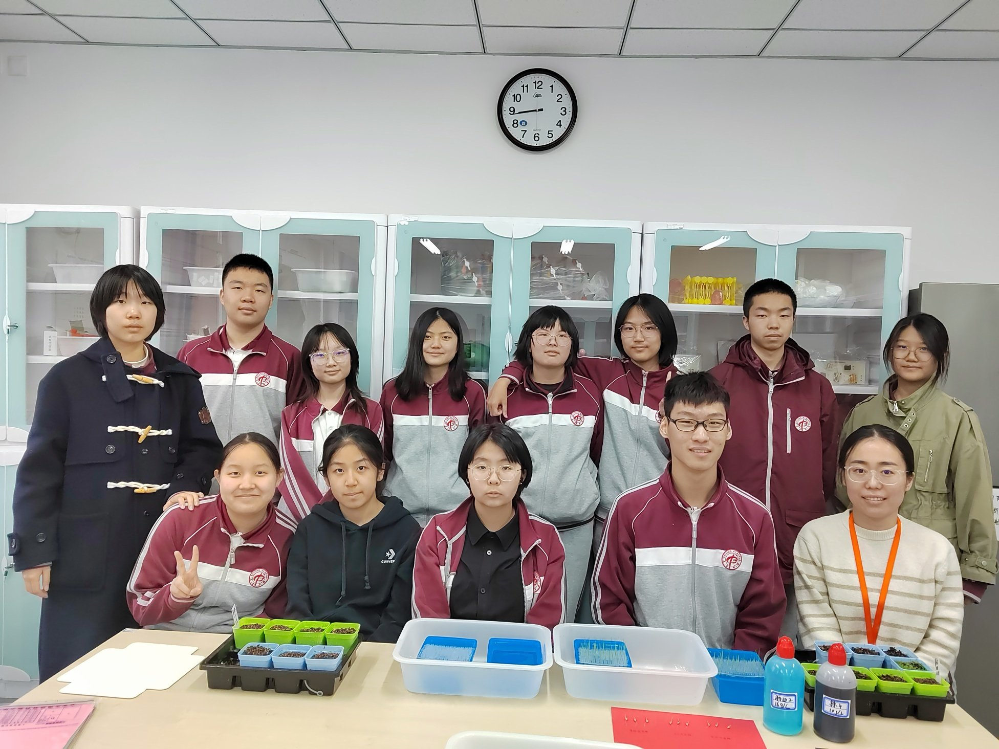
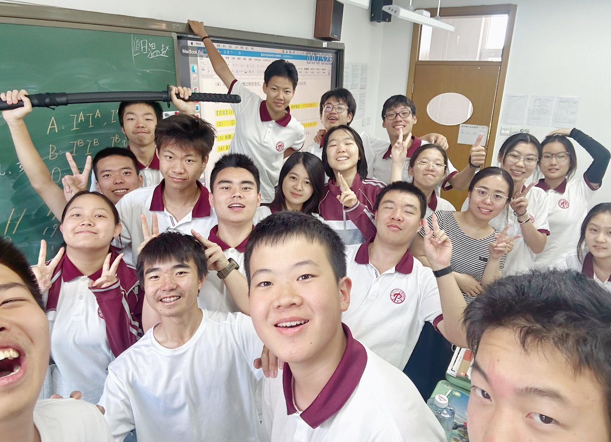
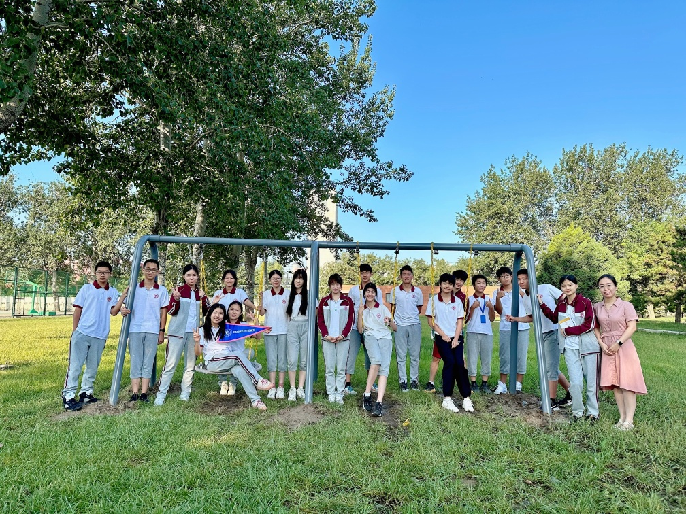

# About

<!--author-->

## 植物知道生命的答案

《植物知道生命的答案》选修课：在这里，热爱生物的孩子们利用每周两节的选修课时间深入探索生物学的奥秘，通过课题研究和互动学习，我们一同揭开植物感知世界的神秘面纱，感受大自然的神奇与美好。

## 生物作业展示

这里汇集了孩子们在基础生物、强化生物课程的学习中智慧和努力的结晶。他们的卓越才华和独特创意令人赞叹，我精心挑选了他们的优秀作业，期待与您共同欣赏这些成果。

## Mc.Rojigally-pros

这里分享了一群高中生们的日常点滴，包含他们的学习心得、生活趣事、读书感想，是我们师生共同成长的见证。

## 友情链接

[Lin’s Blog](https://dreta.dev/)

[Benjamin’s Blog](https://www.benjaminjiang.com/)
