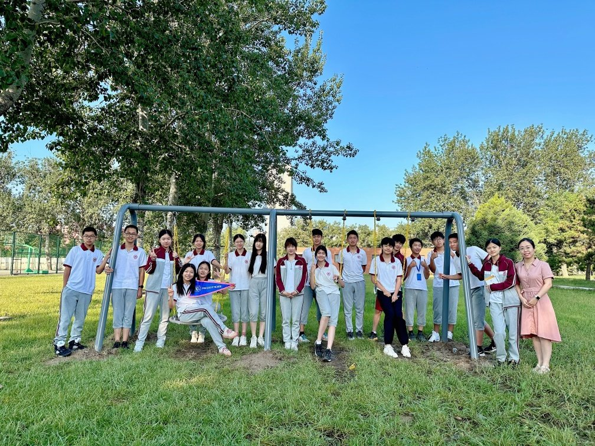

# About

<!--author-->

---

## 植物知道生命的答案 Plants Know the Truth of Life

《植物知道生命的答案》选修课：在这里，热爱生物的孩子们利用每周两节的选修课时间深入探索生物学的奥秘，通过课题研究和互动学习，我们一同揭开植物感知世界的神秘面纱，感受大自然的神奇与美好。

 
"Plants Know the Truth of Life" elective course provides biology enthusiasts with two weekly sessions to delve deeply into biological mysteries. Through research and interactive learning, students explore the perceptual world of plants, experiencing the enchantment and natural beauty firsthand.

---

## 生物作业展示 Biology Homework

这里汇集了孩子们在基础生物、强化生物课程的学习中智慧和努力的结晶。他们的卓越才华和独特创意令人赞叹，我精心挑选了他们的优秀作业，期待与您共同欣赏这些成果。

 
Here are outstanding assignments meticulously completed by students across biology, honor biology, and AP biology courses. Each assignment showcases creativity and inspiration, illustrating the growth and progress of our students on their biological journey.

---

## 生物社区 BioCommunity

这里展示了一系列与生物学紧密相关的精彩活动、丰富多彩的校内社团以及竞赛项目。孩子们在学校悉心培育下，在生物领域进行探索与体验。这些宝贵而独特的经历，一定会化作他们心中难以忘怀的印记，激励他们在生命科学的浩瀚星空中继续翱翔。

 
These activities encompass diverse biology-related clubs and competition projects, providing students with hands-on experiences under the school's nurturing guidance. These memorable experiences are a testament to their growth and will inspire them as they continue to explore.

---

## AP生物 AP Biology

AP生物是美国大学理事会提供的高中课程，旨在帮助学生掌握大学水平的生物学知识。课程内容涵盖四大主题：进化、细胞过程（包括能量和通讯）、遗传和信息传递、以及生物系统的相互作用。AP生物学强调实验和数据分析，培养学生的科学思维能力。学生在完成课程后可以参加AP考试，如果成绩优异，可以在大学获得学分或高级课程资格。

AP Biology (Advanced Placement Biology) is a high school course offered by the College Board in the United States, designed to help students master college-level biology knowledge. The course covers four main themes - Evolution, Cellular processes (including energy and communication), Genetics and Information transfer, and interactions of biological systems. AP Biology emphasizes experiments and data analysis, fostering students' scientific thinking skills. Upon completing the course, students can take the AP exam, and high scores may earn them college credit or advanced placement.

---

## 不一班 Mc.Rojigally-pros 

这是一个充满活力的由18人组成的班集体。在这里，你会看到一群胸有宏图壮志，各怀绝技的年轻人。无论是在课堂上对学术讨论的积极参与，抑或是对课外活动的热情投入，我们都用行动诠释了“团结统一”这四个字。我们班的每一个角落都充满了同学们的欢歌笑语，还有互相给予对方的支持与鼓励。

 
Mc.Rojigally-Pros, a vibrant and dynamic class of 18 unique individuals. At here, you will see a group of young people with dreams, each possessing different talents and skills. Whether it’s active participation in class discussions or enthusiastic involvement in extracurricular activities, we always demonstrate unparalleled unity and teamwork. Every corner of our class is filled with the laughter of our classmates and the mutual encouragement and support we give each other.

---

## 友情链接

[Lin’s Blog](https://dreta.dev/)

[Benjamin’s Blog](https://www.benjaminjiang.com/)
