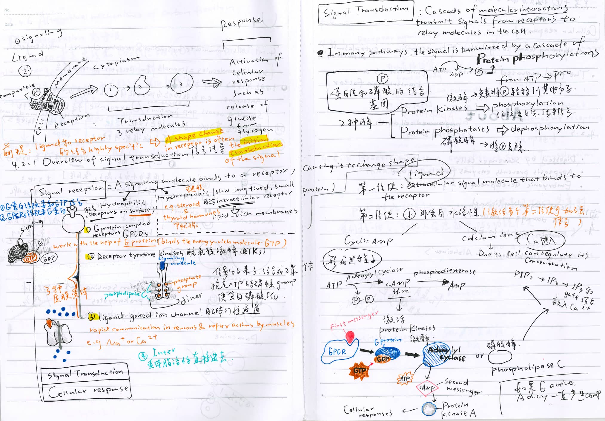

# Snapshot Showcase of Elite Notes & Error Analysis

Get inspired by AP Biology students who nailed exam prep! 

## Note-Taking Inspiration

Browse examples of high-impact notes—color-coded mind maps, concise concept summaries, and labeled diagrams.

## Error Analysis

**Why This Matters to You**

- Copy winning strategies: Use their note layouts and review tips.
- Avoid exam landmines: Learn from others' errors and how they fixed them.
- Stay motivated: Let these examples inspire you to take better notes and track your errors.