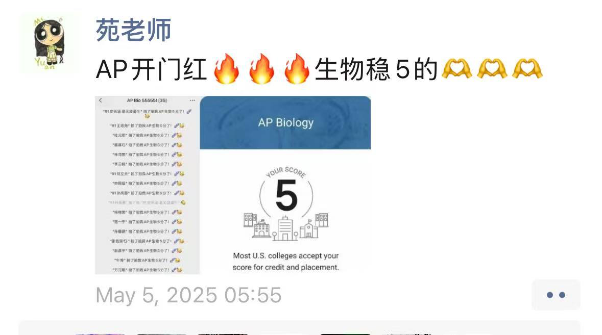

# AP生物总结

终于可以写AP生物的总结了。5.5考完心惊胆战了两个月，一直在算分，最后真是长舒一口气：）

虽然算不上成绩很好或者非常有经验，但奈何感受太多了，遂分享。本文适合所有想学AP生物的同学阅读，不管你是刚经历过合格考，还是已经很久没有接触生物学科了，以下内容可以迅速帮你在暑假期间获取对这门课程的初步了解。

文章内容包括：
- AP生物课程导览
- 可能不甚有用的学习方法
- 课程资源
- 感想以及碎碎念。
可选择需要的部分浏览。

## 一、AP生物课程导览

直到春季冲刺阶段开始我才在苑老师的反复提醒下意识到的一件非常重要的事就是----看考纲。它太重要了，以至于后面回看的时候才发现，以前绞尽脑汁想不出来的FRQ题的答案其实原封不动的就在考纲里。所以建议大家决定报考AP生物后做的第一件事就是读考纲，绝对少走半年弯路。

生物每年的变化不大，因此我就以25年的考纲为准了。26年的大家可以去CB官网下载。

1）考试形式

AP生物的考试一共三个小时，分为两部分：MCQ和FRQ。

MCQ 60道时长90分钟，如果读题速度慢的话时间可能稍会有些紧张。MCQ里有长MCQ和短MCQ，短MCQ长度跟经济题差不多，但长的就很恐怖了。一大段文字配上4-5道题，如果前面理解出了问题后面基本就全军覆没了，所以长MCQ是练习的重点。MCQ部分的满分是60分。

FRQ一共六道，90分钟时长。前两道是长题干，配上数小问，满分9分。和长MCQ类似，长FRQ也非常考验逻辑以及阅读速度。后面四道是短FRQ，一小段题干配上四小问，满分4分。FRQ部分的满分也是60分，但相比MCQ的一题一分，FRQ有1.765左右系数的加权。这就说明如果FRQ错一分，总分就要扣到近2分。所以大家一定要重视FRQ的练习。

学校模考的5分分数线是95/120。但正考分数线不定，按照这几年持续上升的五分率来看，可能在93分左右。不过以95分去准备最为稳妥。

AP生物是半机考，MCQ全在bluebook上回答，FRQ题目在bluebook上显示，但需要写在答题booklet上。这两年均是AP大考第一科，祝大家开门红。

2）考试内容

AP生物一共有八个单元。跟着学校进度的话，2024-2025学年第一学期学完了第六单元，下学期完成七八单元。三月之后会进行四次模考。

考试重点内容与合格考内容有很大一部分重合，比如细胞结构、有丝减数分裂、孟德尔遗传等等，只不过是引入了一些英文专有名词。很多人被生物劝退的一点就是它大量的新名词，但是完全不用害怕，基本上看着看着就认识了。

简单概括一下每个单元的内容：

> Unit 1: Chemistry of Life
> 水的结构，重要的元素（CHONP），生物大分子：蛋白质，DNA，脂质等等polymer以及它们对应的monomer，结构以及功能。

> Unit 2: Cell Structure and Function
> 核糖体，内质网，高尔基体等等结构以及他们的功能，线粒体和叶绿体，细胞膜和膜运输，compartmentalization

> Unit 3: Cellular Energetics
> 酶结构，酶催化，细胞能量，光合作用呼吸作用，

> Unit 4: Cell Communication and Cell Cycle
> 细胞沟通，信号传导，反馈，细胞周期

> Unit 5: Heredity
> 减数分裂，孟德尔遗传，非孟德尔遗传，染色体遗传

> Unit 6: Gene Expression and Regulation
> DNA和RNA结构，中心法则，基因调控，变异，生物技术

> Unit 7: Natural Selection
> 自然选择，人工选择，H-W平衡，进化，共同祖先

> Unit 8：Ecology
> 生态系统，人口生态，生物多样性

个人认为和普高必修课本难度差距比较大的部分在第六单元，而七八单元涉及的内容与环科有重合。其他部分，基本是以必修生物为基准而做的延伸。所以可以根据以上小标题，在暑假着重预习一下之前没听说过的部分。

## 二、不一定有用的学习&答题方法

这一部分其实不太有什么资格分享，以下内容仅供参考，更多还是因人而异吧（本人的大部分情况是，直到快考试复习的时候才恍然大悟应该怎么怎么学）。

这个阶段的生物考试说实话还很难看出它的一些理科特质。有些MCQ的长题干，虽说绕来绕去，但有时甚至不需要你拥有专业知识便可以作答。所以四个字忠告给到大家：记忆+理解。

**一是记忆。**因为考试确实会涉及到很多细碎的内容。虽然说考纲已经是课程内容的一大精华，大部分考点都能覆盖--那它也有两百多页。每年FRQ的六道大题，第一小问都雷打不动会考一道概念/结构/功能题。

就像这样。

这些题基本都不需要读题干，如果基础掌握的牢的话就是送分题，反之就是送命题。这种题错了你会觉得很冤，但其实答案全在考纲里--因此记忆便是重中之重。但是记忆也是要有详略的，有些要仔细记，有些可以简单记。比如七八单元的几个公式，能记下当然是最好的，但就算记不下来也有公式表辅助。虽然今年破天荒地考了一次辛普森物种多样性，但公式全在表里，一拉数一代就出来了。有去抠这些公式的时间不如去背一下光和呼吸作用（25年从MCQ到FRQ，光合作用的题目疯狂上升，甚至有一整道光合作用的短FRQ）。

此外，建议大家不要去背文字。像上文提到的光合呼吸，还有细胞器呀，细胞周期啊，一定要去背图。相信苑老师会提供超级详细的复习图资源，比起干巴巴的文字，把流程以图象的形式在脑海复现一遍的效果更好。

**二是理解。**于MCQ而言理解是要理解题干。一道很长的MCQ框框给你摆了两张图，一页都放不下往下一拉还有一张图--太绝望了。该怎么办呢？其实越长题干它越不难，只要你静下心去理解。我有习惯是先去看表头，或者图的注释。题干前面会说好几句废话给你铺垫背景，大多没什么用，看完表头和xy轴测量的东西你就差不多能明白这个实验做的是什么内容。这个时候可以回到前面的长题干补充一下背景里重要的信息。之后就是找关系。如果一道MCQ里出现多张图，那就要思考这些图之间到底有什么关系了。是其他条件相同情况下控制的两个变量？还是说A的某某反应产生的影响对B的生存有促进/阻碍？等等。还有一些情况是它给你一张大图，上面画了很多通路，其实你只要找准逻辑和提到的事物之间的关系就很简单。
拿一个题举例：

这是一道MCQ。乍一看很难搞，但其实不需要学过就能理解。先看图下注释，a和b两图分别介绍了两种情景：没有tryptophan这个东西和有这个东西，trp operon分别是active和inactive的。为什么有t会使t operon变得inactive呢？只要看图b：原来是因为t的存在会和阻遏物结合，拦在operon中间。图上画的生动形象，到这里你就基本理解题干的意思了，还顺带了解了一下原核调控的其中之一原理。所以MCQ只要你找准逻辑就可以理解。

FRQ的理解我个人感觉有的时候会有点玄学。可能这个时候理解题的背景不是难点了，而是需要你去理解和揣测出题人问这个问题的目的。这个时候要特别注意每个小问前的动词，比如：

有些动词让你直接给出回答(predict,identify,calculate...)，有些则要你去解释(justify, explain...)。关于FRQ的这些动词苑老师也有整理（咋什么都有整理），需要大家记忆并理解出题人在这一问的用意。
还有一种情况是它问题说的花里胡哨不明不白：

第一问直接点出因变量就好，第二第三问则需要你理解到本质的东西。
比如第二问问你为什么研究者用wild strain（野生）去创造mutant strain（变异）。乍一看问了跟没问一样，但其实你需要这么去想：提到的wild strain和mutant strain之间有什么区别？发现：除了一个有mutation一个没有，其他的都相同，因为mutant strain是由wild直接变来的。得到这这个结论之后恍然大悟：哦其实就是一个控制变量的事。这样操作就可以保证后面的实验结果是由它俩所差异的这个mutation导致的，而不是其他的变量。第三问又问，为什么每个strain的通路里都只有一处有mutation？其实道理类似，这样就可以更好的观察每个mutation带来的影响，避免了它们之间的相互影响。

 
两问答案见上。其实经验之谈，一般FRQ都会考一道控制变量的题。当你发现类似的表述差不多就该意识到：出题人要考控制变量了。

每道题理解出题人意图到这个层面，那完全就手拿把掐了。

所以说白了整个AP考试就四个字，记忆+理解，适用于大多数科目，对于另一门我甚是喜爱的AP心理课同样适用。再简单讲一下在学校学AP生物课的话，期中期末的一些注意事项。

其实放宽心因为老师真的不会难为你的。特别是春季学期的期中一下子占50%的GPA，这要是考炸了就真没招儿了。一般就是MCQ+FRQ，我记得在秋季学期还没有接触AP的FRQ练习的时候，FRQ大多是描述+解释？外加简单的实验题。以苑老师的习惯是考前提示一下大家可能涉及的重要知识点，一般来说这些就会在FRQ出一道题让你去描述，比如水的四大性质啊之类的。只要按照重要知识点捋一遍，就没啥问题。关于复习，个人习惯因人而异吧。我喜欢拿除了笔记本以外的另一个本子写写记记，或者梳理一下笔记（我的笔记本太杂乱无人能忍受）。有同学会用电脑或ipad记，我尝试过感觉不如纸笔记得牢，特别是光合呼吸在纸上画一遍图特别爽，所以一直拿的本子。错题分析也很重要！之前老师展示过天星的错题分析，确实做的太好了，而且这个环节可以迅速帮你梳理思路。就比如上面的FRQ样题其实是我自己记过的一道，再遇到这类型的题就不会错了。另外一学年下来写满两整本的感觉还是非常有成就感的：）））。

## 三、课程资源
1）
- CB: [考纲](https://apcentral.collegeboard.org/media/pdf/ap-biology-course-and-exam-description.pdf)

- CB: [公式表](https://apcentral.collegeboard.org/media/pdf/ap-biology-equations-and-formulas-sheet.pdf)

- CB: [历年FRQ(北美)](https://apcentral.collegeboard.org/courses/ap-biology/exam/past-exam-questions)

以及AP Classroom上每一个小节都会有对应的视频课程。这时候有同学就要问了，不想登陆CB那个破网站翻墙看视频怎么办呢？真是问对人了！

2）真正宝藏的资源来了：
https://xyyuan.fun/ap

伟大的苑校亲自搭建的网站，左侧菜单栏选择AP Biology即可看到每一个小节课程的对应视频。这时候又有人要问了，哎呀我看了视频学了知识点我做题还是不会啊咋办，有题目讲解视频吗？？

有的兄弟，有的。
 
[Biobloom B站账号](https://space.bilibili.com/37224626)本世纪最伟大的发明，没有之一。

每次布置作业后老师都会挑选错误率比较高的题目进行讲解。清楚严谨，有问必答，既节省同学们去问老师的时间也减轻老师工作量，太高效了（泪。
该账号除了讲题之外，一些同学们常错的，不怎么理解的知识点比如卡方，零假设，AP生物迷思为您解答！！！

另：该账号讲解视频随机刷新学长学姐：））））。

## 四、感想及碎碎念

以上是没那么干的干货，以下是这一年所想写的一切胡言乱语，总结为：学AP生物学的。

AP机考第一年的第一科，考场的白灯有些晃眼。教室特别热，写到FRQ手心全是汗。AP生物正考毫不夸张的说是我有史以来心态最差的一次考试，MCQ有几道不容易的题一直纠结在两个选项之间，模考常常提前二十多分钟做完，正考就剩了十几分钟。系统自动提交MCQ的前一分钟我看着自己标红了整整9道选择题，尽管现在回想那9道里面应该不少是正确的，但当时真的心态真的有点开崩。FRQ第一题做得是最快的一次，结果一向擅长的第二题直接开崩。先是画图题x轴坐标标错，然后error bar算错，之后整张图显得一团糟。下一个计算小问小学生都会算的水平我硬生生算错，直到检查的时候才发现这怎么代回去数不对呀。中间有一道短FRQ的最后两问，由于是一道预测一道解释，一直怀疑自己预测错了怕一下子丢两分，明明很简单却耽误了好久。着急忙慌赶到最后一题，发现题干根本不像是短FRQ，硬着头皮读完长题干其实没太理解，第一二问凭感觉凑上去了，做到第三问才发现原来这题有俩图。谁懂往下一划一个全新的大表出现的那一刻的救赎感？
总之真的是一团麻。监考收走答题卡的那一刻我打开计算器开始算，如果按照最差的情况选择错xx个大题扣xx分，我还能5吗？第一遍的结果是擦边95，我觉得可能还会低，于是又算了好几种可能。

从5.5考完那天到7.7出分，我一直在算。这也是为什么我能毫不犹豫地说出FRQ的系数是1.765。

但是我知道这一年不只有这一个算式，1.765一问的FRQ决定不了什么，分数线是93也好95也罢都说明不了什么。

苑老师的AP生物真是太好的一门课了——— 

比如课下做的视频（有西海岸口音版），课上的细胞器相亲，以及大马剪纸————

课堂上为了激励我们设置的专属生物币（可以加平时分版）————
 

才发现忘了交，私藏一张但痛失0.1GPA。

比如复习时最爱的Kahoot————

比如CB上惊喜154到长MCQ主播做了三个小时四十分钟（乐————

比如j人狂喜的叮嘱————

 
比如冲刺阶段每天倒计时的群名————

 
以及来自5月5日早上5:55的祝福————

多有趣呀，比分数有趣多了。

可以很肯定地告诉大家，其实当你已经付出了最大努力，踏踏实实把该做到的都做到了的时候，那些在考场上看似没有经过深思熟虑就下笔的答案，都是正确的。

回想5月5日在考场上，标红的选择有一半其实隐隐有了答案，就算第二天对答案错了没有标红的题（cohesion&adhesion我恨你），选择的容错还是很大的。FRQ第二道画的图虽丑虽乱但该踩的点基本踩到，就算有计算错误也都及时纠正。预测和解释那道题大概率没有做错，第六问凭感觉凑上去的一二问都是正确答案，就连时间不够匆匆瞥了一眼图表就下笔的三四问也能踩到一些点。

该来的都会来的，怕发生的也很难发生。预期与现实差异所产生的错误认知不能代表能力也无法预判结果，因此不要提前痛苦。

感谢苑老师，也感谢自己；一年结束了，长舒一口气。

2025.7.14