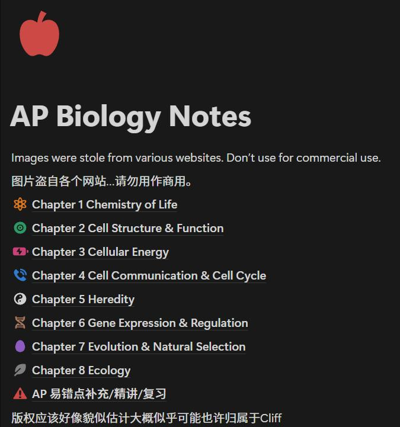

# 回首望去晨光洒落，曾与生物并肩而行

A Journey of Notes, Biology, and a 5

It was a sunny morning. The sun was shining through the windows onto the tables. I took a brand new notebook just for AP Bio, and went into the class of 403. People were robbing the seats (which continued for about 5-6 periods) and arguing who was the first at that seat. 

I sat down and looked around. Someone is discussing the contents of APbio that they previewed before. Someone opening the notebooks with some learning notes they took in summer vacation. 

Suddenly,the bell rang. The classroom fell into silence. Ms.Yuan came in with a smile.

......

<figure>  
    < My biology notebook >  
</figure>

After all, what did we learn?

In a nutshell, AP Biology is a brief introduction to the wonderful world of biology. It's designed to be equivalent to a first-year college introductory biology course for science majors. If you are a student who enjoys biology or wants a challenge, choose AP bio!

AP biology, different from the biology courses of IB and A-level, focus on 8 units: 

1. Chemistry of Life
2. Cell Structure & Function
3. Cellular Energy
4. Cell Communication & Cell Cycle
5. Heredity
6. Gene Expression & Regulation
7. Evolution & Natural Selection
8. Ecology

<figure>  
    < Contents of AP biology, from Cliff's AP biology Notes  >  
</figure>

Each unit has a different portion in the AP test. From this year's students' comments, the hardest part of the whole course is unit 4, 6, and 7. Fortunately, unit 7 is less included in the test. (But 6 and 4 are the hardest according to our classmates, so you need to care more about that hahahahaha)

AP biology requires you to understand more than recite. You need to **LISTEN TO THE TEACHER** in class and make sure you understand all the knowledge points. I really recommend taking notes on a **NOTEBOOK** instead of a MacBook (you can do so if you think you have good note-taking skills on computers) since you can have the writing feelings that enhance your memory. However, taking notes should never be the only thing you are doing. The teacher's speaking speed is always faster than you write, and missing points is just a matter of time.
(Advertisement: Use [Cliff’s AP biology Notes](https://dawn-countess-e09.notion.site/AP-Biology-Notes-1a83a033920080bfaeeadd0b7446bfb4) A fantastic note-reviewing place just for AP biology made by Cliff. You can also access Cliff's AP Biology Notes on Ms.Yuan's website xyyuan.fun - about - Friendly links - Cliff's Notes for AP Biology. It's free and comfortable to use.)

Of course, only listening and taking notes are far from perfect. **PRACTICE** is important. You can stick to the teacher's assignments after class and the mock exams by the school, but some extra tests for personal mistake-discovering will be beneficial. I prefer to use ancient (at least old) AP tasks' questions to find my mistakenly understood parts.

Learn from mistakes is what I learned more than biology. 

In March, I was frustrated by my FRQ scores. I kept thinking, "Why can't I do better?" So I went to Ms. Yuan for help. She pointed out that I often wrote less and skipped important reasoning steps in my reasoning. I was focusing too much on the conclusion, but not showing how I got there. After that, I changed my approach to answering FRQs. Instead of just writing what I thought was the answer, I made sure to explain the reasoning behind it step by step, like guiding the reader through my thought process. Read the answers after I wrote them -- it's easy, but it really worked—my scores started improving. Eventually, I was able to hit a high score on the FRQs. Remember, always connect your reasoning. Think of it like telling a story: from cause → mechanism → result.

Yes, you'll reach that "OMG! The AP test is coming!" stage in April. At that point, learning is mostly done—it's time to review. Go through your old mistakes, ask your classmates, and if you still don't understand something, ask your teacher.

A lifesaver: Read the official AP Biology exam outline on College Board. It clearly tells you what will appear on the test paper and what won't. By focusing only on the essentials, you can study more efficiently and score higher with less effort.

Looking back, AP Biology was more than just a difficult course. It was a journey full of pressure, teamwork, and personal growth. On the morning of the test, we were nervous as we stayed together in a hotel, reviewing everything we could. But in the end, all the hard work paid off. I got a 5, and many others did great, too. If you're planning to take AP Biology next year, be ready to work hard—but it will be worth it. You'll learn a lot, and not just about biology.

To biology!

--------------------------------------------------------------------------------------------------------------------(分割线)

**Q&A session：**

1. Is it very very very hard?

 
As long as you take notes and learn carefully, it will be a great experience of diving into the world of biology. 

2. How much assignments?

 
Not massive, quite pressure-less amount. However, it is very important to finish it with quality.

3. How much time does it take?

 
For me, about 2 hours when you have biology class and 1 hour without biology class. For the last week before the test, maybe more hours are needed, according to how many APs you are taking.

5. How to be prepared for the exam?

 
Practice, question teachers and classmates, and read the outline. Take all mistakes seriously, as the scoring was strict and easy to lose points.

6. GPA high or not?

 
A bad question.

But it’s actually high. By answering questions and doing well on tasks, you will get bio cash, which can add points to your GPA.
