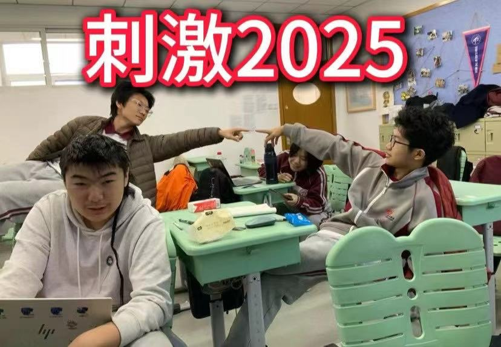
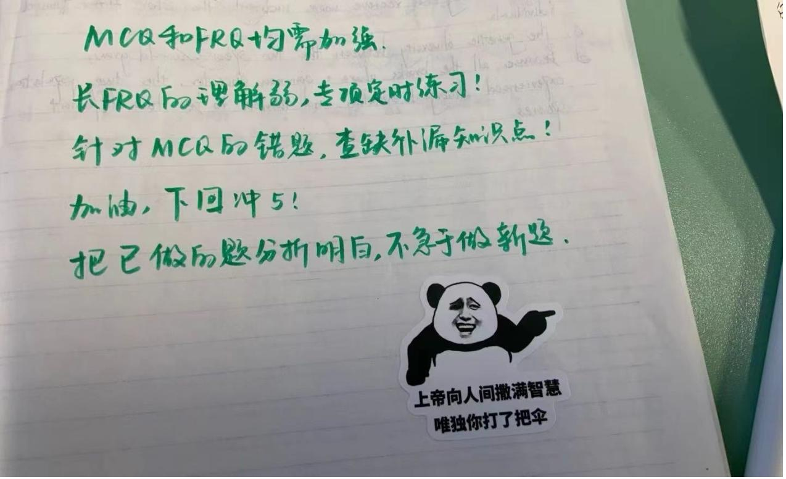
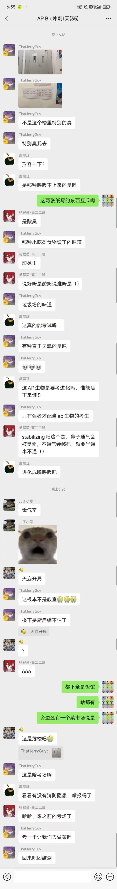
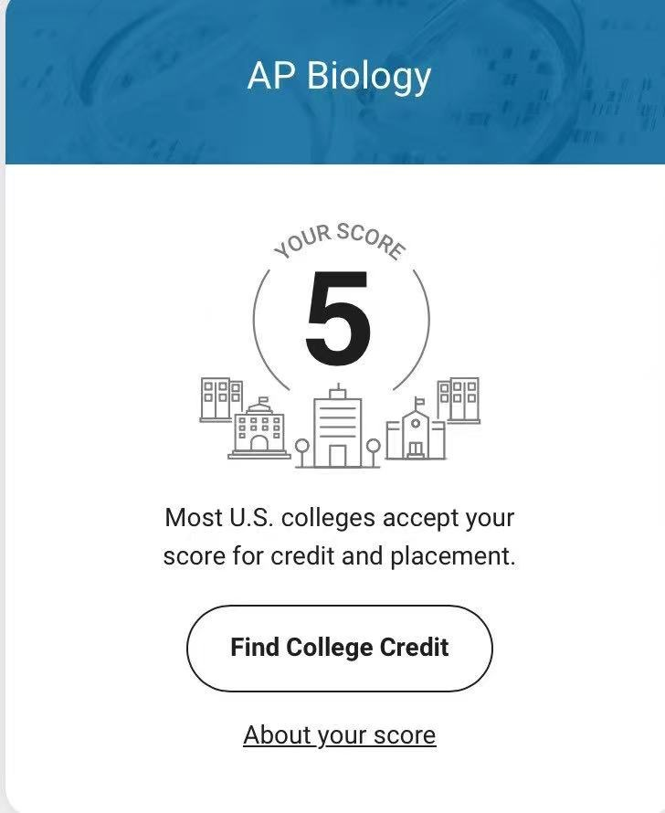

# 刺激2025——AP生物感想

自七月七日AP出分已经过去一个月了，在阅读过Biobloom上其他同学的感受后，我也想向没有学过AP生物的同学介绍一下这个学科。

不过我想介绍的并不是课堂上的经历，而是参加模考和正式参加考试的一些心得体会。

我清晰地记得第一次模考是在2025年3月19日，那个自模考表发下来以后就让我畏惧的日期。当时我正个人对于如何复习比较迷茫，在考试的前两天一直东一棍子西一棒子地看知识点，以致于我到了当天还处于一个很迷茫的状态。模考时间是晚上的六点半到九点半，由于是第一次模考，所以亲爱的苑老师想让我们体会一下正式考试的时间分配。在模考开始前的下午，我和其他上课的同学堆在四班的教室里讨论知识点和做过的题，随着时间推移，我们的讨论内容从“那个光反应和暗反应的全过程是啥来着”逐渐变成了“这个知识点应该不会考这么多吧”到最后变为了“不是这也太刺激了，好绝望啊”。临近考前我的心态彻底沦陷了，脑子甚至无法正常思考，我就这样迷迷糊糊地坐上了考场，等待着命运的审判。

首场模考像一场屠杀， 面对答题格式都有点没搞明白的我，我就像拿着石头的中世纪小兵妄想打败现代坦克。FRQ（自由问答题）里的实验设计题让我措手不及，明明复习过酶活性实验，落笔时却好似仙家对话，前言不搭后语，疑似梦到哪句写哪句。MCQ（选择题）中涉及信号转导的连环题更让我在时间压力下连环失误。最后，我也不负众望，在首次模考取得了擦边四分，苑老师给我写了这样一段评语“上帝向人间撒满了智慧，而你却打了把伞”，徒儿受益匪浅。

第二次模考在苑老师课后的错题总结后，我的答题思路有了很大的提升，虽然还是四分。MCQ的正确率提升了不少，相比上次多拿了十几分，尤其是数据分析题，我发现自己开始能一眼识破干扰选项。考后分析显示，我的弱点从“知识盲区”转向了“细节疏忽”。FRQ做的时候也开始找到了语感，出现了框架，不过答题思路还是过于抽象，答案太过表层，没有去真的解释细节。

后续几次模考每次基于上次都有进步，不过都没有拿到五分，这是已经是四月底，距离正式考试仅剩两周。在考前的五一假期，我感觉我把我前16年的走的神全给补上了，终于自学明白了自己的漏点，苑老师每天不定时的答疑帮助非常大。五月四日，考前前一天，我去考场踩点了，与预期中的不同，考点是在一个比较有“烟火气”的街区，考场弥漫着一股菜市场的味道，这也稍微放松了一下我紧绷的神经。

四号晚上我没有睡着，四点多就起床收拾东西，顺便再复习一会儿了，早上到达考点时，天还没完全亮，我和几个同学在附近的一个酒店大堂进行了最后一次讨论，随后就是正考，决定我们一年心血的考试来了。说实话，当我验证完身份信息，坐在自己的座位上后，我已经释怀了，完全没有紧张的情绪了，随后的考试印象不是很深了，只记得这是我做正式题最顺的一次，三小时一眨眼就过去了。出考场后，空气中朦朦胧胧的，我跟苑老师和家长说感觉考的还不错，原话或许更激动一些。当时只疑惑，之前自己为什么那么紧张。

下一个夜不能寐的夜晚就是七月七日之前了，在七月七日我四点就坐在电脑前不断刷新，不过一直没出成绩，就只好出门去见初中同学了。五点多的时候，有人说了句出分了，我就掏出手机打开college board, 本来还想去遮一下，结果刚打开查分界面，映入眼帘的就是AP biology 5, 当时感觉这辈子都值了。

作为一个学生物的学生，APbio 是我的必经之路也是生物生的必经之路，不过我推荐所有想学stem专业的同学来上，对一个人的学术思维和语言能力会有很大的提升。