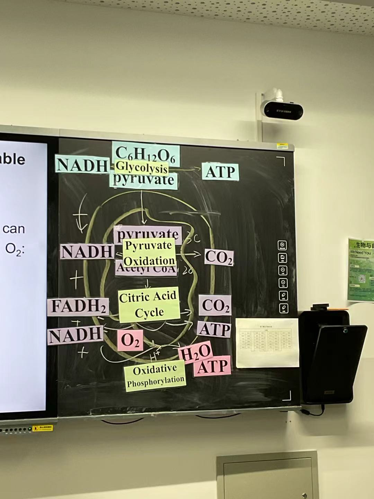
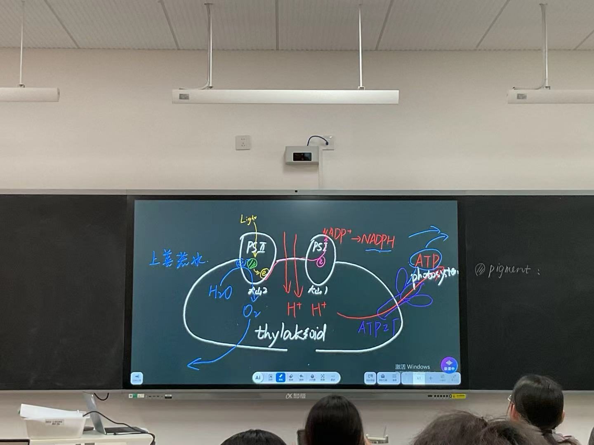
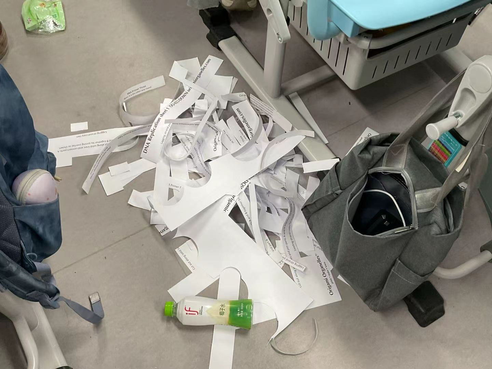
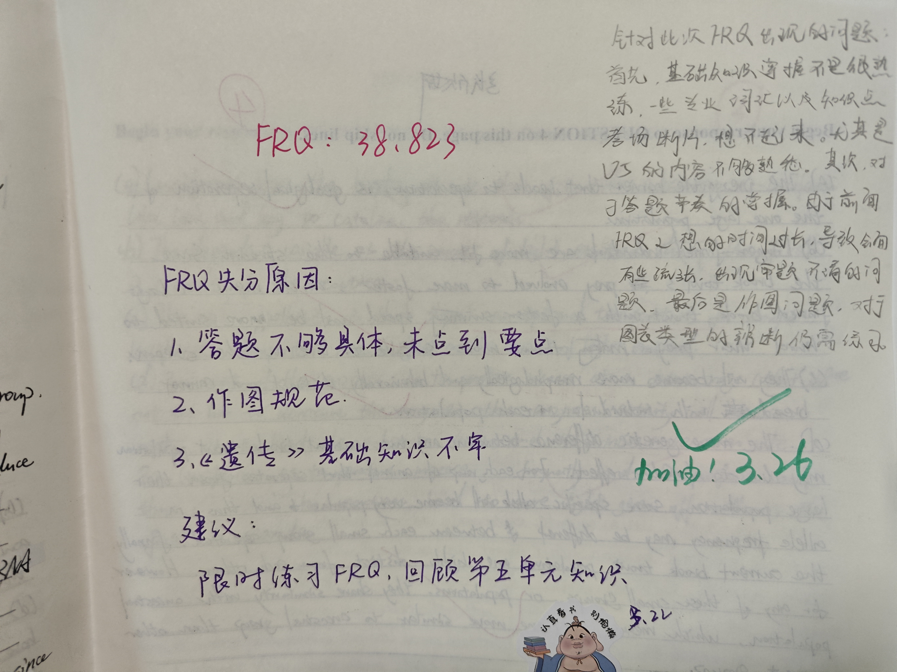
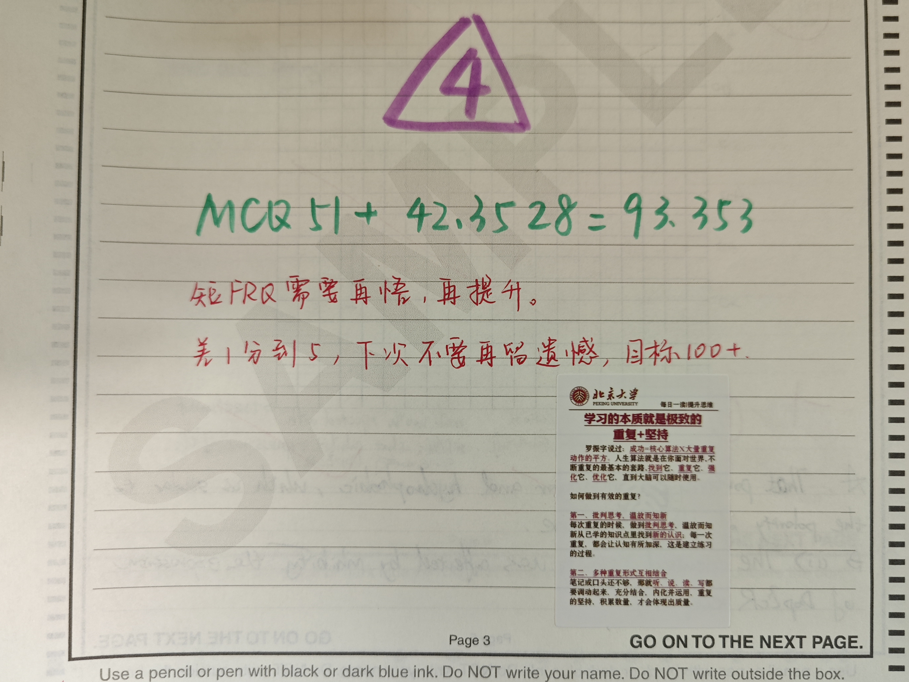
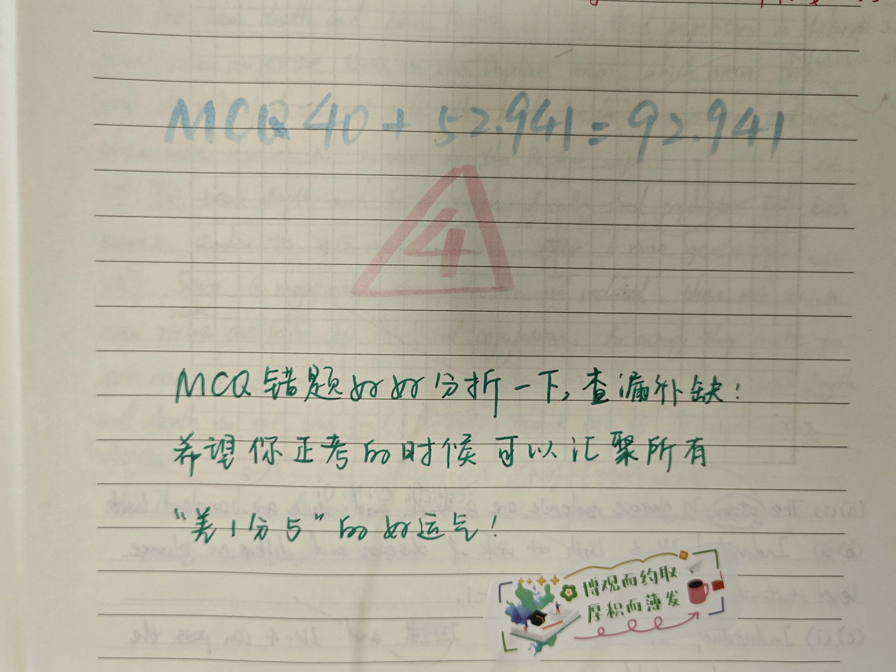

# 那一分的运气，终于落地

2026年7月8日，AP出分后的第二天，我终于能平静地写下这篇感想。

如果要问我这一年印象最深的瞬间是什么，我想不是第一次上课，不是最后一次模考，也不是走出考场的那一刻，而是查分。

昨天我在同学的生日Party上。本来以为晚上八点才会出分，所以完全没有心理准备。结果下午4:47，AP生物群突然开始刷屏，有人发出了自己的五分成绩截图。那一瞬间，我感觉自己的呼吸都停滞了。周围明明很热闹，大家在唱歌、打游戏、吃蛋糕，可我呆在原地，手心全是汗，甚至有些想吐。我实在受不了这种压力，于是跑出了KTV，在外面找了一个安静的地方，给我最好的朋友打电话。

我记得自己第一句话就是：“我不行了，我太紧张了，我不敢查分。”

电话那头的她也很紧张，我们两个人互相鼓励、互相打气，最后决定一起打开College Board。进入查分页面的时候，我看到第一科就是Biology。我根本不敢看，用手挡住了屏幕，一点一点往下滑。当我看到那个数字——5的时候，我的手开始发抖，眼泪一下子就出来了。

我从来没觉得一个数字会有这么大的力量。

因为对于我来说，AP Biology从来都不只是一门课。它是我的第一门AP考试，也是我未来专业方向最重要的一门课。一直以来，我都想学习生物相关专业，所以我总觉得，如果连AP Biology都没有考好，我甚至不敢想自己的大学申请会怎么样。直到看见那个5的时候，我才真正觉得，这一年所有的努力终于有了答案。

但其实，一切的开始并没有这么顺利。

高二刚开学的时候，我第一次接触AP Biology。那时候我的英语水平还没有现在这么好，第一节课学的是4个生物大分子。polymer、monomer这些词直接把我整懵了。我记得特别清楚，苑校突然提问我：“lipids的component是什么？”当时我还在努力记住那些单词，被问到是脑子里一片空白，只想起一个单词——glycerol。我硬着头皮说了出来，结果居然蒙对了。当时我自己都愣住了。

后来学习protein的各种结构和基团的时候，我还以为那些东西全部都需要死记硬背，下课后在图书馆背得昏天黑地。现在回头看，当时的自己真的又懵又好笑。

十月份国庆假期的时候，我去美国做交换生。偏偏就在那段时间，班里刚好学到了AP Biology里最重要、也最难的内容之一——Cellular Respiration和Photosynthesis。回国之后，我发现自己完全跟不上。再加上在美国玩得太开心，心根本没有收回来，苑校给我们补课的时候听的也是云里雾里。但多亏苑校做的一套呼吸作用的流程图。她把各个步骤打印出来吸在黑板上，一步一步推整个过程。我就是靠着那套流程图，完全理解了细胞呼吸。直到现在，我脑子里还能浮现出那些箭头和步骤。

作为生物课代表，我还有一段特别有成就感的经历。学DNA复制、转录和翻译的时候，苑校给我们几个课代表拿来了一沓教具，让我们把里面的材料全部剪下来。我记得自己整整剪了两个晚自习，最后地上全是纸屑，我还拍下来了哈哈。后来上课时，老师用上了我们准备的那些材料。看着自己亲手剪出来的教材出现在课堂上，我特别开心，也特别自豪。可能也正因为反复剪、反复整理这些内容，我对复制、转录和翻译这一部分的理解反而特别深。

真正让我成长的，还是一次又一次的模考。

第一次模考的时候，我完全没有把它放在心上。那时候甚至没有做过一套完整真题，不知道FRQ长什么样，也不知道有什么套路。甚至当时MCQ考试的时候，我人还在澳门准备考SAT。从澳门回北京的飞机上，我一直在看AP生物的知识点，想让自己显得努力一点。可到了真正考试的时候，很多东西还是忘得差不多了，尤其是遗传部分，掌握得非常差。

第二次模考，我终于认真起来了。结果成绩出来，93点几，差一分到五分。我不知道该怎么形容当时的心情，又开心，又遗憾。第三次模考的时候，我竟然还是差一分到五分。我记得特别清楚，苑校在我的卷子上写了一句话：

“希望你把所有差一分五分的运气，都留到正考。”

后来事实证明，这句话真的成真了。

最后一次完整模考，是第一次完全按照完整考试时间来的。我从下午四点体育课下课，一直考到晚上七点多。后半程的时候，人已经快饿得灵魂出窍了。但真正让我难受的不是累，而是紧张。因为距离正式考试已经越来越近，我已经不知道自己还能复习些什么。不是因为都会了，而是因为被这么长时间模考，练习和心理压力折磨到麻木了。作为一个未来想学习生物专业的人，我真的很害怕自己拿不到5。

于是，我抱着一种视死如归的心态走进了考场。

结果考完之后，苑校和我说：“你这次MCQ写得挺好的。”那一刻，我第一次觉得，也许我真的可以。后来成绩出来，我终于拿到了第一次模考的五分，也重新拾起了对正考的信心。

5月3日上午，也就是正式考试的前一天，我怕自己在家学不进去，特意跑去了图书馆。那天早上，我拆开了苑校给我们的信。信里面有老师的祝福，也有考试注意事项，写得特别详细。看完之后，我真的很感动。之后我模拟正考的时间，做了自己特意留到最后的一套考前保温联系，保持手感和做题速度。做完以后，自我感觉还不错，于是带着一种前所未有的平静走进了第二天的考场。

现在回头看，AP Biology带给我的远远不只是一个5分。它教会了我如何分析实验、如何建立逻辑、如何在海量信息中寻找规律，更让我坚定对生物这门学科的热爱。从第一次连各种monomer都分不清，到最后看到屏幕上的那个5，这一年好像很长，又好像只是一瞬间。

我想送给未来学习AP Biology的同学一句话：不要害怕那些差一分的时刻，因为每一次差一点，都在把你推向真正属于你的结果。当你最终看到那个数字的时候，你会发现，所有熬过的夜、所有崩溃的瞬间、所有怀疑自己的时候，都值得。

生命虽易，进化不易，且行且珍惜。

