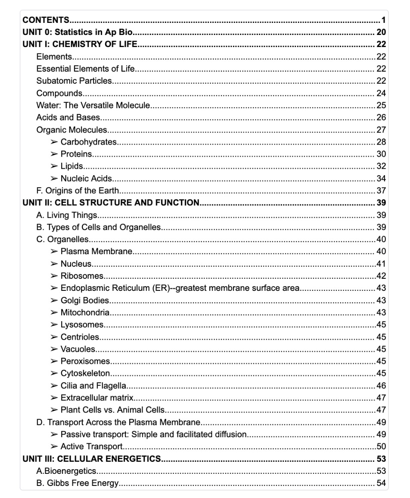
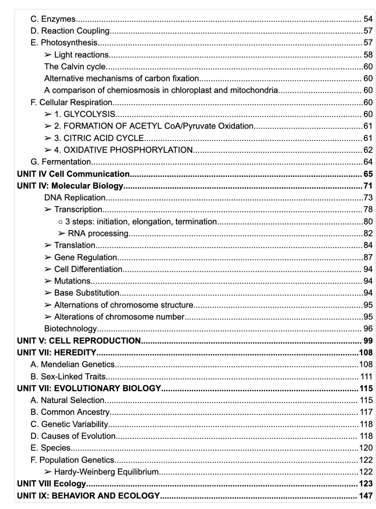

# AP生物反思

这里所介绍的都是个人想法，无对错之分。

如果你点开了这个界面，那么你可能是考虑未来学习生物相关方向（“生物”被列入生化环材，常被称为传统理科“四大天坑”之首。这个评价主要源于本科就业难、起薪低，且通常需要读到硕博才能获得较好的科研或高薪岗位，但生物本身是一个非常有意思的学科，如果你对生物非常passionate的话你会很喜欢这个课程的）；你也有可能是想在成绩单上加一个high rigor课程（那么请直接跳到“如何备考校内期中期末/保持平时成绩”session）；如果你在校外自学备考AP考试请跳到“如何速成AP生物”session。

## 学习生物（In general）

虽然人们常说生物是天坑，但如果我们暂时跳脱出就业和名利的“包袱”，我觉得这是一个非常值得去devote时间的一个学科。

> **保持或者不保持兴趣**
> 
> Follow your passion可能对已经有一个passion的人来说是一个习以为常的事情。但如果你现在没有对哪一方面特别passionate也没关系，重在过程，学习生物可能会spark你在生物相关/之外的passion。

> **付出或者不付出长时间努力**
> 
> 这取决于你的个人目标和期待，如果你追求的是科研recognition/成果，那么你投入的时间不一定会有100%回报。把握好自己的节奏，了解自己如何应对环境会帮助。

我认为学习是一个很难被定义的过程，它非常personal。保持兴趣或者不对其感兴趣都是个人的选择，因为学习本身很难被定义，我觉得是否学好这个学科也是一个很难定义的事情，学习好坏本身和分数无直接关系。

## 如何备考校内期中期末/保持平时成绩

校内第一次期中考试：10月底（强烈建议在新学期一开始就关注期中考试的一些考点）

考试难易程度：由于这是第一次校内的大考+心理紧张，虽然老师说这次考题很“简单”，但是出考场的时候还是觉得题很难。

建议提前开始复习和准备期中考试，第一次考试不要临时抱佛脚（仅代表个人观点）

校内第一次期末考试：1月初左右（每年考试时间略有变动）；考完期中后一眨眼就期末了，建议提前准备下。

校内AP模考~~（不能再多说了；但我肯定期中有一套题会有很多让你justify的问题）~~

校内第二学期期中考试：4月末左右（每年考试时间略有变动）

MCQ：重点关注College Board 上之前做过的选择题（大部分是原题）

FRQ：定向复习（嗯，对，定向很重要），不能再多说了。

如何（速成）AP生物

AP实考涵盖的内容远远没有校内AP生物所教的内容多（虽然正考前超级慌）。AP生物的实验题大多都在考“实验素养”，如果你之前有过相关实验经验，那么你多半会觉得考试很得心应手（仅代表个人观点），这种情况下你只需要通读考纲，确保自己记住上面的知识并能够描述就可以放心上考场了（仅代表个人观点）。

如果你想多复习复习，强烈推荐Lin的笔记（虽然我没看过，但是Lin的笔记一直都很全面，如果Lin的笔记上的内容你已掌握那你也可以放心去考场了）。如果你在开始上课之前就已经有了Lin的笔记，那你将顺利地度过校内考试+AP正考（上课不记笔记都可以）。

其他的没有了。

祝学习愉快，考试顺利。

---

以下内容来自于Avian本人的笔记目录：

