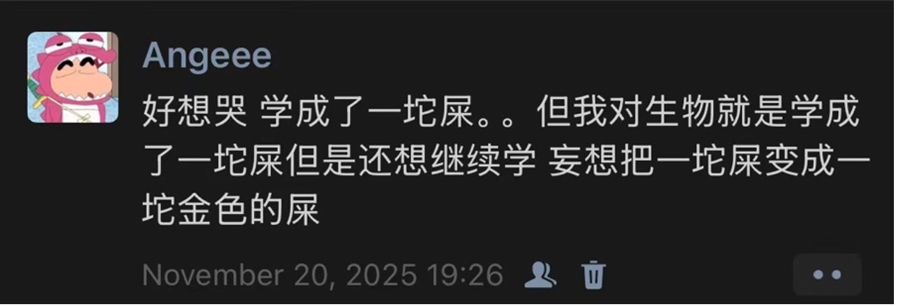
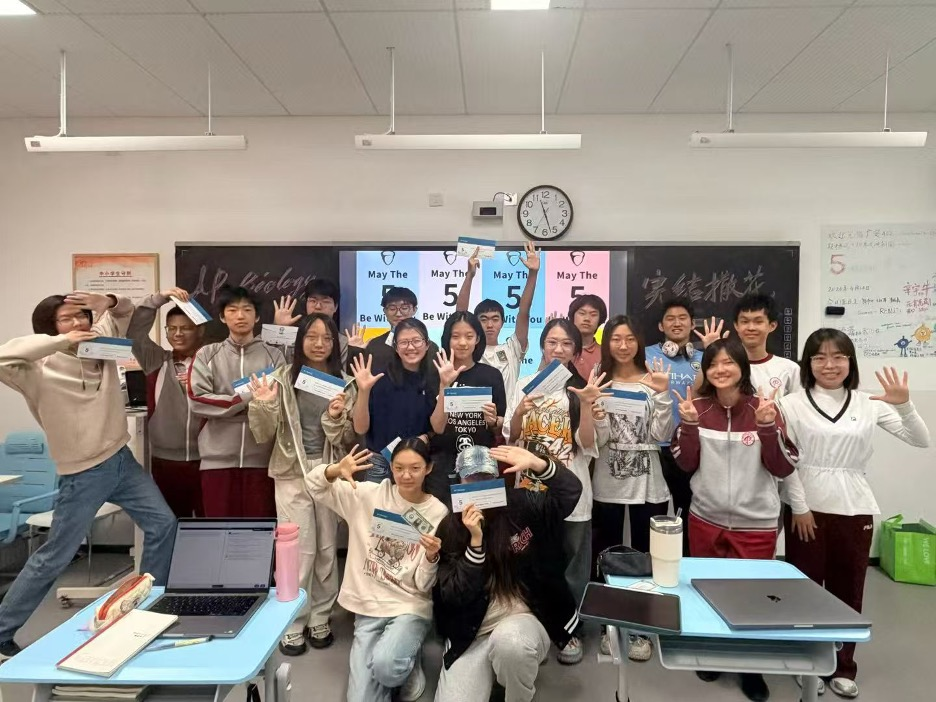

# 元宵万岁

Hello正在阅读这篇的学弟学妹们：我大概是唯一一个ap生物4分但还写了感想的同学吧（苦笑）

在出分之前就一直跟元宵说，如果我要是拿了5分我一定要写感想！好吧，虽然成绩很拉垮，但是拉垮的分数也有拉垮的学法，这里面都是我对于ap生物最真挚的想法和建议，如果你感兴趣，欢迎继续阅读～

本来想分几个部分写的，但是感想太丰富，就想到啥写啥了

整体来说，AP生物是一个难度不低的学科（也可能只是对我来说吧呵呵。。。如果你认为很简单，那可以跳过这段了），相关的知识点和试卷大家在网上也可以直接搜索到，在这里不再过多赘述。经过一年的学习，我猜测大家可能遇到的难点主要有以下几个：

1.	知识点数量：ap生物的知识点非常多且包括很多生词和概念，需要经常巩固。如果记得不牢会很影响做题的速度。Frq的前两问一般是概念题，如果丢分就很亏了。

2.	逻辑链条：mcq中的组题以及一些长题干的题目通常都会包含相对直接的逻辑链条，frq部分则包括了相对复杂的逻辑链条。frq一部分题目是套路或者考察的是知识点，但是另外一部分（比如长frq的d问）想要答对则需要对于题干的思路理解的非常透彻。今年，也就是2026年的正考，frq的难度突然提升，很多人都反应没做完题，我感觉应该是被逻辑链条的复杂程度影响了。

3.	英语能力：我开始学习AP bio的时候托福是90分左右，理解题干和知识点是完全够的，但是我的阅读速度很慢导致mcq经常做不完，也没有很多时间去完全理解题干。甚至从某种程度上来说，我觉得mcq有的题目非常像sat阅读的数据题。

4.	答题技巧：这一点在刚开始学的时候比较容易卡，但是只要多加训练都是可以攻克的。在刚开始学（尤其是小测）时答frq经常会出现词不达意或者没有达到点上的情况，导致失分很多。不过后面的总复习阶段，通过作业/模考+分析错题（真的非常重要）慢慢能够理解出题人的套路，frq的分数会迎来质的提升。

在刚开始学AP bio的时候就觉得这门学科真的非常有意思（现在也觉得是）尤其是课上的活动和Kahoot都印象非常深刻。总之跟着元宵学绝对是没毛儿。AP生物的知识点不像是其他学科那么枯燥，并且很大一部分在强化生物已经学习过了，理解上并没有那么吃力，但是要想学透还是要花功夫的。只要上课认真听讲，听懂是100%没有问题。小测就是完全是另一回事了，元宵班的小测非常明显的特点就是根！本！没！有！时！间！复！习，大多数时候都是今天讲完这一单元明天就小测了，节奏非常的紧凑，想要选AP生物的一定要做好准备。如果你想在小测取得很好的分数的话我建议边学边总结边复习。所以本人一次小测考好的也没有，现在想想真应该好好复习。还有一个大家比较关心的就是期中期末，天机不可泄露，总之只要大家好好听课好好复习并且能把卷子写完就一定没有问题，相信自己也要相信元宵。

不知道在阅读这篇的大家是什么心情，在我学ap生物的过程中我曾多次的看过Biobloom上其他学姐学长的感想，想要看看大家在学习过程中是不是也像我学的这么烂，试图找寻到一些自信。但是我发现：没有。所以我想对正在看这篇感想的你和过去学习的我说：无论你在前期学的有多么烂，考的分有多么低，请不要放弃对生物的热爱。每个人的水平本身就是不一样的，好好的回顾每一个知识点才是最重要的。如果你发现你学的一直很不好，不用怀疑自己，本人肯定学的比你更烂，但是持续的付出时间和精力一定是有回报的。从模考的擦边3分到第四次模考差一点就到5分了，再到最后全球5分率下降题目超难的情况下取得4分。所以大家一定要坚定自己，相信自己啊啊啊啊啊，一定可以的！

AP生物真的是我高一这一年花精力最多、学习过程最痛苦但也是我认为最开心的一门课。虽然屡屡遭受成绩的打击，但是对于生物的passion一直存在，最后就是爱你元宵，爱我们今年的AP bio大家庭，元宵万岁！❤️

以下是本人学疯了发表的名言以及我们的AP生物大家庭，爱你们！

