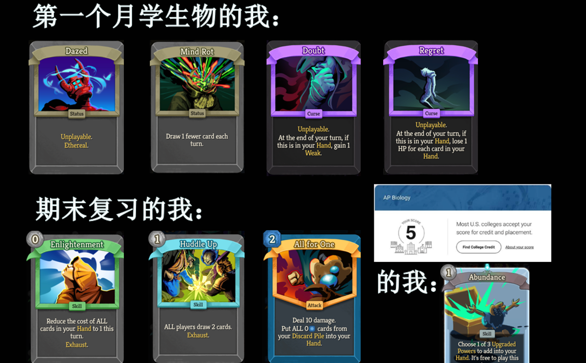

# “ChemioScience”，我不是被逼的

ChemioScience是我总结我整个高二投入最多的三个课程——Chemistry、Biology、Environmental Science所创造的自造词。

其中，我在生物这门课最大的印象是：虽然它的课程人数是我高二选课四科里最少的，但是它的体验是我觉得无可比拟的。

生物这门课的活动非常之多。从今年大家最喜欢的Kahoot，到期末复习公开处刑的十字准心（from阿诺德），我能感受到我确实在用心感受生物的趣味。我还是忘不了一步失误被Lin反超成为第二的故事，也让我记住了雨云的形成是condensation；忘不了第一次章节测拿了68分，也让挫折与懊悔泼醒了我小看生物的态度。

如此多样的活动，自然少不了仅有18个学生的课堂氛围。高三AP生物另外开了班，所以幸运地，我不用像在化学和环科那里面对新面孔不知所措。环科有高三，化学人数快到40人，额外的社交需求让我把大部分时间用于自己研究复习。但即便在个人认为最难的AP之一——生物课程里，我能够敢于课上提问，能够讲解题目，能够完成最后一次团队Kahoot挑战。至于某位zby天天觊觎我的Biobloom ticket这件事……小心我和济宝在明年种菜课上组合打你。

马拉松、巧乐兹和雪碧一起说过：生化环材，四大天坑——我一个人就占了仨。坏处说完了，好处呢？这样的组合之中，这些科目能够紧密联合在一起，一起复习真的能事半功倍。生物2025改革之后，最后两章是环科的最前两章。我甚至都不用细听，因为这些快到期末才讲的知识我已经在期中考试考过了。这真的是遇到版本福利了。化学？它讲理论知识，有时候元素的性质决定功能，在生物第一章讲物质的时候起作用。但本质上化学在这些科学科目中是一个打基础的作用，你得先学会化学的元素和性质，才能理解生物物质的功能，最后研究环科里的群落与关系，环环相扣。

总之，我给生物一个媲美国际部食堂十块钱薯条的含金量：你可以嫌它“贵”，但是它给每个人带来的多巴胺分泌让人欲罢不能。

