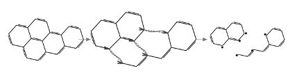

# AP生物课文二则

### 《元宵认错》

从线粒体回来，YXY博士全然不顾身体的疲惫，连夜找我们几个 tRNA 商量下一轮翻译的安排。

谈得晚了，便送我们出门，要 eEF1A·GTP 送我们去核糖体。在去核糖体的路上，我们说：“YXY博士，您回去休息吧。您刚从线粒体回来。”

YXY博士摇摇头，“不碍事，你们知道现在有一批苯并[a]芘进了细胞，不断给我们制造麻烦，你们给核糖体运送合成蛋白质需要的氨基酸，你们的事情便是细胞的事情，是头等大事。”我们都激动了，眼里噙着泪花。多好的苑笑阳博士呀。

YXY博士抬头看看内质网外平静的细胞质说：“如果整个细胞真像这里这么安静就好了，但是就有一些外来的分子，像苯并[a]芘，要搞乱这个细胞，它们是致癌物。”

说着，YXY博士弯下腰，从旁边的 NADPH-细胞色素 P450 还原酶那里接过一个电子，然后看着前面说：“该死的超氧阴离子。”

她把电子奋力向上一掷。很快就见前面那分子超氧阴离子突然爆发出耀眼的强光，然后就坠落下来。

“这是从苯并[a]芘的氧化过程中漏出来的超氧阴离子，它们这几天一直在内质网附近制造氧化损伤，我已经忍了很久了。”YXY博士愤愤地说。我们几个都鼓起掌来，为细胞有这样的YXY博士感到自豪。

那分子超氧阴离子接到电子，又从周围得到两个 H⁺，落下来时已经变成了一分子过氧化氢。

一会YXY博士叫来 Rab7·GTP 问：“那分子过氧化氢跑到什么地方了？”“好像是溶酶体一带。”Rab7·GTP 说。

YXY博士一怔，说：“赶紧去查，看有什么问题没有。”之后YXY博士送我们到核糖体，一直挥手到看不见我们。

没过多久我们听说溶酶体那边出事了。那分子过氧化氢进去以后碰上了铁蛋白降解释放出来的 Fe²⁺，生成了羟基自由基，接着引起膜脂的连锁过氧化。我们很紧张。而这时YXY博士叫我们过去。

她依然那么慈祥，让我们坐下说：“同这些有害分子的斗争总是要有牺牲的。为维持细胞正常工作牺牲的分子是伟大的。”她这时低下头说：“但我必须承认，我当时把那分子超氧阴离子打成过氧化氢的行为太鲁莽了，我在这里向整个细胞道歉。我将向整个细胞说明情况。”

YXY博士又说：“还有，你们走后，我直接撕开了那分子苯并[a]芘。两个碎片上各有三个碳原子带着未配对电子，可那两个碎片我没有完全处理好。”

Fig1.苯并[a]芘被强行裂解后的结构示意

我们顿时热泪盈眶。YXY博士在处理这些有害分子的过程中出了这样的差错，竟然还一直记在心里，还向整个细胞道了歉。

正在这时，在 DNA 上巡查双螺旋变形的 XPC 蛋白从细胞核赶来报告说：“有一分子 BPDE 已经和 DNA 上的鸟嘌呤连在一起了，把附近的双螺旋都挤得变了形。”

YXY博士马上问：“在什么地方？”

XPC 把位置告诉了她，YXY博士便跟着 XPC 往细胞核去了。

我们连忙说：“YXY博士，您先休息吧。这里的事情才刚处理完。”

YXY博士却已经走远了。

我们望着YXY博士远去的背影，想起她前两天才刚从线粒体回来。那时候内膜两边的 H⁺ 浓度差出了问题，她把漏回去的 H⁺ 一个个搬回膜间隙；ATP 还供应不上，又抓住 ATP synthase 中央的 γ 亚基，一圈一圈地转，直到旁边重新有 ATP 放出来。才过了两天，她又处理了今天这些事情，现在又赶到细胞核去了。

多好的YXY博士呀。 我们在以后的翻译中也一定要向YXY博士学习，学她那宽广的胸怀，和勇于认错的精神。核糖体那边下一轮翻译也快开始了，我们擦干眼泪，也赶紧向核糖体去了。

--- 

### 《元宵和Cas9》

明朗的朝阳透过培养液映进了细胞，Cas1–Cas2 小心翼翼地把最后一段噬菌体 DNA 存进 CRISPR 阵列。YXY博士放下了手里的那一小段 DNA，松开了按在阵列上的另一只手。她看着膜外，笑了笑：“又是一夜过去了。时间过得这么快，不抓紧怎么行啊！”Cas1–Cas2 说：“YXY博士，你不要太累了……”YXY博士笑了笑：“出去走走吧！”

从拟核那边出来，就看到了膜里膜外。膜外还挂着几只已经排空 DNA 的噬菌体壳，膜内散着上一轮被切断的外源 DNA 碎片，控诉着噬菌体的罪恶。细胞质里，crRNA 战士们纷纷从前体 RNA 里剪出来，正在准备又一天的战斗。YXY博士快步向膜边走去。crRNA 们看到YXY博士，连忙上来问候。YXY博士亲切地慰问：“昨夜累不累？”“不累！”“大家有信心坚持到取得胜利吗？”“在YXY博士的领导下，我们有万分信心！”

这时，一条 tracrRNA 来了：“报告YXY博士，Cas9 来了。”YXY博士说：“还不请 Cas9 过来？”

CRISPR 阵列旁，Cas1–Cas2 拿来了几个 Mg²⁺。YXY博士亲切地招呼 Cas9：“请用。我们现在噬菌体不断入侵，条件不太好，只能这样款待你了。”

Cas9 敬慕地看着YXY博士：“你们在这样恶劣的条件下，还能坚持和噬菌体战斗，我们很佩服。”

YXY博士：“为了细胞的生存，我们是不惜一切代价和努力的。”

Cas9：“也只有在你的带领下，才有这样强大的力量。”

YXY博士：“别这么说，还有你们的帮助嘛。对付这些噬菌体，有什么困难吗？”

Cas9：“困难很多，如果没有先前你们留下来的那些噬菌体序列，我们是没有经验的，也会更加困难。”

YXY博士：“我们的 crRNA 都有和这些噬菌体作战的经验，它们可以直接给你们作向导。”

正当两人欢声笑语时，细胞膜那边突然传来了警报。一条 crRNA 跑进来：“噬菌体要来了。”周围的分子马上紧张起来。YXY博士把手一挥：“来了就打击它。”

不过一会儿，噬菌体撞上细胞表面的声音、尾管扎进膜里的声音、外源 DNA 被切断的声音，就在膜边回荡交错了。

YXY博士拿过一条 crRNA：“我们出去看看吧。”Cas1–Cas2 说：“YXY博士，这样太危险了。”Cas9 也连忙劝阻。YXY博士笑了，举了举手里的 crRNA：“它认的这段序列，就是上次从噬菌体 DNA 里留下来的。当时它们的 DNA 已经整个进到细胞里面，总比现在危险吧。”

YXY博士拿着 crRNA 来到细胞膜内侧，只见几只噬菌体不停地往细胞里注入 DNA，每有一只贴上来，都有一条长长的 DNA 从尾部送进细胞。crRNA 战士们已经各自同 Cas9 结合，不停地处理着进来的外源 DNA。

YXY博士愤怒地拧起眉头，她看到又一只噬菌体贴上了细胞膜，一条 DNA 正从尾部往细胞里送。她举起了 crRNA，看了看上面的碱基，又沿着那条 DNA 看过去。当那段能和 crRNA 配对的序列正在往细胞里进来时，YXY博士动手了。

她一把抓住那条双链 DNA，两手一扯。

瞬间，那条正在进入细胞的 DNA 从中断开，断开的两截甩在了细胞质里。crRNA 战士们欢呼起来。剩下几只还没有扎稳的噬菌体惊呆了，它们再也没有勇气继续，纷纷松开细胞表面，向培养液里逃跑了。crRNA 战士们在膜边，向着YXY博士欢呼。

YXY博士万岁！
Cas9 万岁！
crRNA–Cas9 友谊万岁！
