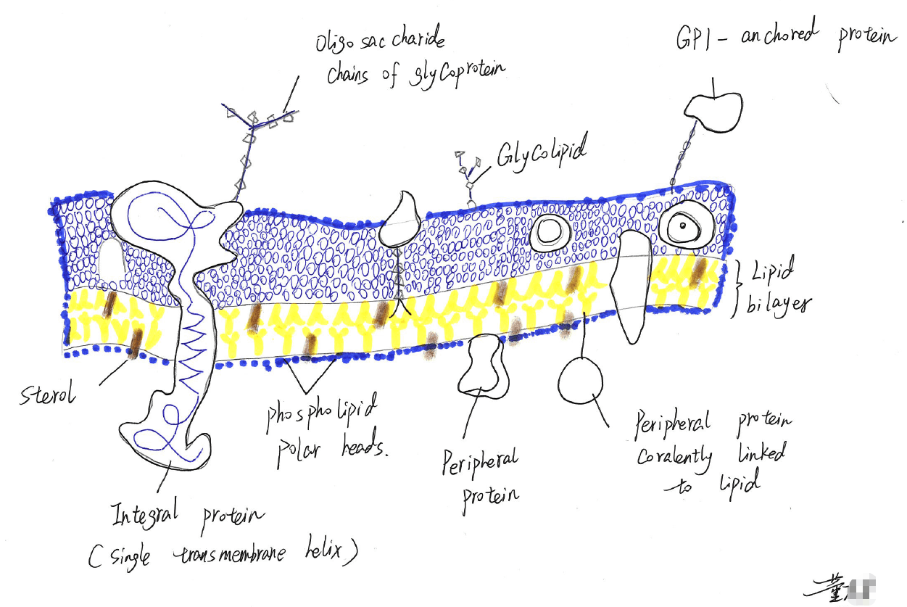
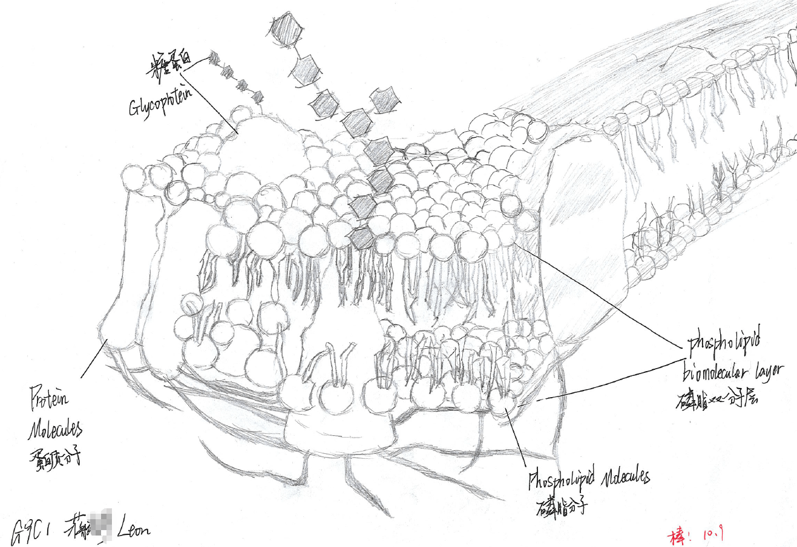
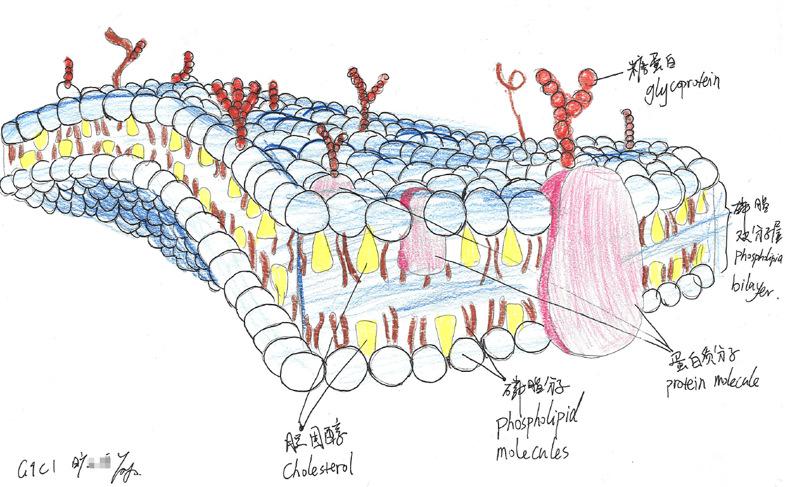
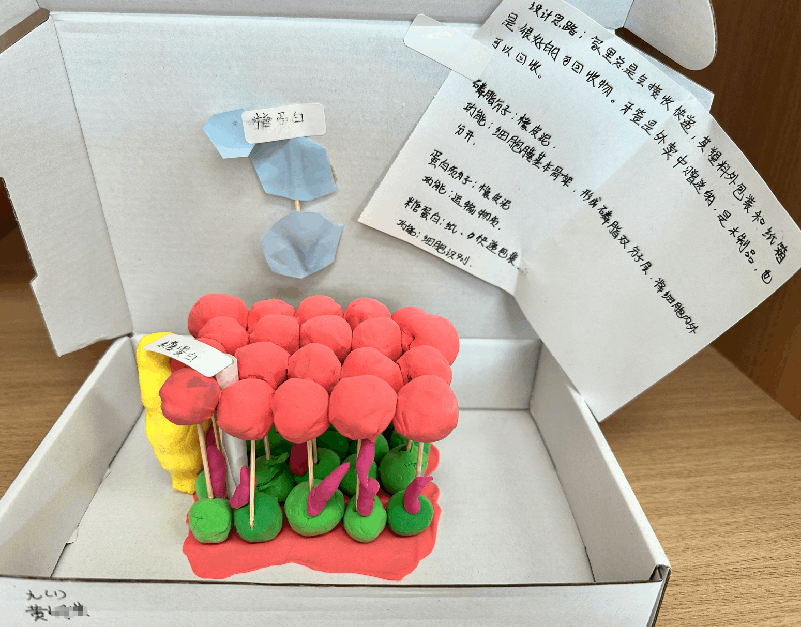
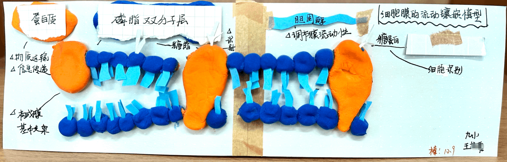
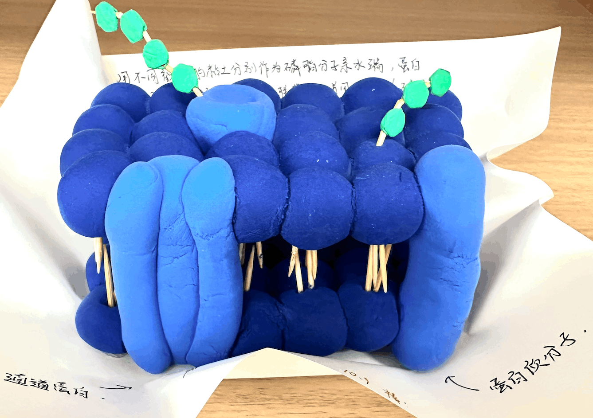
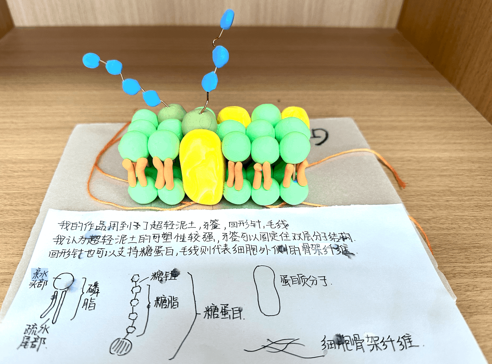
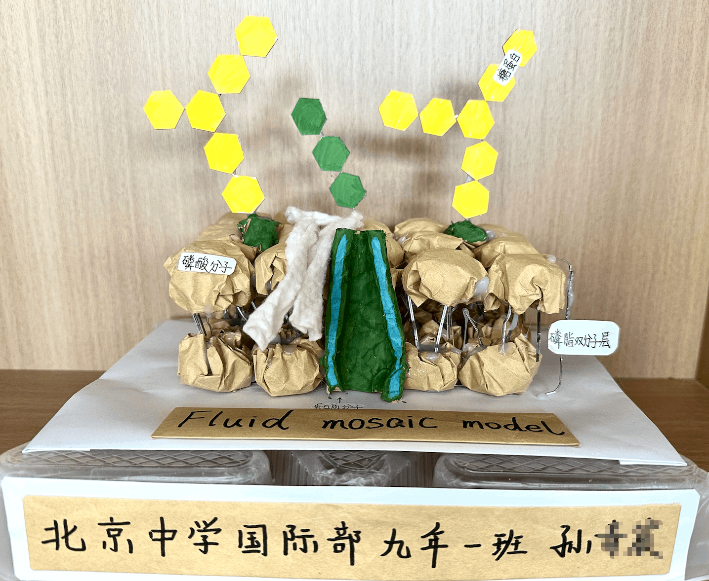

- 目标：通过动手绘画或制作，深入理解细胞膜的结构与功能。培养环保意识，学会利用废旧物品进行艺术与科学的再创造，提升空间想象能力、动手能力和科学表达能力。

- 推荐使用废旧物品或家中易得的材料。例如：旧纸箱、泡沫板、塑料瓶、旧袜子、快递填充物、橡皮泥/超轻粘土（鼓励使用过期或废旧的）、水果皮（如柚子皮）等。
å
- 模型标签： 班级和姓名 + 清晰的标签，标明各个部分的名称。标签可以直接写在模型上，也可以用牙签和小纸片制作。

- 创意说明： 简单解释你的设计思路，以及每个部分用什么材料代表什么结构，并说明其功能。

---

**九年级1班作业展示：**

---

---

---

---

---

---

---

---

