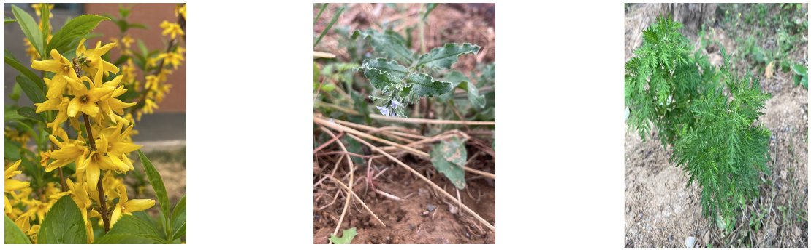
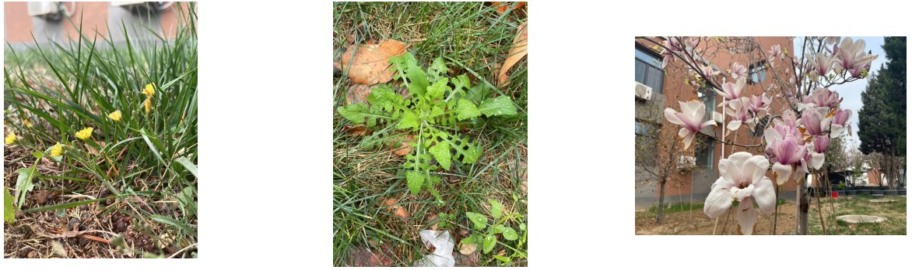
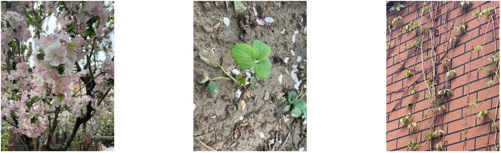
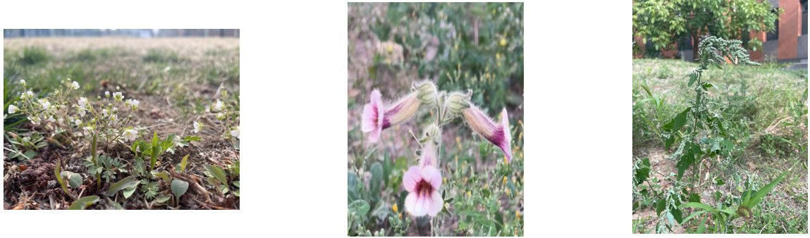
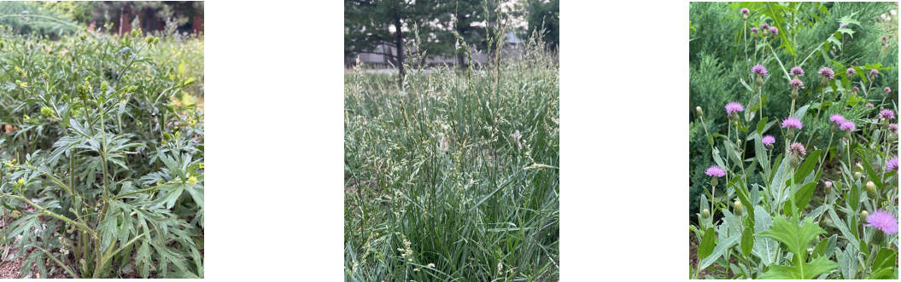
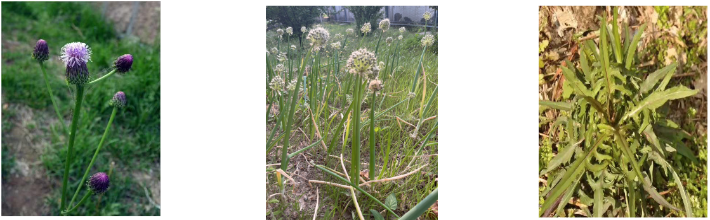
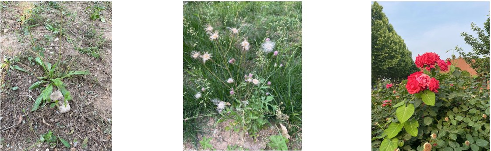
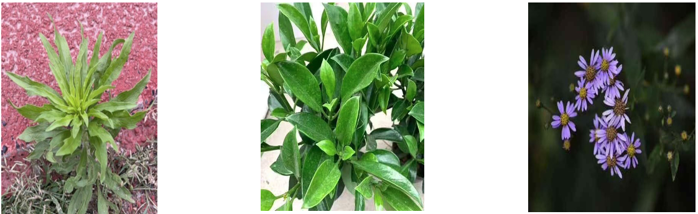
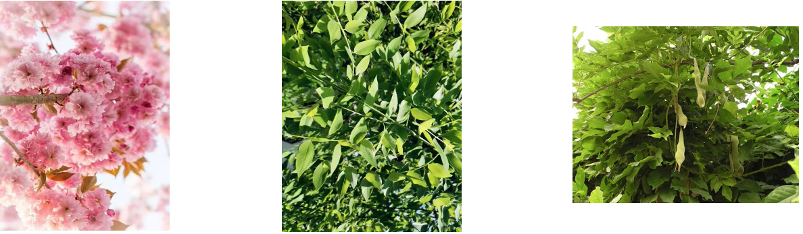
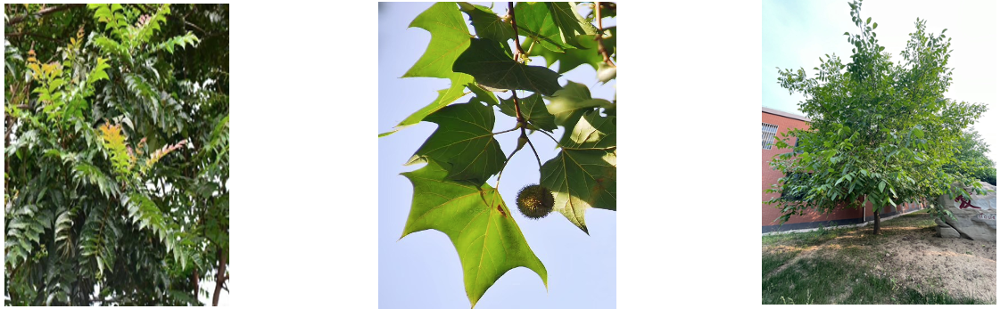

我们利⽤本学期的社团时间进⾏了北京中学⾦盏校区的植物物种调查，社团的全部成员都参与了物种收集以及鉴定，在此我特别感谢各位社员的付出。我们发现先校内有植物物种30余种，横跨多个科，其中以菊科居多，并且有丰富的药⽤植物，我们得出结论：北京中学⾦盏校区拥有良好的⽣物多样性，明年的社团活动我们将把本调查进⼀步完善，进⾏动物物种的调查以及制作线上数字博物馆，希望⼤家进⼀步⽀持和关注。

注：因能⼒有限，若有植物标识错误欢迎各位指正，我们会虚⼼改进。植物下所标注的药⽤价值仅供参考，不要因此采摘相关植物，造成的结果本社概不负责。

---

⾦钟花 ⼜名迎春柳（Forsythia viridissima）落叶灌⽊，⼴泛分布于全国。功效：解毒 治感冒发热，⽬⾚肿
 
斑种草（Bothriospermum chinense）⼀年⽣药⽤草本植物。功效：消毒解肿 可治湿疹
 
⻘蒿 ⼜名草蒿（Artemisia caruifolia）⼀年⽣草本植物，有⾹⽓。功效：凉⾎ 治疗疟疾

---

尖裂假还阳参 ⼜名苦卖菜（Crepidiastrum sonchifolium）多年⽣草本植物，从华北到俄罗斯都有分布。功效：清热 消肿 ⻝⽤

菊叶⾹藜（Dysphania schraseriana）⼀年⽣草本植物，有强烈⽓味，全体⽣短柔⽑。功效：治哮喘 ⽀⽓管炎

⼆乔⽟兰（yulania soulangeana）落叶乔⽊，2-3⽉开花，7-9⽉有时再开⼀次。功效：观赏 提取芳⾹膏

---

⻄府海棠（Malus micromalus）⼩乔⽊，中国特有植物，宝鸡市市花。功效：观赏 果可⻝⽤或解毒

⻩⽑草莓（Fragaria nilgerrensis）多年⽣草本植物，密集成群，叶质地较厚。功效：⽤于⾎热性化脓症

三叶地锦 ⼜名三叶爬⼭⻁（Parthenocissus semicordata）⽊质藤本植物，果实和种⼦近球形。功效：观赏

---

点地梅（Androsace umbellata）⼀年⽣草本植物，只需⼀点⼟壤即可⽣根发芽。功效：治疗扁桃体腺炎

地⻩ ⼜名⽣地（Rehmannia glutinosa）多年⽣草本植物，喜光，种植历史悠久。功效：滋阴补肾 凉⾎⽌⾎

⼩藜（Chenopodium ficifolium）⼀年⽣草本植物，普通⽥间杂草，4-6⽉开花。功效：观赏

---

茴茴蒜（Ranunculus chinensis）⼀年⽣草本植物，在我国各省⼴泛分布。功效：杀⾍ 消炎⽌痛

注意！有毒，⽣⻝会导致⼝腔灼热、恶⼼、呕吐腹部剧痛，严重可呼吸衰竭致死亡。

苇状⽺茅（Festua arundinacea）多年⽣草本植物，⽣⻓迅速。再⽣性强。功效：中等牧草

刺⼉菜 ⼜名⼤蓟（Cirsium arvense var. integrifolium）多年⽣草本植物，优质野菜，地下部分常⼤于地上部分。功效：炒菜⻝⽤ 喂养牲畜

---

泥胡菜（Hemistepta lyrata Bunge）⼀年⽣草本植物，可⾼100厘⽶，分布极为⼴泛。功效：消肿散结
 
葱（Allium fistulosum） 百合科多年⽣草本植物，种植、栽培历史悠久。功效：⻝⽤

翅果菊 ⼜名⼭莴苣（Lactuca indica）⼀年或两年⽣草本植物，⼴泛分布于欧亚，抗逆性强。功效：牧草 蔬菜 治疗咽炎

---

平⻋前 ⼜名⻋前草（Plantago depresses）⼀年或两年⽣草本植物，⽣⻓于草甸与池塘等地旁边。功效：利尿 明⽬

麻花头（Klasea centauroides）多年⽣草本植物，冬天仍有残叶、花⼤。功效：观赏 中等牧草

⽉季花（Rosa chinensis）常绿或半常绿低矮灌⽊，种类繁多，全世界已有近万种且在持续增加，并且是全国多个城市的市花。功效：观赏 活⾎化瘀

---

⻜蓬（Erigeron acris）两年⽣草本植物，全球都有分布，花期7-9⽉。功效：观赏 治⽪疹
 
灰莉（Fagraea ceilanica）⻰胆科⼩乔⽊，原产于台湾。功效：观赏 杀菌 助眠

三叶紫菀（Aster trinervius）菊科多年⽣草本植物，多⻓在林下、灌⽊中。功效：消肿 清热

---

⽇本晚樱（Prunus serrulata var. lannesiana）蔷薇科落叶乔⽊植物，花期4⽉，原产⽇本。功效：镇咳祛⻛ 观赏

⻰⽖槐（Styphnolobium japonicum）⾖科植物，原产于中国，⽇本朝鲜和美洲有引进。功效：花果可⽌⾎降⾎压

藤萝（Wisteria villosa）⾖科落叶藤本植物，在我国栽培历史悠久。功效：降温 减尘 ⻝⽤

---

麻楝（Chukrasia tabularis） 楝科⼤乔⽊，原产于中国、南亚各国也有分布。功效：抗炎 消肿 建筑材料
 
三球悬铃⽊ ⼜名法国梧桐（Platanus orientalis） 悬铃⽊科⾼⼤乔⽊，原产⾃亚洲⻄部，晋朝时便引进国内。功效：治疝⽓ ⽛痛
 
胡桃（Juglans regia）胡桃科落叶乔⽊，原产⾃巴尔⼲地区⼀般栽培于丘陵。功效：果和根治⽛疼 补⽓
