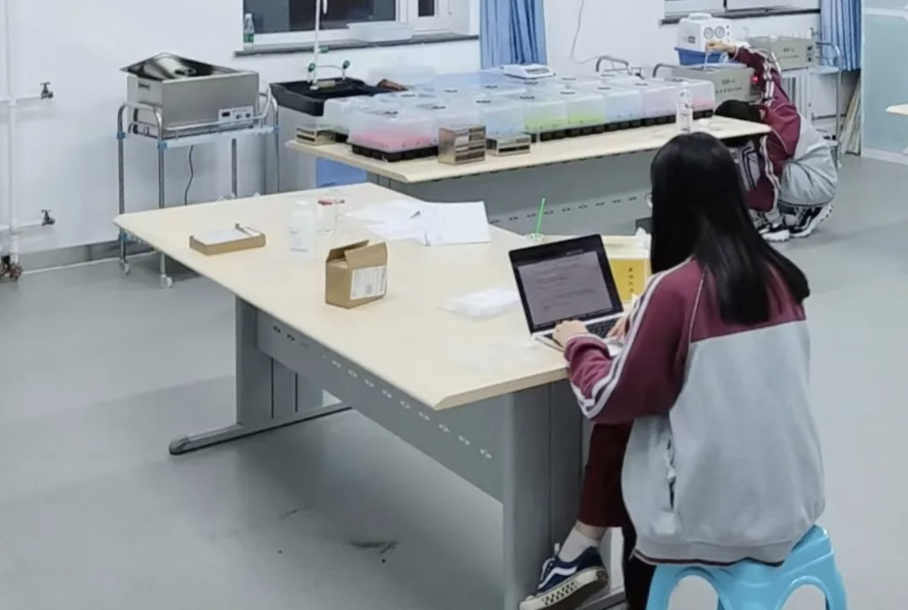

# BAID学生在iGEM国际基因工程机器大赛中勇获金奖

*转载自：北京中学国际部公众号*

iGEM国际基因工程机器大赛（International Genetically Engineered Machine Competition）是合成生物学领域的国际顶级科技赛事，也是涉及多学科交叉合作的跨学科竞赛。该比赛要求学生自主选题，并运用合成生物学等知识解决当地的问题（local problem）。iGEM赛况和研究成果一直受到《Science》《Nature》《Economists》等顶级学术杂志的关注，通过iGEM参赛并获奖的学生更容易受到世界各大名校的青睐，具有广泛的国际影响力与含金量。北京中学国际部在2023届iGEM国际基因工程机器大赛的120支高中生队伍中脱颖而出，荣获金奖，同时获得Best Presentation最佳项目展示单项奖！

Microplastic ingestion and pollution from bottled water is an increasingly severe issue for humans. BAID - China has developed a tool that can evaluate total daily microplastics ingestion amount and the world's first renewable microplastic filtration device for bottled drinking water called "Plasticlear", which consists of a bio-based filtration membrane using syntheticbiology methods and a cellulose composite supporting structure whose shape like a bottle cap. All the materials used were totally healthy and eco-friendly.

Oat protein and several other additives were chosen based on their absorption performance and cost efficiency. The modified cellulose binding module 3 (CBM3) is used to incorporate oat protein into the bacterial cellulose base membrane, using a triblock protein architecture. Molecular dynamics simulation based on mathematical and computational models provide insights on experimental data. Through Ramanspectroscopy analysis and AI-based counting, we confirmed that the filtration membrane achieves a microplastic filtration efficiency of over 95%.

这是北京中学第一次以校队方式组队参加iGEM赛事，初战告捷。iGEM团队主要由两个小队组成，实验（Experiment）和实践（Human Practice）。带着对这个团队的诸多好奇，我们采访了两位团队中的关键人物：高韩与陈以沫。在她们的讲述下，回顾几个月前的那些“美好也不美好” 的回忆，团队的十三名成员是怎么样的努力与坚韧，才成就了这样的好成绩。

---

## 一个机会

高二一班的高韩，是整体团队的队长，主要带领实验团队，以及其他各个部分的整体协调。在她看来，iGEM是一个涉猎范围非常广泛的比赛，年龄跨度从高中生到研究生，不局限在生物方面，也会涉及到计算机，数学，建模甚至是金融或者是艺术等学科。iGEM也是比较学术的，有自己的一套评分体系，是集学术研究和自主项目的一种比较综合的项目竞赛。

高韩未来想要深入学习生物专业，在没有继续明确方向的阶段，她选择多尝试，多探索，给自己一个机会。

高韩：“报名之前，在刚刚了解这个比赛的时候，我对它有一种滤镜。基因工程，相当于是生物工程，感觉很高端也比较遥远。”

根据报名的要求，高韩开始组建队伍。在确定实验组人员后，她找到了同班同学陈以沫，一位未来想要学习文科专业的同学，由她来带领实践组。

6月，对于实验组的同学们来说是火热的。除了准备课业考试之外，还开展了非常多的会议来确定主题。

陈以沫：“在我们所生活的环境中，存在着各种环境问题、社会问题。我们在定题阶段看到一些文章，介绍到现在微塑料的污染非常严重，而且它会在人体里长期积累，造成一些慢性的不良影响。所以我们决定在微塑料（Microplastics）的基础上探索对于这个问题的不同解决方法。前期我们做了很多的文献阅读和调研，看学术界对于微塑料这个问题究竟采取了什么方法。我们列出了不同的解决方法，然后在最基础的三个分叉上面进行探究，分别是直接用酶降解、直接创造一种替代塑料的一种新的材料以及减少人类接触，我们主要方向是选择了最后一种，制作一款微塑料过滤设备，但也探索了第二种，因为会更贴近比赛的范畴，所以我们又综合考虑了它的可行性。”

与此同时，实践组也根据定好的主题推进他们的工作：与社会人员沟通交流。这是因为iGEM注重项目的实际可行性，因此实践组需要根据自己的项目主题向社会征求意见。

Human Practice的定义，是在确定项目主题后在社会中寻找到和项目息息相关的人。同学们需要采访他们，把项目介绍给这些社会人士，请他们帮忙让项目更加脚踏实际地地应用在真正的生活中。

陈以沫：“7月的时候我们开始起草HP（Human Practice）部分的内容。那段时间很累，实验部分的信息量很大，他们做了很多努力去定题，所以说我们得跟上他们的思路。HP大部分的工作都放在如何和相关人士沟通。”

iGEM团队随后与污水处理厂的一名工程师和矿泉水品牌的一名经理取得了联系，这名工程师恰好做微塑料相关的研究，也对项目会涉及到的目标系统比较了解。而矿泉水品牌经理则从外包装层面，根据商业上的判断，给到了一些现实的考量，如在确保瓶身和瓶盖的耐受性、质检等安全因素下如何尽可能压缩成本。在和他们进行讨论以及下一步探索文献后，iGEM团队逐渐发现项目存在的问题与难点，最终确定了研究方向。

在做实验的阶段，实验组还遇到了一个小插曲。

高韩：“我们在处理数据时临时发现没有人掌握处理方法，情急之下，我赶紧查找以前参加各种活动学到的知识，发现曾经Johns Hopkins University的夏校时学到一些数据处理、学术海报制作以及写学术论文的方法。我想试一下当时学到的一种数据处理方法，two-ANOVA analysis，单独用作生物实验里处理数据比较常用，发现竟然真的可行，有一种很庆幸自己有积累又有种幸运的感觉，真的很奇妙。”

iGEM的金银铜奖是更偏向于一个标准化申请制的等级规定，并不是横向比拼。组委会通过考察队伍的作品与答辩，认为达到了某个奖项的标准就授予相应的奖。没有实际上的对手，大家只是在自己的能力范围内，拼尽全力，做到最好，并且希望可以得到认可。

在备赛的几个月时间里，他们开了很多次会，阅读文献的数量数也数不清，有限的课余时间一直在紧张地做各种实验，就连国庆假期也是泡在实验室度过。

高韩：“我们很难在开始项目之前就预见到会花费我们这么长的时间，但是越往后就越觉得要把这个项目完成到最好，所以在合理的范围内即使多花一点时间，也一定要出来成绩。我们的项目本身是很好的，而且也确实值得我们为它付出这么多。在这所有的付出里，我自己也学到了很多，这是如果不参与进来就学习不到的东西。”

这一次iGEM，除了让大家获得这个充满含金量的奖项，也是一张发给大家用来明确未来发展方向的绝佳探索体验卡。

高韩：“我觉得这个竞赛可以让未来想要学这些专业或者是对科研有兴趣的同学认清兴趣。可以提早发现学术兴趣，也可以因为这一个学术经历认清自己原来并不感兴趣，我觉得从长远来看还是很节省时间的。”

而对于实践组的同学来说，即使未来不在生物领域学习，依然获得了宝贵的经验。

陈以沫：“这个项目对我的第一个影响，是让本来想要学习文科的我发现自己还是更愿意去和社会进行接触，而不是去沉浸在个人的世界里，这是一个挺新奇也很刺激的事情。我完全想成为一个社科专业的学生，将来想做一些和人打交道的工作。我觉得这是对我的一个改变。

其实我在一开始并没有立刻答应高韩的组队请求，即使我在九年级就了解了iGEM。但这仍然是一个契机。我考虑到这是一个合成生物学领域的比赛，和我有一点八竿子打不着的意思，但我还是去查了这个比赛，也去了解了以往的队伍所做的实践部分，我发现和我想的完全不一样，还是很有意义的。而且我自己也不排斥去学习其他领域的东西，所以就这样愉快加入了，这才有了今天的收获，感谢团队小伙伴对我的信任，给了我机会，也感谢我给自己的机会。”

---

## 一些困难

实践组的视角是如何把项目介绍出去，让更多专业的人士听到同学们的声音，然后收集这些声音对项目进行改进。

陈以沫：“对于实践组来说，寻找社会中愿意和我们一起完成项目的公司和人，这个过程非常曲折。我们主要是要写邮件，要花非常大的精力去找提供联系渠道的公司。我们锁定了公司所在地和规模后，一个一个去他们的网页收集联系方式，再一个一个把我们拟好的邮件发出去，等待他们的回复。在这种海量筛选之后，回复我们的邮件其实屈指可数。只有娃哈哈和一个污水处理厂回复了我们。这是非常不易的，也非常感谢他们明知道这件事对公司几乎没有什么实际的利益，却仍然愿意帮助我们。于是我们抓住这些机会，及时回复他们的邮件，往来了一段时间后，加上更便捷的联系方式，又继续预约了之后的采访，一点点扩充、丰富我们的内容。”

除此，实践组需要完成实验与实践的整合以及书写整个项目的计划书。在九、十月份，实践组的压力非常大。整合的工作就像把以前编织完的很多布料一点点缝成一件完美的衣服，对于写作和整合能力是极大的挑战。

陈以沫：“我的感受就是过程中一直都很困难，毕竟是我们半年来的成果的最终结合，是很费脑力的。如何把我们做的东西以一个非常顺畅的文章去叙述出来，有点像写论文又有点像传记，真的难。当时我花了很多时间让去思考一个逻辑自洽又令人眼前一亮的思路。不过还是有些办法的，我学习了以往的一些团队的手法，他们会用模型概括自己的内容。所以我就研究了很多种模型，再和自己的创意编织在一起，绞尽脑汁去搭起了骨架。在之后的编辑过程中，需要多人协作配合、修改整理大家的内容，这个过程也是十分地不易。”

高韩：“实验组最开始遇到的困难是，大家对科研的技术手法不是很熟练，比如看完文献不知道实验结论是什么。所以在刚开始的阶段，我们在带领以往不太接触科研的同学们逐渐理解这个过程，在他们开窍之前，是比较痛苦的，但这是一个必须要经历的路程。最终遇到的困难是，进行到项目的最后阶段，大家的情绪都不是特别稳定，我们都付出了很多，但是大大的压力就是存在在那儿，我们之间会产生一些争吵。如果无法沟通的话，是会有人离开，这是没有办法的。”

作为队长，高韩需要把控整个项目的进度，组织整组的组员，以及接受各种各样的问题发生，控制好自己的情绪，提前准备好备用方案。

高韩：“备赛过程中内容很多，而且iGEM有一个重要的银奖评奖标准材料，叫做工程周期（engineering cycle），这涉及到整个项目的整体思路，压力是比较大的。而且iGEM需要花费的资金比较多，时间又拉得很长，从2月到11月，后续还有补充实验。在投入这么多时间和精力的基础上，就不允许没有成绩，压力也如影随形。”

好在所有的难，在最终确定获奖的那一刻，已经尘埃落定。大家终于松了一口气，迎接自己应得的而又来之不易的收获。

---

## 一种传承

高韩：“听说以前有学长参加iGEM，但没有组建校队，我想我们一定要获得好成绩，因为我们是北中第一支自主组队参加iGEM的队伍。

我们必须要获得一个不错的成绩，这样才可能会有后续的其他队伍，以至于在学校里形成一个校队。高韩的心里，还装有这样的一份使命感。iGEM的含金量自不必多说，她希望学弟学妹也能够像她一样，在高中阶段获得这样的成绩。

一方面是对于申请有效，一方面对于学弟学妹来说终于有一个平台参加iGEM。万事开头难，明年再有校队的话，我也想要继续当advisor去帮忙帮助他们，做一个校队的传承，对学校做出更多的贡献。”

北中和iGEM的联系，始于“校长有约”。这是给学生们直接和校长沟通、寻求学校支持的机会。同学们通过答辩，介绍自己想要做的事情，如果可实施，会收获校长的直接支持。

高韩：“校方对于我们的参赛是很支持的，我们在参赛的时候是需要学校出一位首席研究员（primary investigator）。我们的AP生物代莹老师很愿意来指导我们。而且还需要递交校长同意书（principal consent），周慧校长也给予了我们很大的支持。除此之外，学校还给我们提供了实验场地。新校区的生物化学实验室仪器比较齐全的，在最后可以提供给我们一个收尾项目很好的场地，非常高兴。”

陈以沫：“获奖是从小奖项公布，前面就一直没有我们的名字，当时其实挺崩溃的，同学们在学校参加期中考试，我们申请去参加这个竞赛，大费周折才去到巴黎，所以我当时是非常失落的。但当公布团队金奖的时候有我们的名字，我当时有种从地狱走上了天堂那种感觉，一下就轻松下来了。这里要感谢高韩和组员们、老师们。

我觉得学生不能只是局限在知识里，更多的还是要就是走出学校的象牙塔去看看。对我来说，这个金奖是一个很圆满的句号。虽然未来我并不打算学习生物学，但是如果还有这种环境保护、涉及社会责任方面的项目，我都会特别愿意参加。我个人的满足感得到延伸，变成一种责任感，就是我们校训‘Better me Better world’所说的这样。”

---

## 经验分享

问起两位关于参加iGEM的经验，学姐们有话说。

> 高韩：“首先要做好付出很多时间和精力的准备，调整好稳定的情绪，并且需要一定的抗压能力，一直坚持着不要放弃。其实常听别人说科研是很枯燥的事情，但是在自己真的开始做之前，对于这件事情是没有概念的。所以如果你想尝试，做好自始至终全情投入的准备，当然也得具有一定的学术能力和学术素养。付出确实很多，但收获也不少。不仅是收获好成绩，还有友情、经历以及技能技巧。大家都会为同样的目标去奋斗，能遇见一群志同道合的朋友，相互支持理解，并且共同进步，还是很宝贵的。”

> 陈以沫：“站在团队构建角度说，首先需要一个雷厉风行的leader，还需要至少在每个方面都有一个擅长的人。而且我认为有责任心有时候可能比有能力更重要。但确实不鼓励从零开始，还是对专业知识有要求的。期待2024年校队能有更多斩获！”