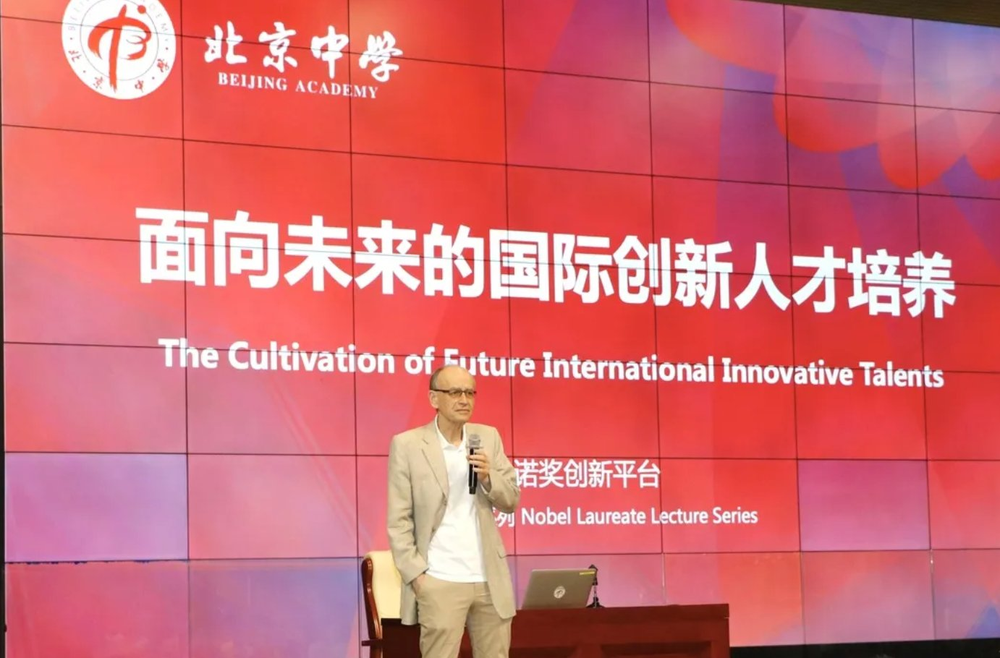
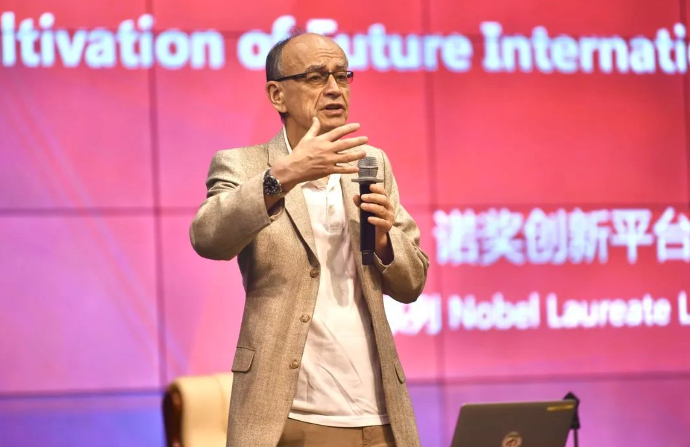
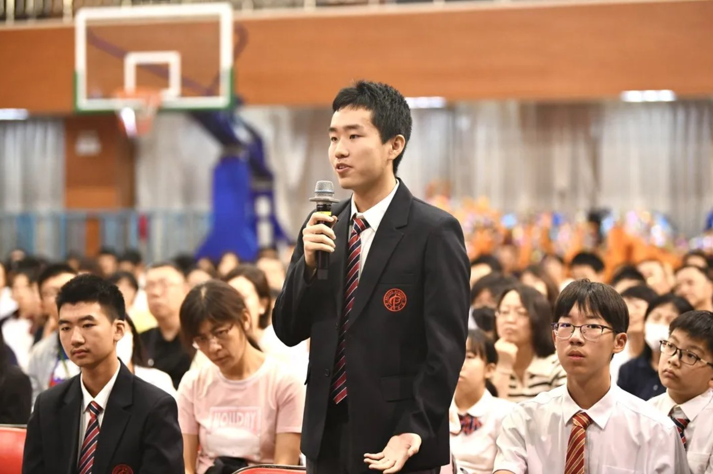
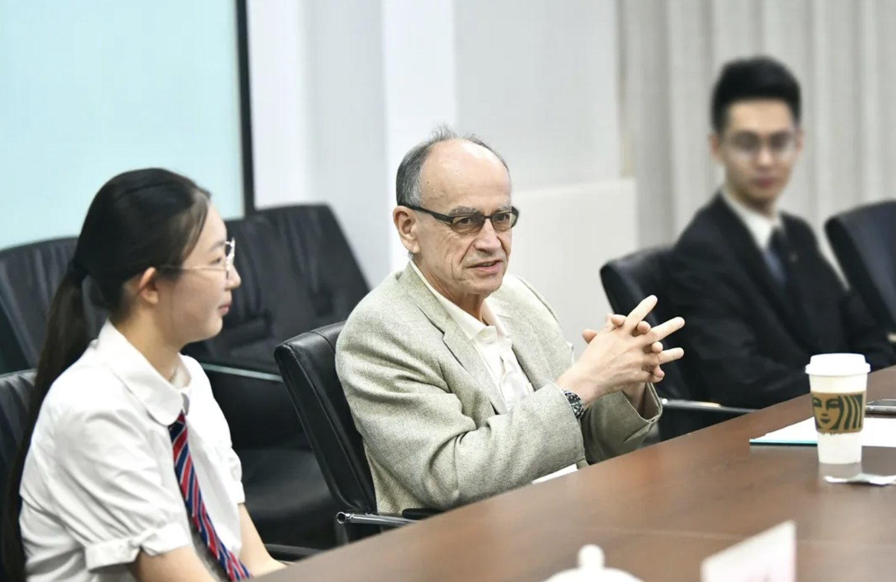
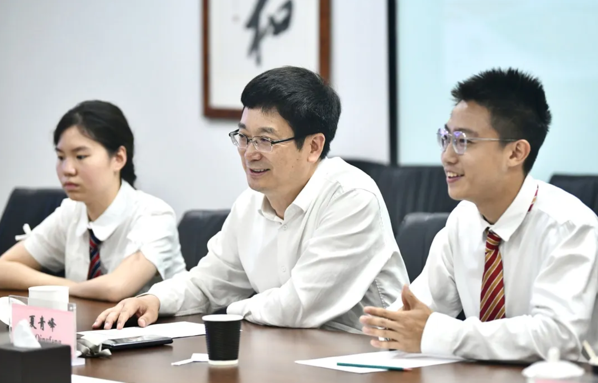
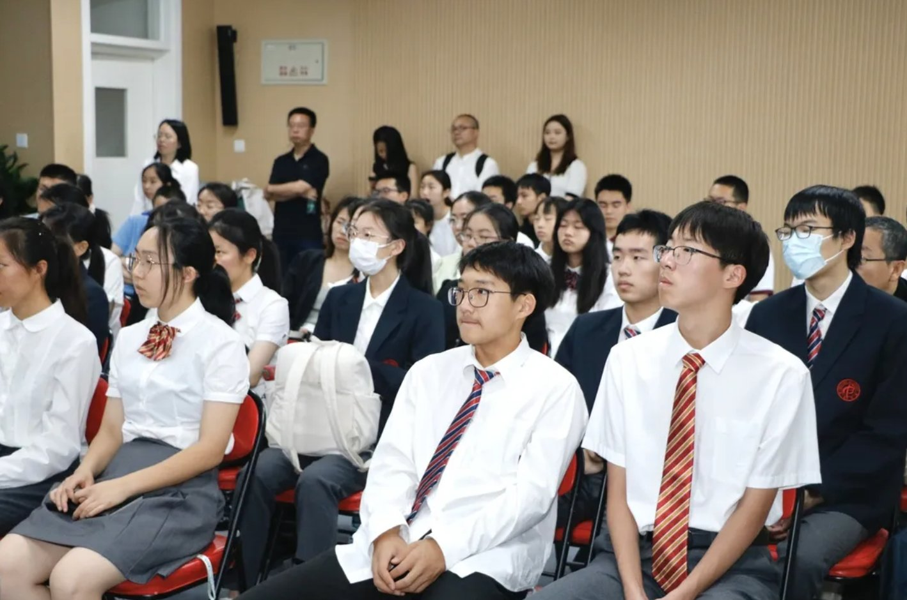
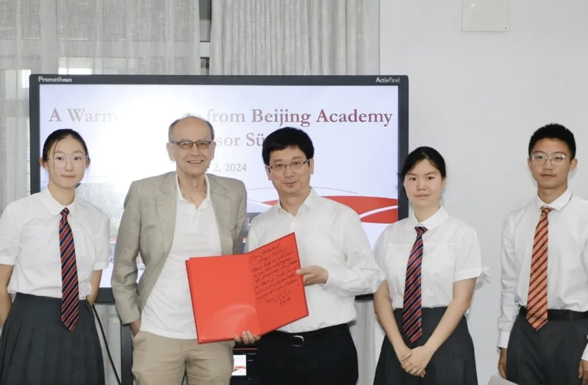

# 诺贝尔生理学或医学奖得主走进北京中学

*转载自：北京中学国际部公众号*

2024年6月2日，诺贝尔生理学或医学奖得主、美国国家科学院院士、美国艺术与科学学院院士、英国皇家学会外籍院士聚德霍夫院士走进北京中学，进行了主题为“面向未来的国际创新人才培养”的精彩演讲，并分享了他对于创新人才培养的思考。

---

## 主题分享

院士介绍了他个人的科学研究历程，获得诺奖对他的意义，以及自己在神经科学方面的研究。最后，院士基于自己的经验，向同学们提出了指导建议。

演讲结束后，聚德霍夫院士与北中学子们展开对话，同学们积极踊跃提出问题，现场学术交流氛围浓厚。

---

## 专题交流

本次活动中，北京中学校长夏青峰围绕学校的教育理念、办学特色、人才培养、国际交流等方面与聚德霍夫院士展开对话，聚德霍夫院士对学校的高质量办学成果及创新人才培养给予高度肯定。

---

## 创新人才座谈

最后，聚德霍夫院士与北京中学学生代表围绕“创造性学习”这一主题进行了座谈交流。本环节由高韩同学担任主持人。王子熙、黄悉然、李嘉、杨程茵四名同学依次分享了自己在自主创新研究及项目学习方面的心得。教授对同学们在课题研究中展现出的问题意识和创造性思考给予了高度评价。同时，他也鼓励同学们寻找自己的真正热爱，结合个人优势，为之努力奋斗，过自己想要过的生活。现场的同学们受到极大的鼓舞。

聚德霍夫院士的来访，是一次成功的学术交流活动。它不仅增强了同学们在生命科学相关领域的兴趣，也为北京中学的创新人才培养及国际化教育进程注入了新的活力。

---

<iframe src="//player.bilibili.com/player.html?isOutside=true&aid=1455474819&bvid=BV1xi421v7U5&cid=1569915080&p=1&high_quality=1&danmaku=0&autoplay=0" allowfullscreen="allowfullscreen" width="100%" height="500" scrolling="no" frameborder="0" sandbox="allow-top-navigation allow-same-origin allow-forms allow-scripts"></iframe>