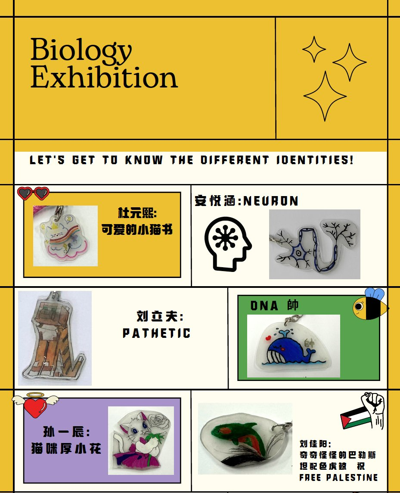
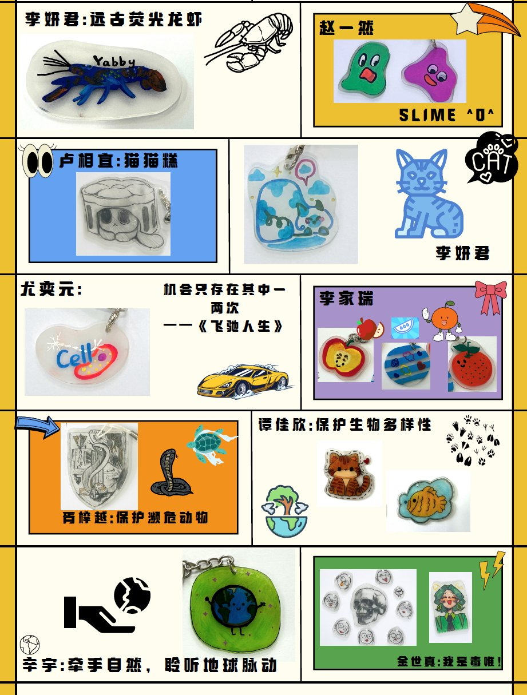
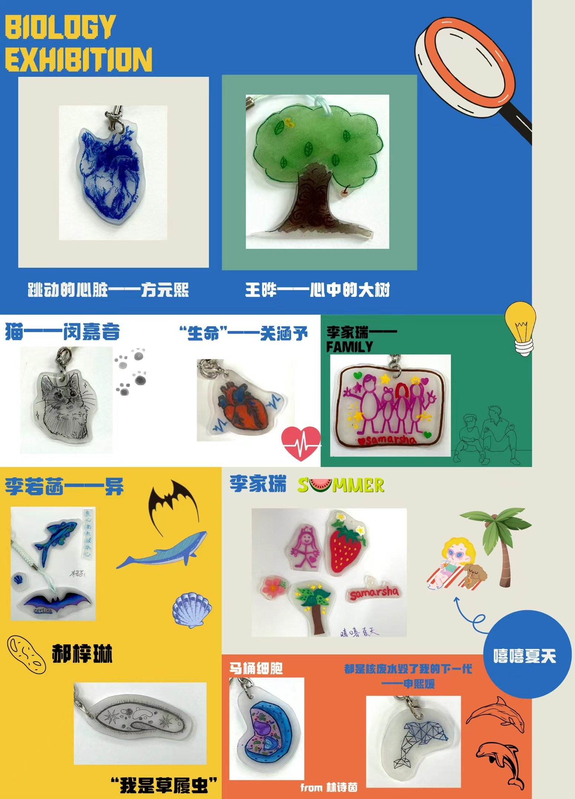
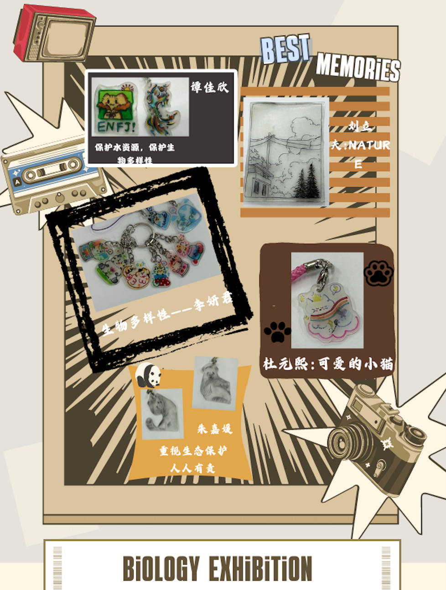

随着五月的尾声悄然来临，我们一年一度的生物学科周活动也圆满落下了帷幕。在本次学科周活动中，我们共同见证了一个个生命奇迹在热缩片上绽放。这不仅仅是一场手工制作的活动，更是我们对生物学科热爱的展现，是创意与知识的碰撞。现在，我们带着满满的收获与感动，共同回顾这段精彩纷呈的时光。

**🌱热缩片上的生命画卷🌱**

本次学科周的重头戏——热缩片模型制作大赛，共收到了近40份令人惊叹的作品，每一幅都是独一无二的，都凝聚了同学们的创意与汗水。从细腻入微的细胞结构到丰富多彩的生物多样性，从抽象深邃的遗传知识到寓意深远的环保主题，它们不仅仅是模型，更是同学们对生物学科热爱的直接表达。

---

---

---

---

**🧬同学感想🧬**

方YX：

参加生物学科周的绘画热缩片活动，我感受到了科学与艺术的美妙融合。
这次学科周中，同学们积极参与制作学科主题的热缩片。大家通过兴趣选择想绘制的图案，将细胞，个体等等生物体的层次，通过色彩与线条在热缩片上细腻勾勒。在这个过程中，不仅锻炼了我们的创造力，跨学科的知识运用的能力，还让我们对生物世界的复杂与精致有了更深的理解和敬畏。随着热缩片在加热中渐渐收缩成形，那份成就感如同见证生命的奇妙变化，鼓舞人心。此外，这次活动的志愿者们也非常热心的帮助大家制作热缩片，同学们在这次活动中相互帮助，共创友好温暖的校园氛围。此次生物学科周活动不仅丰富了我们学习生活，提高同学们协作能力，更激发了我们探索生物奥秘、追求美好事物的热情与动力。

朱JY：

安YH：

---

**最后，我们特别对所有组织活动的志愿者们和参与活动的同学老师们表示最诚挚的感谢和最高的敬意！你们的热情和努力让本次学科周活动充满了生机与活力。同时，我们也对获奖的同学们表示热烈的祝贺，你们的作品不仅赢得了荣誉，更激发了更多同学对生物学科的兴趣和热爱。生物学科周虽然结束了，但我们对生物学科的热爱和探索永不止步。让我们带着这份热爱和梦想，继续前行在知识的海洋中，不断发现、不断创造吧！**