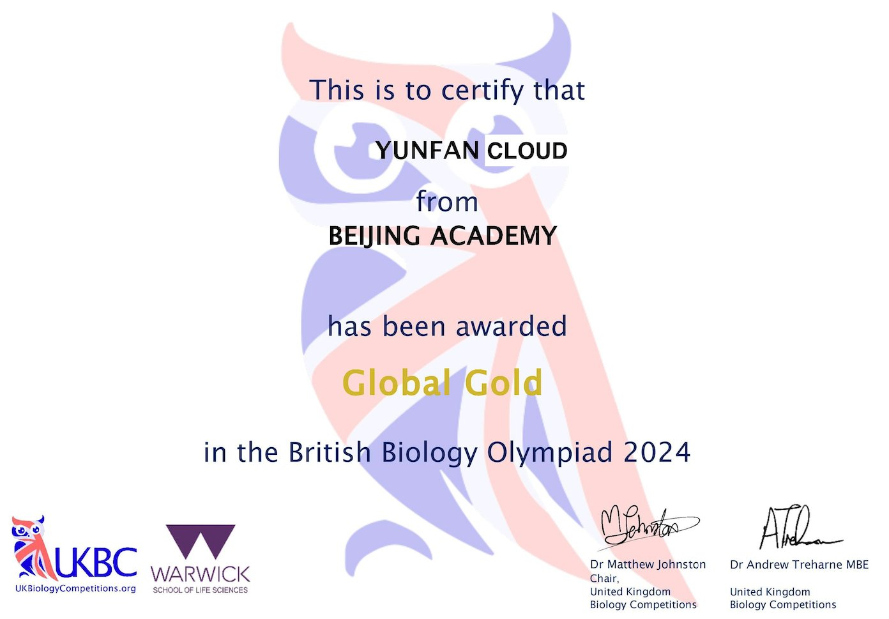

# 兴趣，努力，坚持--BBO的备赛和感想

Written by **Cloud 云帆**

在24年寒假开始备赛时的第一节课就把我吓着了，在学校里可能需要用一周来学习加回顾的知识我需要在20分钟内用英语学习完并基本记忆，这无疑对饱含热情与激情的我予以了相当大的震撼，两个小时的课程结束后，吃午饭时我就发现刚才的名词我已忘了三分之一了，本来我自诩生物学习能力不弱，可是这种前所未有的学习状态让我不得不更加的认真起来，连着上了三天课后我的脑子字面意义上的被榨干了，多亏了作业已经写完，不然绩点不知道要被扣到哪里去了，但是这个时候其实只是用英语把之前学习过的内容重新记忆一遍罢了，但是两周后情况发生了微妙的改变，首先的问题就是呼吸和光合作用，虽然初中和高中已经学习过两遍的知识早已烂熟于心，但是当我看到叶绿素a把电子泵给其他光合色素后的进一步连锁反应示意图时我还是缓缓的说出了一句“啊？”呼吸作用的三羧酸循环更是让我懵了10分钟；随之而来的解剖学给了我当头一棒，初中仅仅学习了一点皮毛的人体现在被细细剖开，解剖刀已经不足以将我所需的地方分开了，解剖针一根根的挑出了神经与血管，紧接着，物理手段已经不复存在，细致的分子运作机理让人眼花缭乱—激素级联，神经元内外的信号传递等等，说实话，当时我的信心被极大地打击了，不禁在想：这么多知识点我真的记得下来么？考试的日子越来越近，定义与名词却总是记混，记得不牢，出分的压力压得人喘不过气来。

可是，我慢慢的注意到了一些事情，我的学习动力到底有没有问题？我学习生物的初衷是什么？我在一个晚自习思考着这些问题，最后一个问题的答案很明显，我学习生物的初衷就是为了了解千百生灵为什么能够存活，每一个生命都是自然创造的奇迹，生物学就是把自然造物的知识变为自己的，掌握它们的底层运作机理，我选择以后学习生物专业的原因是兴趣，那我现在为何不用兴趣进一步来强化我学习这件事本身的动力呢？那个周末的课上讲的是人体免疫系统，但是我又恰好二阳了，本来以为自己的学习效率会不高，但是当大脑在主动的学习它与生俱来就会的知识的时候它又在坚实的履行着这一功能是一种很奇妙的感觉，免疫系统一层层细胞与反应流程的精密配合--你血液里APC吞噬分解病菌后用MHC2呈递抗原给辅助性T细胞后细胞因子会激活效应B细胞，他们需要在你身体早就生产好的理论上可以应对的世界上现在有的，以前有的，未来有的所有病原体的抗体中找到符合现在情况的那一个并唤醒生产它的浆细胞，随后这些生产抗体的浆细胞负责打“控制”，生产各种抗体结合病原体身上的抗原把它们聚集在一起并降低活性，随后刚才一并被激活的病毒性T细胞则是曾担起了“刺客”的工作，进场收割着被感染的细胞，用穿孔素和自身运动给它们打孔，随后进入的颗粒酶会毫不留情的彻底结果它们的生命。随后，病原体被消灭殆尽，记忆B细胞和记忆T细胞记录了这一场战斗，下一次同样的侵略者会被更有效地杀死。可是在绝大多数人的眼中这只不过是发了场烧而已，这种千百年来进化得出的无比精密有效的军队让我感受到了真正的浪漫，我有了一种最原始的求知的欲望，找回了最开始想学生物的根本动力，总而言之，就是不要把知识单纯的当做知识，要记住你学习知识的初衷是什么。而名词记忆则有一个更本源的方法：词根词缀，英语的生物学名词虽然一眼看上去很“流氓”—其是由拉丁语直接转写过来的，与日常用语可以说不是一套来源，所以就算是缩写也不好记，并且中文也不好记，可是你仔细观察一些词的词缀就会发现很多好玩的东西，比如-philic 是喜/亲的意思，hydro这个前缀是水的意思，所以“亲水的”就是hydrophilic，如此一来很多晦涩的词语都变得好记了；而缩写也有规律可循，一般来说结尾是H，比如说XXH这样的一般是什么什么激素，比如说FSH就是促卵泡激素（follicle-stimulating hormone）、FRH就是促卵泡激素释放激素（follicle-stimulating hormonereleasing hormone）。很多学习中的问题都在老师和自己的参悟下得到了解决，与此同时我在周末的游戏时间和学校内的休息时间被压缩了特别多（那个赛季的赛季手册都没满级），课内作业和托福刷完之后大部分时间都在看网课和复习知识点，考试前的那个周末我还需要去青岛参加SKT-HOSA全国站，来回的路途上我也在看着资料。毕竟努力了不一定成功，但是不努力一定不会成功，如此循环了三个月，时间给出了答案。

先抛开结果不看，其实这次备赛我还是有些遗憾的，也希望看到这篇文章的人可以以我为戒，我的备赛的不只是BBO，还有BIO-USAN，也就是俗称的USABO，美国生物奥赛，它和BBO同一天考试，但是我却没有拿到好成绩，我想，最根本的原因是一个老生常谈的话题：刷题，只是在学习后不经过合理的检验是没法真正成为自己的财富的，经常性的刷题和练习是学习必不可少的部分，如果刷题量上去了，甚至从大脑中调用这些知识已经成为了一种“肌肉记忆”那么在最终考试的时候做什么“疑难杂症”都可谓是手到擒来。 而不用费尽回想，美国和英国的生物奥赛其实从今年开始都在要求“一分钟一道题”的能力，BBO今年改革后是90分钟168道题，也就是说除了计算题你做一道题的时间要小于一分钟，这就意味着在考试的时候是没有任何思考余地的，必须让所有知识点都烂熟于心，USABO虽然看起来比较亲民—-50分钟50道题，全选择，但和BBO中英双语的题干不同，USABO是全英语的，也就是说英语题干的阅读会占据你做题的一半时间左右，如果对名词记忆不牢意味着整道题的作废。在备赛的时候最好直接记忆英语名词而不是中文的，不然就意味着你需要两倍的记忆量。

  这两千多个字只是我三个月备赛经历的一点简单感想，我在其中收获的学习能力的增长以及感悟是这干枯的文字说不清楚的。但不论怎么讲，我的努力是有了收获，今年我斩获了BBO的全球金奖，很荣幸可以成为今年中国的1/60，也是我校高一的唯一一名获奖者。但是人外有人天外有天，我相信不用说全国，全市都有数不清的比我优秀的同学，我只是千千万万最普通的普通人中的一个，只不过凭借着兴趣，努力，与坚持得到了一点小收获，高二的USABO是我最后一次机会了，我将在接下来的一年与所有人一起努力去争夺USABO的金奖，与大家共进步，获得更好大学的申请资本。

  本文只为抒发自己的一点情感与博君一笑，观点仅为个人观点，与学校老师无关，若有侵权，随时删改。
  
  望共勉
  
  2024.7.1