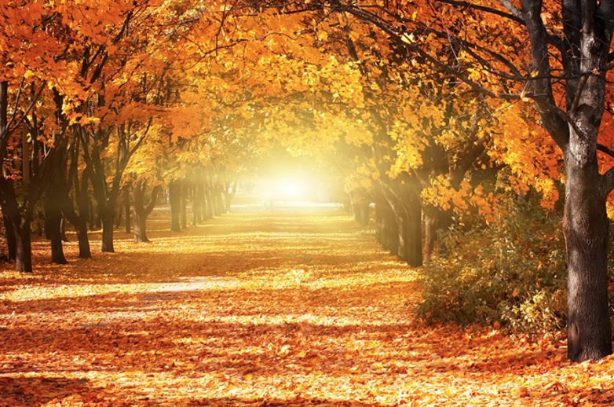
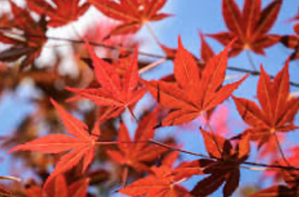
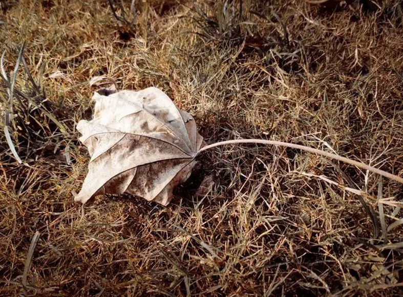

# 红叶——正在消失的风景

Written by **Yilin Li**

首先，让我们先了解一下红叶是如何产生的，和它的作用。在天气逐渐变冷，白昼时间变短，树木停止生长时，叶片下的胡萝卜素显现出来，使叶子变成了红色。它的作用是什么呢？在胡萝卜素显现时，树木会停止产生叶绿素，并且开始吸收原先的叶绿素，为度过冬天产生能量。所以红叶的产生对树木是十分重要的。

但是全球气候变化变化正在影响红叶的产生。首先是秋天的推迟，Chinese e daily的报道中提到“根据气候中心（Climate Central）的数据，自1970年以来，美国各地的秋季气温平均上升了2.7度。一个比平常更热的秋天会导致我们看到树叶变色的时间发生变化。从1970年到2021，罗利的秋季气温较高的天数增加了10天。在北卡西部城市阿什维尔（Asheville），秋天温暖的天数增加了5天。”来自中国天气网的报道显示，“根据气象大数据显示，1981年2020年，北京的秋天来得越来越晚了，上世纪八九十年代，北京的平均入秋时间还在九月上旬，进入本世纪以来，北京入秋的平均日期就推迟到了九月中旬，最晚的甚至拖延到9月下旬。

国家地理在最近的文章中也提到“北美全境枫叶红色出现时间比19世纪前平均推迟了一个多月。比如北京最近的温度在几周内降低了接近十多度，冷暖交替时间变短，即秋天的缩短。 虽然气温不是唯一影响红叶出现的因素，湿度，病菌都对他有所影响，但是种种现象表明，红叶确实正在向北移动，并且出现时间逐渐推迟。  

同时因为气候变化导致的剧烈的气温变化也影响着红叶。。但是根据阿巴拉契亚州立大学的霍华德·纽菲尔德博士的说法，“准时和良好的秋季色彩的最佳条件是9月降温，到10月夜晚凉爽，晴朗，但不寒冷，因为过低的气温会导致树叶过早掉落。”但是现在，在十月中才开始降温，并且降温速度很快，比如北京去年秋天有段时间降低了接近十多度，冷暖交替时间逐渐变短，所以还未等树木适应环境变化，寒冷的天气就到来了，这使树木适应环境的时间大大减少，“很多还未变红的叶片就已经脱落了”国家地理在最近的文章中说到。“这对树木的寿命和健康造成极大的伤害。

“最近对欧洲树木的研究表明，气候变化导致一些树木比过去更早地落叶，这会减少森林系统从大气中吸收碳的数量。”这一全球气候变化导致的树木问题，会对气候又造成一次影响，形成恶性的循环。

因此，我们在此呼吁：

1.	请尽量利用清洁能源减缓气候变化，帮助大自然进行自我修复。
2.	请从生物和环境研究出发，尝试那些可持续发展的技术，帮助树木增强对环境变化的适应能力。