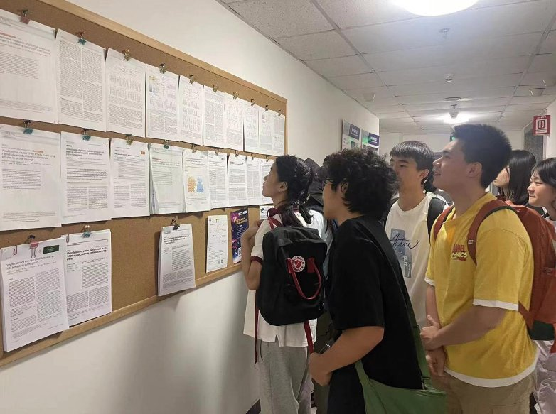
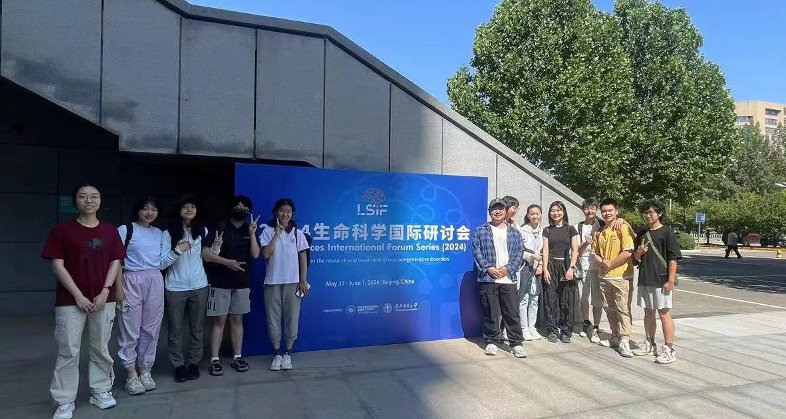

# iGEM Reflections

Written by **Tengyu Zhang**

On November 15, 2023, our iGEM competition team was established. Before I begin my narrative, I would like to introduce the iGEM competition. iGEM, short for the International Genetically Engineered Machine competition, is an annual global event that tests the boundaries of biology, engineering, and computer science. It tasks student teams from around the world with the mission of designing, constructing, and testing biological systems that address pressing global issues. Our school's previous iGEM team won the gold medal, and this time we also hope to strive forward, continue our efforts, and win the gold medal once again.

Briefly introduce our project, we refer to previous researchers' use of FRET technology for comparing ATP levels in the mitochondrial matrix of HeLa cells with those in the cytoplasm and nucleus, and use FRET as the technical basis to improve an efficient ATP detection probe for high-throughput drug screening and fluorescence imaging. We hope that one or more anti-breast cancer drugs can be screened and functionally validated using this probe.

Since the establishment of the team, we have encountered one difficulty after another, many of which I had not anticipated, from how to think about a topic to how to find a laboratory that high school students can use. Some problems have been solved, while others still exist. I feel my responsibility is to coordinate everyone to solve these emerging issues together. Overcoming each difficulty brings me long-lasting happiness. The iGEM competition has taught me many things, not just limited to academics. For those students who want to participate in the iGEM competition, I would like to say that iGEM is not only an academic assessment and training, but it will also bring you comprehensive growth. At the same time, its threshold is very rigorous, but I hope everyone can embrace the mindset of "the more difficult it is, the more we should try." Only by trying and experiencing can we achieve growth.

