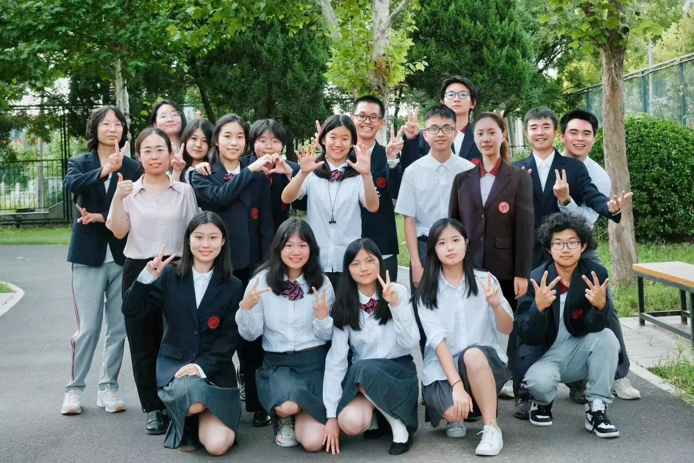
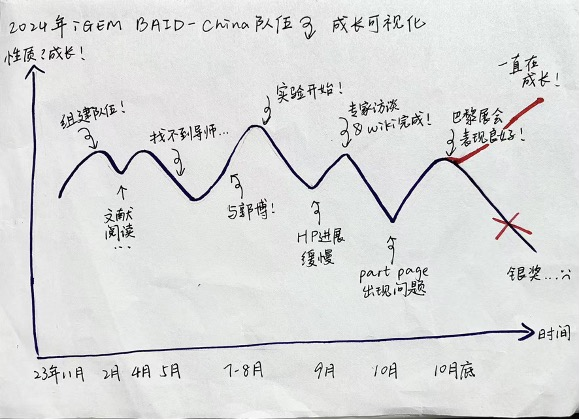
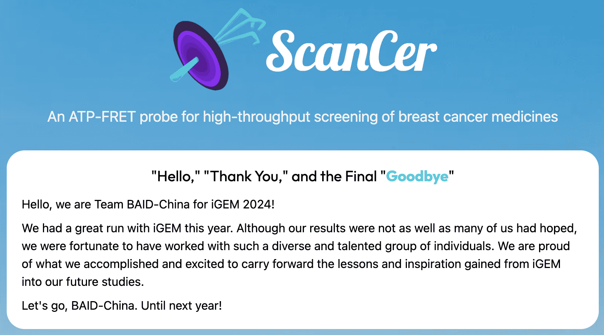

# 2024 iGEM Reflections

## Reflection 1

Written by **Zhongjun Bai**

_作为一个从上高中以来就已经明确大致生物专业方向的我来说，第一次浏览iGEM合成生物学赛事的网页时属实给我不小的震撼。来自世界各地的本科生，研究生，高中生的生物爱好者们齐聚在Jamboree现场，相互交流项目，相互传递经验，从而结交深厚的友谊......, 这些无一不是对一个懵懂的生物爱好者的极大吸引。_  

以下我想以经历和对新一届iGEM队伍的经验方向分部分在我所参与负责的part进行讲述。 
### Wet lab & Jamboree  
生物的学生们一定都无法忘记自己第一次走进专业的生物实验室时的场景吧，我也不例外，不夸张的说，穿上实验服带上手套的时候心中的喜悦无法抑制，并且有一种无与伦比的自豪感，但是真正到了实验环节这种自豪感就会被按在地上反复摩擦，直到自豪变成自卑……当然，熟练实验操作时那种自豪感也会也会重新被拾起，但是就看你有没有足够的实践机会了，毕竟想成为像博士那样的“科研老狗”：可不是几个月的细胞培养和插枪头能达到的。 
**经验教训**
本次比赛关于wet lab上的问题主要就是队伍中**信息差**，实验的机会和时间有限，哪怕所有人都有意愿参与到全过程的实验当中，在这届的情况下看来这确实不太实际。一个是队员的时间不允许，再一个也是最重要的就是实验并不需要七八个人同时工作，学过微观经济的同学应该都知道当生产工具有限的情况下无脑增加劳动力的结果吧.....所以一定要做好实验的人员安排，不要出现很多人集中在实验室的情况，而且要注意一个点，实验参与就好，没必要追求全程的参与，因为即使全程参与，没有足够的理论知识支撑，你对于实验全程的参与就几乎等同于去实验室插了2个月的枪头（仅代表个人观点），如果真的想学到东西，其实还是理论来的快，当然理论和实践的搭配是最好的，但是如果你想在iGEM的wet lab的部分做到这些，除非你有极其充足的时间精力和毅力是不可能完成的，并且哪怕完成，成本会远小于利益。 
所以怎么在iGEM中真正学到刚才所提到的理论知识并且了解自己的项目（不要不信，一定有人在iGEM整个赛程结束之后都不知道自己的队伍做了什么）就涉及到一个非常重要的点，也是最不好实现的，也是我们这次失误的点——补全信息差。 
* 为什么要补全信息差 
这个就与Jamboree现场活动的内容有关（下一年的iGEM High school zone的活动形式可能会有所改革，下面所说的活动内容仅限2024的版本，具体内容查看当年iGEM官网的Jamboree部分）现场最重要的三个环节： 
BOOTH（现场摊位展示，你需要随时熟练的给前来询问的不论是本科生还是研究生还是高中生介绍你们的项目，当然你也可以参观别的学校的booth，了解他们的项目；北大，清华，复旦，同济，McGill，Princeton等高校都会参与）; 
LIVE STAGE TALK（现场的直播舞台展示，主题几乎没有规定，就是随意发挥，并且是否参与都是自定的，最好根据当时wiki以及presentation video的完成程度来决定，因为这两个内容更加重要，如果没有完成没有人会顾及到live stage talk因为它确实不会影响最后金银铜奖的评定，但是报名参与了就一定要提前准备，不然效果会不好，而且如果效果不好就不会有人来听，就是挺尴尬的，live stage talk应该与presentation的单项奖有关，据这届的经验，上台整活的效果应该会不错，当然如果学术能力够强（像第一届的学长学姐一样）直接讲项目也是可以轻松拿best presentation提名的; 
JUDGING SESSION（线上线下加起来一共6个评委，先听你们5分钟的项目简介（当然他们已经**Super细致的！！！**看过了你们的wiki 和presentation video，所以没必要赘述）然后就会进行20分钟不间断的提问）。 
上面所说的三项无一不需要你对项目全面、专业、**正确**以及细致的了解，一切的疏漏都会酿成不可避免的结果，尤其在judging session中他们会在5分钟presentation结束之后20分钟内不间断的进行提问，其中不仅需要所有judging session的队员们都有十足的准备（因为没有人可以避免不会在紧张的时候出现致命的学术错误，所以出现错误的时候其他队员一定要第一时间反应并且更正，不要怕说错了显得不专业，因为学术错误远比不专业的表达对于最后评委给出的评价影响要大）并且要记住judging并不完全是评委对于你们的考验，也是给予你们更正的机会，因为有些问题实际上是对于队伍所提交的wiki以及presentation video中没有提及或者含糊但是很重要的点的确认，如果因为回答问题效率过低导致最后评委这类的问题没有提出来，可能会导致judger的误判或者对项目以及实验的误解，让本身出彩或者操作正确的点成为缺点或者减分项。 
所以我建议的解决方法是让请到的导师或者教授，在开题之后给所有同学们讲述项目的整体框架，并且在随后的每周对应第一周所给出的框架搭配当周的实验结果以及状况细节的为同学们解释实验的相关内容，随后干队的同学再进行干队部分的相应进展的介绍，在介绍完毕后不论是湿队还是干队的同学都要积极的提出改进措施以及建议，最后干队同学进行总结和讨论，最后落实在随后的进展中；**在此基础上总队长，干队队长以及湿队队长要做好老师每周所讲的内容相应的考核以及抽查，这极其重要，**因为这届我们采用的是相对低效并且耗时的线上例会的形式，这种形式完全不能保证同学们参会的效率，包括我在内的大部分同学都会在“与自己无关的内容上”直接挂在会议上干自己的事，但是实际上不论所讲的内容是湿队的实验进展还是干队的成果汇报这都与每个人息息相关，在现场每个人都需要有自己独立介绍整套项目流程的能力，同学们自己也能真正了解到自己为什么在做这个项目，为什么要参加这项比赛，而不是只有“有助于申请”这一个目的；再一个，大部分的例会是队长们自己讲述，这难免会导致内容的准确性以及学术严谨性上没有办法得到保证，因为一定没有人可以保证比导师讲的还详细还准确。

### Team building
这个是决定是否要进行比赛的决定性因素，要更正一个思维，正确的参赛顺序不是思考完时间以及金钱成本合适之后就马上选择加入iGEM队伍然后进行选题之后进行实验，最后得出结果参加Jamboree的。反之，正确的顺序是： 
* a.组织起一群对iGEM感兴趣的生物爱好者讨论总结出1-2个**可靠**新颖并且抓人眼球的主题
* b.到不论是校内还是校外寻找可靠的有责任心的，具有独立制作高效，美观（这项属性次之，因为你也不知道当届的评委到底把什么成为美观，内容还是最重要的）的team wiki团队项目介绍网站，相当于是这个队伍所有信息总结出的字典），以及可以进行生物方面dry lab虚拟筛选等内容的高水平modeling人才；加上可以可以高效并且美观的绘制队伍海报，演示示意图，团队logo，产品logo，presentation ppt等等的美术人才；再加上有强大的汉语以及英语交流表达能力，和高情商的Human practice 人才与不同的专家，教授，学校和企业进行沟通，形成最后的Human practice flow，让整个项目的社会意义足以体现；最后在a条件中的那些生物爱好者们是最必不可缺的一群人
只有满足以上的两项条件之后再去报名参赛组成队伍才是最有效的，才不会在后期项目进展的时候面临瓶颈，导致最后的结果不尽人意。 
**所以在这里我也要呼吁学校要在高一刚开学的时候甚至更早就跟同学们介绍这个项目，让大家有足够的时间了解iGEM，并且给予同学们足够的帮助完成上面所说的两项内容，最终在报名截止之前组成各方面人才充足的不论是iGEM联队还是iGEM校队，并且在每届的赛程结束之后都为随后的队伍总结经验，提出选题上的想法，从而形成闭环，使北中的iGEM成为引以为傲的传统不断的在每一届延续和发展，并且打破机构队对与奖项的垄断，我相信这也是我们这一届的队员以及上一届优秀的学长学姐们共同的愿望。**
最后，我想感谢所有帮助我们完成今年比赛的博士，老师，同学，专家，企业以及一直在我们背后默默推波助澜的家长们，并且祝愿随后每一年的北中iGEM校队取得优异的成绩，希望我们是北中iGEM唯一的遗憾！ 

希望我们的经历能对你们项目的发展有所帮助

People are dying, but we take CARE!

---

## Reflection 2

Written by **Jia Li** 

飞机着陆的那一瞬间她就知道她不可能再回巴黎了。机场落地窗外，夕日欲沉，鼻腔瞬间感受到不适，是机场刺鼻的发动机引擎的烟。雾霾笼罩着整个城市，乌黑蒙蒙似遮天蔽日。那一瞬间，她动摇了不止一次：现在回去还可以吗？ 

取行李。入境。过海关。出去的那一刻，看到家人在栅栏那边等待，不知为何，她骂了一句，此时她再也忍不住，所有的琐事思绪一下子冲垮了堤坝。某名其妙地，眼眶红了，眼角湿了，她心想：明明说好不哭出来的。她怕被人说，于是眼睛直直瞪着前方，努力保持眼睛一动不动，但还是有热热的水珠滑下脸颊，浸湿了口罩。 

她不知道怎么的就似乎顺其自然地坐上了车，斜靠在车窗侧边，眼内还湿湿的，眼角同样挂着水。天更阴沉了，机场高速边的路灯暗黄黄的，在黑沉沉的烟霾中闪烁，跳跃，扩散，扑朔，消散，随泪珠划下。车轮飞速旋转，与地面摩擦着，挤压着路面上的碎石瓦砾。一瞬间，她觉得汽车引擎和车轮摩擦地面的声音似乎离她越来越远，世界好像只把她一个人留在了后方。泪水中，旁边行驶的车辆似乎速度变得越来越快，越来越快…只有她被落在后面，越来越远，越来越远，越来越看不清… 

雾变浓了也可能天暗了，她只觉得前方的路越来越远，越来越模糊。我还在往前走吗？还是我在后退啊？她怀疑着。此时她只是觉得一切都无所谓了：我从一开始就不应该有那个希望，为什么要一开始给我那么大的希望啊，到最后期待多高落差就有多大，其实我从一开始就应该认识到理想是不可能成为现实的。她想：也是啊，从过去到现在一直到未来，我的期待都从来没有也不会再成为现实的。 

一个傍晚，一个回程的路上，一个少女，一个麻木沉沦的心，从此，世界于她而言将不会再拥有色彩。她早已失去了她的心。 

那个夜晚，她拖着麻木的心，平躺在床上，期盼着：要是就这样永远长眠在这里再也不要醒来就好了啊。被子压在身上，把她封印在床上。她觉得有无数双手正把她拽向无底深渊，隐约间，世界好像掐住了她的喉咙，瞬间让她难以呼吸，这是她第一次感受到这种窒息的感觉。啊啊好难受啊啊啊。 

一片死寂。这之后好像过了很久很久，她还是没有睡着。明天还要上学呢，别再任性了，她极力尝试劝自己睡觉。可是，我好不甘心啊，明明可以做的更好的，脑海中的另一个声音呜咽着。这时，她又感受到一滴热热的东西划过侧脸，“嗒…”那是眼泪落到枕头上的声音。一滴、两滴、三滴，他们还在滑落…天花板上，对面住户的灯映射在墙上，窗外依旧是漫无边际的雾，晕染着暗沉的夜和炽黄的路灯。钟表秒针转动的声音好吵好烦啊，她的心烦躁起来。时间于她而言好像完全静止了一样，只有秒针的“咔哒”声默默记录着时间的流逝。 

醒着的时候她骗自己说：睡吧，梦里面什么都可以有，什么都会实现，不用害怕失败和疼痛。这让她又想到她多少个深夜，多少时间和精力都砸在了一个注定会失败的事情上。她想，为了它，我到底放弃了多少东西？以后我还会有尝试的勇气吗？她无声地哭着。 

哭累了，没等眼泪干她就睡着了，这时她已经完全不知道是几点了。 

突然想到自己有什么重要的事情没做，她猛的从睡梦中惊醒，世界静得让她可以清楚地听到自己的心跳。哦，原来已经可以不用早起了啊，她刚意识到。看了眼床边的表，五点半。她重新躺回床上。隐隐约约，她做了一个梦。梦里她像往常一样五点半起床，6点坐上6号线地铁，换乘14号线。地铁上她看看手机，快7点了，人越来越多，地铁越来越挤。呼吸声，铁轨的尖锐声，边上散出的温热的气流，刺鼻的香水味和消毒水味，一切都让她觉得难以呼吸。因为失眠，她每次早上起来心脏都是疼的，心率也是异常的快，纵使在梦里，她也可以感受到隐隐约约的疼痛。她很想从这个梦里醒来，但是这个让她痛苦的梦还在继续。赶着朝阳出发，回到家的时候天已经完全黑了。整整五周。每天累死累活的，她还要挤出时间完成校内作业，除此之外，她什么都没来得及做… 

醒来的时候，她的眼角流着泪，这种情况最近总是发生。她不止一次在梦里和现实中哭喊过：有谁能赔我时间？谁能赔我一颗积极向上充满希望和勇气的心？谁能告诉我我是否还可以对未来抱有期待？谁可以告诉我我可以不用再害怕了？谁可以告诉我再拿时间赌博时不会再输得一无所有？ 

闭上眼，她以为她能够忘记，但留下的眼泪却骗不了自己。她多么希望时光可以倒流，多么希望一切还能挽回，但这些都只是她的一厢情愿罢了。 

---

## Reflection 3: 向上 —— 记2024年iGEM比赛BAID-China队伍

Written by **Yuehan An** 

拖了很久的一篇感想，因为一直没想好怎么写。内容太多故事太多情绪也太多。然后我突然想起小学语文课老师讲的一个分析故事情节的方法，画折线图。比如说如果主人公经历了一次挫折，折线方向就向下；而一次成功则能让折线方向调转向上。一般来说，一个复杂精彩的故事画出来的折线图就像心电图那样起伏不定。决定了，用这个方法来记录。

第一笔我画在了结尾处，毕竟打下这行字的时候距离得知最终成绩是最近的，记忆也最清晰。那天会场里灯光很暗，我们的位置被占了，无奈只能坐席最后部。随着屏幕一页一页切换，期望一次次落空，直到最后一页黑底白字给了所有人当头一棒。身处8200公里外的我们身边甚至连个可以提供安慰的人都没有。消化不了的情绪都被巴黎夜晚的暗色吞噬了，结局已定，至于该怎么接受没人有答案。想到这里我在纸的最右端画了一条向下的线。

顺着这条线往前走，钟表指针一圈一圈拨回一年前的十二月。第一年校队学长学姐的胜利给了我们很大鼓舞，组队的时候苑老师跟我说队伍里还需要一个既对生物感兴趣，也比较擅长人文社科方面任务的人。我当时觉得这位置简直太适合我，甚至没考虑自己只有生物必修一的知识储备，甚至没考虑这一年可能要付出的时间精力，回忆起来好像什么也没考虑。纯粹的激情凑齐了十五个人，说实话除了激情也没别的了，所有人都是第一次。好在iGEM这个比赛所需要的所有领域，从生物实验到数学建模到社会实践我们都找到了合适的人选，在一切的最开始也就是白纸的最左段，我想我们可以得到一个向上的线。随后比赛的推进就停滞了很长一段时间，由于经验不足，所有人都必须从AP生物开始补起。基础知识、文献阅读，太多太多的漏洞。折线向上又向下摆动，突破一个瓶颈后刚有起色就很快被另一个障碍压下去。到次年三月，眼前最重要的事情便是选题和选导师。选题的过程所有人就像无头苍蝇一样乱撞，每个人读的文献、关注的方向大相径庭，谁也拿不出一个准话。选导师同样困难，劳烦家长们联系的各种机构质量良莠不齐且价格高昂。直线下落再下落，知道四月底才迎来了最重要的一次转机。

和郭博的第一次沟通之前我们也和其他机构老师有过交流，他们态度大多生硬，只有郭博对我们就像一群好朋友一样友善。郭博不光带来了选题的大方向，并且提供给我们进入首都医科大学的实验室的机会，以方便进行后面的湿队任务。一下解决了两个大问题，项目总算可以往前推进了。定下导师后就到了AP考试期间，我记得有一次，好像是微观经济和seminar刚考完的那个晚上我们还在开会讨论。我下午有考试所以没来得及回家，就干脆在车上准备汇报的内容。那是我大概第一次仔细通读完官网上对HP的所有要求，每一条每一项。

Human Practices也就是人类实践，是队伍将自己湿队实验部分的成果推广到社会上的重要一环。通过问卷调查、专家访谈以及项目可视化等途径，HP部分需要不断采纳社会专家建议、修改完善湿队实验，辅助项目推广，将工程周期完整化。大部分队伍在integrated human Practice的基础上还会做教育或商业相关的行动，例如讲座、科普活动、商品上市等等。在这些方面突出的队伍会选择申请iGEM比赛除金银铜奖以外的special prize,比如best entrepreneurship或者best education。获得这些prizes一般要比只拿金银铜要难得多。我对HP的另一个理解就是讲故事：你该如何跟一个完全不了解合成生物学的人，有逻辑地、简要精炼地介绍你们的项目？答案就是一个故事线。

上一届学姐优秀的HP给了很大启发，也是今年CARE model的主要灵感来源。我在一开始便把我们整个iGEM队伍的工作分为了四大部分：从一开始发现问题和顾虑concerns，到决定解决问题采取行动actions，再到不断完善对实验进行修改revision，最后通过教育education或商业entrepreneurship等方式将项目推广。提取每一部分的首字母，拼拼凑凑出一个CARE词。这也是我们想向组委会展示的我们最特别的品质--对于社会的关怀。除此之外，iGEM还十分看重的一点便是工程周期。队伍需要展示出自己的周期是完整的、有逻辑的。于是将以上四个部分串联起来，形成了一个流动闭环的圆，这就是我们的CARE model，我们的故事线。

有了框架，剩下的就是用各种实际行动往里面填内容。干队进行的同时，我们也迎来了进入实验室的机会。第一次进实验室参观是大家一起：第一次穿上实验服，第一次接触各种仪器，第一次听到冰箱响起心脏跳动般规律的滴滴声，第一次闻到空气里特殊的各种气味...哪怕已经过去这么久，当初那一份陌生又新奇的心情依旧强烈。走进实验室我们才算真正走进了项目的中心，从这里开始，最初的那一条折线才开始缓慢地向上爬。整一个暑假我们排满了班，基本上队内每一位同学都会负责一整周的实验。起初我本以为自己作为干队的一员，对于实验部分可以少参与那么一些。然而，比赛里每一个部分都是环环相扣的：没有对湿队实验的了解，HP部分就无法通过寻找专家等方式对于实验进行修改完善。于是从七月底八月初自己个人事情稍微少些以后，我就开始和大家一起参与进湿队实验。西铁营站很远，一般要倒两趟地铁。八月的每个清晨，赶着早高峰来到城市另一端，早上九点准时迈进首医的大门。每天下午出来后我都喜欢拍一张那个门口的天空：有时候是万里无云，也有时候是大雨天，阴晴不定的天气里不变的是每天坚持去实验室的人。一开始的任务以了解实验室器材、进行基本操作为主。直到我去的那一周开始才开始正式进行项目相关的实验。由于都是第一次，我们在过程中出现了很多问题，比如说巨大的信息差和实验日志记录的不完整导致后面去实验室的同学完全不知道前面同学做了什么，操作的失误，诸如此类很多。一个多月时间折线上下起伏不定，有一次我们找不到合适的排枪，16板药物稀释只能一个一个加药；有一次下午四点多刚做完PCR回家第二天一早就听说昨天的失败了；有一次那一周人手不够，我临时去顶位置，两个人做药筛做到周六。这还只是我参与部分的记忆。对于那些暑假一共才六周跑了五周实验室、全程参与没有一天休息的同学来说，遇到的困难和挑战简直多得多。直到暑假末尾，军训前的一周我们终于才把数据弄出来。这里真的再次感谢郭博全程陪伴指导。尽管实验结果可能有些不尽人意，但这已经是当时的我们能做到的最好了。

暑假期间随着重心转移到湿队实验，HP部分进展慢了下来。六月左右我们发放了第一份问卷，作为背景调查的一部分，也是我们第一次将自己的项目推向社会。由于iGEM历年参赛的中国队伍很多，国内也成立了许多iGEM社群。我们有幸联系到了东北几所高校的iGEM大学生队伍并与他们进行了几次沟通。他们不光向我们介绍了自己的项目，也给我们提出了许多宝贵的建议。正是这样队伍间的互帮互助让我感受到，iGEM不仅仅是一个比赛，而是一个连接了全国乃至全球各地合成生物学爱好者的纽带。后来我们也协助他们完成了一次面向东北高中生的科普讲座，分享我们作为高中生队伍都干了哪些事情。出人意料的是那些高中生中可能有国内生物竞赛的选手，提出了许多刁钻的问题。这也让我们意识到扎实的理论背景知识是与实验实践同样重要的。而与专家访谈的推进停滞不前。像去年学姐一样我们也发出了很多封邮件，回复的寥寥无几。有一个乳腺癌志愿组织让我印象深刻，我们当时请求能否让我们以志愿者的身份参与他们的活动，顺带推广我们的项目。他们的回复是作为志愿者需要投入非常多的时间，而我们当时确实没有时间了，只得遗憾放弃这个方案。暑假底，距离提交所有内容还有一个月，我们还有许多只有开学才能进行的教育活动没有做。这也是我们今年做的不完善的一个主要原因：对于时间的规划太不充分，许多任务开展的时候剩余的时间已经不多了。若是再提早一两个月开始联络，结果确实可能大不同。

九月简直太疯狂。日子一天天倒数，再迟钝拖延的人也该意识到时间所剩无几了。实验室收尾，于此同时wiki也就是我们的项目网站内容编写开始。九月初一天我坐下来复盘截止那日我们HP部分所做的所有任务，才发现完全撑不起来故事线。各种着急，在那一周紧急调动了周围所有的人脉，才得到了和几位专家沟通的机会。有一周的每一天晚上我们基本都跑在各个医院、研究所之间。抓紧整理好所有的内容后就是一个字，写。庆幸故事线是早在5月左右就定下了，思路整理起来还算清晰。为了突出HP部分对于湿队实验的辅助，我搜集了实验部分遇到的挫折和失误，着重体现了在实验设计和完善的每一步里HP的重要性。最后一周全队的人在不同的部分一起冲刺，几个人熬到一两点。虽然熬夜可能也是实力不足的体现吧，但当时实在是没办法了：白天要上学，自习课很少，同时还有队友不在国内。截止日期是国庆节假的第二天，我记得自己在30号交完了HP的wiki文案和所有的图片，刚感叹奔向假期结果那天晚上突闻噩耗：原定申请的三个special prize的其中之一因为实验问题没法用了。解决办法只有两个，一个是抓紧再找一个prize申请，另一个是把HP部分劈成两半，分别申请best education和best integrated human practices。后面两个部分都是我负责的，因此我深知我们在education上下的功夫是远远达不到获奖标准的。国庆第一天早上我还是把分开的文案交给了负责wiki的同学，结果下午一个语音通话打过来education惨遭驳回--做的真的很不完善。只能是编写新的部分。10月2日我在前往外地的火车上改完了最后的HP逻辑线，而理论组的同学一直奋斗到晚上十点wiki截止前。当晚群内的语音通话氛围究极紧张，直到freeze前的几分钟都在做修改，最后一分钟，所有人屏息凝神，才把wiki和part page交了上去。

交完并不意味着结束，没有人敢长舒一口气觉得告一段落，也没有人有底气说我们目前为止做得天衣无缝。Wiki freeze第二天早上我们才发现part page里出现了重大纰漏，几位负责的同学都情绪激动，但也无力回天。收到官方回信无法再提交修改以后，我们只得在后面截止的presentation video和最终的巴黎答辩里做纠正。回顾整一年其实我们出现矛盾的次数并不多，可能那是唯一一次。我倒是觉得争吵不一定就是坏事，如果吸取双方的建议后能帮助我们及时确定后面行动的方向，那也算没白吵。需要避免的是毫无营养的对骂--人身攻击、能力攻击是万万不可有的。至此，折线再次起伏，好在最后化险为夷，我们也明确了在巴黎之前应该做好的工作。国庆假期回来的那天我们完成了presentation video的录制，尽管多次笑场，最终整体的效果还是蛮不错的。在此衷心感谢Lin全程的协助。这也是巴黎之前最后一个ddl，提交完之后我们正式的进入了最终答辩的准备阶段。

距离答辩不到一周，学校安排了很多次的模拟答辩，我们私下也串过很多回。每一次不管是和老师还是校外专家的沟通里我们都能发现很多问题，对于很多部分的理解都是模糊的。就这样一次又一次不断完善理解，尽量把准备工作做全。距离出发的日子越来越近，来自各方的压力也越来越多，可能说到底最多的还是我们自己给自己的压力。巴黎展会的4天是一年成果兑现的四天，所有工作都要在那四天里得到一个结果。直到坐上飞机抵达巴黎迈入会场的那一刻前，我们对于最终的结果都没底。付出的时间精力财力是确确实实摆在那里的，完全不可能做到放松和不带任何预期。

这种心态在迈入会场后悄悄发生了变化。进入jamboree的那一刻我才意识到其实这一年压根不全是为了最后的金银铜奖而努力的。除了130支高中队伍外，更多的是来自全球各地各高校的大学和研究生队伍。很多看似很遥远的学校，Stanford，Cornell，去年的大学生组冠军Mcgill，他们的展台就设在那儿，欢迎所有人去参观交流。我突然想起之前在网上看到一些“专家”对iGEM的评价是：学术性未满，商业性未遂。的确，如果只把iGEM当做一个比赛看待，如今金奖率逼近50%，获奖完全不是什么值得稀奇的事情，确实可以评论一句“水赛”。但它真正的意义是在于提供一个给所有爱好合成生物学，致力于用科技造福人类社会的人的平台。所以其实我们一年来的努力并不是为了争一个人人都能得的奖，而是获得一张进入这个平台的入场券。如果不参加比赛，如果不进行我们的项目，也许对于生物学的热爱只能悄悄地在心底生根；而经过这一年的种种，我们才得以获得入场券，得以来到这里与全世界的顶尖人才相聚，得以使热爱真正的发芽。几天时间里我们逛了几乎所有叫得上名叫不上名的学校的展位，他们不会因为我们是高中生而区别对待，而是耐心的讲解所有我们没学过的专业术语和技术，Stanford的两位同学甚至给我们展示了他们的申请文书。同样的，我们的展位也迎来了数不胜数的观众。有中国的有外国的，从高中生到大学生到评委，各方各界都给出了宝贵的建议，我们也得到了很多支持和鼓励。也许永远不会忘英国队伍的两位队员在看到我们的标识后激动地说特别喜欢我们的wiki的场景，不会忘泰国队教我们用泰语说“生物”这个词时她们的笑容，不会忘许多之前合作过的国内大学队伍认出我们之后说“你们是北京中学呀！”给我们的温暖，也不会忘有一个印度评委在听完我们的HP后说的那句I love it。也许有很多客套话，但那些话是独自身处异国他乡的我们能获得的最大力量来源。其他参赛队伍来巴黎参展的人大多都有十余个，他们的公共演讲观众席常是人满为患，和只有五个人且没有导师陪伴的我们形成了鲜明对比。但只要有一个人坐在台下听我们讲，只要我们讲完以后有一两个鼓掌声响起，就能给我们带来许多力量。那几天收获的一切是无法估量的，比起奖项，所有友谊、知识、视野才是真正能伴我们永久的东西。因此，不管结果如何，我敢说没有一个人后悔走上这么一趟。

后来的事大家也都知道了。答辩的前一天晚上没怎么睡好一直在准备，第二天judging room里那半个小时属于我们的时间从presentation到答辩也都尽力去做了。可能有些部分回答的不甚完美，在等到官方的feedback前我们都还没有办法去做一个全面的复盘，于是目前为止能回想起的所有经历、感受、成长都写在前面了。回到最开头，也就是闭幕式那天。尽管经过jamboree的四天自己的心态已经产生了很多变化，但说完全不功利，完全不在乎结果是不可能的。奖项是从special prize开始公布，一些奖我们也不报什么期望，但前几天收到赞扬比较多的HP部分和wiki宣布没有我们之后，所有人都隐隐意识到了结果不会太好。从铜奖开始宣布，一页一页滑动地很快，尽管拼命祈祷前面不要出现名字却还是在silver那一栏里看到了我们。当时是国内的凌晨一两点，有同学熬夜在等我们的结果，也有同学早早睡了期待第二天早上能看到好消息，最后却是什么都没有。那种跌入谷底的冰冷是我这辈子都不想再体验第二回的，是付出了一切却没有一个好结果，是苦尽甘也不来。当时眼泪确实绷不住了。

坐在北京写到这里又回想起了场馆的黑。没什么灯光的后半部分坐席，结束后震耳欲聋的派对音乐，或交错着的喜或悲的人群。走出场馆，眼睛被外面的刺眼的霓虹灯照的生疼。我看向了那条标记着我们这一年的折线，从白纸的最左段慢慢爬到了最右端，那里赫然画着我最开始画下的，那条向下的线。刺眼，像那晚城市的霓虹灯和挂在脖子上的银牌。

本该到这里就结束的，但我怎么想也不对劲。如果说这个折线图的横坐标是时间，纵坐标是某个事件的性质（失败或成功）的话，那么最后画上一笔向下的线确实是没问题的。毕竟最后我们也是确确实实经历了一次刻骨铭心的挫折。

可如果纵坐标代表的是某个事件所带来的成长呢？

转机便从这里开始。

意识到一件事情的性质再简单不过了。无非那两种，要么赢要么输呗。所以那一套分析记录故事情节的方法最适用于小学生。而作为高中生，在这个即将独立迈向社会的年龄，我们难道还要用最浅显的两种分类来记录吗？在认清一件事带给我们的最终结果以外，更重要的是意识到自己在其中所收获的经验与成长。我总抱怨自己一年来一直在走下坡路，好像什么事都没得到一个好的结果。若是从性质角度分析那可能确实，但从另一个角度来看则恰恰相反。那条以成长为纵坐标的折线，不管是标记着iGEM这一年的，还是标记着我的九年级的，实际上一直悄悄地往上爬，默默地记录着积累着每一次失利得到的成长。不光适用于我自己，更适用于所有因为这次比赛结果而难过的同学们。回头看时，请不要愤怒，不要后悔，不要抱怨，不要看结果的性质，要看过程的成长。要看我们从一群什么也不懂的新生，到逐渐组建起十多人的队伍；要看一开始为实验室和导师各种发愁，到用一整个暑假了解实验操作流程，得到了人生第一个实验成果；要看从反复发邮件无人回复，到抓住每一次机会完成的专家访谈；要看wiki从一开始的空白到填满了成果；要看从刚站在巴黎展台前的怯懦到答辩演讲的自如；要看身边的朋友，家人和老师的支持；要看自己走过的路。

说了这么多再低头看，我给最后一段折线拐了大大的一个弯。

向上，向上。

---

## Reflection 4

Written by **Han Gao**

各位好，最近正值申请季的间隙，在UC系统的ddl袭来之前我也算有时间来写写已经过去一年的赛后reflection。

第一年的时候我属于是实验、HP、官方流程等n手抓，wiki上的project description和engineering success还有大部分sub-page都是我手搓的，还有presentation的大纲逻辑和实验部分。iGEM那个巨大的官网和评奖系统我从赛季12月就开始扣、看往年cases，印象太深刻以至于发现第二届在提交东西的时候居然还没我熟悉。。。

第二年的资源比我们那时候好多了，有大学平台的实验室，我和去年的LH又当一年Advisor，去年很多踩的坑都能避免，可惜成果不尽如人意，也算校队常态了。

好消息是即使去年获得了相比之下几乎是“凯旋”的开门红成绩， iGEM对我也算不上一个特别积极的经历，一些人的评价、含金量越来越水以至于我需要在申请中弱化这个曾经投入很多精力的东西。今年遗憾的金牌、遗憾的所谓“校方”认可，去年获得了，然而并没有太大的用途。校队打iGEM是历练人，只是多少有点付出与投入不成正比，毕竟大机构随随便便就能包揽大奖项，超过50%的金奖率，这比赛打起来也没什么意思了。

大学申请的趋势变得太快，三年前我给自己做升学规划，那时候iGEM还是个很有含金量的大比赛，大家都愿意把它写到活动列表第一位，招生官看到点头微笑；等到去年，120个高中队里80个中国的队伍，60个机构，iGEM在community小文书里被写烂了；现在我申请季，招生官们已经审美疲劳了。

趋势变到现在，感觉是功利主义下台、更偏好真诚的人了。即使它有些上不得台面，我在过程中建立革命友谊的队友们（我们“顶梁柱”6人小群）、学习的跟社会各方人士扯皮经验、在Jamboree听的冠军presentation、甚至是项目conceptualization时曾经放弃的研究思路都成了小文书素材的知识积累。

iGEM毕竟是个国际化的大平台，它带来的更多是眼界的开阔，让我多少也感觉值了。高中只有一次，总不能全是功利地干活吧？合成生物学社群的热情、在巴黎现场的专业学术展会、曾经也觉得没什么用，最终还是在奇怪的地方派上了用场。

相信一切都是最好的安排吧，虽然这个title不再辉煌依旧，但是真诚的付出永远会在Common App上闪耀啊！

p.s. 在这里讲着大道理，我的申请结果也是未知数，那种东西已经不在乎辣（惨淡笑。。。看到下一届貌似真的形成了社群还真是无心插柳柳成荫，祝越来越好 :)

---

## 老师想说的话：

孩子们，首先我想对你们在iGEM比赛中所付出的努力表示最深的敬意，比赛的结果并不是衡量你们价值的唯一标准。你们在实验室里的辛勤工作、在Jamboree现场的精彩展示，以及面对挑战时的坚韧不拔，都是你们成长和进步的证明。每一次的尝试和努力都是成功的积累，即使它没有立即转化为预期的结果。 
你们所总结的经验和教训将成为未来道路上宝贵的财富。信息差的补全、团队协作的优化，这些都是你们在这次比赛中获得的宝贵经验。相信在未来的学习和工作中，这些经验将帮助你们更加出色地完成任务。失败和挫折是人生的一部分，它们让我们更加深刻地认识自己，也让我们更加珍惜成功的时刻。泪水不代表脆弱，而是勇敢面对挑战后的释放。你们已经做得很好了，现在，是时候抬起头，擦干眼泪，继续前进。 
这次的银奖只是起点，不是终点。你们还有很长的路要走，还有很多梦想等着去实现。不要因为一次比赛的得失而怀疑自己的能力和价值。你们每一个人都是独一无二的，都有能力创造属于自己的辉煌。 
最后，感谢BZJ、LJ、AYH和GH四位同学分享这段宝贵的经历，你们的感悟和成长将激励着未来的队员们。愿你们继续保持对生物学的热爱，对科学的探索，对梦想的追求，勇敢地迈出每一步，不断超越自我，成就更加辉煌的明天。

---

- [iGEM wiki of BAID](https://2024.igem.wiki/baid-china/) 

