# 2025 iGEM Team in BAID

iGEM国际基因工程机器大赛（International Genetically Engineered Machine）是合成生物学领域的国际顶级科技赛事，也是涉及多学科交叉合作的跨学科竞赛。该比赛要求学生自主选题，并运用合成生物学等知识解决当地的问题（local problem）。iGEM赛况和研究成果一直受到《Science》《Nature》《Economists》等顶级学术杂志的关注，通过iGEM参赛并获奖的学生更容易受到世界各大名校的青睐，具有广泛的国际影响力与含金量。北京中学国际部在2025届iGEM国际基因工程机器大赛的140余支高中生队伍中脱颖而出，荣获金奖。

---

## 项目介绍：Pestacheck

Pesticide residues on food pose serious health risks to the whole world, yet current detection methods remain inefficient and unstable. Recognizing this issue, we developed Pestacheck, a rapid, low-cost pesticide residue detection test strip based on the enzyme-inhibition principle of acetylcholinesterase (AChE). Through Alanine-scanning mutagenesis, we engineered AChE mutants via Cell-Free expression system. The optimized enzyme was immobilized with Gold Nanoparticles (AuNP) to improve sensitivity and integrated into a colloidal gold-based test strip for visible colorimetric detection. Together, Pestacheck provides a user-friendly synthetic biology solution for on-site pesticide residue detection.

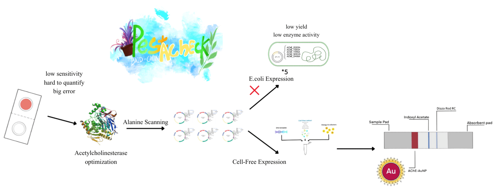

---

2025年是北京中学国际部第三次以校队BAID-China的形式参与iGEM比赛，再一次荣获金奖。从组建队伍到选题头脑风暴，从实验室内的探索到社会层面的推广，每一步都由同学们自主完成。团队的18位队员明确分工，团结协作，才在整整一年的比赛周期里用坚持和汗水取得了如此来之不易的成绩。 

iGEM比赛不同于任何其它的生物竞赛。作为一个项目式评选的国际赛事，它不仅需要队伍在合成生物学领域有所贡献，也需要队伍体现项目的社会价值。同时，由于其独特的评奖评分规则，队伍需要额外完成三个特殊领域（包括建模、商业、教育、硬软件开发等等）的工作并体现卓越，才有资格参与金奖的评选。今年的BAID-China队伍就包含了想要未来在各个不同领域中深入的同学，各取所长。

## 一、耕耘与准备

早在24年年底刚刚建队后，同学们便开始了选题的相关工作。寻找合适的导师、选择优势的比赛village（赛道）是那段时间最主要的任务。

在选题头脑风暴的过程中，同学们的意见有所分歧。为了尊重每一个想法，队伍首先分成了两赛道进行探索：治疗（Therapeutics）和农业（Agriculture）。整个寒假，两组的同学分别就自己的赛道提出了可能的项目雏形，广泛阅读文献并分析以往这些赛道中成绩卓越的队伍案例。

**安悦涵**：“项目式比赛最好的一点就是队伍有着足够多的自主发挥空间，任何天马行空的想法都有可能实现。因此我们不否认任何一个想法，只是择优选择。可能未来某天在巴黎的展会上就能看到类似自己想法的项目落地。”

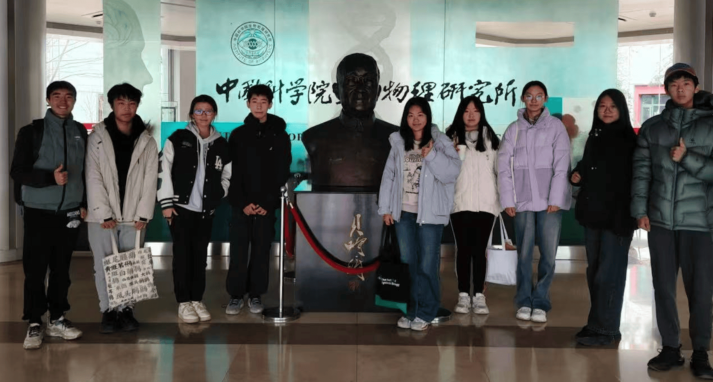

## 二、探索与挑战

经过层层考虑，队伍最终选择了农业方面，并聚焦到了一直广受争议的农药残留问题上。为了保证食品安全，农产品常需要抽样送往专门的公司进行农药残留量检测，这对于个体农户来说是一笔不小的经济和时间成本。同时在家中，对健康生活有追求的人们往往也想要自行再次检查果蔬上是否无或者仅有低浓度的农药残留，以保障家庭食物安全。这些需求使得一个便宜高效的快检方案迫在眉睫。通过调研，队伍发现市面上已经有类似的产品产生，但它们往往存在着许多问题。通过预实验测试了解到产品痛点后才得以定向突破。

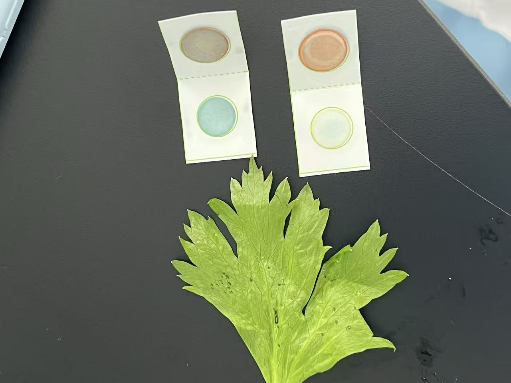
（测试已有产品图）

6到8月，队内十余名队员多次奔波于学校和实验室，满员的实验排表和坚持记录的实验日志见证着同学们的努力。

**周悦伦**：2025年的暑假是我最难忘的，也是飞速成长的两个月。漫长的实验过程真的非常困难，失败总是说来就来。用原核表达出现包涵体，尝试了不同方法仍无法解决；点突变PCR的5个突变体总是有一两个不成功；第一次做无细胞表达的时候，阳性对照就是不表达.........每天的实验日志记录着我们无数次的探索与反思，每一次的尝试都是经验的积累。那两个月，我用公交车上的时间一点一点学习着那些我从未接触过的实验操作与原理，在一次又一次的失败中不断收获。如今再次回想起那段忙碌的时光，依旧感慨那日复一日的努力与坚持。

**管一楠**：记得实验初期，实验室小白的我做完质粒的酶切后拿去跑胶没有加对照组。拿到结果后发现不对需要去调整。我一开始没听懂问题所在，又不好意思再追问，于是错误的把对照组又单独跑了一遍。面对着两个无用的凝胶结果和被耽搁的实验进度，尽管指导老师哭笑不得，却只是跟我说今后一定切勿不懂装懂，有问题的不要顾虑什么直接问就好了。渐渐的，我熟悉了各种设备的用法，还有一些既定的实验流程，对合成生物学的实验思路有了更深入的了解。

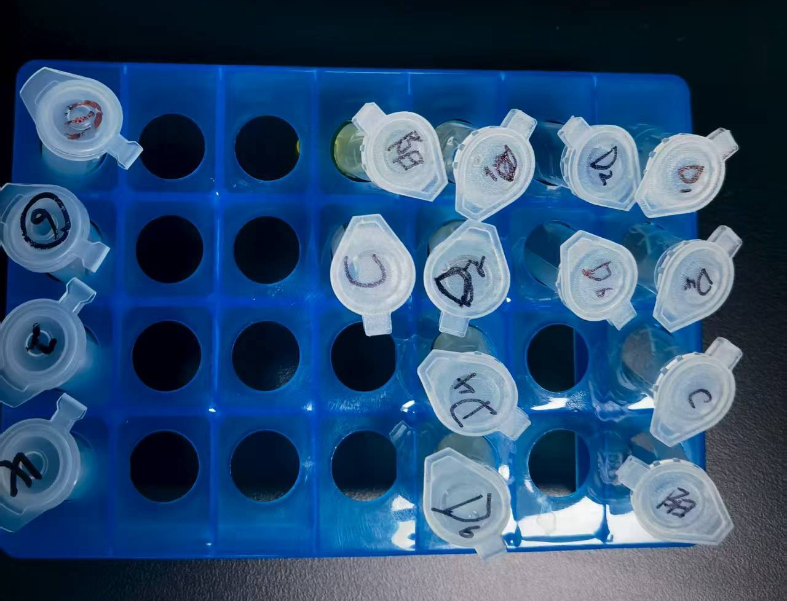

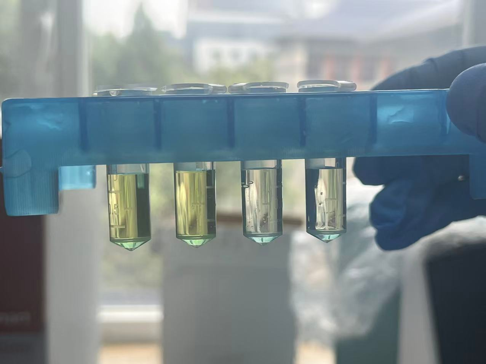

除了实验，iGEM还非常看重项目的社会实践部分。HP（human practices）是队伍将自己湿队实验部分的成果推广到社会上的重要一环。通过问卷调查、专家访谈以及项目可视化等途径，HP部分需要不断采纳社会专家建议、修改完善湿队实验，辅助项目推广，将工程周期完整化。

今年，实践组的同学将工作分为四个部分：发现、定义、发展和推广。在此基础上，同学们在四五个月的时间内一共进行了13次相关活动，包括问卷、专家访谈、队伍交流等等。

**杨芮溪**：HP不仅是宣传和推广我们的项目，更是要在项目初期设计调查问卷，总结结果，做专家访谈等等人文方面的工作。通过对相关领域专家的采访，我们可以更好地发现产品的问题，也可以为湿队的实验提供材料和背景。iGEM的多元化是我对这个比赛最大的感受，同时我也从其中学到了很多：如何设计一个调查问卷使其更有真实性？如何让访谈的结果和项目的初衷通过一纸文字传达给评委？从第一次接触到这个比赛时研究历届金奖队伍HP部分，到最后总结每位专家访谈的记录写成wiki上的HP全过程记录，无论是对课题的了解的深入还是沟通表达能力的提升，都是这个比赛带给我的最好的回馈。

**安悦涵**：在去年年底浏览官网时，我发现iGEM对于出色的HP有三个要求：Reflective（反思性），Responsible（负责性），Responsive（回应性）。对应这三个标准，我们对每一次的HP活动进行了回顾，并形成了我们自己的反思模型。在这个模型的帮助下我们才得以真正做到“integrated（整合）”，真正意义上把项目推广到社会中去。

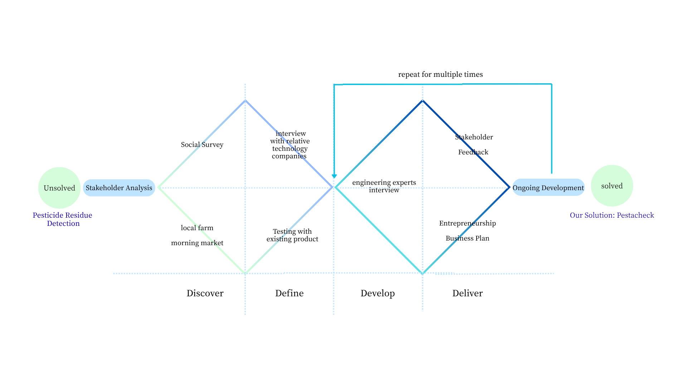

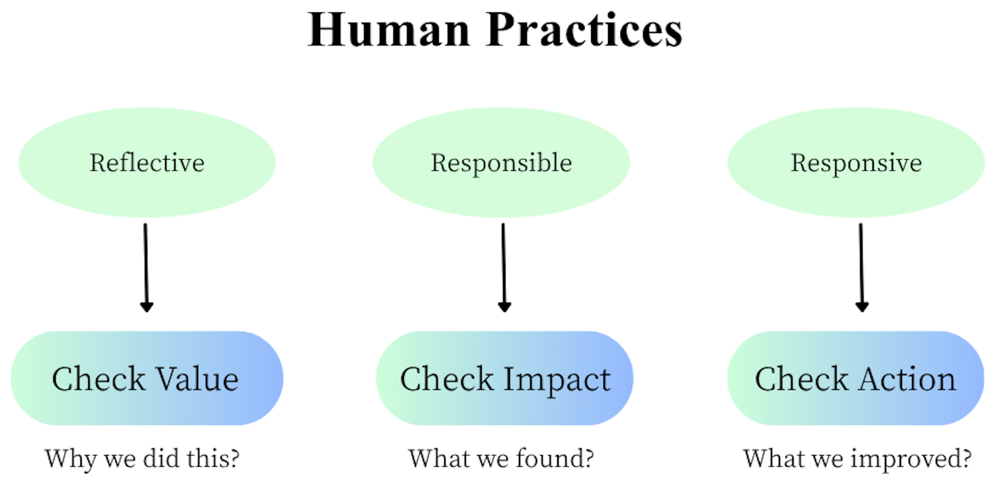

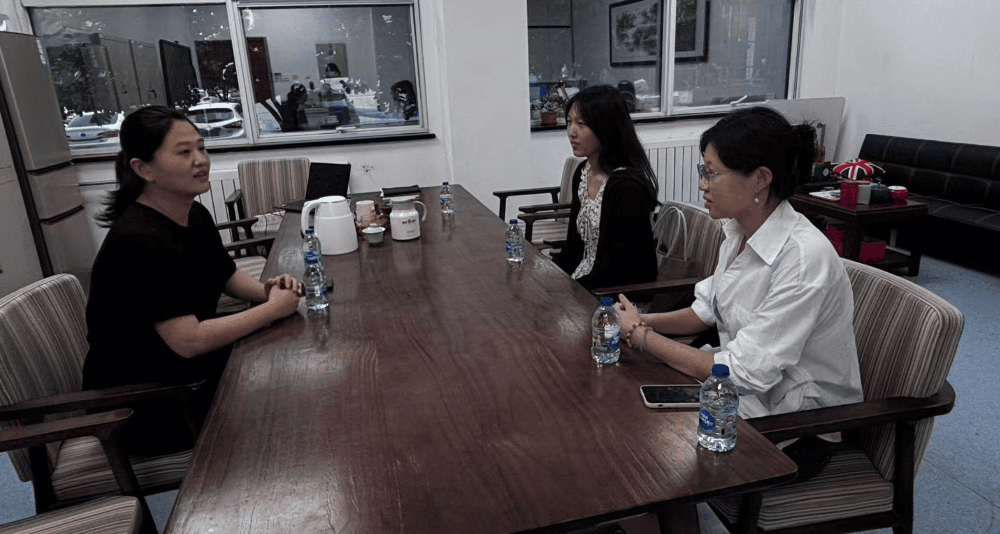

iGEM与其他竞赛不同的一点在于它独特的跨学科性。除了最核心的生物实验，人文方面的社会实践，还鼓励队伍在其它学科分支上进行探索。今年，队伍吸纳了更多未来旨在经济、计算机等学科内探索的同学，因此在项目内选择了商业和软件这两个方向进行深入研究。

**李家瑞**：商业部分其实就是把一个还没长开的小想法，一点点揉顺、捋清楚，好让别人听得懂，也愿意相信它不是空想。对我来说，这一切特别像在解一个乱成一团的结。你先得找到能拽的那根线，哪怕很细，然后顺着往下走，同时不停判断这个方向能不能走得通。

过程中来来回回是常态。很多时候你以为某个规划挺稳的，结果做到一半突然觉得不对劲，只能把之前那套暂时丢开，再从头把逻辑搭回去。对我来说，最难的其实一直都不是写下来，而是把脑子里那些乱七八糟的碎块拼成一个能讲得通的整体。方向一旦想清楚了，文字反而是顺手的事。

等到最后，我把所有支线都整理到一张表里，能一眼看到它们怎么互相卡住、互相支撑，那种总算理顺了的松口气，是整个过程中最有成就感的瞬间。

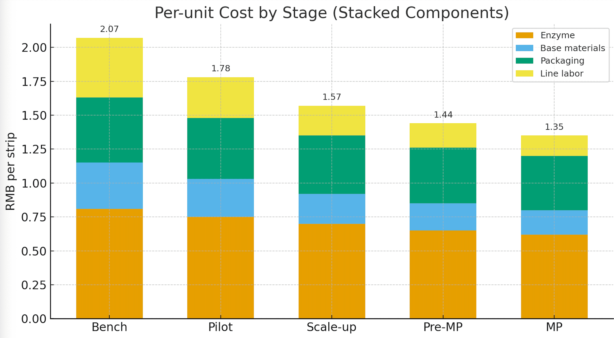

**马睿皓**：本次软件的任务较为困难，接触到CV领域在目前仍然在研究的一个话题——颜色校正和归一化以进行不同光照强度、不同设备色温和白平衡等严峻条件下的识别。由于时间紧迫我便优先用Dart编写了图形化界面。未来我也将在SVM的基础上尝试继续实现整个的检测过程，使整个项目更加完善。此外我也负责了项目宣传视频的剪辑。这个需要基于大家的成果进行严谨且完善的整合。我观察了很多团队几年来公开的视频，从中也学到了很多剪辑方法，遂自学AE和PR来解决这种问题。较为困难的其实就是如何在“做”的基础上“做好”，做出亮点、要给人一种特别吸引他们的感觉。最终我还参与了项目试纸硬件模型的制作，最终带去了展会进行展示。

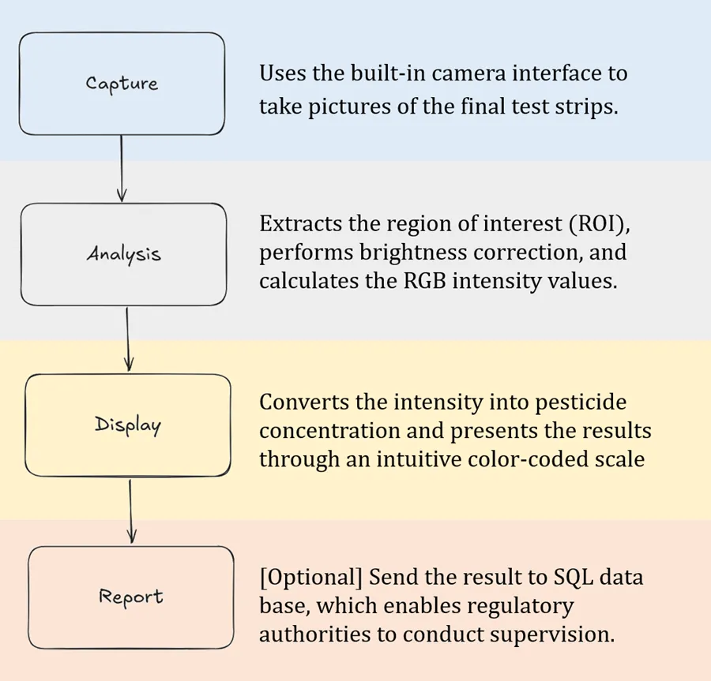

## 三、展示与收获

从24年底到25年秋季学期开学，队伍的各个分队已经完成了数不清的任务。这时就需要用一个媒介来向评委及大众展示我们所做的一切。这就是iGEM要求的提交项目之一——wiki（网站）。

**孙喻琨**：在为我们 iGEM 团队制作 wiki 的过程中，我深刻体会到这不仅是一个简单的内容呈现平台，更是艺术表达、创造力的具象化。从最初搭建整体网站架构，到一点一点把队友们撰写的实验内容、图表、故事放入对应的版块，这个 wiki 承载的已不只是信息与文字，而是我们整个团队的努力、韧性与创造力。尤其在wiki freeze的前几天我们的队长安悦涵、队员李家瑞等等同学不断针对文字细节进行无微不至的修改，让我深刻的体会到了大家在这件事上的共同付出。我也常常熬到很晚反复调试代码、改配色、加交互效果、调间距，利用大量课余时间完善美观程度、在同学的见证下画了20多个水果，为了让团队的成果更被更好的呈现。wiki 的完成，是我个人不断突破设计与技术瓶颈，也是我们所有成员共同克服疲惫、互相扶持、在最后期限前咬牙坚持的成果。

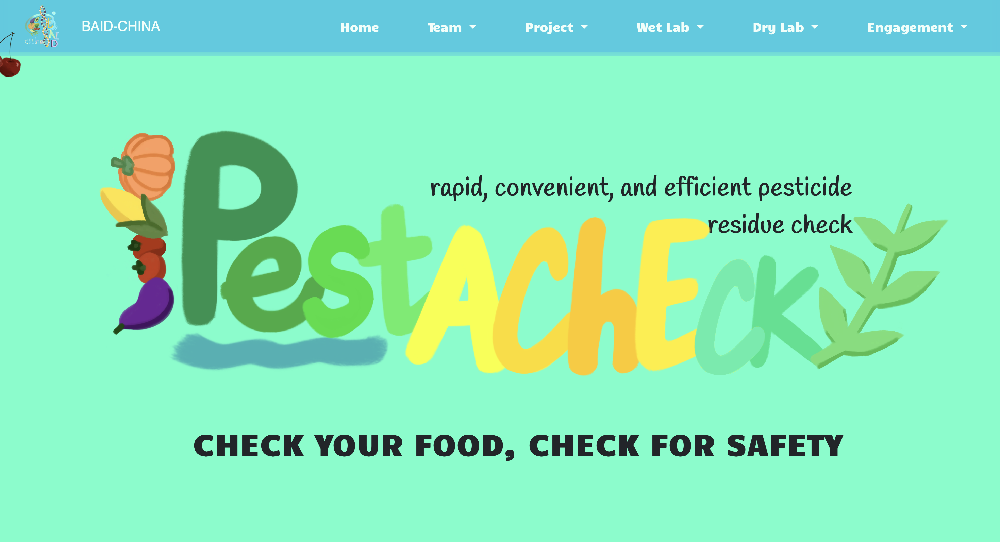

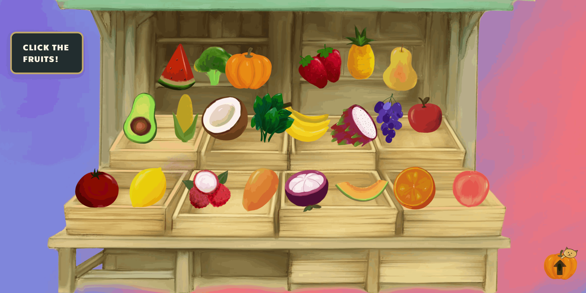

十月底，等到所有视频、网站等都提交完毕，队伍即将迎来了最后的挑战：巴黎线下答辩。为了能最充分地做好准备，队伍借用学校老师资源和其它外部资源，在前往比赛现场前后一共进行了9次模拟答辩。落地巴黎，顶着时差排练五分钟的汇报和二十分钟的问答，这段时间对同学们来说是艰苦但快乐的。

**齐济**：最后一两周，我们每天都会聚在一起联系答辩一两个小时，而且几乎每天都会请各种老师和同学帮我们改进我们的答辩。到了巴黎，我们又开始准备各种问题。我们把各种人问的所有问题都收集起来，自己又想了好多，然后给每一个问题都准备一个对应的答案，分别不断地改，然后背下来。一直到在等候室外面准备答辩，我们都还在一遍又一遍地练习自己的演讲稿。我们对着wiki逐字钻研，把项目的每个流程、每种方法、每张图表都刻进心里，不是为了应付评委和答辩，而是为了对自己的付出有个交代。最后大家也都很好地完成了答辩，评委们问的所有问题我们都有事先准备。

**周悦伦**：jamboree的几天真的很紧张、很艰难，也真的很精彩！刚到巴黎的几天基本都是凌晨就醒，一早就开始练答辩、过问题。大家在狭小的房间里一坐就是一下午，答辩数不清练了几遍，记得到最后甚至别人负责的部分我也能脱口而出了。

judging session最难的部分就是评委会随机提问。那几天，我们共同编辑了一个准备问题的文档。记得一直到晚上12点，我躺在床上，打开电脑还能在共同编辑的文档里看见一行行文字被敲上去。答辩那天凌晨4点我醒来后，大家竟也都醒了。早上6点，我们又一次从头开始过问题，此时文档里已经写满了几千字，每一句回答也已经烂熟于心。
当judging session中每一个问题都被我们有条不紊的回答后，我长舒了一口气，这一年太不容易了！

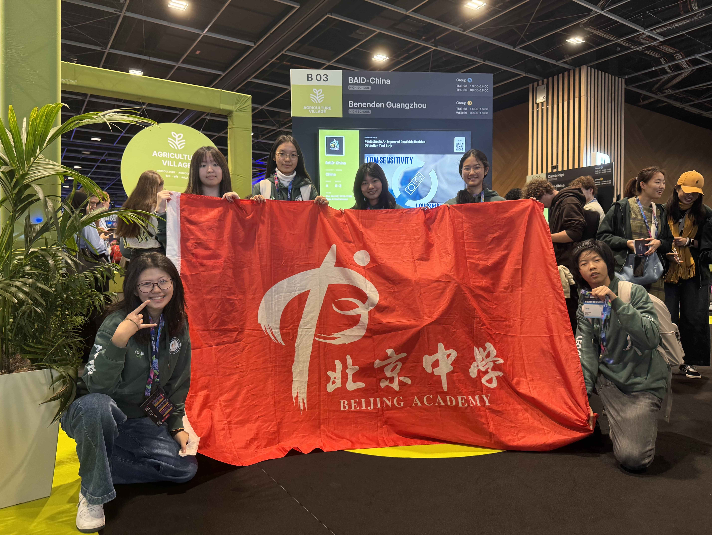

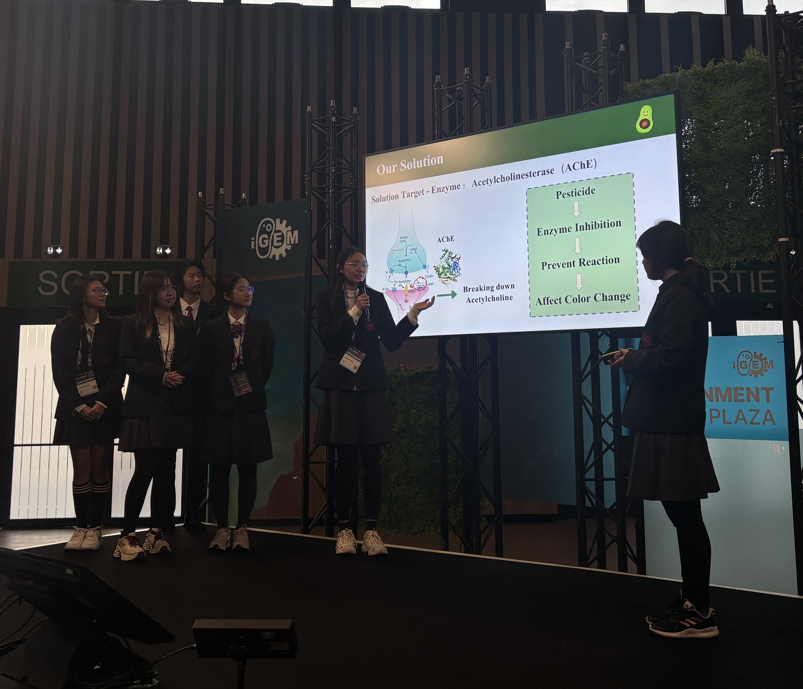

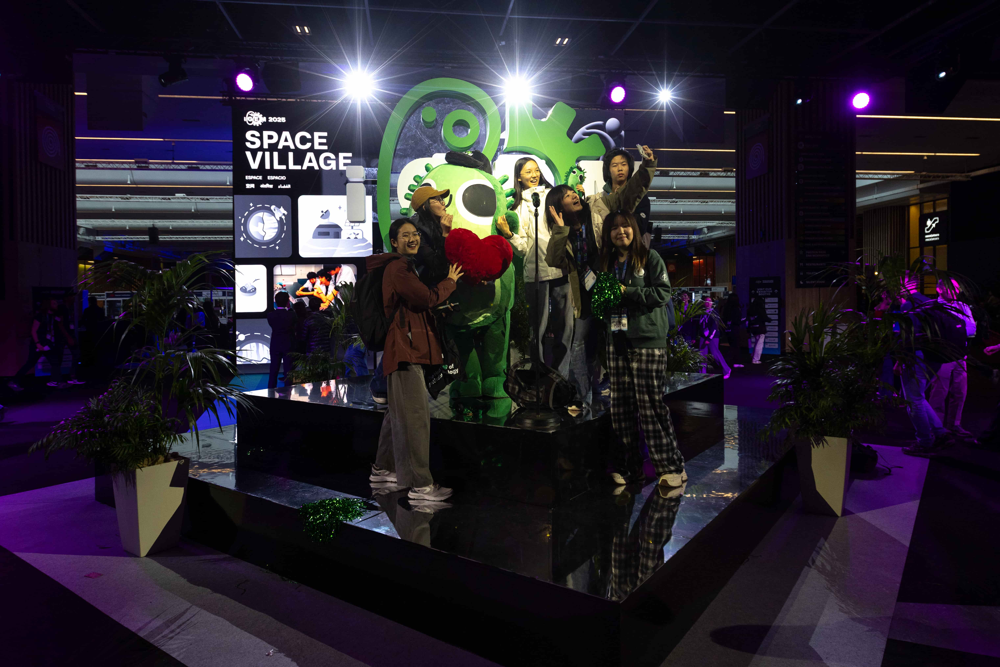

巴黎时间10月31日晚上闭幕式，北京时间已经是凌晨一点多。对于BAID-China的队员们来说，这注定是个不眠之夜。

**刘立夫**：颁奖的时候，我们凌晨一两点坐在电脑前看着远在巴黎的他们，群里也在热情地讨论着。从第一个到最后一个提名，始终没有看到我们的名字。当时心跳极快，也很压抑。跑到床上，对着巴黎的方向隆重地磕了三个。今年的奖项宣布用了二维码倒计时的方式，于是对着还剩1秒的倒计时又磕了三个。抬头一看——哇，金色传说！——我们金奖了。

千磨万击还坚劲，任尔东西南北风。沉甸甸的金牌捧在手里同学们才意识到，这支队伍居然跌跌撞撞地走了这么远的路，也终于迎来了最好的答案。

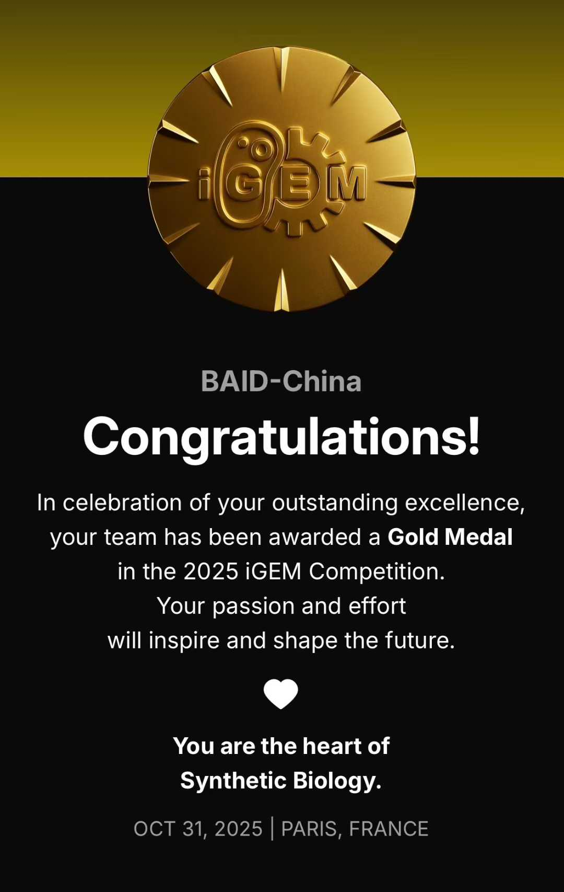

当然，这是永远令人难忘的、鲜活又珍贵的团队凝聚下的必然结果。

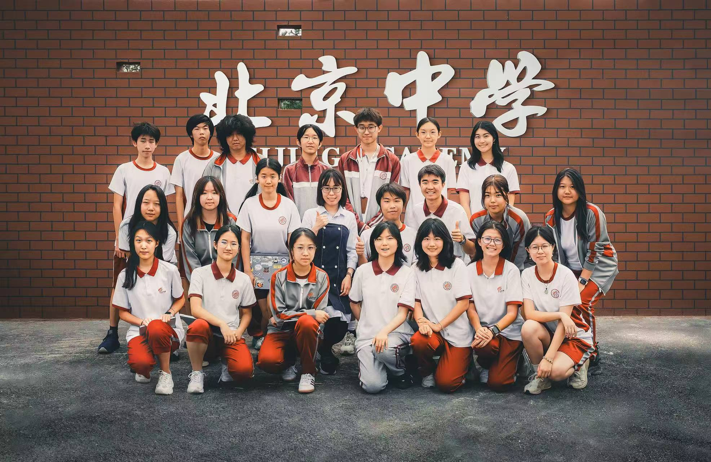

## 四、感想与收获

BAID-China 2025的故事在这里就要结束了。也许未来队员们会选择不同的道路、学习不同的专业，但因为iGEM凝聚在一起的这一年将永远印刻在所有人心里，不断带去希望和力量。

**齐济**：和同学们一起拼搏努力了许久，终于在最后拿到了自己期待的、也是我们应得的结果。这是一群人用专注与坚持，把“可能”变成“必然”的过程；也是我们在青春年华共同进步的美好体验与记忆。

**黄梓勋**：一点一滴，一字一句，无论是失败还是成功，是兴奋还是沮丧都属于我们，没有人可以抢走每个iGEMer心中最最珍贵的记忆。

从六月到九月，从盛夏一直漫步到秋天，从地铁到飞机，从北京到巴黎，我们的每一步都算数。

**韩紫月**：暑假的时候花了大半时间穿梭在研究所和实验室，那时的经历好像在上一秒，下一秒我就已经站在了世界的另一个尽头，巴黎。准备答辩的工作可能是在飞机上，餐厅里等等。每次汇报排练都会获得褒贬不一的评价，一次次争执，一次次鼓励才塑造了我们队伍最完美的答辩。到了颁奖，对比赛结果揭晓未知的不安和对巴黎jamboree之行的不舍交织在心里，揭晓奖项的那一刻大家一起抱头痛哭，深夜微信群里远程队员们的一个个庆祝消息飞快的闪着……我想这是我们每个人一步步努力应得的成果。

**管一楠**：打完这个比赛后，我在日常生活中看到一些问题，比如流浪猫问题、女性卫生问题、环境问题，总是会第一时间想到：是不是合成生物学能解决这个问题？除了思维上的开阔外，一个研究肿瘤为题的获胜队伍的演讲也让我感到动容。当他们站在台上，用科学思路逻辑严谨的讲述完他们的平台如何起效后，手拉手站在一起向台下的我们说“Thus, synthetic biology changes the world”的时候，我真的感到了周身热血沸腾。

**安悦涵**：当了队长才知道，这个比赛背后牵扯的隐形付出绝非旁人能想象到的，也不是几行文字就能讲清楚的。和iGEM的故事太坎坷，于我而言是整两年的探索和投入，过程中的压力和痛苦太深刻了。但是最好的都在路上，我由衷地荣幸能带着校内的大家走到今天，成长远比奖项更重要。祝2026年的同学们继续加油，希望BAID-China这个传承四年的队名继续闪闪发光。答应我登上Jamboree的大屏，走上台领单项奖好吗——！

-BAID-China is the heart of synthetic biology-