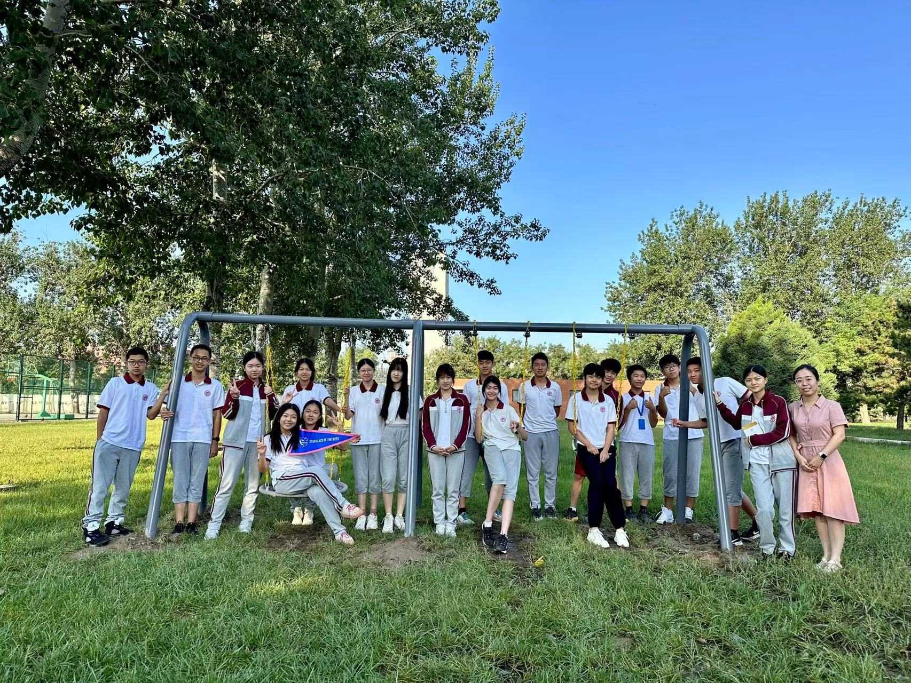

**Welcome to Mc.Rojigally-Pros**, a vibrant and dynamic class of 19 unique individuals. 

欢迎来到 Mc.Rojigally-Pros，一个充满活力的由20人组成的班集体。

At here, you will see a group of **young people with dreams**, each possessing different talents and skills. Whether it’s active participation in class discussions or enthusiastic involvement in extracurricular activities, we always demonstrate **unparalleled unity and teamwork**. Every corner of our class is filled with the laughter of our classmates and the mutual encouragement and support we give each other.

在这里，你会看到一群胸有宏图壮志，各怀绝技的年轻人。无论是在课堂上对学术讨论的积极参与，抑或是对课外活动的热情投入，我们都用行动诠释了“团结统一”这四个字。我们班的每一个角落都充满了同学们的欢歌笑语，还有互相给予对方的支持与鼓励。

Here, we are individuals have passions about **computer science, musical, birds, sports, anime,** and so many interesting things. But indeed, we are united by our love for learning and our determination to excel. We come together to study for standardized tests, prepare for AP exams, and participate in various competitions. Our **shared goals and collaborative spirit** create an environment where everyone feels motivated and supported.

在这里，我们对科学，音乐，鸟类，体育，动漫等等各种各样的事务都充满激情。但纵使我们各有不同的兴趣爱好，我们的心都被对学习的热爱和追求卓越的决心紧紧联结在一起。我们一起冲刺标化考试，准备AP大考，参加各种各样的比赛。我们共同的目标和协作精神创造了一个人人相互支持鼓励的环境。

Our class teacher, Ms. Yuan are our guiding lights, providing us with the knowledge and tools we need to succeed. She not only teaches us **the curriculum** but also instill in us **valuable quality**. 

我们的班主任苑老师，是指引我们前进的一束光。她为我们提供了成功路上不可或缺的知识与工具。这不单单体现在课上给我们传输的知识，更体现在日常给我们灌输的宝贵的品质。

Mc.Rojigally-Pros is more than just a class; it is **a family where we learn, grow, and thrive together.** We look forward to the future with excitement and confidence, ready to face any challenge that comes our way. In the days to come, we will continue to **stand side by side**, bravely **pursuing our dreams** with boundless passion and unwavering determination, facing every challenge that life brings. **One day**, we will part ways, **embarking on our separate journeys** to the universities of our dreams across the seas, where we will continue the unfolding chapters of our lives. But this family filled with love and hope, **will forever shine brightly in our memories.**

Mc.Rojigally-Pros不仅仅是一个班级，更是我们在这里学习与茁壮成长的家庭。我们怀揣着兴奋与自信展望未来，并且准备好乘风破浪，知难而进。未来，我们会继续肩并肩，充满无尽的热情，拥有坚定的决心，勇敢追梦，面对生活带给我们的每一个挑战。虽然总有一天，我们会分道扬镳，踏上各自的康庄大道，越过大洋去追寻自己的梦校，继续展开人生的篇章，但是这个充满爱和希望的家庭，将永远在我们的记忆中闪闪发光。

Follow us as we embark on this exciting journey, full of learning, laughter, and unforgettable experiences!

跟随我们一起踏上这段令人兴奋的旅程，充满学习、欢笑和难忘的经历！

