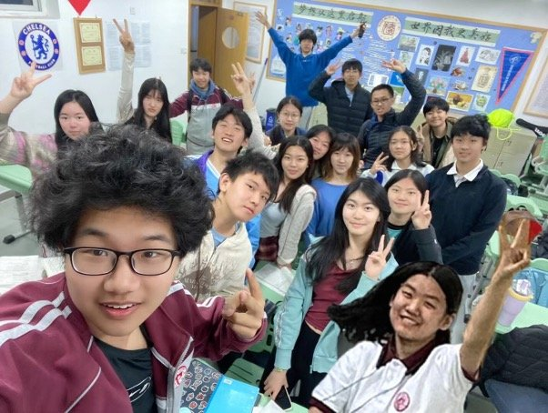

# 班诗一首

诗句中融入了班级每一位同学的名字，不仅展现了班级的凝聚力，更传达了同窗之间深厚的情谊。

临风望羽客，仁慈久乃存。

博浪挥椎处，涵空烟柳碧。

争赏诗家句，瑞应乃如许。

寒毛络石清可数，自有潺湲济物功。

莫言客子无愁易，相思难忘晗听雨。

恰似小园桃与李，四海南奔似永嘉。

秋毫不犯三吴悦，江涵秋影雁初飞。

终藉神明佑吉士，始是新承恩泽时。

感我此言良久立，老夫聊发少年狂。

既亦非知梁上乐，敢嗟彼有釜中攸。

何琼佩之偃蹇兮，黄卷新书芸委积。

东雷震震，风雨欲来。

宜多应者，雨雪霏霏。

卓荦为杰，君何以然。

昔禹之治水，六联文墨曹。

天静无尘夜半时，鹊乌啼罢众星稀

庄生晓梦迷蝴蝶，唐风雅韵传千古。

藤花缀缨珞，人皆是尧舜。

文王喻复今朝是，微澜鹤影漾瑶琨。

