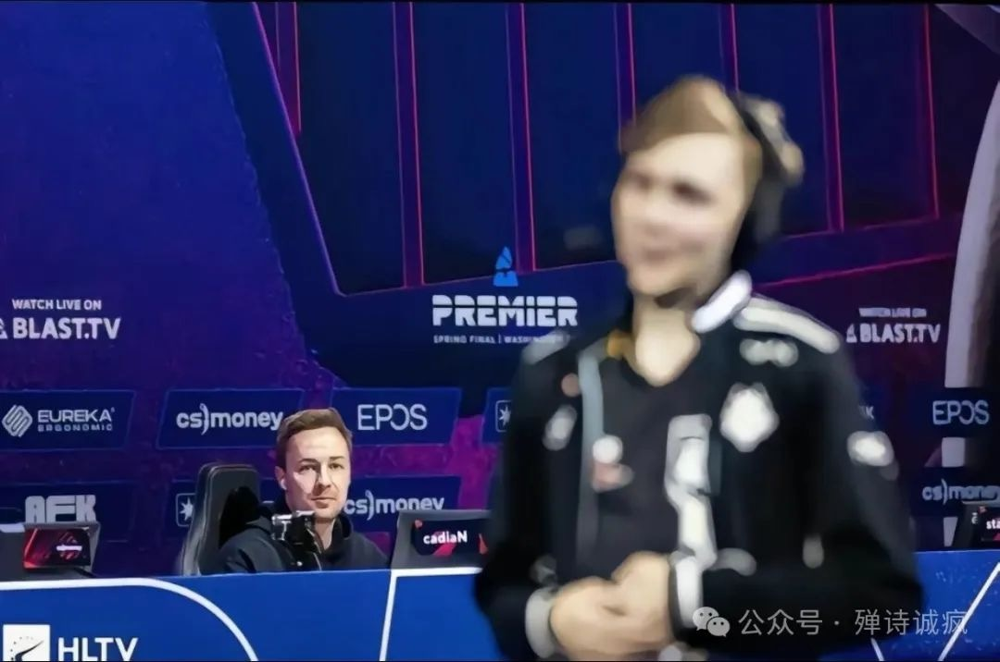

# 第九艺术——一个“网瘾少年”的独白

*若干年后，当你回忆起自己的童年时候，可不要只有补习班和试卷啊！*

讲真，我觉得我真的算得上网瘾少年，两岁时就看我爸打dota，四岁就自己玩cf(cross fire)。对于小时候父母双忙，没有什么朋友又欠缺通信手段的那个时代，游戏可以说是除了上学和打球之外我生活的全部，记得小时候电视上还有一个频道是电竞世界，放的都是一些dota，cf和cs(conter-strike)的比赛，现在是没有了，再到后来出现的各类视频平台上各种实况主，这些被家长嗤之以鼻的东西陪我度过了我的孩童时期。

上学后每到一个新环境常常要被人问“你的爱好是什么啊”这个时候爱好单一的我只能从众多选择中挤出三个字，打篮球，因为喜欢打游戏是一件见不得人的事情，至少小时候的我是这么认为的，也不想承认自己有多喜欢打游戏。上了学后有了一些朋友，但是更多时间我还是在打游戏，和朋友玩以及打篮球更多时候只是不能打游戏时的代餐而已（以前）。

对于我这样的情况，和很多人一样，面对这种情况，父母大多是要批评指责一番的，我家长也不例外，因为游戏我没少挨骂，好消息是由于我的父母还算开明所以我的屁股算是保住了。上了初中后这样的经历是越来越少了，或许是父母老了，或许是随着弟弟年龄的增长，父母需要花更多时间在他身上，儿时梦想中的生活算是来到了。

不过伴随着心智的成熟，我也渐渐开始思考一个问题，为什么，为什么我对于游戏如此痴迷？如果问两年前的我我会回答“游戏好玩”，但是现在我会回答“这或许是我为数不多放松，获取成就感的方式”。

虽然从小到大学习一直还算不错，但是碍于我嫉妒要强的性格，加之我或许确实没有令自己满意的能力，生活中的压力是越来越大了，精神内耗也是越来越严重了，身边人越来越内卷了，面临着学习压力，同龄人压力，升学压力尤其是在我听到我可能无法在北京读高中进而需要回江苏读高中的时候，游戏成了我的避风港。

说起来，我也许有点天赋在打游戏上，现实里我也就是众多npc中的一个，但是**游戏里至少在cs里我是拯救队伍于水火的救世主，我可以享受队友的欢呼，享受肾上腺素飙升的过程，这些是我在现实生活中所没有的，游戏顺理成章的成为了我获取成就感和释放压力的最好媒介**。

除此之外，我如此痴迷于游戏还有一个原因，在游戏里我不再是我，和很多人喜欢读书的人的理由差不多，读书可以体验一个人的人生、体验一些生活中很难甚至无法存在的事物，游戏也是如此，我可以成为一个故事的主角，可以驰骋美国西部，可以穿越中世纪，可以成为夜之城的传奇，而我觉得就这一点，游戏是比书籍，电影等传统媒体更好的，游戏具有互动性，那些传统媒体只能看、听，游戏我可以按我自己的意愿去做出自己的选择，只有在游戏里我才真正能够**脱离第三人称，转变为第一人称**。

借此机会，我还想谈谈我对于游戏的未来以及“第九艺术”这个概念的想法。以下文字仅代表个人拙见。“第九艺术”这个概念来自于玩家群体，现在还不被大众承认，依我个人的理解，艺术，实际上是一种承载人类文化、精神、生活以及意识形态的载体传统。八大艺术我就不再过多赘述了，之于游戏，实际上现在很多游戏（这里多为3A）也能够作为这样的载体，如果你去仔细研究各个游戏的背景内容，你是能发现很多与人类历史，文化相关的内容在其中的，而游戏本身又可以代表制作组的立场及观点，大表哥等游戏就是最好的代表。再说说游戏的未来，随着前几年国际奥委会涉足电子竞技领域，国内出台多项政策扶持游戏厂商，包括游戏背后所带来的巨大经济价值，电子游戏绝对算得上是一片红海，无论从经济还是文化角度，游戏的蓬勃发展都绝对是一件必然的事情。

好了，感谢您能读到这里，这篇文章的目的也不是让更多人去玩游戏，也不想为部分游戏正名或吹捧，只是聊聊游戏至于我和我对于游戏的看法，从cf到cs，罪恶都市维加斯到GTA5，从欧陆风云到文明6，游戏伴随了我的成长，我见证了游戏的发展，最后我想用极客湾云飞的一句话作为结尾:

**“我就非常羡慕那些讲起硬件、讲起游戏涛涛不绝、热情满满的如今的年轻同学，希望你有好好享受这段快乐时光，若干年后，当你回忆起自己的童年时候，可不要只有补习班和试卷啊。”**