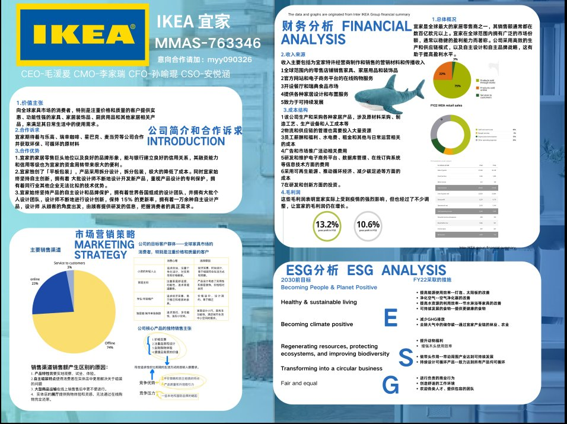

# 北京-上海-哈佛 我的BPC之旅

*每一次成功地克服困难，我都感受到了自己的成长和进步，这种成就感是无法用言语表达的。*

## 北京

在我九年级刚入学时，在一众丰富多彩的社团活动中，我被学长所介绍的BPC活动社团深深地吸引到了，我立刻选择了加入社团，并邀请几个同学一起报名参加了这个活动。

首先我们迎来的是在十一月份进行的线上排位赛。线上排位赛分为两个部分，市场规模估算挑战和商业决策沙盘挑战。市场规模估算挑战则是在通过进行一些在学校的调研，分析研究若在学校小卖部开放三明治和纸杯蛋糕，学校所面向的市场有多大、用户人群有多少、潜在收入有多少、可能有哪些成本等问题并制作ppt。在市场规模估算挑战中，我们需要在线上进行沙盘模拟，从不同的市场中选择一个或者多个最适合投资的市场，争取获得最多的市场份额和总收入。新颖的规则和比赛形式使我感到兴奋，但是同时，如此复杂抽象的比赛形式也使我不知道从何下手。在经过了历时两天的线上排位赛，我和队员们积极讨论，思考，最终获得了参与全国站的资格。

## 上海

怀着激动的心情，我们在寒假时前往上海参加全国论坛。全国论坛中，我们见到了更多与我们同台竞技的高中生，更多创新有趣的比赛形式。我们在5天内完成了公司海报的制作，高管团队课程，商业跨界连连看结盟组队，导师开小灶，队内讨论，急速融资路演，董事会最终决议以及沙盘决策挑战。

我们小队选择代表的公司是宜家，我个人承担的角色是CEO。我们在深夜进行宜家公司的价值定位，可持续发展可行性，财务分析等讨论，虽然每天在竞赛期间都会熬夜到很晚，但是在和队员们讨论的时候我感受到了所有人对于商业的激情，这使我热血沸腾。

虽然最后的成绩不尽人意，我们小队无法晋级全球论坛。我以个人提名获得了晋级全球论坛的资格。

## 哈佛

在今年四月清明节的时候，我前往哈佛商学院参加了BPC全球论坛。

我们参加了4场由哈佛商学院教授主讲的关于谈判技巧，商业战略，社会价值等讲座，这让我更深刻地感受到了商业的魅力，也使我商科的概念更清晰了。我在教授的讲解与引导下深入地思考了公司是由何定义、公平与平等如何定义、公司盈利和社会价值为什么从学术角度而言并不矛盾、如何用数学模型衡量公司解决社会问题的能力、盈利行为的社会价值是什么、伟大的公司如何从创始初心走向持续的伟大等深刻、关键的问题。我听到了来自哈佛的学长学姐通过追踪公司、持股参与和政策角度来谈论ESG。例如，讨论了碳交易政策，以加州在碳减排方面的进步为例。他们还探讨了企业在未来5-10年应该优先考虑的可持续性问题，如何实现净零排放目标等。

我在全球站代表的是the cooperative society（The Coop），担任的还是CEO。**我们在真实的商业世界中，通过深入的采访与激烈的头脑风暴思考商业决策者、运营者如何发现问题、解决问题、创造新的市场空间等关键的实际问题，为自己的项目打下坚实的调研基础。**

我们需要面对来自咨询、投资、实体行业、经济与商业研究的资深国际行业专家与学者，提出对于能在真实运作中给The Coop提供平衡利润、社会影响力与环境可持续的创新破局方案。最后我们在哈佛商学院HBS Aldrich Hall进行了最终的演讲。

除了许多学术上的收获，我在独自面对未知挑战的同时，体会到了独立生活的真谛。独自一人在异国他乡的经历让我更加独立和自信。在美国，我需要自己解决各种生活琐事，如食宿安排、路线规划等，这迫使我学会了更好地管理时间和资源。我不得不克服语言障碍和文化差异，主动与人沟通交流，采访我们这次比赛所代表的商店the coop的经理，这锻炼了我的沟通能力和社交技巧。**每一次成功地克服困难，我都感受到了自己的成长和进步，这种成就感是无法用言语表达的。**

这次独自赴美参加比赛的经历也让我更加珍惜家人和朋友。在异国他乡，我时常会感到孤独和思乡，但是正是这种孤独让我更加明白了家人和朋友的重要性。他们的支持和鼓励是我不断前行的动力和力量源泉，我会倍加珍惜与他们在一起的每一刻。

