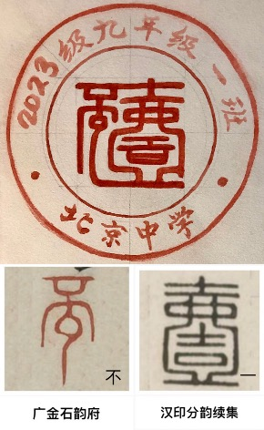
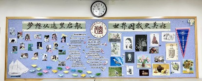
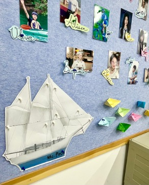
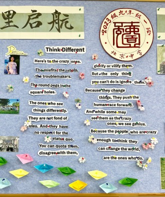
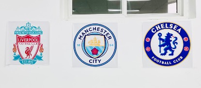

---

## Our Class Name
**Mc. RoJigally.Pros**

`Not just a name, nor aggregation of initials`

> We are Micro in appearance,
>
> but actually Pro in mind.
>
> We set small goals,
>
> Building our great dreams.

We are **M.C.R.O.J.I.G.A.L.L.Y.P.R.O.S.**

*---- Mc. RoJigally. Pros*

## 班级徽章&中文班名

此班徽由“不一”两个字组成，代表了我们的中文班名“不一班”。“不一”两字的写法参考的是其的篆书，将两个字穿插融合后，以类似于篆刻的形式将其笔画风格化，放入了一个正方形的结构中。

完整的班徽外圈还加上了“北京中学2023级九年级一班”的字样，将正方形的主体部分放入一个圆内，外柔内刚，刚柔并济。

班徽的颜色采用纯红色，恢弘大气，也旨在与北京中学的校徽相呼应。另外，与传统文化书法结合的创作方法和圆形套圈的结构也与校徽的特点紧密相连。我们认为班级文化与校园文化是相互联系和相互促进的，故有意将此班徽的设计向校徽设计的方向靠拢。

## 板报设计
教室装饰给了同学们展现自我，开拓创造力的舞台

- 后墙板报全景

- 全员参与，纪念留存，装饰性与实用性并存。帆船意象，呼应主题“扬帆起航”，将九一班集体具像化为大船，在2023的九月起航，承载十八名Mc. Pros个体的梦想，开启四年的航程，将ta们送向属于自己的彼岸。

- 板报精选英文文章Think Different - Steve Jobs为Apple所作的广告词

- “鼓励创新，独立思考，不拘于常规，我们非同凡响”；和而不同，乐在其中的最好体现，教室墙面展示——热爱体育的体现，学习体育拼搏精神。

