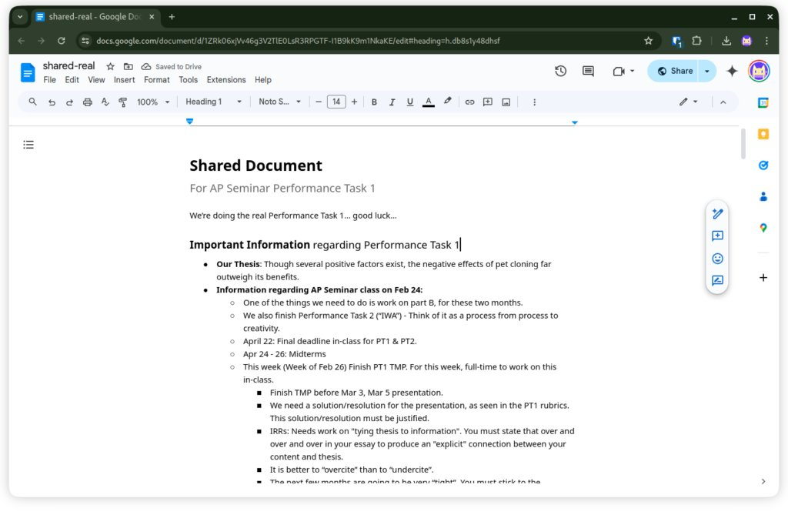
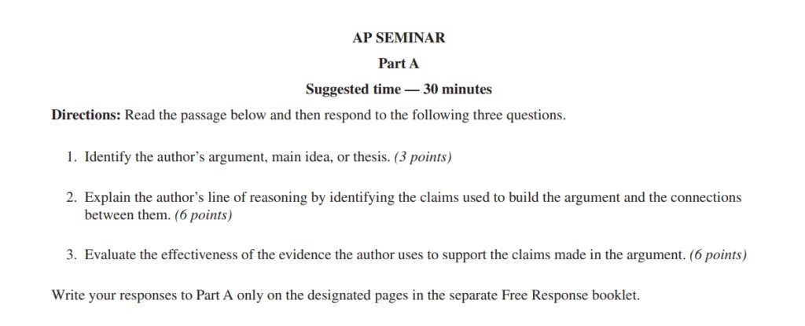

I took the AP Exam for AP Seminar on May 7. After the exam, I breathed a sigh of relief, knowing that I will never be tortured by the endless writing, research, revision, and presentation anymore. _AP Seminar is a radical course, and it gave me an absolutely radical experience._

## Origin

As I mentioned in [Life at an international department](https://dreta.dev/2024/03/30/so-you-want-to-go-for-an-international-department/), some students at BAID are assigned to AP Seminar on their first year, and that includes me. Upon discovering AP Seminar on my schedule, I was rather confused. The description on [College Board's website](https://apstudents.collegeboard.org/courses/ap-seminar) was frustratingly vague, talking about cliches such as "critical thinking, collaboration, and academic research skills" without giving a clear sense of what I would actually be doing.

The AP Seminar classroom cat

Yet alas it's seminar! My first real day in AP Seminar began with an American teacher Mr. Michael handing out a brief course description—far from enlightening—and asking us to read it. It took two tedious and annoying periods for us to read (literally read aloud) the course description, leaving us only _slightly_ more informed and _a lot_ more confused than before. What is "AP Capstone"? What are we supposed to do in this class? These questions would not be answered until almost half-way into the semester.

## First tries

The next period, Mr. Michael didn't appear. What replaced him was Ms. Ma, a young Chinese female teacher. Ms. Ma told us in a kind of lighthearted fashion that AP Seminar was about doing projects and topics, and the first topic that we're going to work on is _nuclear power_.

The problem was that nuclear power was a subject that none of us knew anything about. Over the next few periods, we tossed our ideas onto the floor, literally, as we scribbled thoughts on colorful papers and flung them into a growing pile at the center of the room. Initially, this playful brainstorming felt like the essence of what I thought AP Seminar would be: fun, engaging, and collaborative. I thought, _wow, AP Seminar is fun!_

After a few periods, we were told that we are supposed to complete a presentation on the topic. I grouped up with several classmates I already knew, hoping that our pre-existing rapport would translate into effective teamwork. However, the reality of our group quickly dispelled my hopes. As the project progressed, it became evident that my teammates were not as committed as I had hoped. The enthusiasm that we had from the colorful paper pieces quickly turned into disheartening silence. Days turned into weeks, and still, almost no progress were made.

Our incredibly rushed presentation slides for the nuclear power topic

Frustration mounted as I realized that we are almost out of time, and no one was willing to push the project forward. The lack of effort forced us into a last-minute scramble, making the final presentation incredibly rushed and far from the quality I had envisioned. Ultimately, this was when I came to my first lesson learned in AP Seminar: **pick good teammates.** Yargh.

> Pick good teammates.
>
> Lesson learned during AP Seminar

Still exhausted from the teamwork challenges in the nuclear power project, I hadn’t yet found that the root of my frustration was the lack of effective collaboration. Before I could reflect further, we were swept into our next assignment: _The Truman Show_. Ms. Ma tasked us with gathering reviews of the film to prepare for our next class discussion. I was very hopeful that this could mark a fresh start for AP Seminar.

However, just as we were gearing up to dive into _The Truman Show_, unexpected news hit us. Ms. Ma was out on flu quarantine, and Mr. Michael would be our sole teacher here for the foreseeable two weeks. The transition was anything but smooth. Without Ms. Ma here, weeks passed with little to no progress. Then, abruptly, the topic was cancelled! We were told that now, we need to face the doom head-on: **The Performance Task 1.**

## Seminar reveals itself

This marks the turning point of the AP Seminar class. Previously, it was fun. But after that, it became much more stressful. It was at this point that we were finally informed of the true nature of the AP Seminar class.

> Know what you are going into.
>
> Lesson learned during AP Seminar

Throughout the year, we were supposed to learn fundamental critical thinking and reading skills such as understanding and analyzing arguments, identifying multiple perspectives, avoiding bias, evaluating credibility, etc. The projects on nuclear power and _the Truman Show_ were supposedly designed to teach us these critical thinking abilities, although the effects to which are uncertain.

After learning these abilities, we were supposed to complete several tasks that _contribute to our AP scores._ These are:

- **Performance Task 1: Team Project and Presentation.** Comprising 20% of total AP grades, students are expected to group themselves and choose a research topic on their own. They are expected to complete an **Individual Research Report (IRR)** of 1,200 words and a **Team Multimedia Presentation (TMP)** of 8 to 10 minutes.

- **Performance Task 2: Individual Research-Based Essay and Presentation.** Students will receive a **7-article stimulus material pack** in late January. They must identify a theme and complete an **Individual Written Argument (IWA)** of 2,000 words and an **Individual Multimedia Presentation (IMP)** of 6 to 8 minutes.

It was absolutely shocking that we have to complete all of these tasks in the so-little time that we seemingly have. Writing 1,200 words, and another 2,000 words, and another two presentations! I've never written anything _that_ long before. I wish I knew about what we were about to face at the beginning of the course. This amounts to the second lesson learned during AP Seminar: **know what you are going into.** Even if you don't have a choice to take the class, you should at least do some research beforehand to know what you will be doing throughout the year.

The AP Capstone "QUEST", which identified required abilities for AP Seminar students.

Ms. Ma told us that we want to finish Performance Task 1 before the end of the semester in mid-January, and before actually starting the real Performance Task 1, we are going to do a mock run because the teachers won't be able to help us anymore after the official start of the tasks. _This was where seminar became real._ Argh!

## The Performance Tasks

I knew that I needed different teammates for Performance Task 1. Otherwise, my AP Seminar grades would be totally cooked. Thankfully, I observed how the different teams worked during the nuclear project, and I already had a couple of people in mind. I now have a new team with all incredibly capable and talented people, giving me full confidence that this time, the project is going to go great. And so it did. We blasted through the Performance Task 1 mock run, and everyone agreed not to regroup for the real Performance Task 1, and so we started.

It's that time of the year when everyone on Reddit says they're cooked!

I thought it was going to be a dramatic moment for the official start of the Performance Task 1, something like those grand ceremonies for finishing construction projects. It didn't go like that. Instead, Ms. Ma just gave us a single sentence, marking the official start of our project.

As we began to dive into the Performance Task 1, an issue became apparent: time wasn't on our side. The semester hurtled toward its end, and the deadlines were looming larger by the day. Despite our best efforts, nearly everyone in the class was falling behind. Our teacher had to extend our deadlines multiple times. It soon became clear: we were in a race against time, and we _were_ losing. As a last resort, our winter break became a casualty of our academic pursuits. Argh.

In a whirlwind of activity, we all wrote our Individual Research Reports (IRRs) over the break. Misunderstandings about the IRR's purpose led us down the wrong path initially; we had mistaken it for an argumentative piece similar to the Individual Written Argument (IWA). This confusion really stemmed from our in-class discussions focused on crafting arguments, which gave us the false impression that the IRR was supposed to be argumentative. Realizing our error just in time, we went through to the correct approach, which was more about synthesizing existing viewpoints than presenting our own. This properly surmounts into one of the other lessons learned from AP Seminar: **Read the rubrics!** We wouldn't have gone down the wrong path if we just read the rubrics and requirements more.

> Read the rubrics!
>
> Lesson learned during AP Seminar

The pressure mounted as the new semester began. With the Team Multimedia Presentation (TMP) on the horizon and only three weeks to draft a 2,000-word IWA, the pace was frenetic. Discussions and peer reviews stretched into the nights, and we almost broke down in a last-minute video call to finalize our presentation the night before it was due.

Our shared document for Performance Task 1

And then we finished our presentation. It actually went quite smoothly, marked by an almost unbelievable collaborative effort. For the first time since I started at BAID, I truly experienced the power of effective teamwork. Performace Task 2 went through in a similar fashion. This time, however, I was on my own, which brought both relief and a different kind of pressure. Without the need to navigate team dynamics, I found flexibility in how I managed my work. It entirely freed me from the nightmares of previous teamwork issues.

## There's still the exam!

As we are already exhausted and frustrated by the performance tasks, we still had to prepare for the ultimate challenge: **the AP exam** (or the end-of-course exam). The AP exam is composed of two parts:

**Part A.** In this part, students read an article and answer three free-response questions regarding the article's thesis, line of reasoning, and use of evidence.

**Part B.** In this part, students read four articles and compose an argumentative essay based on the themes of the articles.

The two-hour time frame allotted for the exam was _palpably_ insufficient. Every second was precious, and the pressure was unbelievably intense. I was especially challenged by Part B, where the leap from the sources to a broader theme like "Fast Fashion"—seemingly unrelated to mere mentions of "clothing" in the texts—required a depth of thinking that felt almost ridiculous under exam conditions.

In the months leading up to the exam, our preparation consumed every aspect of our class time. Nearly all of our in-class hours were dedicated to drilling through practice tests, leaving us no opportunity to refine our ongoing performance tasks. The school even kept us overtime at night, which always left me drained after I return home at 9pm. I thought I came to BAID to escape the long night classes for grade 9 students still preparing for the Zhongkao (high school admissions exam), but it would seem that I couldn't escape that fate of staying overtime after all. Argh.

Part A exam questions

I took the AP Exam on May 7. I remember breathing a sigh of relief after sticking my AP ID Label on the free-response booklet, knowing that I will never be tortured by the endless writing, research, revision, and presentation anymore. With all of the skills that I have developed through the year of struggles and tears, the exam itself actually felt surprisingly easy, and I felt like I breezed through it without issues. I am now eagerly waiting for my ultimate scores to be released in July.

## Reflections and thoughts

AP Seminar is finally over. The night after finishing the AP exam, I reflected upon the lessons that I learned and my thoughts for the course. For anyone of you who are about to study AP Seminar next year, here are a few things to learn in addition to what I discussed previously.

**Pick good teammates.** Many of the issues that I faced early on in the course could have been easily avoided with better collaboration efforts. Thankfully enough, I realized my mistake before the start of the real Performance Task 1 which contributes to my AP scores.

**Know what you are going into.** If you have a choice, you should think twice about choosing AP Seminar. It's definitely a great course that was very helpful for my critical thinking and research abilities, but it's also incredibly challenging and you will _surely_ face setbacks on the way. At the very least, you should read through parts of the course and exam description to know what you will do throughout the year, and know what to do when your schedules aren't exactly adding up.

**Read the rubrics.** There was one incident that I didn't mention because of limitations on space previously: one of my classmates wrote a whole IWA without referring to anything in the stimulus material pack. There was also us almost writing a whole argumentative IRR piece when the IRR isn't supposed to be argumentative at all. If we read the rubrics earlier, none of these issues would occur.

**Follow a template and read samples.** When you write your IRR and IWA, you really need to follow a template. These are easily found with a Google search. Following a template really makes your mind clearer and allows you to flow your writing way better, which ultimately contributes to your grades. You should also read high-scoring IRR and IWA samples available on College Board's website to see what you are lacking in.

**Enjoy and have fun.** AP Seminar is definitely challenging, but it's also one of the classes where I had the most fun in. Try to relax, and not be too stressed in the tasks. Confidence is key!

## Finally...

Reflecting on my journey through AP Seminar, despite its challenges, the course was immensely rewarding. It significantly expanded my capabilities, especially in critical thinking and the academic space. The blend of individual and team tasks, coupled with the rigorous demands of the performance tasks and the AP exam, provided a dynamic learning environment that was as fun as it was demanding.

I would wholeheartedly recommend AP Seminar to new students. It's more than just an academic course; it's a chance to develop skills that will serve you well beyond high school. If you're ready to challenge yourself and grow, AP Seminar is the perfect opportunity to do just that. With a right mindset and a proactive approach, you too can enjoy AP Seminar to its fullest. (May 13, 2024)
