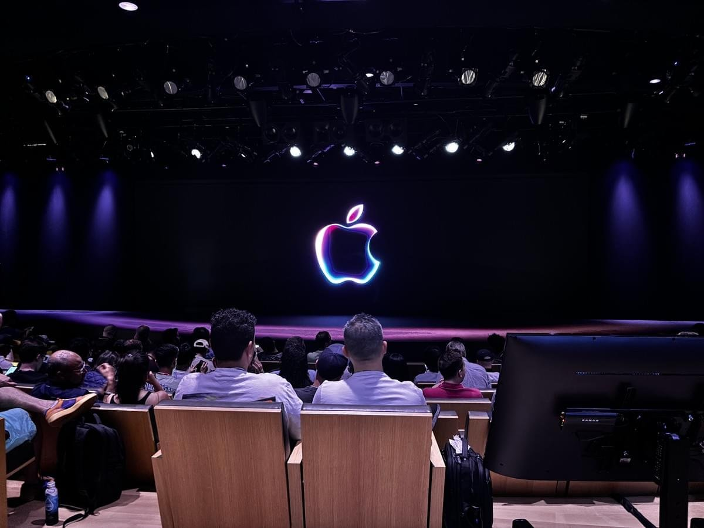

# WWDC--Cultivation to next-generation developer

Every year, WWDC is one of the most anticipated days for tens of thousands of developers, because at this time of year, Apple will release the latest technology and software updates. This year, I participated in the Swift Student Challenge, an affiliated event of WWDC24, and successfully became one of the 350 winners of SSC with my work, and got the opportunity to enter ApplePark to participate in the WWDC24 event.
With my excitement, I swiped my card and stepped into the magnificent ApplePark.
Apple Park, this palace of modern technology, stands in the heart of Silicon Valley like the light and shadow of a future city. Its architectural outline is round like a spaceship, perfectly showing the ultimate fusion of simplicity and technology. The glass curtain walls surrounding it reflect the bright sunshine and changing cloud shadows of California, as if it is an oasis in a dream.
The atrium garden is full of greenery, thousands of pear trees are in bloom, and the faint sound of flowing water and the whisper of the wind among the flowers add a bit of natural tenderness to this holy land of technology. This is not only the birthplace of technological innovation, but also the perfect combination of nature and humanity, reflecting the ideal of harmonious coexistence between man and environment.
Walking into Apple Park is like stepping into the door of the future world. Every wall and every window shows Apple's extreme pursuit of details and unremitting exploration of beauty. Here, technology and art blend, innovation and tradition dialogue, and every design is an imagination of the future.
Apple Park is not just a building, it is a stage for dreams, a gathering place for wisdom and creativity, and a starting point for exploring the unknown. Here, every step is at the forefront of time, and every thought may change the world.

This event is full of stars, not only the famous video bloggers on the Internet or the bigwigs of the company like Sam Altman, but also gathered together to participate in this annual feast for developers. The scene was crowded with people, full of impatience and expectation. After arriving at the venue and having breakfast, I went to the back row of seats and met many influential video bloggers on domestic platforms, such as "Film and Television Hurricane", and had a brief exchange. I went to the seat area belonging to SSC winners. Fortunately, our seats were behind the VIP (Enterprise Guest) area, and the area in front belonged to technology giants such as Sam Altman, Satya Nadella, etc. After taking our seats, we waited for the conference to begin.

In addition to the release of new operating systems and other technologies, I was even more shocked by the training of young next generation developers at WWDC24.
From the evening reception on the first day, I was deeply moved by Apple's enthusiasm for developers. From the entrance of the reception, the retail team lined up to cheer and applaud each winner and the people who came to collect badges to enter and exit the subsequent venues. From the end of the long line to my entrance, the cheers seemed to have never stopped. The cheers of dūb dúb D! C! are deeply engraved in my heart. The reception session is actually to bring all the developers together, so that everyone can get to know each other initially, build relationships, etc., and the winning works of this year's Apple Design Competition are also displayed to the public, and emotional developers can also communicate freely with these big guys. The most important thing in such occasions is to open your heart, enthusiastically and actively find others to share your works and opinions, or even just chat, just to connect with others and improve yourself. According to one of the SSC leaders on the scene, some people in the previous sessions had similar interests and hobbies, met at SSC, and even started a business together later. At the dinner, I met some Chinese developers and had a great time chatting with them. I also had some exchanges with some Apple managers. From this reception, which I thought was simple, I realized that the communication environment of American developers was different from what I had originally thought.
With a little shock in my heart and excitement that could not be concealed, I spent a difficult night and stepped into the venue of WWDC24 - the magnificent ApplePark! At breakfast, we students who participated in SSC were divided together again. It can be seen that Apple tries its best to create opportunities for the next generation of developers to communicate at every moment. After breakfast, I came to the main venue, which shocked me even more - the students were divided into the second closest seating area to the big screen, and the closer area was the position of various business giants and Apple's top executives. Even those developers who have been developing for decades are behind us young beginners. Feeling that I am so valued as a young developer, the feeling is complicated and exciting. On the one hand, this kind of attention is like a light, illuminating my confidence and expectations. On the other hand, this kind of attention also brings a sense of responsibility. I realized that standing on such a stage, I represent not only myself, but also countless possibilities in the future. This emphasis makes me more determined to pursue excellence, explore the unknown, and create possibilities. It makes me deeply feel that every young developer should not be ignored, and each of us may be the one who changes the world.
After the press conference, after a short lunch, the student developers were called together. I didn't understand this link at first, until I saw Craig Federighi walk out of a door in ApplePark and gradually walked to the area where students gathered. For a moment, I was shocked. I didn't expect that such an important person would come to a group of students to discuss development face to face. The students took turns to introduce their works, and Craig listened patiently one by one. I tried to squeeze forward, but was stuck in the crowd. I knew that the time was up, and Craig left with a happy face. Therefore, developers abroad should take the initiative. Active talents can get the opportunity to communicate with such a big man, and it is good enough for him to remember this person or work for a short time.

After the State of the Union, the 1:1 in-person lab that developers are looking forward to the most arrived. There were hundreds of Apple developers and engineers divided into various regional categories to welcome developers to come to discuss and solve problems one-on-one. I was very shocked by this intensive communication and training method at the time. I was deeply impressed by the intensity, professionalism and systematicness of Apple's training for new developers. Throughout the event, both beginners and senior developers could feel the enthusiasm and pursuit of technology. Every corner of the park was full of an atmosphere of exploration and innovation, as if every conversation and communication could inspire new inspiration and thinking. In addition, after more than an hour of study in the Afternoon session on the second day, Apple called out its top engineers to communicate with developers at the closest and most direct distance. Developers lined up to communicate with engineers to seek improvements to their works. This environment gave me extremely deep feelings every moment.

---

---

It is a little regrettable that I only won the ordinary winner this year instead of the distinguished winner or even the top 12, which also made me miss some better opportunities such as communicating and sharing with Tim Cook in person, entering the laboratory inside ApplePark, etc. Of course, this also gave me a great motivation, let me remember the taste of failure, strive to continue to work hard in the next few years, and strive to get the distinguished winner or even the top 12 in the future to get better resources.
At this WWDC24 event, I was deeply shocked by Apple's emphasis on and training of young developers. As an author, I often pay attention to how the technology field influences and inspires the next generation, and Apple's approach is undoubtedly a model of innovation and motivation. From one-on-one practical laboratories to direct dialogues with senior engineers, this education model not only demonstrates Apple's rigorous attitude towards technology, but also reflects their profound considerations for cultivating a new generation of developers. Each link is carefully designed to ensure that every young developer can get the most from learning and growth. In addition, this education strategy also shows an important concept: in the world of high technology, young people are not only learners, but also the main force of future innovation and change. Apple obviously recognizes this, and by providing such opportunities, they are not only imparting technology, but also cultivating future leaders. Every detail of the entire event, from the warm welcome of the first-time visitors to the patient teaching of the professionals, reflects a respect and expectation for technology and new talents. This culture and educational philosophy are what I think all technology companies should learn. The future technology industry needs not only technological innovation, but also the cultivation of young talents with innovative spirit and sense of responsibility through such an educational model.

---

**This passage is from [WWDC24-2](https://www.benjaminjiang.com/blog/wwdc24-2)**