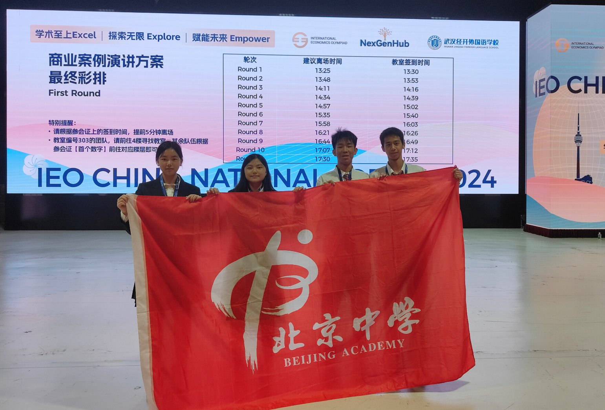

# 努力与付出皆是成长

历时4天，我和我的队友们打完了IEO中国站的比赛。这是我这一学年第一个也是目前第一次参加的竞赛。

今年五月份我们我和队友们开始备赛，从一窍不通、一点没学过的宏观经济、国际贸易开始学起。一开始题库里的题我每单元都会错很多，笔记本上全是错题，我自认为我在认真备赛。但当第一次初级站模拟测评完后对着实在难以说出口的成绩。“我真的有在努力吗？或许，我真的适合学习经济吗？”我反思了许久，一周、距离正式测评一周我必须再进行调整。或许是努力也是运气，我的个人成绩比理想中好了很多。也感谢队友们的付出，我们初级站团队分数得以高分晋级。

接下来是两周的时间，准备中国站。中国站加入了金融这一模块，经济部分引进了许多深度很广的模型和定理，包括中级微观。每刷一单元十道以上的错题和知识点上的漏洞层出不求，我很崩溃。期末、中考和合格考模考接踵而至，让我应付不及。整整一周都是一点半以后睡的觉，但我坚信我可以掌握这些知识。但幸运不会总眷顾我，中国站线上考试发挥的可谓一塌糊涂，考完后第一感受就是想哭。

这周四刚下完化学课就坐飞机来到武汉，老实说，周四冒雨跑回酒店让我有点收不住心。第二天也就是周五8:00，开始了商业案例分析。我低估了分析的难度和考虑的因素，直到下午四、五点我们才确定具体的解决措施。查找资料更花费了大量时间，我们九点多开始整合信息。经验和知识的匮乏，让我没有运用到经济学最重要的“模型”来帮助我更可视化我们的方案。从九点到周六凌晨三点半我们四个终于提交了方案，早晨七点起床冒着雷阵雨终于前往了会场内。不到三个小时的睡眠让我头疼欲裂，大家状态都不是很好，我们都在安慰对方。

会场内又是写手卡又是熟悉内容，很快就用光了自以为很多的时间。很感谢队友和老师对我的鼓励，最后的呈现不是特别完美但也符合预期。只是面对评委刁钻的问题，让我们有点措手不及。我还记得在我讲的时候手抖个不停。现在回想起来，紧张是无可避免的。

今天是中考前最后一天，我们上了回北京的高铁。迎接我们的是中考，三天后是为期两天的期末考试。我一直觉得闭幕式结束之前的领奖环节是一场梦，我总是侥幸地认为即使没有进入到今天第二轮的商业演讲，也能拿到一个很好的奖项。但是，我们并没有做到，我没有实现我自己的目标，也辜负了老师和同学们的期待。说不后悔、不难过肯定是假的，我在想如果我周五上午可以再多搜一些资料；晚上再帮队友们更详细地完善一部分PPT；早上再努力一点，背好自己的演讲内容，比赛结果会不会更好呢？
这次收获许多，我感觉自己在这四日的武汉之旅中更成熟、自若了。再次表达对我的三位队友的感谢，没有你们我肯定晋级不了中国站。也要感谢我们的带队老师，帅老师一直在安慰我们四个。我总是在大赛中、演讲过程中缺乏自信和合适的自我实力认知…希望以后可以改掉这一系列的缺点…！要是下次参加IEO或者其他比赛。一定可以做得更好，为自己和学校争光，不要再留下任何遗憾。

——Olivia

