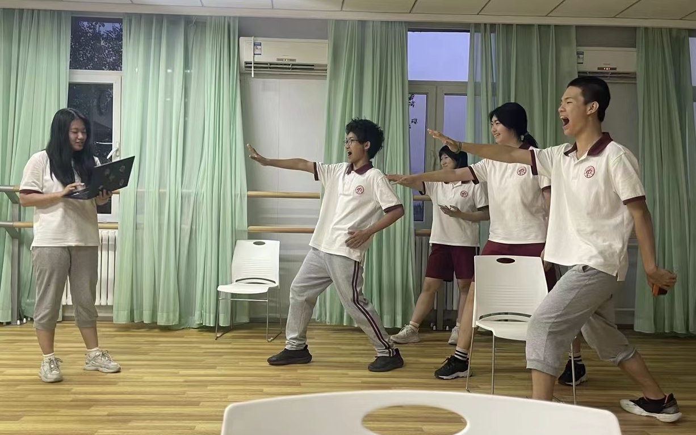
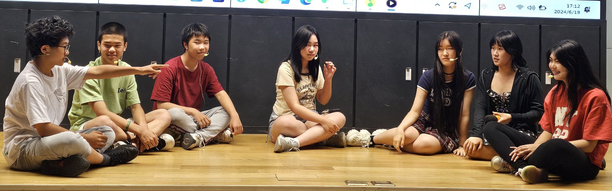
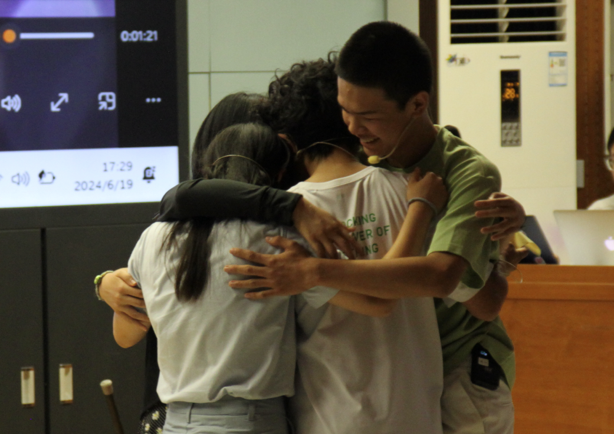
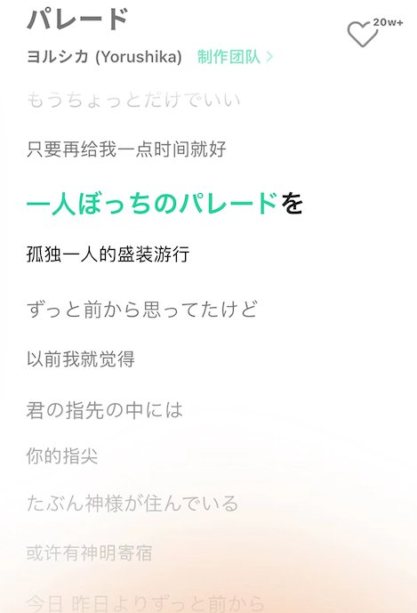
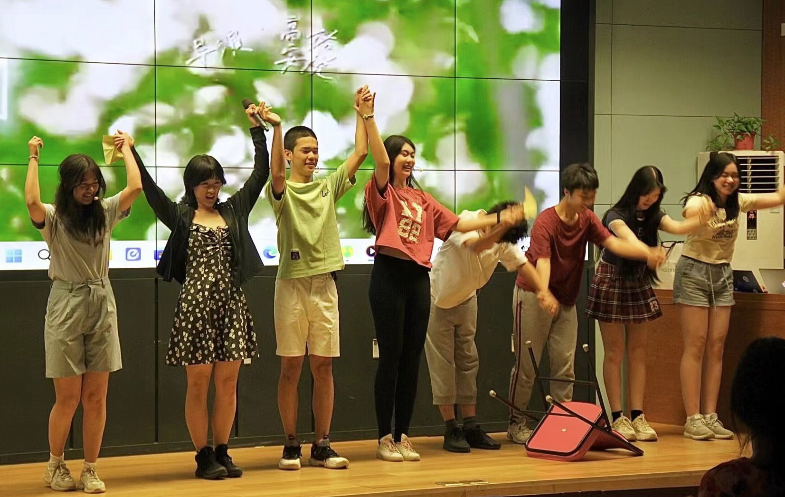

# 抓一次火花

***It’ll be us, it’ll be us, it’ll be us and only us.***

## Hug Me--作为主创之一的心路历程

**Audrey**

英文戏剧节结束了，导演当了编剧当了主演当了音乐当了设计当了道具当了总之是一切一切与剧目有关的任务几乎都参与了一遍。回顾从二月份得知要举办戏剧节到最终的表演，由衷的感慨我们真的走了很远的路。尽管现场有超多失误：卡顿，忘词，音画不同步，道具忘拿，笑场，出戏，最后大家的反馈却远远超出了我们的想象。在上台的前一秒我甚至还在想“只要演完不被嘲笑就够了”。这样想当然是有原因的。

2月26日刚得知要举办英文戏剧节的时候我本不打算参与剧本的编创。当时Leo发来了两个已成形的故事，叫hug me。非常好，给我们定了一个温暖的基调。当天晚上班级群里非常热闹，忙着选角，分工，不过自那天之后这个戏剧的推进就放缓了，由于AP还有各种考试。

5月16日AP考完，第一版英文剧本产出。非常伟大，四个主演的名字--Clara，Klay， Ray，Miranda--第一次出现。这一版讲的主要是两对互相爱慕的少男少女，与最终版相比另外两个主演Ray和Miranda的戏份更多，对于他们的刻画也更细致。反正大考后闲来无事，于是很快就打算开始排练。

然而排练的过程中我们发现了各种问题。这一版的剧本细腻但似乎没有一个主线剧情，作为戏剧我自认为与设想的效果有些不同。主演们似乎无法完全投入到剧本里，与里面的角色产生共情。也许一个好的演员可以做到完全融入一个与自己性格特点完全相反的角色中去，但对于我们来说，难度还是太大了。于是突发奇想我想自己试着改一改。

在二十分钟内讲好一个充满戏剧性的故事就不得不牺牲掉一部分的情节。出于私心我把重心转移到了我和Jerry饰演的Klay和Clara上。Clara是我在看上一版中非常喜欢的一个角色。她很多面，为了贴合主题love and respect我给她加上了抑郁症患者这一身份。也是在第二版，为了增加一条主线我们第一次使用了“时空穿越”这个稍有些俗套的梗，尽管没什么新意但能保证看的过眼。为了更快的完成剧本创作，我干了一件后面看来非常错误的事情：把大纲喂给了Chat GPT。GPT很聪明，它能读懂故事也能编创故事。生成出来的文字简短的经过人工修改后就又形成了一版剧本。

然而人工智能是永远无法拥有人类的创造力的。它写出来的台词连贯但毫无感情，更多像是对我提供的大纲文字的扩写。这一版剧本苟活了一阵子，大概是排练时间最长的一次，但是问题是十分严峻的。这一版的第一个scene便是Clara尝试自杀，这一幕我们练了又练始终无法进入当时的感情。同时来临的中考模考和各项任务让此时的我们对英文戏剧节的热情基本磨灭。更别提看到其他班在这个时期利用自习课已经排的八九不离十，而我们的自习课只能一次次地被占用进行考试，此时的挫败感是极强烈的。

非常疯狂的，我向其他同学们表达了想要再创作一版剧本的愿望。**GPT参与创作的剧本终究不是我们的。它不会知道我们每个人的特点，Leo天马行空的思维，Jerry的冷幽默，Sophia的小斗嘴，Molly坚定的执行力...**选择原创剧本，创造出的应该是我们的故事。我希望我们班所有人可以不是只扮演角色，而是演出自己。抱着这样的心态和目的，我又打开了word，这时候是端午节，距离演出还有一周。

端午节三天我去看了心心念念的音乐剧汉密尔顿。这是我觉得最有感染力的一部剧，灯光打下来第一位演员出场眼眶就湿了。无与伦比的表演，观众从开场曲就能被调动，散场后所有人都带着欣喜的笑容或被感动到哭得通红的眼睛。这一个经历给我触动很多，更带来了很多灵感。

赶着凌晨的飞机回到北京，一到家就打开电脑。真的要卖一波惨，最后一天的假期除了作业还有好声音的排练外，基本一天都在写剧本。焦躁、犹豫、不安，不确定能不能赶上，不确定能不能排完。与此同时班级群也有了不和的声音，我们班当时因为各种原因甚至没有和负责老师一起排过一次，道具服装也有很大的分歧，更别说最新版剧本连个影子都没有。当天晚上，剧本写完，发到群里后我说：

*“相信的心就是我们的魔法，加油加油。”*

没错。

最终版的剧本有点黑色幽默。去掉了略显尴尬的英雄救美片段，一开场就是已经死去的Clara站在生死交界处。同样的还有Klay。他们在彼此不知情的情况下一起决定回到过去拯救对方，Klay不想Clara自杀，而Clara不希望因为自己而拖累了Klay的人生。有点咯噔和老套的剧情，却是我们在当时能写出得最好的东西了。无论如何，是没有退路了，所以硬着头皮也要上。我把剧本印了出来，十多页，还蛮有成就感的。

端午回来后就立马投入了排练，经过强烈的建议，这周的自习终于留给了我们。排练是令人崩溃的，迟迟进入不了状态的主演们，背不下来的台词，牺牲很多时间到戏剧节里而不知道最终的结果如何。但是我们给出了承诺，承诺把戏剧做好就必须把它做好。带着这种奇怪的信念感一切似乎就变得热血起来了。

剧本是确定了，台词也吩咐下去背了，还有很重要的一部分--音乐。17号下午，我们在舞蹈教室排练。最后一个scene是Clara和Klay向对方坦白彼此的“穿越”。这部分本应该是一个小高潮，但我写的词总显得干巴巴的，完全没有应有的感情。这时汉密尔顿之旅就派上用场了，我们打算用唱的。临演前两天决定唱歌！

非常迅速地决定使用Dear Evan Hansen中男女主对唱的Only Us作为伴奏，又改了一大部分词。同时又在第二幕Klay刚穿越回来决定去找Clara的时候再加一首Disappear，正好解释了为什么Klay会义无反顾的一次次选择回去去救Clara--- **cuz no one deserves to disappear or to be forgotten**. 我反正很喜欢，但毕竟距离演出只有两天剩余，跟着伴奏唱好还是很困难的。

这天晚上我决定再做一个背景视频，加上一些在写剧本的时候脑海里就已经构想过一遍的音效。第一幕结尾在生死交界处留下的伏笔（Miranda递给Clara的礼物是什么）在第七幕左右经过rewind后才得到解释。Rewind的过程我做了一个炫酷的音效，选取了一部分之前每一位演员说过的台词，加上钟表声、倒带音、留声机老唱片声，展现出一种时光回溯的情景。在更多的一些细节处比如雨声、呼吸声、心跳声修改了一遍又一遍。这个视频23分钟左右，是和我们的演出一起播放的，为了卡上点我们在最后两天的排练都是和这个一起进行的。然而事实就在这里：只、排、了、两、天 。

我和大家都不止一次的觉得只要我们晚一点点演出，甚至就晚一天，结果都会大不一样。但如果再晚一点，也许我们就不会在18号晚上从五点多看到夕阳从401的窗帘溜进来，一直排到八点半整层楼都熄着灯只有我们打着手机手电筒。我相信参与戏剧节的每一个班级都有着类似这样的体验，但我们的于我们来说最特别。**每一次忙里偷闲见缝插针的排练，每一次热情燃尽又不得不重新站在台前，好在写下这段文字的时候时间还未过去太久，所有一切记忆像幻灯片一样循环了一遍又一遍。**

19日当天体育课时间我才第一次跟Luna讲清楚视频的播放---因为之前的排练都是我或者其他演员负责的。上台前坐在台下，折着原定最后一幕扔给大家的纸飞机，不得已的大口的呼吸才能使心率平稳一些。一切都太匆忙，焦躁而无法安定，我记得当时我的手都在抖。当时Leo问我：戏剧节和上次的好声音相比哪个紧张？我回答说绝对是戏剧节。因为这不是我一个人或者我们一个小集体的活动。这是我们班的成果啊，在此之前还没有其他人听过。

主持人报完幕我们甚至还在台下没带上头麦。麦克风的线像是无限的纠缠到了一起怎么也解不开，费了好大力气带上之后我给技术同学示意，接着耳边就响起了早就设定好的下雨声。没有预想中的加油打气自我建设，一切似乎就自然而然的进行了...就往前走，走到台上，说第一句台词。

第一幕结束一切还算顺利，结果第二幕便出现了巨大的失误--道具没拿。慌里慌张地托Molly把标志着穿越开始的陀螺拿到台上去，听着台下由于演员们临时改词传来的阵阵笑声，心里总算踏实了些...

才怪。哪会那么容易结束呢？一波未平一波又起。背景视频由于沟通太少磨合太少，出现了很多的不同步。当时我在幕后疯狂的朝对面打手势，脑子里真是一片混乱，空白到什么也想不起来。像是默念了几句“完蛋了”之类的话吧，似乎是，当时几乎已经到达破防的边界了。这一幕有一首歌，但由于背景频繁地切错，歌唱的断断续续。好在Jerry和台上的演员们反应都算快，找到调之后马上切了进去。

然后的失误是一个接一个啊，忘词了，rewind后的一幕陀螺又忘拿了，一波又一波的冲击下情绪已经超级复杂了。不甘、难过、无奈、着急，各种各样，掉链子的地方太多，不知道观众能不能看懂故事。于是跌跌撞撞地走到了最后一幕。

忘了哪一幕Jerry在台上即兴把椅子推翻了，当时我内心就笑了。有种放下一切破罐子破摔的感觉。管他们呢。管别人怎么想，我们就这么演。有摆烂的成分在，但人在极度无所谓的情况下倒是真的能发挥好。最后的最后only us的前奏响起，我当时特别想笑出声，也特别想哭。**如果有人看到Leo和我为剧本付出的一切努力，如果有人看到Molly找了无数次李老师约时间排练结果由于各种原因都没能成功，如果有人曾看到Jerry从一开始的僵在台上不知所措，到演出那天演出自己，大声说出每一句台词，我想你们大概就会懂了。奈何不知道是演技不到位还是碍于面子，在舞台上没能真的哭出来。但我想Clara一定会在这个时候哭吧。**

*”All the pain that I suffered, try to quite the noises in my head, I can’t compete with all that.”*

她没有办法一个人对抗所有的抑郁情绪，我也没有办法一个人创造出一整个hug me。

于是这个时候所有其他演员们都唱到:

“So what if it’s us, what if it’s us, what if it’s us and only us”

如果是我们一起呢？

“and what came before won’t count any more or matter”

以往的一切都不重要哇。

忘了是怎么结束的了，只记得我打开纸飞机，读出上面的“hug me”，然后我们抱在一起，很紧很紧。

于是一切就结束了。

演完我只想逃。不知道该怎么面对其他人的评价，害怕得到嘲讽，也由于还有下一场戏于是跑走了。直到走到楼梯间，李老师出来跟我们说：“你们把肖老师演哭了。”

虽然不知道具体是什么情况但是，啊？

梁老师说：“特别棒，有温度”

啊？

那天晚上的学生活动群，正在为戏剧拉票，几个外班的同学说：“hug me真的绝”“确实顶”

啊？

一直暗暗斗嘴的五班同学说：“投了你们班的最佳剧本。”
啊？

事情朝着完全没有预想到的方向发展了。意外获得了很多支持，很多赞美和很多爱，这都是我上台前完全没有想过的。没有心突然踏实下来的感觉，反而提得更高了。有时我甚至会怀疑我们演的真的有那么好吗？说不定只是安慰话呢。直到我收到了最后一幕来自伟大的摄影师们的照片。主演们抱在一起。

我将它算作年度照片了。看到它之后，我才意识到也许我们的表演并不完美，但我们的情感绝对是最打动人的一环。没有表演成分，所有人在此刻脱去了自身的角色，我们就演自己。这世上所有的一切，每个人的名为人生的演出都不会是完美的。但此刻请拥抱。拥抱一切艰辛和苦难，不满意的瞬间，不完美的我们自己

灵光一闪的瞬间补齐了这部剧的最后一笔。

剩下的唯有感谢。

在整个戏剧节的过程中我感觉自己一直处于一个比较强势的角色。可能是自身想法比较多，比较希望事情朝着自己的预想发展。所有的任务从剧本到编导到演出到音乐，交给其他人我都不放心。这一点在我后面的复盘中意识到是十分错误的。就像我前面所说的，这是我们的故事，当然不是我的故事。很多时候为了赶时间提效率我都不得不自己来做，导致一部分同学对于戏剧节的参与较少，这一点我做的非常不到位。如果还有下次，那我们一定提前准备，让所有同学都参与进来。因此感谢全体九一班同学的包容理解支持。

AP大考，中考模考，合格考模考甚至于美术模考。我们比其他班的排练时间少了太多太多，仅剩的为数不多的自习全部用来排练，而主演同学们没有一点怨言，全程参与，甚至留到晚上八点半。特别感动的是戏剧节第二天，别的班的同学说Klay这个角色特别适合Jerry。当时我归功于自己剧本写得合适，因为Klay的一些特点是按照他写的。但比起剧本，最重要的还是他真的把这个角色演活了，最佳男主实至名归。Molly完全也配得上一个最佳导演，前期所有沟通工作，我们做不到位的都是她来干。Sophia驾驭mean girl角色的能力已无敌。作为最支持我们班戏剧的一拨人，有你们hug me才完整。

最后的感谢送给Hug me故事的原创Leo。回到原点，第一版的故事永远最难写也最重要。感谢创造出Clara, Klay, Miranda, Ray，让我们也有机会进入你的故事。这次一定还有很多点子才华没能派上用场，那就让遗憾成为下次再合作的理由吧。未来一定会成为最优秀的文艺创作工作者的，希望在每一次创作中都能再一起抓住最终的spark。

断断续续的写了三四天，终于是及时的把这一段难忘的故事记录下来了。可能还遗漏了很多细节，剩下的就由时间保管吧，**希望某天偶然想起九年级的戏剧节，还能回想起那些藏在深处的闪光。**

感谢所有人，台上的，台下的，给你们一个大大的拥抱。

2024.6.22

HUG ME 

Audrey

---

## 逃兵的盛装旅行

**Leo**

英文戏剧节超乎预料地结束了。

感觉又是那么的悄无声息，带来也带走了新的东西。

Hug Me的剧本有四版，最初的版本是我写的，与约翰写的最终版大相径庭。而约翰写的三版是在交替的不满足于满足中所诞生出来的。我的第一版被淘汰也大抵是因为如此吧……

最初写Hug me的动机之时觉得自己有很多想法，既然拿到了这么一个「麦克风」，我就大声把想法说出来罢了。于是，Hug Me的初稿像是如今的英格兰足球队，每个场景分开来都炫技似地豪华。但也正因为如此，这些场景连载一起后没有清晰的故事主线，也不符合演员的实际需求。到后期，我才在冷读的过程中意识到这个问题，但已经为时已晚了。

我的初稿没有“入围”甚至没有派上用场——我不甘吗？我肯定是不甘的。而矛盾就悄无声息地产生于此：尽管我很不甘,但我似乎不想把如此陕隘的自己展示出来，说好听的是为了集体会弃自私；说不好听了就是不敢正视自己。

于是，排练就只好在没有投入100%激情的情况下展开了。

我本来就没有太看好Hug me，一波三折(还真的是)的创作过程，被中考模考压缩的排练时间，杰瑞僵硬的动作....最主要的肯定还有我扭曲的内心。(说的有点严重了,当时感觉没有那么的投入激情,激情己经在前文扑灭了..?)大家似也因类似的原因没有太入激情。

于是，排练就千疮百孔而缓慢地进行着。

要想成功，「实力」和「激情」中必须拥有一项。如果没有实力，可以靠勇往直前的毅力来解决一切问题。如果没有激情，可以用实力操纵属下成为自己的“工具人”来高效地工作。而如今的Hug Me一无所有，没人有制作舞台剧的经验，也说实话没有人在这个阶段做到了100%的投入。前途茫茫，但摆烂而导致的「无所谓」的心态又似乎使情况看起来没有那么糟。

于是，大家在进退两难的情况下靠着对「班集体责任感」的「良知」进行着排练。

终于到了时间来不及的时候，演出前一天所有的scene都还没过完。于是我们一伙人晚自习时间在晚自习终于把每个scene的过场排完了，还记得当时班鬼故事真的很开心。一定是紧密的排练让我有了集体归属感吧！最终，我们在实力和激情二者中选择了更具有时效性的「激情」。

于是，在情绪到位实力不到位的情况下迎来了最终演出。

我常说要在少付出的情况下多收获，而关键就在于把**点亮舞台的那一个spark**。讲真的这真的是很难遇到的东西。对于Hug Me来说也是好不容易(轻而易举)才找到的这个spark，甚至是到了表演的最后一幕，奇迹般地spark才姗姗来迟。但**英雄总是最后出场的**，就原谅了吧。对于我来说，**事前的「无所谓」与事后的「满溢」——这种幸福感来的过于突然**，使我有点恍惚了……我还在不甘吗？还有的，我仿佛什么也没做有做。对约翰的感情是羞愧，甚至是嫉妒；对自己的感情是不甘，甚至是厌恶——让这成觉才多持续一会儿吧。

戏剧呀，Hug me呀，合作呀，什么的，还会有的，一定还会有的——那可是让我感动到发誓付出一切使日后不再不甘，不再羞愧，把这份感动延续下去的感动，感动，和感动。

复杂交错的情绪，再持续一会吧。**HUG ME 永不落幕。**

2024.7.1

HUG ME 

Leo