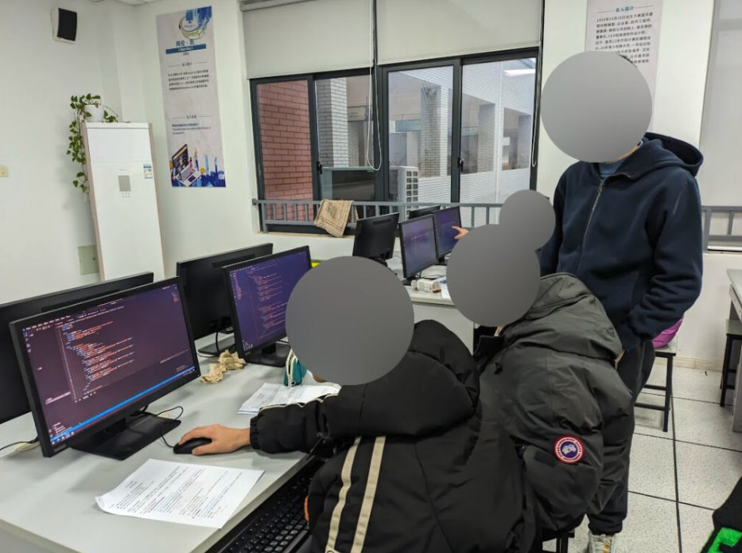

# One Year at BAID : Footsteps of Growth

_When I first heard the news that would change my life, I was overwhelmed with confusion and excitement. It felt like the world had suddenly expanded before me, filled with both promise and uncertainty._

It was around April 2023. At that time, I was in grade 8, and the school required everyone to take night classes until late to prepare for the biology and geography standardized tests. As if that isn't enough, every Friday night, some students (including me) were scheduled for a math competition class, also until very late. I had never stayed at school this late before, and it was hard to adjust. I was annoyed and frustrated. At some point, I was so annoyed that I would yell at my teacher for stepping over boundaries.

One day, during lunch break, I received the extremely exciting news that there was now an opportunity to go to BAID. My heart raced with a mix of joy and disbelief. That night, during a break in that annoying math competition class, I ran outside and called my family that night, breathless with excitement. "Guess what? I might not have to take night classes anymore!"

Looking back now, it was in that moment that I decided to pursue the international track. The reasoning was simple and clear: I didn’t want to sacrifice my entire personal life just to keep doing countless practice tests.

<figure>  
    < It's unimaginable, but night classes are the norm in Chinese schools. >  
</figure>

Then came the long and anxious wait. After an uneventful May and June, we finally received confirmation in July. I was going to BAID.

On August 31, 2023, I officially walked through the gates of BAID. Walking through the gates felt like stepping into a dream. The campus buzzed with energy, and I was filled with hope and a sense of endless possibilities. It was the first time since starting middle school that I felt truly excited about my future, but I was equally as confused about it. _I was truly naive back then._ What should I do? What results could I achieve? I felt a bit lost.

We toured the campus, took photos with the teachers, and principal Ms. Zhou and homeroom teacher Ms. Yuan introduced the teachers and courses. It was my first time eating in the school cafeteria, getting new books, meeting classmates, and attending new AP classes. Everything felt new and exciting, yet confusing.

<figure>  
    < A picture that I took on my first day of high school. >  
</figure>

* * *

A few days before school started, I saw a message from a teacher on BAID's mailing list encouraging students to start their own _student groups_. At that time, I had the idea to start my own group, but I felt it might be better to spend a year getting used to the place first before considering it.

When I told my family about this idea, however, they urged me to start a group right away, even if I wasn’t familiar with what's going on at school. Their reasoning was that international college admissions requires students to have comprehensive abilities, and starting a group would greatly enhance my overall skills.

But what kind of group should I start? I thought web development was a good idea. There were a few reasons: I had recently completed an online web development course from Harvard University and found it very interesting; and I thought that web development didn’t require much prerequisite knowledge and was relatively easy to start projects in. So, in a somewhat confused state, I applied to start a group. Fortunately, the teachers were very willing to give students a chance to practice, and I successfully passed the interview for starting a group.

> International college admissions require students to have comprehensive abilities.
> 
> My first encounter with the idea of international admissions.

The promotional event for student groups was on a cold, sunny day. My classmates and I set up a stand and handed out flyers to the students present. Before long, I encountered my first challenge: _no one showed up_.

Our group barely met the required number of members with five students, including four from my own class who came to support me (thank you all so very much). Looking back, this result wasn’t too surprising. As a newcomer, no one knew me, and my group hadn’t been proven yet. Why would anyone join just based on a poster and a flyer?

Barely managing to get a few people together, I faced another problem—the course content wasn’t engaging, and everyone seemed more interested in doing their homework instead. It seemed everyone’s time was tight, and the course didn’t appeal to them. One day, while I was teaching, I looked around and saw all of my students’ heads buried in their books and computers. It was a punch to the gut. I clenched, feeling utterly defeated.

<figure>  
    < I was trying to help our only students. >  
</figure>

That night, I collapsed on my bed, reflecting for a long while. What went wrong? I ruminated, but I couldn’t find an answer before falling asleep from exhaustion. It wasn’t until an opportunity during the winter break that I solved this puzzle.

> What went wrong?
> 
> I faced challenges, and I tried to overcome them.

* * *

Before I knew it, it was winter break! It was around this time that I met Li He.

Li He could be described in one sentence: “How is this person good at everything?” Whether in computer science, mathematics, or other science fields, he had remarkable abilities. He had achieved excellent results in various competitions, participated in numerous activities, and contributed significantly to the construction of the new school website. When I was hesitating about how to spend my winter break, he reached out to me—we could go to a middle school in [Zhoushan, Zhejiang](https://dreta.dev/2024/04/21/in-review-a-volunteering-activity/), to teach local students some computer application knowledge.

I gladly accepted the invitation and attended a pre-departure meeting the same day. However, the meeting left me somewhat worried. How much could we teach in three days? How well would the local students adapt to our teaching? What results could be achieved in such a short time? These questions made my head spin.

<figure>  
    < I was helping local students with their work. >  
</figure>

Preparing the lessons was even more grueling. I was responsible for three lessons, each an hour long, and preparing each one took me four to five hours, including preparing handouts, slides, and practice materials. I could still remember what I wrote in the notes: "THE PAIN!"

During the lesson preparation, I reflected on my previous experience with the student group and realized there were significant issues with the course design. The content was somewhat confusing, the pace was too fast, and there weren’t enough exercises.

> _At that exact moment, I felt a surge of fulfillment I had never experienced before._
> 
> It was truly unbelievable.

I tried to learn from these lessons, and it yielded unbelievable results. The local students were incredibly focused, with jaw-dropping learning abilities. All the students could complete the tasks excellently, and they achieved great results, much better than what I had expected.

Before our activities ended, the local school organized a conclusion ceremony in the auditorium. As we were about to leave, I chatted with some local students, and they said the event brought them not just the little knowledge we could teach in three days but also a sense of curiosity. _At that exact moment, I felt a surge of fulfillment I had never experienced before._ I felt like I truly made a tangible difference.

<figure>  
    < It was truly an unbelievable experience. >  
</figure>

This might have been the most fulfilling winter vacation I have ever experienced in my life. This was the first time that I started thinking about some questions I had never considered before: How do you get familiar quickly with new students? How can you break the barrier between students and teachers? How might you capture attention? Simply giving a few lessons might not fully answer these questions, but it has truly opened my eyes to the world of possibilities before me. It showed me the true power of knowledge sharing and collaboration.

> I started thinking about some questions I had never considered before.
> 
> For the first time, even.

* * *

The new semester was about to start, but I hadn’t finished my assignments. After a few days of catching up on homework, I began attending a machine learning course taught by a university professor.

On a Friday evening, we started the first class: linear models. I had the presumption that it would be very simple (stemming from the word "linear"), but reality soon proved me severely wrong. The professor mentioned using partial derivatives to find the minimum value of the loss function, but I didn’t even know what a “derivative” was. This issue became more evident in subsequent lessons: in the second class, the professor introduced representing linear models using matrices, and I had no idea what a “matrix” was. On occasion, I could understand a lesson on the first try, and I'd be ecstatic. But more often than not, I could only grasp the general concept, remaining confused about the specifics.

<figure>  
    < It was almost impossible to work on the report that we were assigned. >  
</figure>

I was greatly challenged. For a moment, I realized a harsh truth: _I knew nothing_. Sometimes, I felt extremely doubtful of myself. I had severe imposter syndrome, where, despite others around me seeming to think I was capable, I doubted myself. What should I do?

> I knew nothing, but I can learn.
> 
> A key realization.

After one class that was particularly hard to understand, I rolled around on my bed (something that I always do when I'm stressed), trying to grapple the harsh truth of my ignorance. I had an epiphany: _I can learn, and I can grow._ In that moment of realization, it felt like a light bulb had turned on in my mind. I _understood_ that my initial failure was not the end, but a crucial learning experience.

For the first time since I started high school, I had a clear academic goal, a clear understanding of what computer science entails, and what I could do. Later, through the introduction of the principal, Ms. Zhou, I communicated with our alumni, making me know better about what I could learn.

* * *

Looking back, when I first decided to come to BAID, I was indeed naive. I didn’t know what I wanted to do, didn’t know what I wanted, and had only a vague idea of my major. I was mostly driven by the desire to avoid taking night classes until nine o’clock.

A year later, I _am_ no longer naive. For the first time, I know the goals I strive for, understand my current position, clearly see what I need to do, and hear the possibilities for my future.

<figure>  
    < A year later, I am no longer naive. >  
</figure>

I have grown. During my year at BAID, I had my first time daring to start a student group in an unfamiliar environment, tackling numerous challenges along the way. During my year at BAID, I had my first time pondering questions I had never considered before and having incredible moments of enlightenment. During my year at BAID, I had my first time seeing my ignorance, knowing what I didn’t know, and understanding _how_ to know what I didn’t know.

Entering BAID was like stepping into a vast, uncharted ocean: both thrilling and terrifying. It was the best year of my life, but also the hardness year of my life. No matter how daunting the journey becomes, the belief that _"I can"_ will always carry me through.

> Each experience was a milestone towards becoming a more resilient, determined individual.
> 
> Yes, I can.

As I reflect on my year at BAID, I see not just a series of events, but a transformation from a confused eighth-grader to a determined student ready to embrace any challenge. Each experience was a milestone towards becoming a more resilient, determined individual. Yes, I can. I truly believe that as long as I am willing to work, learn, explore, and try, I will be able to face any challenges ahead, soaring to achieve my dreams. The simple reason is that I can.

_(July 1, 2024)_
