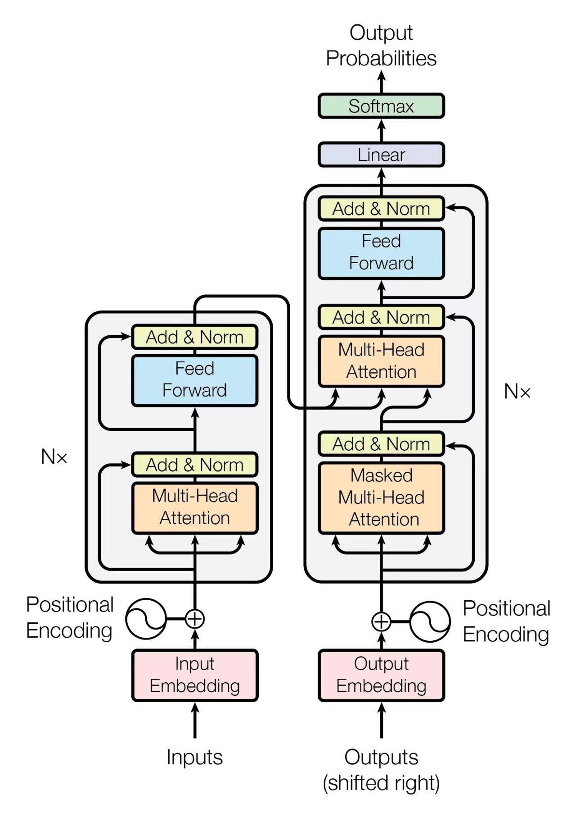
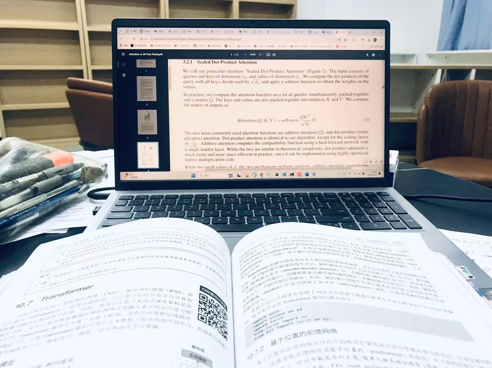
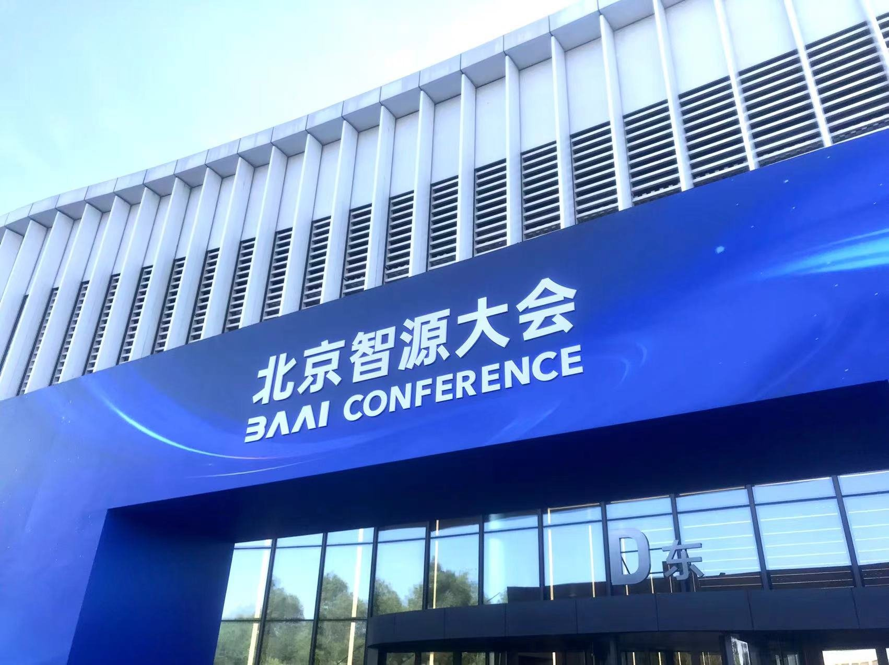

# 插上热爱的翅膀，勇敢地去飞翔——我与计算机的故事

*且视他人之疑目如盏盏鬼火,大胆地去走你的夜路。*

“左手拿着一本《机器学习》，右手抱着电脑，她飞快地穿梭在人群中，明朗的笑容和利落的短发成为她最显眼的标志。”

这是我的同学在作文中对我的描写，朴素而真实。

无论是家长、老师还是同学，提到我，一个必定绕不开的词就是“计算机”。我和计算机，似乎早已深深“绑定”在一起。

我和计算机的故事很长，但在这篇文章中，我想抛开那些复杂的技术细节，聊一聊我对计算机的感情、计算机带给我的成长以及我从计算机中看到的，更大的世界。

初次踏入计算机的世界是在五年级，我学了 Python，写了几个有趣的小游戏。

六年级的时候，抱着“做一件很酷的事情”的心态，我搭建了我的第一个个人网站，这前前后后耗费了我将近三个星期，当网站主页终于呈现出一行“hello world”的时候，那种激动的心情是难以言表的。或许也是从这个时候开始，我逐渐发现我对计算机的兴趣似乎不止于“偶尔做一件很酷的事情”。

我的第一个个人项目是在初一，入学三周后，我发现“记作业”是个让同学们困扰的问题——每一项作业都需要记录在记录本上，如果不记录就很可能会忘掉，而且没有一个统一发布所有作业的平台。

这让我产生了搭建一个统一发布作业的平台的念头，并且我很快付诸实践，从零开始自学，最终这个项目在初一的第二个月成功上线。（当然，后来也有过很多更新完善，在本文的后面部分会提到）

从那以后，一直到初二结束，我每天回到家的第一件事就是在平台上发布作业，后来我去到了新的学校，原学校的作业网站也交给了其它同学继续运营。可以说，这个网站承载着我的回忆，也记录了我在计算机这条路上最初的脚步。

初一下学期，我自学了 C++，七百页的“大部头”我在两个月里啃完了三百多页，技术栈的扩充带来的是更强的深入探索的激情。

很多人曾问过我，“你为什么会喜欢计算机？”，我总在尝试回答，却一再发现我难以给出明确而具体的原因——我对计算机的热爱似乎没有来由，我只是发现，在我面对无论是具体的代码公式，还是更宽泛的计算机科学的时候，我总是激动而喜悦。计算机让我着迷，让我愿意为之投入所有可能的时间，这种原生的热爱不断地驱动着我的生活，也极大地丰富了我的生活。

当然，梦想总有和现实“不兼容”的时候。初二下学期，我意识到可以以一种全新的方式重构整个作业网站，相当于把现有的项目结构全部推翻，重来一遍（因为新方法会带来极大的好处）。同时我希望把这个项目做成一个“发行版”，这样其它班级和学校也可以通过这样的方式发布作业。奈何，“小中考”临近，各科的难度也陡然上升，面临越来越重的学业，有限的时间和精力在迫使我做出选择——我该如何重新分配我的时间？有些事情，是不是必须被放弃？

我用实际行动表明了我的态度——学业成绩和我的项目，我不会放弃任何一个。

初二下学期，我总会在学校以最快的速度完成所有作业，那所学校的作业很多，所以这并不是个容易的事情，但我总在尽力寻找所有可能的时间。回到家之后，我会拿出将近三个小时的时间去实现我的项目。最终，所有工作完成耗时一个月（最终的成果十分令我满意！），这期间我还进行了高强度的期中考试和中考复习。

不过，事情肯定不会如想象中的那样一帆风顺，在中考前的学期每天拿出三个小时做“和考试不相关的事情”给了我不小的心理压力，把时间表安排的没有一丝空白也给我带来了不少负面的影响。在这个过程中，对自我甚至对人生价值的怀疑也常有出现，但无论如何，我从未想过“放弃计算机”。我在不断地适应、调整，尽可能地寻找到学业、热爱和正向情绪三者之间的平衡点。这段时间对我来讲是一个至关重要的阶段，它带给我蜕变，不仅仅是因为它让我学会高效利用时间或合理调解情绪，更重要的是，它让我真正看清了自己内心的追求与热情，让我意识到人生绝不是只有考试，更让我重新认识了我与世界的关系。

我想，这段经历是独特的，它在很大程度上塑造了现在的我。热爱与执着，坚韧与坚定，探索与平衡，心怀梦想而又关注现实……这些特质将会支持着我在计算机这条路上越走越远。

令人惊喜地，我有幸在初二结束后，经过层层选拔，进入到一所很好的学校，并在初三就开始高中课程的学习。

这是一所令人非常喜欢的学校，在这里我发现了新的学习方式，这让我的学习效率提高了不少，从而拥有了更多可以自主安排的时间。

初三的寒假，我开始自学机器学习，这比任何我曾经学过的知识都要复杂，其主要原因是人工智能领域涉及到许多“高深”的数学知识，类似于微积分、线性代数、统计学和概率论等等，同时许多专业文献或书籍都是英文，对我的英语能力也提出了很高的要求。

嗯，不过显然我早就做好准备了。我一直认为，最难的东西是决心，只要我有决心，这些再难也是能学下来的。

人工智能真的是一个令人着迷的领域，虽然有些算法的确很难理解，但在我经过几个小时的研究，终于理解它们的时候，我真的会惊叹于它们背后极其精妙的思想。

我开设了一个个人专栏，专门讲机器学习，现在已经写了十万多字。

课业蛮多的，但我总会找到时间去钻研那些很难又很有趣的数学，去继续写我的专栏，去继续探索这个广阔的领域……

去继续奔赴属于我的计算机世界。

当然，作为一个“未来的计算机专业（或人工智能专业）的学生”，关于计算机专业的“流言蜚语”我也听过不少。尤其是在这两年，因为 AI大模型迅猛的发展，越来越多的人开始唱衰计算机专业，说“计算机的时代结束了”“未来只会有越来越多的开发者被淘汰”……诸如此类。

我想，这些言论或许看上去有一些道理，但若深究，它们都经不起推敲，也不太具有参考价值。

在这类文章中，我看到诸多作者都在以“工业革命使得许多手工业者失业”来类比“人工智能的发展会使得开发者失业”。

的确，工业革命对许多产业的格局造成了颠覆性的影响，许多手工业者因它丢了工作。但是在工业革命之后，生产效率的提高使得人们得以从枯燥重复的“体力活”中解放出来，去从事更有创造性的、更能够凸显人独特智力的工作。工业革命淘汰了一部分只会机械化、重复性工作的人，但给予了那些拥有创新能力和探索心的人更多的机会。

我认为，人工智能的发展也是同理，随着 AI 代码能力的提高，一些只会机械地写代码而没有创新能力的开发者的确会被淘汰，但那些愿意钻研的、拥有创造力和对科技趋势洞察力的开发者们不但不会被淘汰，反而会拥有更大的平台、更好的资源和更多的机会。

所以，人工智能的飞速发展对我们而言究竟是威胁还是机会，这并不取决于人工智能，而取决于我们。

这个世界根本上还是由人主导的，人的主观能动性是我们应对这个瞬息万变的世界的最有力的武器。

与其在漫天的评论和舆论中迷失自我，不如沉下心来，去培养自己身上那些无论何时都不会被取代的能力——元认知、创造力、好奇心、洞察力……以及最根本的，对某个领域长久地热爱和对生活的热情。

“且视他人之疑目如盏盏鬼火,大胆地去走你的夜路。”

插上热爱的翅膀，勇敢地去飞翔！

共勉。