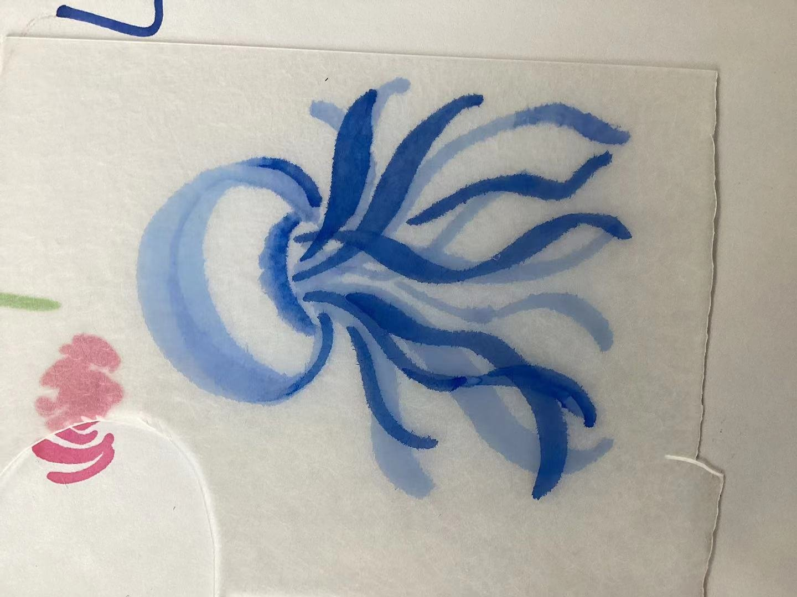

# 一年

# 学年回顾｜一年  
一年过去啦。   
在北中度过的第一年。   
2023年8月我们首次见到各位。   

   

九一班首张合照
   

这时候Jerry还没把卷发留出来  （  
九一班开学后各位逐渐熟悉，创立班群班规等。       

现在的小群
   

我们会给每个过生日的人准备生日会，大家都非常的快乐啊hh    

首次为寿星在班内过生日（Patricia）

   

刚来国际部，各位欢乐且充满信心与希望。 
激情之余，我们学习上也体验到了新的科目和挑战：AP微观经济与pre-AP微积分 

     

 神书巴朗 
    微观经济学是我们从未学习过的科目，而我们面临的挑战还不止如此，还有托福标化考试在路上等着我们。 
虽然挑战挺多的但是学习还是给我们了很多活动的时间。比如露营，成都阅历课程等等。   

露营时的快乐时光
   

          

 阅历时的快乐时光 
   
成都是个好地方啊真的  
还是蛮快乐的hhh  
首次期末考试也到来了，我们第一次体验了国际部的期末考试，每个人都在担心GPA的事，无暇玩乐。     

小花猫（我的紫米粥啊啊啊你咋跑了😭）
   

考试结束，自由啦。我们还剩余了一周的学校时间，而我们在这一周有三个选项：北京文化探究，景德镇文化探究和电影文化探究。 
我和几位同学选择了景德镇文化探究（毕竟是陶艺课的hh）   

当时还碰见101石油分校的了
   
官微：北京中学国际部英才培养系列之“创新实践营”——景德镇陶瓷艺术探究活动  
其他同学选择的便是其他两项，也产出了很多美妙的宣传海报以及调查报告。 

——————————————学 期 分 割 线——————————————

第二学期到来，AP大考提上日程。  

各位同学也去参加了各式各样的活动。  

Happy NEC
   
不过，第二学期仍有快乐的活动：328春游  
北中传统，十分快乐，樱花好看让我们想起了霓虹国的某些樱花🌸（bushi  

 

328赏樱花
   

数天过后，我们迎来一次不告而别。 
我们在AP考前甚至有一次团建，男生种树，女生种花。 
随即便是AP考试，紧张刺激。  
AP结束后，我们的主要任务便是标化，还有保住GPA。但是相较于前段时间较轻松。 
  

三咖啡演义
   这个学期我们还经历过狂风大雨。  
陶艺课正式开展了捏泥人的快乐课程，我们在课上发挥自己的创意，创造各式各样的任务。 
 

创意
   
强化化学课程进入有机化学，我们在课上搭建球棍模型，老师讲课也幽默有趣。 
 

神一样の分子 
   各个学科开展学科周活动，让同学们在快乐中体验学科知识的魅力。 
有生物学科周的制作热缩片：  

某位天才の神作 
   有化学学科周的科学实验展示：   

铝热反应留下的坑 
   有史地政学科周的拼图活动：  

多人共同完成的超难拼图！！！（
   
 又是一学期的期末。 
我们还举办了戏剧节，我们班上演了大型青春校园喜剧Hug Me，由伟大的安导和高导创编，迎来一阵好评。  这学期差不多到此也结束了。 
回顾这一年，我们从懵懂的初中生成长为高中生，学到了很多新知识，得到了很多新的成长。 
这一年虽然有道别，但是也有新的朋友与我们认识结交。 
AP考试与标化没将我们打倒，那我们更要挑战我们的潜力，达到更高的地方，学的更多，看的更远。 
九月份我们就要变成十一班啦，会遇见更多的人，学到更多的知识。 
愿九一班四年不见不散  
九年一班，非同一般！ 
