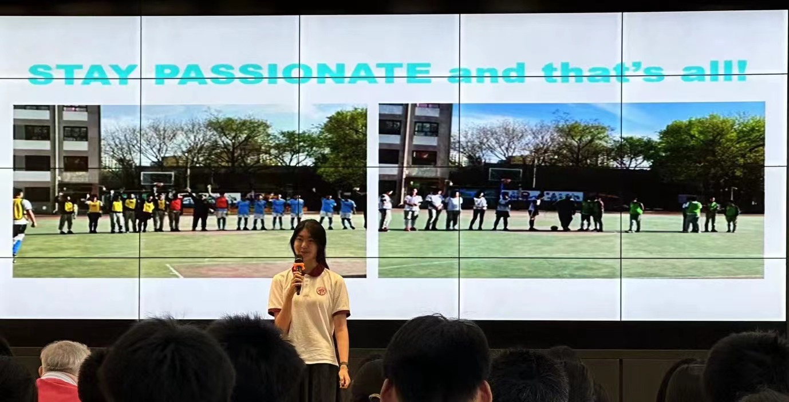
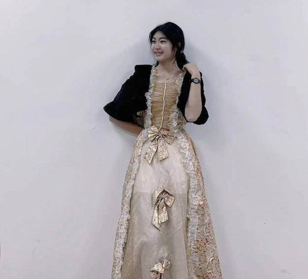

# syk学年总结 

*阳光正灿烂，大胆的走你的路就好了！*

来国际部的第一年，是我在北京中学的第四年。这一年我经历了许多，而这些经历伴我成长。平心而论，去年九月刚来到国际部我心中是有一丝丝优越感的。作为从西坝河升上来的学生，我已经比大多数班里同学多学了一年内容，有更加扎实的学科基础，而去年我们备考模拟中考的过程中我也是越战越勇，逐渐找到了考试的技巧和感觉，最终的中考分数其实并不亚于任何其他国际部高一的学生。我进入国际部的第一个月就以最高得分被评选为“创新创造”主题的校级月度人物。而我在入学来第一次期中考试中也取得了相当不错的成绩。但是越到后来，我其实发现在任何一个地方成为那个最顶尖的学生绝对没有我想象的那么容易。在我与更多人更加熟悉的情况下，我更加体会到每名同学都有他们各自的闪光点，他们都有值得我学习的地方，而在国际部这个环境下，我们注重的应该绝不仅仅只是学术成绩，所谓的全方位人才、六边形战士才是我们追求的终极目标。

我也总结了我之所以能够在第一月的月度人物评选中获得最高分，并且在后来的年度人物中取得较高的评价，其实都是因为我体现了自己发展的全面和多元。这里分享一些就我自己的经验积累的小技巧，在准备月度人物、年度人物答辩的ppt前，我们一定要关注评委评分标准，如月度人物会围绕校内学科学习、校内活动、校外活动和其他展开，而年度人物会围绕同学们仁、智、勇、乐和综合评价多重维度进行评分，我们在介绍自己的时候一定要兼顾每个维度，尽可能展示自己的优势，这也是一种“争取所有采分点”的方式。我注意过很多在一个方面能力特别强、单项才艺特别突出的同学，但他们一般都会只针对这一个维度讲述，这就导致他们缺乏了对于自己的综合评价，漏掉了很多“采分点”，所以评委们在打分时，这些同学们也很难扩大自己的优势。

作为我学年的总结，我也希望能够围绕月度人物、年度人物的评分维度来展开，我也很赞同学校对于学生能力评价的这几个标准。像我在前文所说，只有学术成就（年级排名、班级排名等）远远不够，校内活动同样重要。

**仁：**
>我一入学就申请加入学委会活动部，每次都会认真完成任务，与部长和其他部员积极沟通，也和另一名同学自主筹备了一个集市活动，完成了活动策划的撰写；作为班级的生日委员，认真筹备每一次生日会（见[Mc.Rojigally-Pros别具一格的生日会](https://xyyuan.fun/mc/2024-07-08-birthday/)）

**智：**
>积极参与校内学科周活动，在化学学科周化学知识竞赛活动中和队伍一起荣获了第一名；加入同班同学的web开发社团，帮助学生公司的咖啡馆制作线上自助购买网页。

**勇：**
>我连续四年参加北中杯足球赛，今年也作为唯一上场的女将，争取助攻的机会，和同学们一起争夺了校内第三名；参加北中篮球赛，为班级女篮贡献自己的力量，班级荣获第四名的成绩。参加北京中学运动会，荣获九年级女子跳高第一名。

**乐：**
>在新年联欢活动中和好朋友们一起上台唱歌，参与drama class的《卖火柴的小女孩》演出；参加学校“X无限可能”演讲比赛活动，讲述自己坚持足球这项热爱、直面身边的性别歧视，到现在学习计算机、为性别平等注入力量的故事，夺得全校第一，荣获Public Speaker of the Year称号和Best Creativity Award；成功进入北中好声音复赛，演唱《We don’t talk anymore》；参演班级《Hug Me》和drama class《They Eat Sunshine Not Zebras》两部英文戏剧。

其中，当时学校有幸在我们演讲比赛前请到了一位专业演讲大师来给我们上一天的演讲训练营活动，让我受益匪浅，我也真心感受到了具备良好的演讲能力的必要性。从演讲稿的精心修改到上台演讲时临场准备技巧，从老生常谈的仪容仪表、眼神交流，到语音语调、肢体语言、舞台站位、观众互动等等，携带着那天得到的知识，我也希望能够将其分享给更多人，而这也将作为我暑期在江西支教活动的重点主题。其实在上台之前，甚至是下台之后，我从未想到我能够荣获Public Speaker of the Year的称号，但是当越来越多的人对我的演讲和演讲内容表示认可、当颁奖时读到了我的名字时，我在惊喜之余也着实感受到了原来讲述自己以前难以启齿的故事和有些屈辱的经历竟然能给他人带来巨大的力量。与我从小坚持踢足球的独特经历有关，我一直对于性别平等话题有着自己的见解，种种困难和挫折不断将我击垮，但是热爱的力量支持我们在坚定地走着属于自己的路。而演讲训练也帮助我更有感情和感染力地将自己的这个故事讲述出来，得到了其他人的一致认可，大大增强了我的自信心。

 

校外活动我也没少参加，第一个学期就参加了许多学术知识竞赛，加上4门AP课程学习与备考，忙得不可开交。可能在很多同学眼中我这一年非常成功非常顺利，但其实并非如此，任何人都有跌倒的时候，我们要想获得很好的荣誉也都要走很长一段上坡路。缺乏经验的我就在这条路上摔了好多跟头，比赛的失利和准备不足总是让我压力巨大、悲痛欲绝，但是现在我能够直面那些挫败的经历，从不足中吸取和积累经验，相信以后会越来越好。其实**跌倒不是失败的代名词**，一切经历都是成长，每件事做了都不会是徒劳的。我去年开学后就按照计划参加了CSP-J/S，作为与我专业计算机最最相关的学术奥赛，我也准备了很长时间，这也是我第一年参加。我顺利的以高分通过初赛后来到了复赛现场，但是由于过度紧张和电脑操作、文件保存路径失误，我遭遇了所有计算机竞赛生最担心最恐惧的“爆零”事件，当时一出考场就崩溃了，身边人也都不断安慰我。所以比赛后的复盘是至关重要的，我也明白了自己“爆零”的原因，积累了经验，在寒假和暑假集中训练信息奥赛题型，争取明年比赛时能够顺利一些，发挥出自己最好的水平。我寒假时也连着参加了USACO美国信息奥赛的月赛、BPC商赛和NAQT学术知识碗活动，但是最终其实都没有得到十分理想的成绩。我也意识到其实一开始报名这种竞赛时一定要有针对性，因为人的精力都是有限的，这么多竞赛活动叠加在一起我自然没有时间和精力分配给每一个，这样三心二意的，最终自然也无法在任何一个比赛中发挥出最好的水平，我们一定要学会取舍。第二学期我也找到了在校外活动上的感觉，第一次作为队长参加IMMC数学建模大赛就分别荣获了中华赛和国际赛的特等入围奖，还被邀请至香港进行线下答辩，虽然仍有不足之处，但是我也相信我也始终走在正轨上。我争取到了NeoScholar游戏设计与计算机算法交叉学科的线下科研机会，以A+的成绩得到一定的奖学金，自学了芯片和电路设计；同时我也争取了耶鲁北京中心“同在蓝天下”Building Bridges支教活动的机会，通过了面试，暑假将与各大高校的大学生一起在江西省重点中学进行支教……

其实**阳光正灿烂！大胆的走你的路就好了**以上就是我这一年比较“简短”的总结了。我这一年在苦乐交织中不断前进，更全面的认识了我自己，交到了很多非常好的朋友，也更好地融入这个班集体。希望往后的时间里我们都会越变越好，在自己的道路上闪闪发光！

 