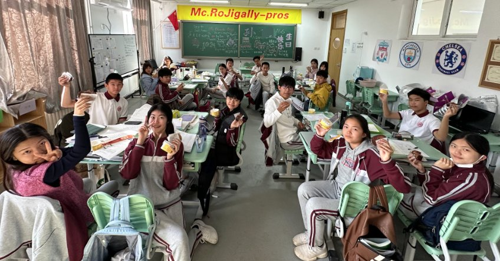
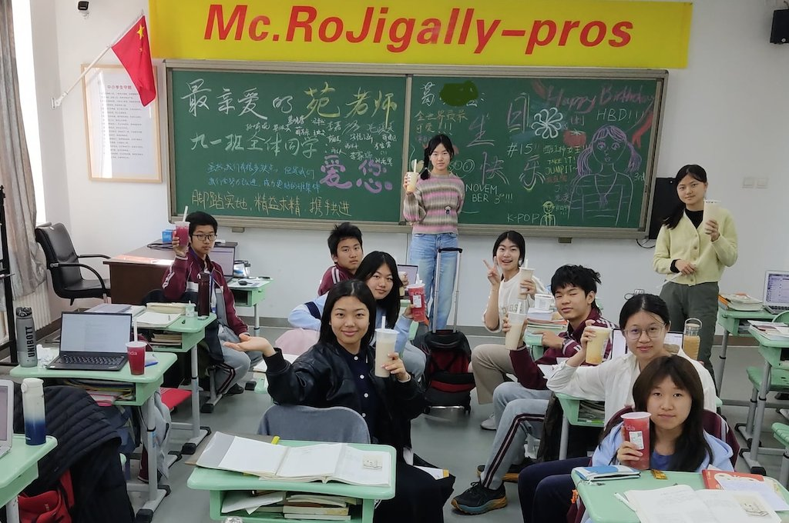

# Mc.Rojigally-Pros别具一格的生日会

*我经常幻想着等到我们毕业了，对比每次生日板报更新的有趣的内容，脑海里重现当时班里流行的“热梗”，那将会是一件多么幸福的事情。*

**syk说:**
>我在北京中学西坝河校区的时候，我们班就有个温暖人心的“传统”——为每名同学都举办一场充满惊喜的生日会，不留遗憾。渴望着延续“传统”的我从去年一开学就挑起了生日委员的大梁。我认为在同学过生日时为他们准备惊喜是一件极其能够增强班级凝聚力的事情，再加上我们生日委员负责着为同学们准备一些蛋糕或饮料、布置个性化且精美的板报，大家中午在班里欢乐的汇聚在一起拍张合照，实在是非常有纪念意义。我经常幻想着等到我们毕业了，如果将三四张自己和同学们在一起的生日合照拼成一张图，看着大家的样貌和气质从懵懂走向成熟，对比每次板报更新的有趣的内容，脑海里重现当时班里流行的“热梗”，那将会是一件多么幸福的事情。所以我和另一名生日委员不错过每名同学的生日，一起认真负责地提前筹备生日会所需购买的甜点或饮品，事先调查同学们过生日对于蛋糕口味的偏好，再与财务委员沟通开销情况。每次有同学过生日的中午，我们也会叫上几名热心的同学留下来一起布置与装饰板报，大家都牺牲了自己吃饭的时间而为这个集体付出着；再派几名同学“拖住”寿星让他/她晚点回班，更加充分地准备黑板上的内容。

**syk说:**
>令我印象深刻的是当我去年过生日时，我其实并没有想到其他同学会为我准备什么，而我也提前协商好了我那天会带几个达美乐比萨分给大家吃。出乎我意料的是，我们班的另一位生日委员还额外点了一些奶茶和果茶，而我吃完饭回班后也惊喜的看到了其他同学一起组织着绘制的生日板报。这种被其他人关心和祝福的感受原来是这样美好，也希望我能通过我这个职务将这份美好传递下去。

---

2023.9.5

Patricia的生日是我们举行的第一次生日仪式。当时我们刚入学，对彼此还没有很熟悉，却早早做好了准备，打算给她一个惊喜。还记得同学们兵分两队，有我在内的一部分同学负责引她到教室外的其他地方去，而另一部分同学则留在班内准备板报和蛋糕。再次走进教室门的那一瞬间所有同学都齐声喊出生日快乐，板报也写上了我们最真诚的祝福：AP全5。刚刚相识五天的我们格外的团结，这也是我第一次感受到咱们这个班集体的温暖。

---

2023.10.7

国庆假期后迎来了第二位同学--Lin的生日。此时的同学们已经相处了一个月的时间，对于彼此也渐渐熟悉了起来。于是在常规的板报设计上又加入了许多个性化的元素：比如Lin标志性的口头禅riiiight和stop it。生日仪式的氛围也变得更加欢乐了起来。

---

2023.10.9

紧随其后的是Clara的生日。板报上写下了“跳舞最美”，“雅思9分”等真诚的祝福，和有着五彩头发的小人像。蛋糕也一改传统的纸杯蛋糕，由生日委员Sophia定了大家都喜欢的冰淇淋蛋糕。每一次的细小变化都让这个仪式变得独一无二，独属于当天的寿星。

---

2023.10.15

Alisen的生日在周末，于是我们将仪式的时间挪到了随后的那个周一。尽管15日当天所有同学都在班级群里送上了祝福，但线下和大家一起过一次生日的意义是格外重大的。精心制作的板报、特殊的蛋糕、全班一起唱生日歌，我想每个人都会被这样的氛围感动。

---

2023.10.24

十月的最后一位寿星是Jerry。作为“pop culture nerd”，他的板报元素十分丰富。我认为每一次的板报最特别之处就在于此，哪怕没有写上名字，我们也能一眼看出来：哦，这是xxx的生日。Jerry还特地带来了酸奶和蛋糕和大家分享，省去了生日委员的准备工作，感谢。

---

2023.11.3

进入11月，第一位过生日的同学是Olivia。这次生日令我印象十分深刻，由于前段时间班内的纪律一直不是很好，总有违纪情况出现，我们打算利用这个生日向班主任苑老师道个歉。于是在画生日板报的时候我们留了半边黑板，所有同学都在上面签名表示会改正所有的不足，不再让老师们担心。尽管生日当天苑老师不在，我们还是按照惯例拍了合照发到了班群。这次经历让我触动很多，深深感受到整个班集体的团结和温馨。

---

2023.11.15

迎来了我们最辛苦的生日委员Sophia的生日。一直以来每位同学的板报、蛋糕或奶茶都是她一手操办的，超辛苦，很伟大。所以这一次什么都不用她再亲自上阵，从板报到奶茶全都由另一位生日委员Yoyo和其他同学承办，也算是放了一次假。特别特别好，这也是我们班在2023年过的最后一个生日。

---

2024.1.8

赶在假期前给Grace过了生日。还记得在瓜分蛋糕前她发表了一段感想，具体内容记不太清了，只记得很有领导气概，听着也很感动。本次生日的特邀嘉宾是猫猫紫米粥同学，拉着一起拍合照了。

---

2024.3.18

开学后的第一个生日是Malina的。她的板报肯定有白鲸咖啡馆、阳光姐等各种元素。以往其他同学生日板报上最灵魂最抽象最可爱的小人一定都是她画的，不过自己的生日可就画不上了嘻嘻。到了下半学期班上的每个人都成为了彼此的好朋友，所以板报上经常出现各种有趣的整蛊。不过所有的玩笑都必须经过本人同意才行。

---

2024.3.26

一周之后是Molly的生日。印象最深的当属她定制的超大蛋糕，十分巨大，上有帅哥两位。蛋糕消灭起来有些困难，于是叫上了除了我们班外的很多同学，大家一起分享了这份甜蜜。

---

2024.4.23

世界读书日也是Luna的生日。大家都不约而同地在板报上画上了很多鸟儿，虽然叫不出他们的学名，但Luna爱鸟是大家都有目共睹的。生日板报最打动人的地方在于每个人都可以参与绘制，每个人都可以根据自己对这位同学的了解画上ta喜欢的东西。所以当寿星们看到满黑板的自己喜欢的东西，一定是无比幸福的。

---

2024.5.8

我的生日，每一位画板报的同学非常感谢，下次别画了（划掉）

---

以上是我们举办的生日仪式的小记录。这一年里18位同学一共举办了12次。其他一些同学生日处于寒假或暑假里，同学们无法线下相聚，但都会在班级群里送上最诚挚的祝福。还有一些同学选择不举行，我们也尊重每一位同学的选择。
看着照片对着日历回顾这一年里每一次同学们聚在一起唱生日歌的情景，从一开始的生疏陌生到后来的打成一片，随着年龄不断增长的是我们彼此之间强有力的纽带。希望未来还能将这一传统延续下去。

Audrey

2024.7.8

---

**syk说:**

>班主任的生日必定是重中之重，我很早就开始规划到底以什么形式能够送上一份别具一格的礼物。其实我原先想的是毕竟是我们第一次为班主任过生日嘛，所有人都假装不知道有这件事，假装大家都不记得她的生日，悄悄问另一位老师以确定苑老师生日的日期，到当天给她来个真正巨大的惊喜。期望是好的，但可惜“地下工作”做到一半风声还是透露了，老师们似乎都知道我们在为班主任的生日制作惊喜。无论如何，还是先按计划行事。我提前在网上购买好折叠本和丙烯笔，像是运行一个地下组织一样，只要趁着苑老师不在班里我们就开始“搞事情”。我先装饰好封面和折叠本中的前几页并做好示范后，就开始给同学们传着去写祝福语，嘱托他们一定要小心再小心。但无论如何最终效果依然十分振奋人心：我们每名同学负责折叠本中的一页纸，大大的写上“苑老师生日快乐”以及自己的名字，每页都装饰的五颜六色的；当折叠本散落开来时足足有十几米，就像是同学们手拉着手一起庆祝这特殊的日子，用爱将苑老师包裹着。终于到了苑老师生日那天，收到惊喜的她热泪盈眶，看着她幸福洋溢着的笑容，我无比开心，我想这就是做生日委员的意义。

