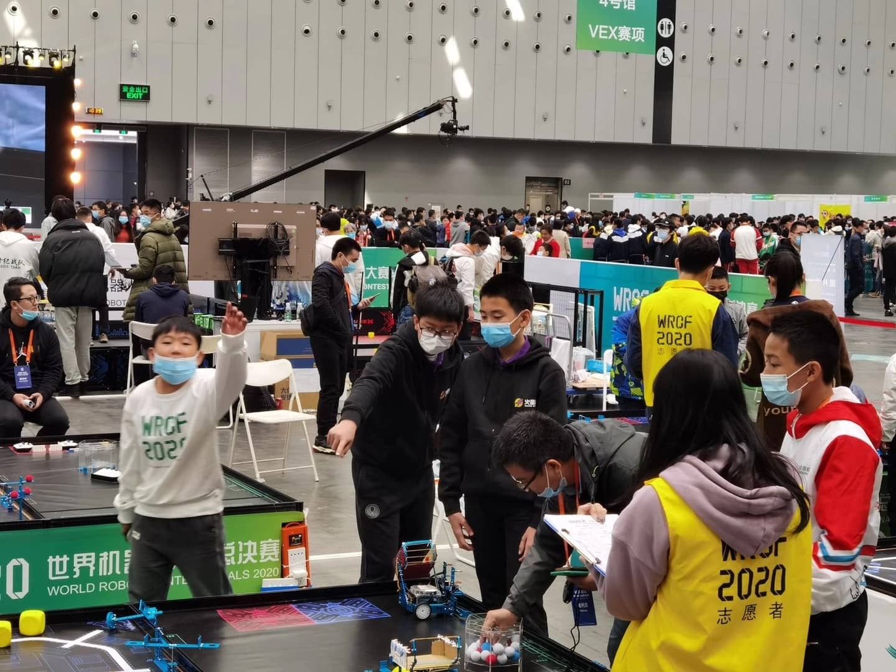
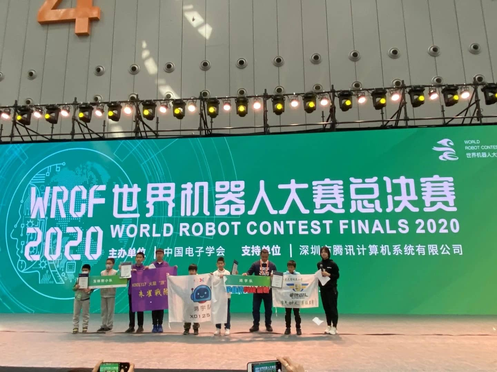
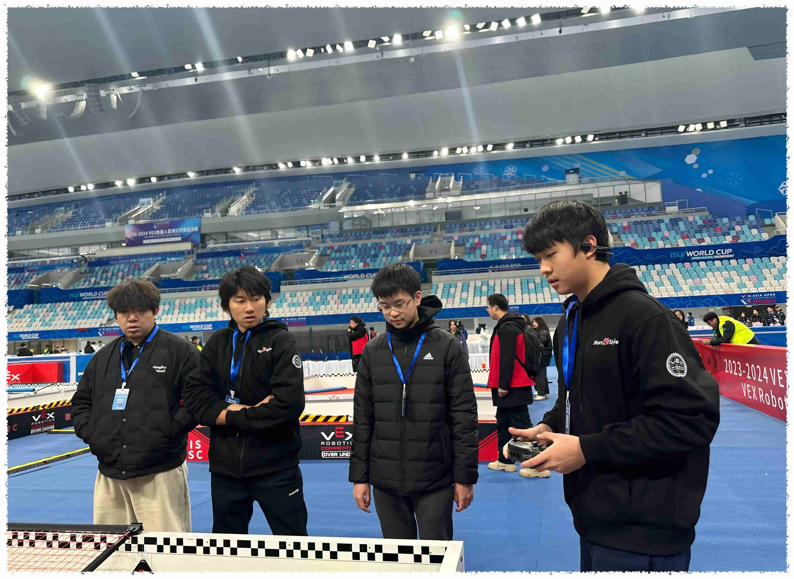
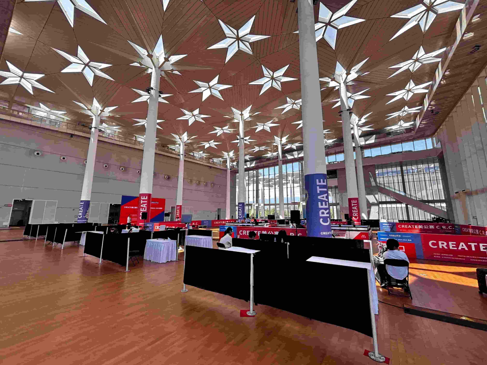
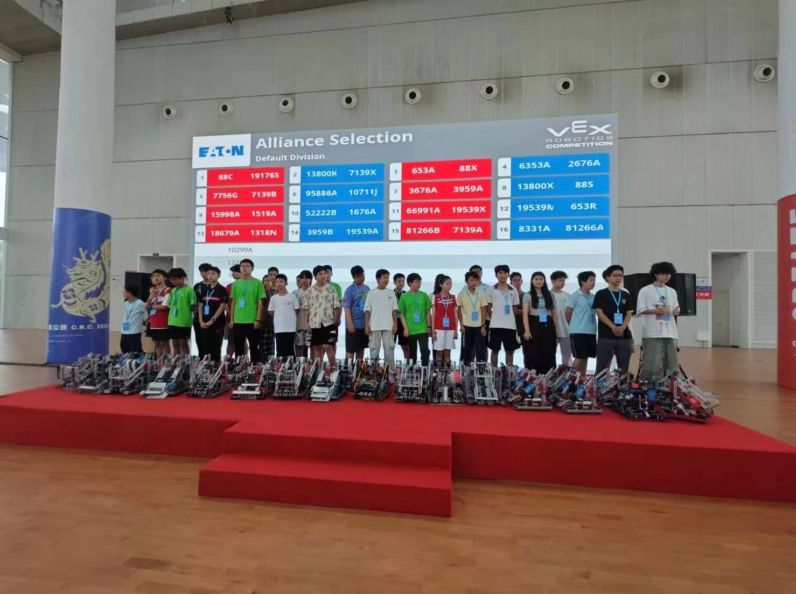
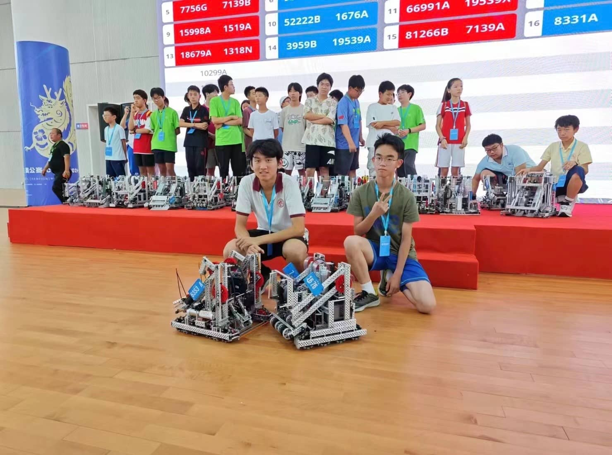
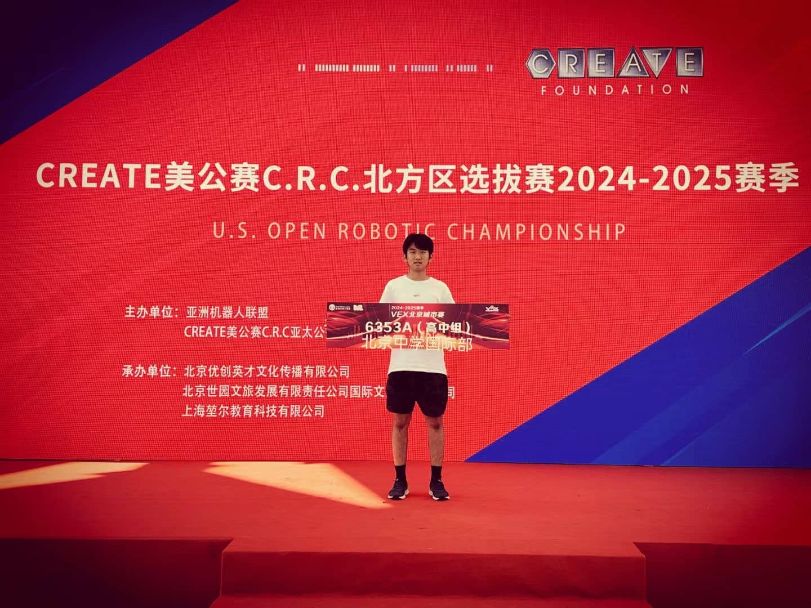

# Changing Expectations

*Remember, always maintain your passion for your inner yearning and devote time to it.*

## Vex 2024-2025 Create America Open Beijing Trials  

Robots have always been my passion since I was a child. I started building Lego when I was 5-6 years old and was attracted by the beautiful large objects made up of small parts. Then, as I grew older, I explored the field of robotics more deeply in elementary and middle school, and participated in competitions such as ROBORAVE, Botball, Robot Challenge, MakeX, etc., and achieved quite good results.  

However, in the last two years of junior high school, under the pressure of the Chinese education environment, I gradually became frivolous and somewhat lost, and I briefly gave up studying robotics (I have always regretted this rash behavior to this day). 

Fortunately, when I stepped in high school, I picked up my love and persistence for robots again. After failing to carry out the FRC (First Robotic Competition) project (due to the high requirements for funds and personnel, the project was difficult to progress in school), I tried the VRC (Vex Robotic Competition) from the end of 2023 to the beginning of 2024, and participated in the "2023-2024 VEX Robot Asia Open Finals-VRC Middle School Group" held at the Beijing National Speed ​​Skating Oval. Since this was my first time to participate in a VEX competition, my lack of experience led to some fatal mistakes, and the rush of time made me not have a long time to train, resulting in only winning the first prize and not entering the knockout of the 16 teams, which is a small regret. 

After the 2023-2024 Vex World Championships, the ***High Stake*** competition for this season was released. It is obvious that this year's on-field play is much more difficult than last year's competition, and it really tests the operator's intuition. For the Beijing City Tournament on July 15-17, as the second game in my life (the first game I participated in as an individual with the school's team number), due to other arrangements, there was actually no time for preperation. The initial goal was to experience the on-field situation of this season. A training camp was held a week before the game to quickly familiarize myself with the rules, build the robot, and master the operation techniques.  

<small>It is worth noting that, unlike the last competition at the National Speed ​​Skating Oval, this time I represented my school in the competition (using the team number 6353 applied for on behalf of the BAID), which made the invisible mission on my shoulders even heavier.</small>  

On the afternoon of July 15, we arrived in Yanqing. The accommodation conditions and environment of the hotel were unexpectedly very comfortable. The first night was a bit boring because there was no game table. What touched me more was the tension in my heart as I kept thinking about various problems. At the same time, seeing my classmates playing and traveling happily in various places aggravated my depression. I lay down early, but the tension and worry in my heart kept me awake for a long time. After all, I heard that some strong teams participated in this competition and it was at the beginning of the season, I held some doubts about my robot and the program I wrote and my operation.  

I got up early the next day. The tension and anxiety seemed to be caused by being too tired last night. Now after resting, I have eased a lot. After completing the final comprehensive inspection of the robot, I followed my teammates and coaches into the venue.  

Compared with the National Speed ​​Skating Stadium in the city, the venue for this event is much smaller, making it more crowded. The preparation time seemed to pass by in an instant, as if I had fast-forwarded to my first game. Fortunately, the first game went very smoothly. Compared with the training in the base a few days ago, the intensity of this game was not worth mentioning, which also dispelled some of my nervousness. But with the experience of various previous competitions, I knew that I couldn't let my guard down. In addition, the two opponents in the second game were strong teams under strong organizations, and my teammates seemed to have not even yet mastered the functions of the robot (since it was the first game of the season, such situations were quite common). In the automatic stage of the second game, my program ran "exploded", resulting in the the opponent’s ring occupied my top ring. This mistake allowed the opponent to win the automatic stage. (ps: In this season, the 6 points in the automatic stage are crucial, basically directly guiding the direction of the game.) After confirming the score, I didn't know whether to laugh or cry about this mistake. Under the gaze of the audience on the sidelines, I was full of embarrassment. With this emotion and simple adjustments, I entered the manual stage. I performed well in the manual stage this time, but my teammates did nothing in 1 minute and 45 seconds, which led to us losing the second round.  

I regretted it very much, because the record of 1-1 was a relatively low ranking. If I continued with this ranking, I might not even get a spot in the regional competition, let alone the spot in the US Open that only belongs to the champion. Fortunately, I was still quite confident at some times, and my mentality was generally stable and would not fluctuate too much. I took every step down to earth, steadily, won the next 3 games, with a record of 4-1. However, due to my relatively low AWP, I stayed in 9th place. Although I had already obtained a spot in the regional competition, my expectations became higher. I definitely hope that I can do better, or in other words, **the best**. In the last round of the regular season, I faced a joint team composed of the Experimental High School Affiliated to Beijing Normal University and another institution. I worked hard to win this game with another dimension of mission belonging to BAID. This game was extremely tense. Compared with the previous performance, the team affiliated to the Experimental High School of Beijing Normal University obviously broke out, took out 200% of their energy, and performed extremely well. But in the end, with the clever cooperation between me and my teammates and a controversial penalty (the controversy here means that the other party did not think that some of our rings were eligible, but the referees counted the points for us after checking the rules together. This time the dispute even broke out into a small conflict, which attracted the chief referee and the chief referee to participate in the judgment), we won the last round of the regular season with a difference of 4 points, bringing the record to 5-1 and ranking 6th.  

The selection of the team was really full of intrigue and deception. In order to make their team form a team with better teammates, each institution and organization used all kinds of means, with lies and truths mixed together. Skipping the tedious and dark process in the middle, my team 6535A and 2676A of an institution formed the 4th team.  

<small> NOTE: Originally, there was a chance to form a team with the 88C which hadn’t lose a game in the regular season, but unfortunately 88C finally chose the team of Beijing Normal University Experimental High School, and the gears of fate began to turn again. </small>  

In order to prepare for the third day of the rematch, this time we couldn't be as debauched and bored as the first night. At night, we crowded with the league's organization in the venue built in their hotel house to debug the automatic program and discuss tactics. Since there is no need to pursue AWP in the rematch, in order to get more points, the automatic program will adjust to a more "score-scoring" method and route and save redundant steps for competing for AWP. The automatic program was debugged until 10pm. We then discussed some tactics and confirmed our left and right side distribution for the knockout. Then my teammates went back to sleep, and my coach and I went back to our room to watch the replay of the day's game over and over again, reviewing the aspects that could be done better. After a careful review, I was obviously very haggard after a day of hard work and was extremely eager for sleep, but more importantly, I needed to repair another machine with my coach. In this way, the time came to 12am, and I finally went back to sleep.  

On the last day of the knockout, the teams were eliminated from the top 16 all the way to the finals. In the finals, there were 2 wins in 3 games, and the remaining games were decided in 1 game. In the first two rounds, the opponent alliances we encountered were all ranked lower (because we were ranked higher), so we won the game relatively easily and entered the top 4. In the semi-finals our team met the top 1 team. Before the game started, neither the coach nor ourselves thought that this game could end without losing. Sure enough, in the automatic stage, just as we thought, 88C's automatic scoring ability was too strong, and our team lost the automatic without any suspense. Perhaps with an attitude of resignation, the manual stage of the game started. As usual, I should clamp the base and then collect rings steadily, and quickly occupy the addition area to try to win, but at the beginning, I was too nervous and could not clamp the base at the correct angle for some reason, so that having trouble collecting my score rings. I became more and more nervous, and I even pushed the base up, making it completely impossible for me to clamp it. With extreme annoyance and even some anger, I tried my best to make more use of my advantage (undoubtedly the fastest and most accurate ability to put rings on wall stake in the game) and changed my mind to defense. I started to annoy the opposing vehicle, knocking down the pile of rings collected by the opponent, and every time the opponent seized the top ring of the wall stake, I would instantly hang my own ring to get a higher score. My teammates also played well in this game. In the end, we overwhelmed the first team together. We mastered the rhythm of the game, played to our own advantages, and won in a way that no team in the field expected. Under the surprise of everyone in the audience, my teammates and I roared passionately to vent our inner emotions, and we defeated the first team just like that.  

But the finals were not satisfactory, as our opponent was a relatively weak team. We won the first game smoothly, but in the second game, the opponent's defense and our own misjudgment made us lose the game by 1 point. Moreover, due to the huge off-court forces of the two opposing teams, the momentum that was like their home court made me gradually lose my feeling, and finally lost the game in the third game due to a bad premonition.  

Of course there are regrets, but from another perspective it seems to be much better than my initial expectations. It’s a pity that I didn’t win the championship by 1 point in the second competition. This statement has made me very happy and confident. But the most important thing is to prove yourself, just like the Shōhoku High School in Slam Dunk, being able to beat the strongest team is already a manifestation of strength. Expectations should not be set too high, which will bring more disappointment. At least I believe that I have left my own impression in this VEX circle. In the future, I will work harder to promote the development of the VEX project in BAID. After all, it is just the beginning of the BAID Vex team and the beginning of the season. Everything seems full of hope and vitality.  

Another thing that touched me during this event was the change in expectations. Looking back on my own journey, it seemed that my goal at the beginning was to win a spot in the regional competition and accumulate experience, but as the competition progressed, I discovered more possibilities for myself, and I began to expect higher goals and achievements, which may be beneficial or unrealistic, but expectations have indeed changed, and looking towards higher goals may bring me more disappointment, but isn’t it always like this for people? Become a daydreamer with a certain degree of action, and the curiosity and yearning for the future seem to really drive us to climb higher and farther peaks.  

> The future belongs to those who **believe in the beauty of their dreams.**
> —- Eleanor Roosevelt

Finally, if you are interested in working together to expand the Beijing Middle School VEX project, you can add my contact information. Remember, always maintain your passion for your inner yearning and devote time to it.

