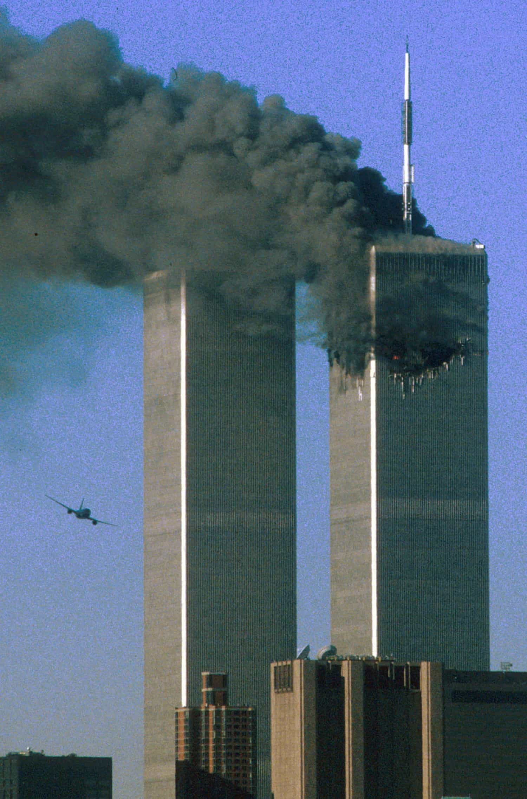

# NO DAY SHALL ERASE YOU FROM THE MEMORY OF TIME

*RIP for all the innocent people who lost their precious life in this terrible incident.*

September 11, 2001, the day that changed the course of human history. 
It was 8:30 in the morning in Manhattan, New York. It was a sunny morning with a clear blue sky and no clouds. The dazzling morning sun shone on several magnificent buildings in the south of Manhattan, including the World Trade Center. In the past decade of economic globalization and the opening of emerging markets, the US economy has been unprecedentedly prosperous. Although the bursting of the Internet bubble brought short-term economic fluctuations, the information technology revolution has greatly promoted productivity growth, and the development of the technology industry has been reflected in the financial market. Investors are optimistic about the future. The Nasdaq index rose rapidly in the late 1990s, driving the vitality of the entire financial market. Wall Street's investment banks, hedge funds and venture capital companies have flocked to the technology industry, seeking to get a share of this high-growth field. The financial industry as a whole has benefited from the acceleration of globalization and the strong performance of the US economy. A large amount of capital has poured into the market, and corporate IPOs have emerged one after another... Wall Street symbolizes the center of the global capital market, and it is still brightly lit, full of opportunities and wealth. This day seemed to be just like any other day. Employees from Moody's, the U.S. General Services Administration, U.S. Customs and other companies and institutions walked into the North Tower of the World Trade Center with smiles on their faces, optimistically welcoming the arrival of a new day. 

The two giant towers of the World Trade Center next to Wall Street have been the spiritual symbol of the rapid development of the United States in all aspects of economy and technology since April 4, 1973. As two remarkable industrial marvels, one record after another defines the limits of human engineering. The Second Tower, which has stood for nearly 30 years, remains as majestic as ever, and everything seems to be no different from normal. Meanwhile, American Airlines Flight 11, scheduled to fly to Los Angeles International Airport, took off from Boston's Logan International Airport. 

---

At 8:46 in the morning, the whole world turned upside down. Inside the North Tower, the coffee on the table had not yet been brewed. Suddenly, there was a loud bang in the building, and it began to shake violently. Smoke rose rapidly, and the fire alarm sounded. Before everyone could react to what was happening, they began to run downstairs. People gradually recovered from their shock and confusion. Yes, something that seemed impossible and even sounded absurd really happened: a plane crashed into the North Tower. The mechanical floors of the North Tower of the World Trade Center, floors 93-99, were completely destroyed. From the surface, a deep pit appeared on the wall. The almost full fuel tank of the aircraft caused a raging fire in the floor. The observation floors above the 99th floor were not open yet, and no tourists flocked in, but the service staff here had fallen into despair. The fire showed no signs of stopping. In the countdown to the glorious life that had just begun, they were overwhelmed by fear and had no other choice. When the firefighters rushed to the scene, they could hear the sound of heavy objects hitting the ground one after another. At that time, they thought it was the sound of rescue equipment being activated. 
At 9:03 in the morning, in the midst of shock and confusion that people still thought it was an accident, United Airlines Flight 175 crashed directly into the South Tower of the World Trade Center. Floors 78-84, where Fuji Bank was located, were instantly destroyed. Suddenly, the entire Manhattan sky was covered with smoke. The term "terrorist attack" was forced to appear in people's minds, and the word "accident" alone was no longer enough to deal with this incident. Panic and astonishment covered the entire Manhattan. All TV channels interrupted the broadcast of emergency news, and the city's fire trucks, ambulances, and police cars were dispatched in full force. Firefighters rushed to the upper floors of the two towers in teams regardless of everything. 

At 9:37, American Airlines Flight 77 crashed into the Pentagon. At 9:45, the FAA ordered an indefinite ground stop for all air traffic in the U.S. At 9:57, United Airlines Flight 93 crashed into a field, intending to attack the White House. 
Within two hours, the two towers, filled with people fleeing in panic and firefighters fighting bravely, collapsed one after another. Manhattan was like hell on earth. Smoke had covered the blue sky. The buildings that represented the prosperity and prosperity of the United States no longer existed. Instead, there was a flame that seemed to burn forever in its foundation. It was a scene like hell. The cries and screams were drowned out by the crackling of the flames and the roar of the sirens. People were displaced and panicked, and the ground was covered in red and blood. This was an unprecedented scene in the United States, the most powerful, prosperous, and free and democratic country in the world. 

---

Days passed, Ground Zero had stopped burning, but it seemed to still be burning. People looked out the window, and the scenery they had seen for most of their lives seemed to be missing something, familiar yet strange. The world had changed, the whole city was quiet, and the New York Fire Department was empty. People knew clearly that this was the beginning of a certain moment in the world, the edge between eras and societies. From then on, although they could not see the long-term future, everyone knew that the world had changed. 
As the deadliest time in American history, 2,977 innocent, fresh, and shining lives were brought to an end. The youngest was less than ten years old, and most were young talents and elites between 20 and 30 years old. They were about to release the value of their lives, but because of this terrible thing, they all lost their lives. 
From a macro perspective, this is of course a huge and even devastating blow to American society. Stocks were suspended, banks closed, companies went bankrupt, the economy was sluggish, the number of homeless people increased sharply, and American society fell into an unprecedented panic. Countless different articles have defined countless times the far-reaching impact of this event on the United States and the world. But this is not the purpose of this article. People all over the world know about this major event, but who can remember those innocent people whose lives were ended by this event? 
What moved me most was the 9/11 Memorial located below ground zero, which really allows visitors to remember those innocent people. No Day Shall Erase You From The Memory of Time. This is a sentence from the Roman poet Virgil, which is engraved on the wall of the memorial. Everyone who passes by can feel the grief and strength flowing from the words. These words are not only a commemoration of the lives lost, but also a reminder that no matter how the world changes, we should not forget the value and dignity of individuals. I think this should be the ultimate reason why we keep reviewing this whole event. The unfinished stories, the dreams of the past and the hopes of the future, disappeared and reappeared in our hearts. Although the world may face various challenges, the human spirit and solidarity can help us overcome many difficulties and move towards a better future. 
I was very touched that throughout the memorial, there was no place that promoted the decisions or actions of the ruling class. The leaders were never the ones who really cared. The purpose and significance of this memorial was to remember these most ordinary and innocent lives. I think this is Liberty. 

---

What is Liberty? This is a good question. I don't think anyone has asked themselves this question from the bottom of their hearts. I don't think there is any word that can accurately describe the word Liberty. It advocates individuals. The essence of Liberty is people. From the founding of the country to the present, the important feature of American society is that it has always maintained that the basic unit is composed of individuals, and each individual is an indispensable part of the whole society, and each individual also loves each other deeply. In the face of all unknown risks, 343 firefighters rushed to the high floors without hesitation. In that ruthless disaster, they showed true courage and sacrifice. This sacrifice, this supreme care for the lives of their compatriots, is the highest embodiment of the spirit of Liberty. Their heroic behavior is not only a rescue of life, but also a defense of freedom and dignity. In those moments of chaos and fear, they showed the most glorious side of human nature. This spirit can be found not only in the United States, but also in the world. Every country and every culture has their own "343 firefighters", ordinary people who stand up in times of crisis. That is why the messages and displays in the memorial are not just the stories of one country, but the values ​​and lessons shared by all of humanity. Regardless of country or culture, we should remember that it is these seemingly ordinary yet courageous individuals who form the foundation of our society. 
The commemoration and reflection after the 9/11 incident is not only about mourning the dead, but also about reminding us that each individual is irreplaceable and the importance of free thought. The loss of those innocent lives and the heroic sacrifice of firefighters have made us clearly realize that individual freedom and independent thought are the cornerstones of social progress and unity. Liberty is not only the embodiment of political rights, but also the guardian of freedom of thought. No matter how bad the environment is, we should not lose the right to think and express freely, just as those heroes defended the spirit of freedom and human dignity with their actions. Because what we see is the courage, fearlessness and selfless dedication of individuals. They are not just following orders or fulfilling their duties, but based on their own beliefs, they make choices for others and society. This right to choose essentially reflects the spirit of liberty - not a simple political concept, but a deepest pursuit of mankind. The essence of "Liberty" is the recognition and defense of individual dignity, which means that everyone has the right to choose their own behavior, including making selfless decisions in times of crisis, and maintaining free thoughts and spiritual independence in ordinary days. In the memorial, these individual sacrifices remind us that freedom is not only a right, but also a responsibility, and a value that we all maintain. 

> "Without freedom of thought there can be no such thing as wisdom; and no such thing as public liberty, without freedom of speech."

As time goes by, after people overcome their despair and indignation, gradually clean up the ruins of the World Trade Center, and build two pools and underground memorials to commemorate the disaster, it seems that the incident has passed, but what about the reality? Something is missing... People will never forget this disaster. What can we do? What Bush did in the past, start a war? I don't think this is a good solution, or it is a proposition without an answer. If Bush becomes president, what people want most is to fight back and let those terrorists be "sanctioned". Yes, Bush chose this. But from the current perspective, is the 20-year war on terror really "just"? Because this war has killed far more innocent civilians than the 9/11 incident, and more people have been displaced... War itself is actually a transfer of hatred, just like what is said in Attack on Titan: Even if there are only two people in the world, hatred will continue, and there will still be war. Indeed, in the face of terrorism, this kind of extremism hiding behind civilians, there is no real "optimal solution" to deal with it. Each of us can only promote more love as much as possible and reduce the spread of hatred as much as possible. This is destined to be a question without an answer. At the same time, this further shows the importance of our pursuit of Liberty. Only when everyone makes progress and everyone relies on free will and love for others to deal with things, excluding anti-human extreme disasters, I hope this can make the current dark society and world more peaceful and loving. In today's China, the dissemination and promotion of Liberty ideas is even more important. I firmly believe that this is a way to allow people to break through the ideological barriers set by the ruling class. This is also a crucial prerequisite for creating a more loving community or society. This is also people's free will to break out of the cage under the government's confinement. 

> "Liberty is an effort of the mind, rather than the arms."

Finally, those who died in various terrorist incidents will never come back. I can only hope that everything we are doing and pursuing now will not be in vain for their sacrifice. Everything they have given will plant a thick seed of hope in people's hearts in the future, ready to bloom at any time. 

> NO DAY SHALL ERASE YOU FROM THE MEMORY OF TIME

**RIP for all the innocent people who lost their precious life in this terrible incident.**