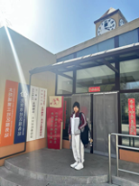
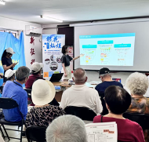

# 银花灿烂——我与老年人之间的故事

*您教我写字，我教您用手机——“银花灿烂”公益项目*

一开始只是突发奇想....

手机“困住”了我身边的年轻人，我们被困在电子世界的牢笼中，冰冷的铁栏阻断了我们与身边的老一辈之间的交流。我们被困在里面，他们在外面。一开始只是突发奇想，自己确实需要一个项目去证明自己的领导力，于是我开输了对于身边的事物的观察：我发现了我每次去姥姥姥爷家躺在他们房子中的大沙发上盯着手机屏幕的余光总能捕捉到姥姥渴望交流又不敢上前的落寞神情；我发现了在爷爷奶奶每次与我见面小心翼翼请教我怎么用手机生怕我不耐烦的局促不安；我发现了妈妈和舅舅埋怨姥姥姥爷每次都网购被骗需要他们帮忙联系卖家时爆发出的争吵。我看不得别人在我面前那样落寞、手足无措的样子，更何况是自己至亲的人，而每一位不会用手机的老人，都是像我一样的高中生或年轻人的至亲。于是，我的公益项目的内容也定了下来：您教我写字，我教您用手机——“银花灿烂”公益项目。为什么是“银花灿烂”呢，银花灿烂是我在澳门一个教堂门口看到的名字，愿我的公益也可以像教堂一样带给有需要的人力量、温暖，帮助他们实现自己的愿望。

<figure style="text-align: center;">
  
  <figcaption>澳门教堂照片</figcaption>
</figure>

2024.3.31
这是第一次实行这个公益项目，我的内心无比紧张。这时这个公益活动只有三个人，我，101中学和北京四中的两位学姐。因为大家都对于联系社区没有什么头绪，于是我求助了我姥姥联系了我姥姥所在的老年社区。在小红书上我发现了发不出去的教老年人如何使用手机的报纸，于是我联系了对方成功要到了所有发不出去的报纸，这也成为了每一次举办活动我们都会发放的固定材料。在一个小时紧张的讲解如何使用打车软件后，我也成功的完成了这个公益项目第一次的开展，爷爷奶奶们特别热情，在公益结束后也一直念叨着希望我以后再来。我无法形容当时的心情，我很有成就感，我教爷爷奶奶们学会了用高德地图打车，但是我又感到茫然。这个公益项目怎么做大？我到底来还不来这个社区？是追求开展公益的质量还是做过讲解的社区的数量？爷爷奶奶们让我下次还来给他们讲解，我真的还会来这个社区讲解吗？带着这些疑问，我开展了在下一个社区的活动.....

  
  

---

2024.5.19

彭羽慈和我的一位发小加入了我的公益项目。我联系了一家养老公寓，我们在养老公寓开展了第二次教老年人们用手机的活动。也正是这次活动，让我陷入了矛盾。养老公寓中的老年人们大多数都年龄比较大了，当我开始讲我听老年公寓工作人员的建议而准备的“如何使用抖音”的PPT让老人们拿出手机时，我发现有很多老年人因为过于年迈已经无法听清我们说话甚至有些神智不清了，很多人也只拥有老年机，更别提怎么用抖音了。当时我手足无措，底下有几位老人已经开始叫嚷“我们根本就不需要用抖音”“根本就学不明白”，我准备和上次一样在底下和几位我的志愿者们一起一步一步教各位老年人操作，但是有手机的老年人占少数，而工作人员又开始催促我时间有限，我迫不得已只能将ppt像做期末汇报一样讲解了一遍，无法顾及老年人们听没听懂。当时我感受到不断的有相机在我身上拍照，我却提不起兴致，只想流泪，我在思考这样进行公益有什么意义？这不就只是形式主义吗？在最后讲完我又挣扎了一下，我在结束“期末汇报演讲”后说了一句“如果有任何在手机使用上的问题都可以找我们问”。幸亏有了这句话，有几位老人兴致勃勃地找我们提问，在我们回答他们，与他们聊天的过程中感觉他们眼睛都亮了，像小孩子第一次接收到新事物一样。在解答完几位老人和回家后反省许久后我明白了一个道理：作为普通人，我可以影响和改变的人是有限的，但是勿以善小而不为，我所帮助的每一个人都算数，主要能多让这世界上的一个人开心，多成就了一个人，我的一切努力都是值得的。

  
  

---

2024.7.4

这是我认为目前最成功的一次讲解了。我们讲了“如何使用点外卖软件”“如何使用打车软件”。全程所有人都非常配合，问的问题也大多都是与如何使用打车软件相关的。因为时间有限，所以在如何使用点外卖软件时并没有留时间去给老年人操作和指导所有的程序。在讲座结束后，部分老年人询问了诈骗电话/广告相关内容。

---

2024.7.25

这是我认为最失败的一次活动。大部分人都没有任何问题，非常的沉默。这次活动举办的较为失败的原因首先是没有和社区工作人员沟通好，活动前一天晚上下了大雨本来并没有打算办。社区工作人员对于高中生活动不太重视，在沟通之后并没有提前找到任何老年人参加此次活动或者宣传，人全部是临时拉来的。在最后活动效果不太好，社区的工作人员反而来责备我，说我一切都没有说明白表述清楚才导致一切的发生，当时我也气上心头，在还有很多人在场的情况下与她爆发了很大的冲突。在冷静过后我也反思了自己的问题，我确实缺乏与她的沟通，给她提供的关于我的项目的介绍也不够多，所以才导致了失败。我也不能一直都如此情绪化，让一时涌上心头的情绪冲昏理智。

---

2024.11.8

这次因为除我外的所有人都因为不同的事情没有办法到来，所以我一个人在放学后前往社区进行了如何使用高德地图叫车的讲解。但是因为是下午4点左右，所以在我讲完后所有的老年人都从社区中心冲了出去去接孙子和孙女下学。在时间上我确实没有考虑到这一点，下次还需要改进。

  
  

---

2024.11.24

我顺利联系到了一个义工组织，他们可以提供各种需要陪伴的老年社区或者公寓，以后也不需要我再去一个一个社区联系了，节省了不少时间和精力。这次去到了东坝的一个敬老院。让我印象非常深刻的是敬老院的工作人员给我们提了几个注意事项：第一，跟老人说话的时候要低下身，他们的颈椎和耳朵不太好；第二，老年人的精力有限，可能听着听着就会睡着，这都是正常现象；第三，不要在老年人面前打电话或者给他们自己的电话，不要给他们这么一个念想，让他们一直挂念着；第四，不要在老年人面前说“以后”“将来“之类的词，这会使他们想家…听到这些之后我控制不住的觉得很悲伤，因为他们的孤独缺少陪伴而悲伤，因为自己做不到真正改变点什么而悲伤。
后面教一个奶奶用手机的时候她一直在说看着身边的人流利的用手机她有多羡慕，但是我在教她的时候她说自己不识字，太笨了，学不会，跟别人没法比。我也不好说什么，只能笑着说这个事情不分聪明和笨，都需要一个学的过程。这么多次养老院和老年社区的活动我发现其实老人学不会手机的最主要原因是因为他们自己已经放弃了，不愿意去接受新事物，因为已经认定自己老了，没有学的动力。 我也没有能够再次激起老年人学习动力的能力，最后只能多陪伴陪伴他们，哪怕就一个小时，哪怕只能给他们带来一天的快乐。

---

现在已经有从最开始的三个人变成十个人啦，希望以后也可以越来越好!

如果有对这个项目感兴趣的可以来加我微信，一起传递关爱。

