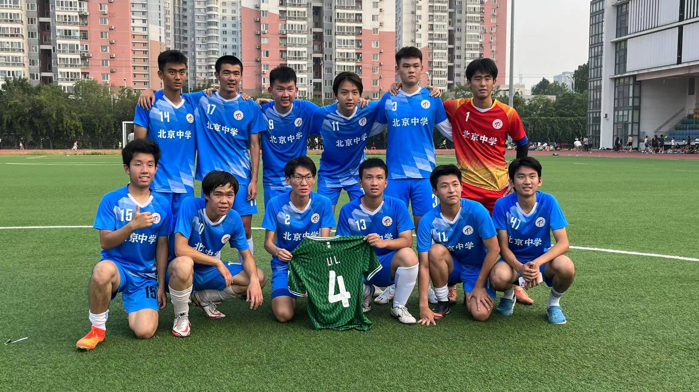
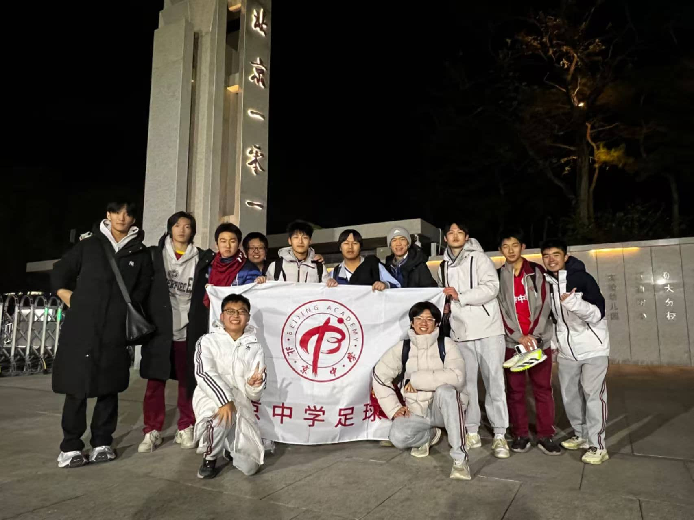
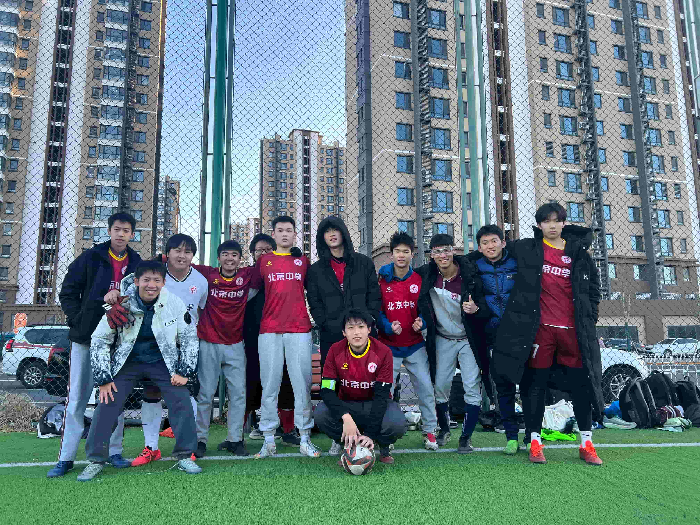

# 我对足球的追求

*怀揣着这个梦想，我一步步努力地训练，在周末和有空时找寻点点滴滴可以用来与朋友们踢球的时间。*

**足球是我从小的兴趣。** 从小时候起看着英超的比赛，我总是幻想着可以和电视上的球星们一样驰骋在绿茵场上并在关键的时刻攻入决胜的一球。怀揣着这个梦想，我一步步努力地训练，在周末和有空时找寻点点滴滴可以用来与朋友们踢球的时间。随着年龄的增长，我的足球技艺也在不断提高着…一开始我专注于俱乐部的训练和比赛，和一些高水平的队友一同提高并四处征战。这一阶段主要是在我初中的三年发生的，我在这段时间也取得了一些比赛的奖项。 

随着进入了高中的生活，我发现我心中的足球重心在逐渐转移为对于校队的发展上。与其说是和一些专门踢足球的“运动员”们一起比赛，我更乐意和平时里一起学习与生活的同学们一起训练一起努力。即使水平和技艺也许并没有俱乐部那么强大，为一直较弱的队伍创造历史打下基础还是比为一直强队锦上添花对我来讲更有吸引力。 

在体育课和同学们更深入了解之后，我成功加入了我们学校的足球校队，开始随队参加名为“北高杯”的北京国际高中间的比赛。随着时间的流逝，经过一天天体育课的磨合，我们的校队开始初具雏形了，每个人都信心满满对这次比赛充满了信心。 

2024年4月5日是北高杯的第一场比赛也是我参加校队的第一场比赛，对战W*学校。这一场我作为我较为熟悉的前腰位置出战，赛前我充满了信心可以将我们校队的进攻火力比较好地提高。比赛开始，对方中前场的压力比我想象的要多很多，他们高大强壮的身体让我没有很快地适应比赛节奏，在一开始的几次对抗都以丢失球权为结果。在这种节奏下对方也取得了第一个进球，虽然依靠的是假摔“骗”来的点球。进球让我很快冷静了下来，好好反思了自己的状态。后续我逐渐找到了比赛的节奏和熟悉的触球感觉，不久后在一次角球进攻中开出了一粒角球精准地找到了Y同学的头顶头球扳平比分。随后的比赛中双方再各进一球以平局结束比赛。比较可惜的是在这场比赛的后半段我并没有创造进球。第一场比赛以平局收场，我觉得这是一个我校队经历的一个不错的开头吧。[校队的第一场比赛](https://www.benjaminjiang.com/blog/baid-s-first-varsity-game)  

我的第一届北高杯赛事经历便告一段落，后续小组赛的两场比赛我因一些个人原因均没有参加，校队在这两场比赛中发挥和运气也不佳，两连败在小组赛出局了… 

北高杯失利后我们队伍及时调整了受挫的心态，这可能也得益于每天在学校的共同学习和生活，让我们有了极为牢固的关系和很强的调整能力。 

又过了一段时间，中间也参加了一些友谊赛，我们校队的实力也在不断提高，准备参加另一个赛事，一个由另一个学校的学生组织的公立学校国际部间的比赛。从2024年10月13日开始，我们校队虽然过程艰难，可是小组赛前两场面对十某学校和海某学校一平一胜拿下4分。最后一场小组赛面对1*中学保平即可出线，可是我们队伍一同从金盏地区赶到圆明园旁边，早已不是为了平局而来。值得一提的是随着比赛一场一场的进行，我从一开始我擅长的边锋和中锋逐渐转化为了中场球员再到防守型中场，以弥补我们校队的防守强度不足。比赛一开始，我们队伍就展示了争胜的决心，在前几分钟进攻对于对方狂轰滥炸取得进球。即使对方很快将比分扳平，我们依旧靠着一粒点球和之后接连的两球把比赛分差拉大。最后的时间里，对方依旧在顽强的进攻，他们作为强队给了我们很多防守的压力，不到最后时刻没有人敢有一丝松懈。到最后10分钟，我们在场上的每个人几乎都先后拼到抽筋，可是我们依旧在场上努力防守，努力奔跑，将这场比赛视为决赛一般，一直撑到了比赛的结束，4:2，成功打败这支传统强队。 

从一开始的“弱队中的弱队”，一直到可以与强队掰手腕的阶段，会想这段旅程每一次都让我深受震撼。和同学们、校队一起努力一起成长，我收获了很多，每一场比赛在牢固同学关系、锻炼球技的同时也让我的毅力和一些其他精神品质得到了锻炼。当然校队的征程还在路上，我希望在未来我们队伍可以继续进步，继续参加更高级别的比赛，站上更高的舞台！
