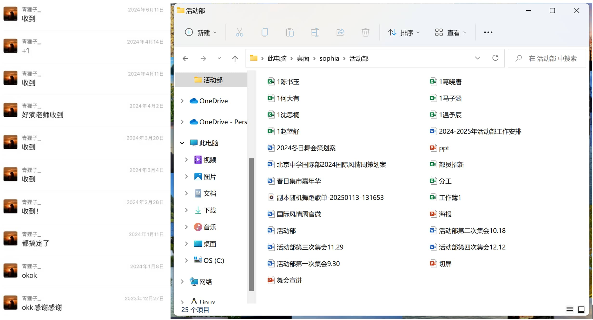
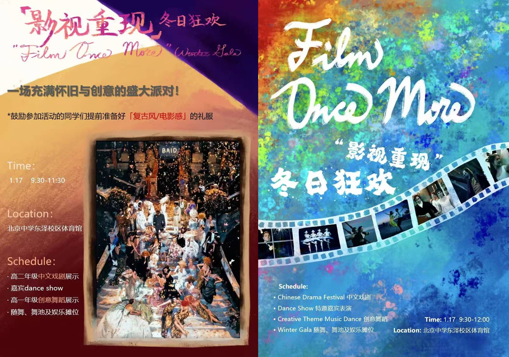
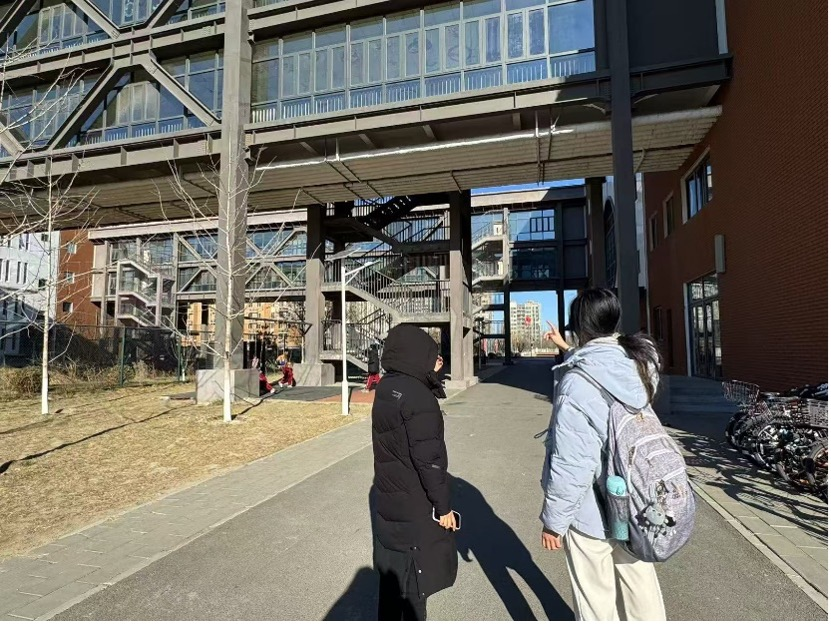
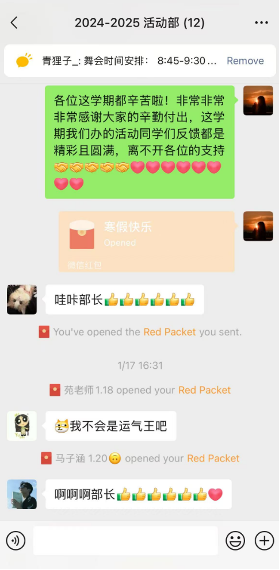
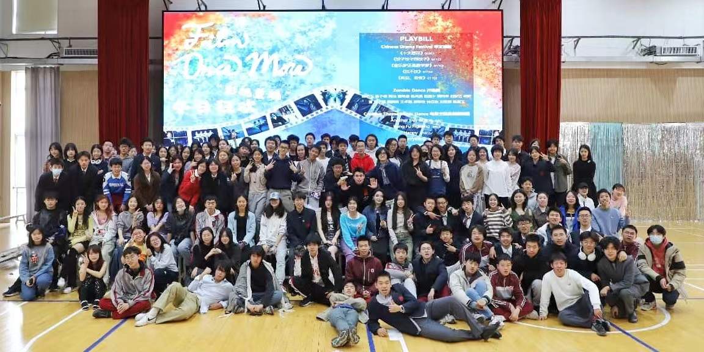

# 一次无穷的跨越

*记从部员到部长的感想，虽然还有一整个学期ahead*

**你一直热衷于参与各种活动，并且总是乐在其中，享受着那种无忧无虑的欢乐。然而，突然之间，你发现自己逐渐无法像从前那样纯粹地参与其中，无法再沉浸在单纯的快乐之中。你从一个活跃的参与者，变成了站在幕后策划和组织的人。你要思考每一个细节，协调每一个环节，承担更大的责任——因为你所面对的不再只是自己，而是整个学校的师生。**

**曾经热爱的事情，似乎逐渐变成了一份工作，变成了一种沉甸甸的责任，一场无法掉以轻心的挑战。当你肩负起统筹全局的任务，当压力如影随形，甚至到了假期你还需要操心下个学期有什么新的活动可以创新，甚至还需要联系所有商家最后汇总出一份财务报表来向学校申请报销，你是否还会一如既往地愿意投入其中？是否还能像从前那样全心全意地享受这一切？**

九年级时，我只是活动部的一名普通部员，回顾当时的经历，所做的事情屈指可数。我曾负责过一次月度人物的PPT整理，协助寻找师生评委，为国际风情周的世界巡游活动撰写规则说明，还在班级的Secret Angel活动中负责宣传与执行。事实上，这些任务很快就能完成，根本不用花费过多的心思。此外，我倒是与另一名部员合作撰写了春日集市活动提案，还算比较有突破。但现在看来，其实这份提案存在许多不足。那时，我对活动的理解还停留在“完成交办任务”的层面，而不是深入思考如何让活动更具影响力。

而如今，我深刻体会到领导者与执行者的巨大区别——我不再只是接收任务，而是需要从零开始策划、统筹并完善每一项活动，把每一个活动真真正正放在心上。每一次布置任务前，我必须对整个活动有清晰的框架和方向，活动推进过程中，我要协调各方资源，统筹进度，优化细节，最终呈现出理想的结果。从与老师、校领导的沟通协调，到及时处理现场突发问题、做好“兜底”工作。但当我面对无数个要处理要协调的事情而无从下手时，合理分工与高效部署成为了一个必修课。我现在逐渐意识到，很多时候其实领导并不需要负责所有细节的落实，而是在熟悉各项工作流程、具备系统思维后，将任务分发给团队成员共同协作。活动的成功不仅仅依赖完美的计划，更需要对团队的信任、对不确定性的包容，以及在过程中不断调整适应。

**从挑战到挑战**

我仍清晰地记得，十月的月度人物评选当天，正值阅历课程小组开会，导致师生评委难以到位，原定的主持人又临时请假。当我中午赶到现场时，发现报告厅的座椅尚未摆放。面对突发状况，我迅速奔走于多个办公室，临时协调老师和评委，最终由自己即兴主持了评选活动。当时手忙脚乱，我的应变能力得到了极大的锻炼。

国际风情周期间，挑战更是接踵而至。由于当天中午我的物理考试，原定于午间的暖心礼物赠送环节被耽误，我也几乎没有好好吃饭。而姜饼人DIY活动因我对于我的通知13:00活动开始的疏忽，导致当大部分同学到场的时候突然发现材料不足，现场一度陷入混乱。为了弥补这一缺漏，我紧急回到教室取备用饼干礼物作为补偿，同时也将送礼物的活动调整到第二天中午重新进行。这次经历让我意识到，保持冷静、快速响应和灵活调整至关重要，我也逐渐体会到策划与执行并存的乐趣。

为了制作出一个令人满意的中文戏剧节+舞会海报，我足足花了三天的时间：第一天在小红书上翻阅了无数篇“高级感海报”，自己手绘了一份，细节调整了很久；第二天给老师们看，才意识到这个海报看起来太low了，开始陷入无限的发愁与苦恼当中，又搜集了很多信息，翻看了ICC、实验国际部、四中国际部等等的海报宣传设计找灵感；第三天从早上9点开始联系美术老师讨论海报设计，和朋友聚餐的全程都在苦苦构思，下午1点多回到家迅速开始绘制，询问了很多同学老师的建议，背景和文案排版调到了5点钟发给领导，又收到了一些改进的建议，最后改到了晚上7点多基本定型，后来自己有些细节看的不顺眼在晚上10点多钟又调整了一些。

**从杞人忧天到信任过程**

回想起国际风情周游园会举办前，我一度忧心忡忡，担心活动的吸引力不够，担心摊位设计不够有趣，害怕奖品无人问津。中文戏剧节和舞会前，我同样忐忑不安，害怕同学们因期末备考和文化探究课程的繁忙而无法充分准备，担忧演出时长过短，气氛冷场。然而，事实证明，所有的顾虑都在活动当天烟消云散——国际风情周游园会现场热闹非凡，奖品甚至供不应求；戏剧节和舞会节目效果超出预期，甚至因为现场氛围太好，导致时间超时，部分环节不得不临时调整。当活动圆满结束，听到同学们的欢声笑语，我才深刻体会到：真正的成长不仅在于解决问题，更在于敢于迎接挑战，坚定信心并全力以赴。

**从批评到解决**

批判性思维并不仅仅意味着发现问题，更重要的是提出理性、可行的解决方案。过去，我常常抱怨学校的时间安排过于紧凑，导致许多活动难以落地，或因场地有限而无法实现最优方案。例如，金盏校区报告厅空间狭小，限制了大型活动的举办。但现在，我逐渐明白，任何问题如果没有具体的策划和行动计划，都只能停留在“问题”层面。以这次成功申请东泽校区的场地为例，我们不仅需要提前踩点，还要细化到各个环节的安排：志愿者人数、路线指引、水牌布置、家长群通知、教师支持等。正式汇报方案时，校领导提出了关于住宿生如何乘坐大巴车的细节——是否需要备选方案？一辆大巴车是否足够？如何分配乘车名单？清点人数的责任人是谁？如何确保每位住宿生都按时上车？每一个细节都提醒我，考虑得越细致，执行时才能越顺畅。

我更加深刻地理解到，很多事情不是“等”来的，而是“争”来的。上学期我们的日程紧凑，诸多活动安排受限，但归根结底，春日集市的未答辩未落实等，其实归咎于我们未能拿出足够完善的方案同时也没有积极推进。如果当时我们更主动争取，提出更切实可行的执行计划，或许结果会有所不同。正因如此，这次舞会我在申请东泽校区场地时，我不断优化方案，从志愿者分工到设备准备，再到宣传推广，确保活动顺利落地。无论是在什么方面做什么事情我们也都应更加主动地去争取资源，不再让机会白白流失。

刚刚接手部长职位时，是的，我很长时间感到迷茫和不安，害怕自己无法胜任这个角色，担心活动不能顺利进行。随着一次次挑战的克服，在学校领导们和老师的支持下，我逐渐建立了自信，学会了以更积极的心态面对困难。这段经历也让我学会了如何更有效地沟通、协调资源、分配任务，也让我意识到，任何一个成功的活动背后，都离不开细致的规划和不断的调整。在未来的日子里，我将和活动部成员们一起为全校师生们创造更多值得回忆的精彩瞬间，同时也将这些经验运用到更广阔的生活和学习中。

**我想，对我来说，答案是肯定的。尽管压力倍增，尽管身份转变带来了前所未有的挑战，但正因为热爱，所以更加愿意投入。看到自己策划的活动为校园带来活力，看到师生在活动中收获快乐，这种成就感远远超越了简单的参与所能带来的满足。当整个舞会活动宣告落幕，我望着逐渐空旷的场地，眼眶湿润。当收到了老师发来的大合照，我的视线许久没有离开这张照片。或许无法再像过去那样无忧无虑，但在幕后默默付出的过程，却让我找到了另一种深层次的快乐——那就是创造快乐、成就他人，也成就更成熟的自己。**

