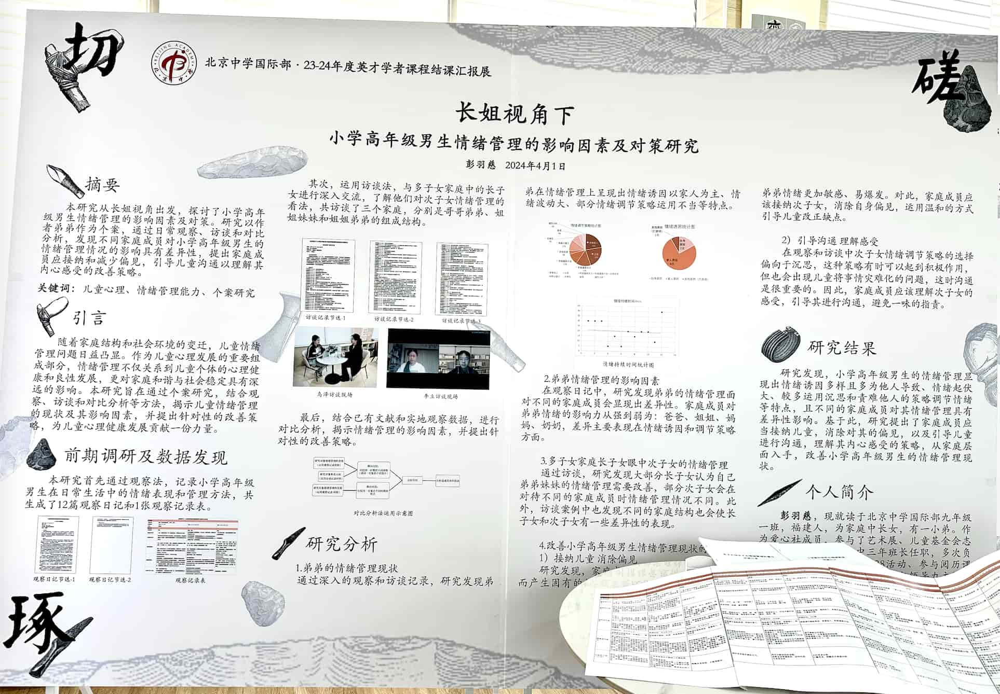

# 英才学者感想

*作为长姐，我感到自己在家庭中承担着一种“桥梁”角色，不仅要帮助弟弟管理情绪，还需要引导家庭其他成员更好地理解他的情绪表现。*

2023-2024学年，借助学校开展的英才学者项目，我得以开启了自己的第一次研究之旅，研究题目是：长姐视角下——小学高年级男生情绪管理的影响因素及对策研究。

作为多子女家庭中的长姐，我一直以来都很关注弟弟的情绪管理问题。在生活中，我常常发现弟弟在遇到困难或矛盾时容易出现情绪波动，甚至会因为无法妥善管理情绪而影响与家人和朋友的关系。怀着对这一现象的好奇，我开始尝试通过查阅文献来寻找答案。在阅读中，我了解到儿童的情绪管理会受到诸多家庭因素的影响，而随着多子女家庭的增多，关于多子女家庭情绪管理的研究也逐渐成为热门课题。因此，我想就多子女家庭中次子女的情绪管理进行研究。我研究的主要问题是：小学高年级男生的情绪管理现状是怎样的？情绪管理的影响因素是什么？有什么样的策略可以改善情绪管理现状或培养情绪管理能力？

我主要采用观察、访谈和对比分析的研究方法获取研究数据和材料。首先，我撰写了12篇观察日记并提炼了一张观察记录表，以分析儿童情绪管理的现状。其次，我访谈了三个分别来自哥哥弟弟、姐姐妹妹和姐姐弟弟家庭的长子女，了解不同家庭结构中长子女对次子女情绪管理的看法，拓宽研究视野。最后，通过对比分析法，对收集到的数据进行整理和分析，揭示小学高年级男生情绪管理的影响因素及改善对策。

通过分析观察和访谈，研究发现小学高年级男生的情绪管理显现出情绪诱因多样且多为他人导致、情绪起伏大、较多运用沉思和责难他人的策略调节情绪、面对不同家庭成员的情绪表现不同的特点。

通过上述发现，我的结论是不同的家庭成员对小学高年级男生情绪管理具有差异性影响，并对改善其情绪管理现状提出了对策：第一，家庭成员应当接纳儿童，消除对其的偏见；第二，家庭成员应引导儿童进行沟通，理解其内心感受。

这次研究对我而言，不仅是一项学术探索，更是一次深入自我和家庭的对话。我深刻地意识到，情绪管理是每个人成长过程中的重要课题，而家庭是这一课题的核心课堂。首先，我在研究过程中对弟弟有了全新的认识。过去，我常常因弟弟的情绪波动而感到困扰，甚至有时会下意识地批评他。但通过研究，我开始意识到情绪波动的背后，往往隐藏着他内心的真实需求和未被满足的期待。我学会了站在他的角度看问题，用更多的耐心和包容去倾听他的想法，而不是急于指责或教导。这让我和弟弟之间的关系得到了显著改善。其次，这次研究让我对家庭教育有了更深刻的反思。每个家庭成员的行为都会在不经意间影响孩子的情绪发展，而这种影响可能是深远的。作为长姐，我感到自己在家庭中承担着一种“桥梁”角色，不仅要帮助弟弟管理情绪，还需要引导家庭其他成员更好地理解他的情绪表现。最后，这次研究让我认识到学术研究的魅力。通过查阅文献、收集数据、分析问题，我不仅学会了更加理性、系统地思考问题，也积累了许多专业知识和研究方法。更重要的是，这次研究让我从一个旁观者，变成了一个积极的参与者，能够为改善家庭关系贡献自己的力量。
