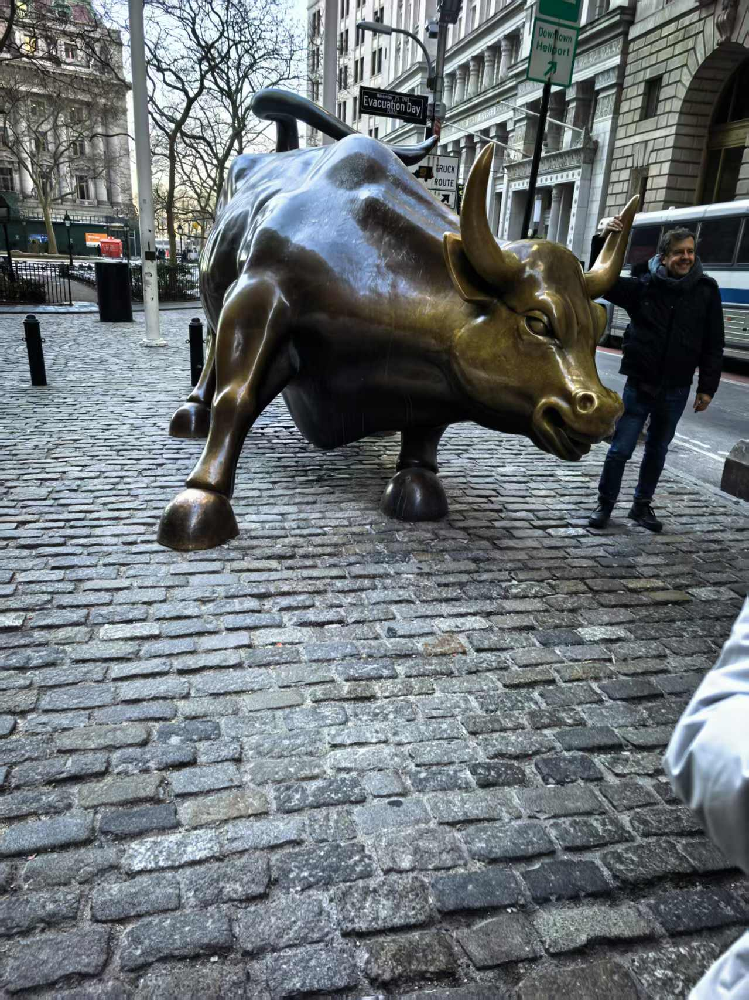
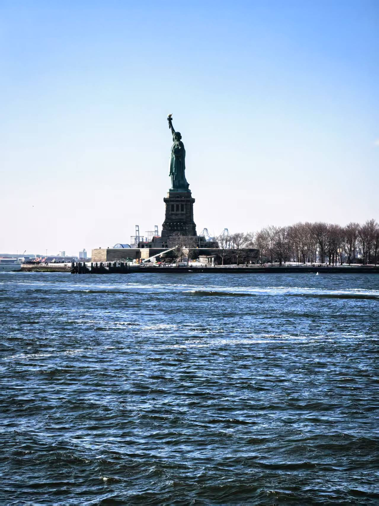

# 活动感想

*铜牛巍然屹立，仿佛在诉说着华尔街的历史与传奇，也让我对纽约这座城市的经济发展有了更深的理解。*

早晨吃完早饭之后，我们向着纽约城区出发，在穿过了著名的“生死隧道”后，片刻便来到了双子塔的遗址。在导游的带领下，步行前往华尔街。清晨的阳光洒在华尔街的街道上，给这座繁忙的金融中心增添了几分温暖和活力。望着往来熙熙攘攘的人群中，我感受到了这座城市的繁荣与脉动。当我看到那座著名的铜牛雕像时，更是被它所蕴含的力量和勇气所感染。铜牛巍然屹立，仿佛在诉说着华尔街的历史与传奇，也让我对纽约这座城市的经济发展有了更深的理解。

随后，我们乘坐船只前往自由女神像。河面上很冷，呼啸而过的海风冻结着我每一寸暴露在外的皮肤，船只越开越快，我也随着破浪开始摇摆，试图找到一些划船的感觉。随着船只逐渐靠近，那座高耸入云的自由女神像愈发清晰。在阳光的照耀下，自由女神像显得庄严而神圣，她手持火炬，屹立在海口，仿佛在向世界宣告着自由和民主的力量。那一刻，我深深感受到了自由女神像所代表的精神和价值。

这次纽约之行让我收获颇丰，不仅让我领略了这座城市的繁华与魅力，更让我对自由和民主有了更深刻的理解和认识。我相信，这次经历将成为我人生中最宝贵的回忆之一。