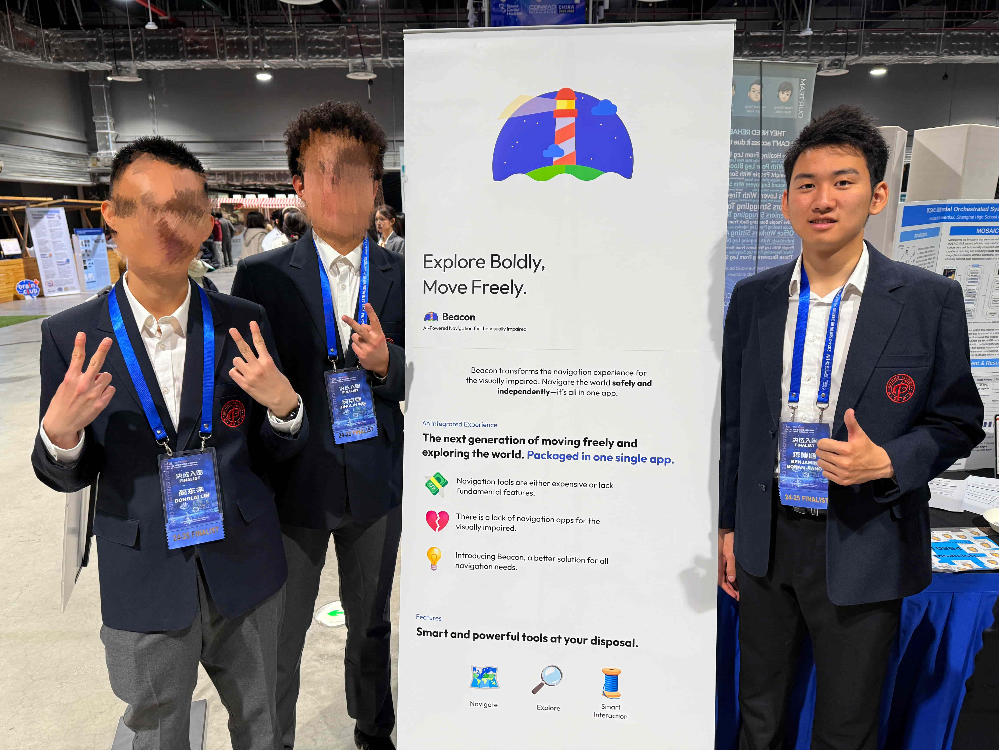

## A journey full of joy and a little regret

I don’t know where to start, because just last weekend (March 15-16) I ended a journey that seemed ordinary but left a deep mark in my heart.

Let's go back to the beginning of everything. At that time, due to the failure of Conrad Challenge 2024, I wanted to find a few strong teammates to prepare for Conrad Challenge 2025 with me and strive to get better results. For this reason, I contacted classmates L and W and formed a team.

This was also due to an opportunity. L, a student in the team, had a lot of contact with several visually impaired high school students. After some discussions and more in-depth interviews with more visually impaired people, we established the project Beacon. This project aims to realize a navigation software for the visually impaired, and also includes the AI-driven environmental awareness features. In this way, the development of this project and the preparation for the competition in a narrow sense began to be steadily promoted simultaneously.

In this article, I don’t want to talk too much about the specific content of project development or the experience of preparing for the competition. I want to focus more on the content along the way that I will still remember in the long future.

This experience was actually the first time that I completed a project with several classmates. To be honest, I didn't expect this experience to be so smooth at the beginning. As the weeks passed, the advancement of various aspects of Beacon never stopped. The three of us cooperated with each other more and more tacitly and had a clear division of labor. In some cases, when a student could not keep up with the progress, the remaining two team members would actively help him to complete the content. This kind of team cooperation and collaboration is what I have always longed for. I think that this desire has been realized in the Beacon project.

Another point worth mentioning is the management of expectations. When the award ceremony started on the afternoon of March 16, our initial thought was "getting a medal no matter gold, silver, or bronze would be enough". As the award ceremony progressed, our team did not show up on the big screen when the Bronze Medal results were announced. In addition, we roughly judged the position of our project and we were sure that we would at least be in the top 3 of our track. If we had been told this result a day ago, we would have cheered and felt satisfied. When the Silver Medal was about to be announced, we all prayed that our names would not appear, and repeated that "it would be enough to just get the Silver Medal". The Silver Medal was unveiled, but unfortunately our names appeared on the big screen. As the second place in the whole venue, we should have been very happy, but we didn't seem to smile on the podium. To be honest, from my perspective now, this award is indeed very good, but I still felt very regretful at the time. This is the role of expectation management. Being able to adjust your expectations well can actually make you feel much better without changing anything objectively happening.

Looking back, I will definitely not remember the content of the competition or the results in this experience after a while. So what are the most impressive things in this journey? Thinking carefully, it is the most trivial things that left me with sweet memories. Sleeping in a guest room with two classmates, traveling together in the center of Shanghai at night, squeezing in a taxi together to prepare for the report... These are what I think the meaning of this experience. I feel that it is really happy to be able to do something with classmates or friends. This time we came to Shanghai for only two nights, but it is this insignificant time compared to school that makes me already miss it now. Although the result this time cannot be said to be the best, the memories left for my future self are definitely with mirth and happiness. I don’t know why I say this. I hope that in the future I won’t need to care about so many so-called "results", and won’t be so pessimistic. Cherish every tiny moment of the present, because these are the contents that will appear in the memories of the future.

On the return flight, when I looked up through the window and saw the bright starry sky outside, I could put aside all distractions such as preparations for the competition and worries about rewards, and just recall the time I spent with my friends. Against the backdrop of the scenery, the feeling was so beautiful.

Finally, I am very grateful to every student in the Beacon team. It is you who have given me something worth remembering at this stage of my life. Also, this competition is over, but Beacon is not over yet, or it is the beginning of a new journey. I hope Beacon can continue to do it, and let more people "Explore Boldly, Move Freely" is also one of my dreams.

