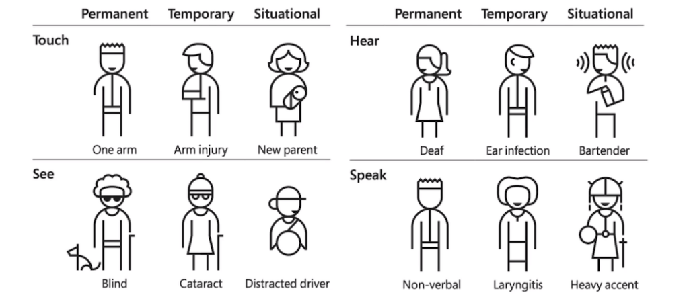
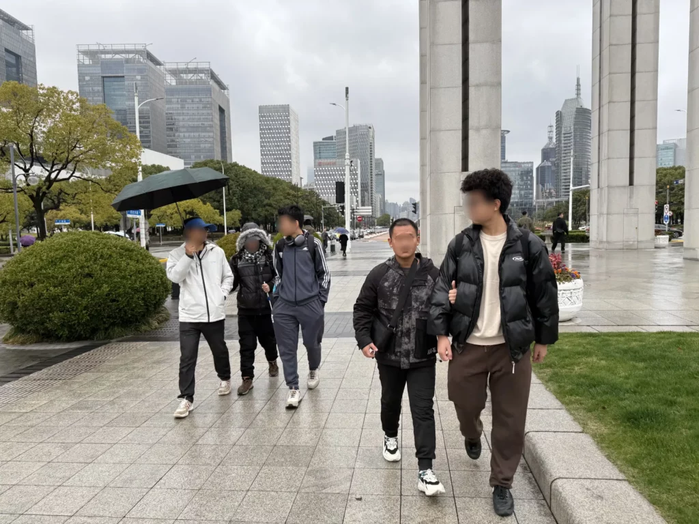
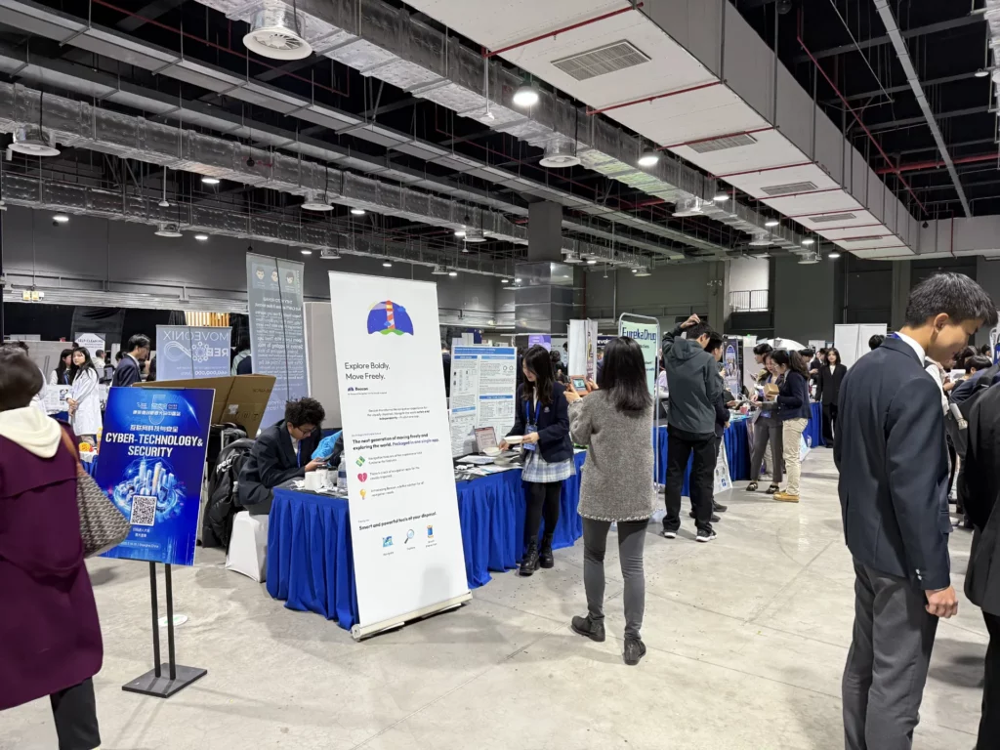

# Seeing The People Who Couldn't See

Well, it has been a pretty long hiatus! I haven't written anything in a while because I've been incredibly busy. I have been working on my Conrad Challenge project with a couple of my friends and several other concurrent projects.

Today's is the story behind the project, but it's not just the story behind the project. It's a story of meeting new people and making new friends, a story of changing my perspective, and a story of recognizing my own fallacies and trying to do better.

* * *

## A Boring Summer

Over summer 2024, I was bored. There weren't many assignments over the break, and I finished them in a breeze. Afterwards, there didn't seem to be anything to do.

I decided that I want to expand my perspective a little bit, but mostly just to find something to entertain myself. "Why don't I volunteer?" I thought. The only problem—I'm too shy, and I could hardly stand the thought of having to talk to someone in real life. Instead, I opted to do something online.

I didn't know where I wanted to start. I scrolled through the countless volunteering programs available on the _terribly made_ "Volunteering Beijing" website. All of them, however, either don't take minors or aren't interesting to me. There was one program that caught my eye, however: the _Hequn_ volunteering platform, where both minors and adults can participate.

On there, a blind high school student is finding an English tutor. Sounds like something I can help with! I'm pretty confident in my English abilities. After reading the job description, I was so moved by his thirst for knowledge—despite all the challenges he must be facing, he was determined to learn. And I was ready to help—to bring the light to someone who couldn't see.

* * *

## I Should Do Something

The first session was scheduled for late July, and it went moderately well. There were a couple of hiccups, however. For one, I had grossly overestimated his English level. He was in high school, so I naturally assumed that he would have basic mastery of middle school English. Turns out, however, because of high staff turnover at his special ed school, he has never learned English systematically. His English abilities were limited to the alphabet and some basic words, so I had to redo the teaching material the night before the session.

Afterwards, everything went smoothly. After a few sessions, he invited two other girls from his homeroom to learn English with me. And it appears that he has also recruited other tutors for different subjects. Before each session, I would chat with him for a little bit. He lives in Hebei, the province bordering Beijing. He attends a special ed school. And even though he doesn't quite know what's going to happen, he wants to study, and he wants more access to knowledge. Yet because of his visual impairments, he finds it hard to understand intricate concepts.

I was deeply touched by his determination. "身残志坚" ("disabled in body but firm in spirit")—that's the word to describe him in Chinese. They were a weak part of society, and people like me who are normal and kind must step in to help. I should do something!

* * *

## For We Are Human, Too

It was into September, and I requested an interview with them after one of the sessions. They happily obliged. Before the interview, I made a list of questions. Here are a couple of them, just to give you an idea.

- Can you use your phone on your own?

- Are you able to go to your classroom by yourself?

- Can you brush your teeth on your own?

I asked them what they struggled with the most, what parts of life were hardest, and what could make things easier. I expected them to be grateful, but instead, they only laughed awkwardly. I didn't quite understand what went wrong with the interviews.

I persisted. Before each weekly session, I would pester my students with the same questions. I tried not to be inclusive, only subtle. But they only responded with a few words and another awkward smile. Eventually, I had to ask, "Why won't you people answer my questions?"

In exchange, he asked, "Why do you think we need your help?"

"I’ve met a lot of people like you. They mean well, but they don’t realize they’re being condescending. Yes, some of us do need help—but if you really want to help us, you need to see us as equals, not as people beneath you, _for we are human, too._"

> Yes, some of us do need help—but if you really want to help us, you need to see us as equals, not as people beneath you, _for we are human, too._

He wasn't angry, just amused. But I was speechless. I had walked into that conversation believing I had the answers, but in reality, I had never truly listened.

I reflected for days. For the first time, I realized that nobody needed my “help” or my sympathy; instead, what they needed the most was understanding and respect. Disability isn't something to "overcome." It's not something to be "fixed." It's part of who they are—a different way of experiencing the world. My role wasn't to lead or rescue, but to listen, learn, and walk alongside. In trying to teach, I ended up being taught something far more important: humility.

I think... I learned something.

* * *

## The Idea of Accessibility

Our concept of disability has evolved significantly over time. In the early modern era, disability is viewed as something unlucky or even a curse. This is known as the **traditional model**. Persons with disabilities were referred to as "cripples," and people usually kept their distance from them. This way of thinking stripped persons with disabilities of opportunities and left them dependent and misunderstood.

The **medical model** came with modern science—it treated disability like a medical issue to be fixed. Persons with disabilities are labeled as "patients," as people to be cured. Yet this approach made it easy for society to over-control their lives and treat them unfairly under the pretense of "helping."

By the 20th century, especially after the world wars, more attention was paid to how society itself creates barriers for persons with disabilities. This is known as the **social model**. This model sees disability as a result of an inaccessible social attitude. Still, many challenges remain, as mainstream society continues to operate on a non-disabled norm.

Now, we view disabilities through the **human rights model**. It views every individual, including those with disabilities, as holding equal rights and inherent value. It's not just about including persons with disabilities, but also about ensuring they have full access to all aspects of life. However, turning legal protections into real-life impact remains a major challenge.

> Disabilities don't just exist in the so-called "persons with disabilities," but is rather a universal experience that all of us face.

Today, we acknowledge that disabilities don't just exist in the so-called "persons with disabilities," but are rather universal experiences that all of us face. A distracted driver couldn't see the cars in front of them. That, too, is a disability.

**Accessibility** is about making sure everyone can equally perceive, understand, navigate, and interact with environments, products, and services. We must avoid thinking of people with disabilities as an _"us versus them"_ topic. Accessibility is about everyone.

<figure>  
    < Types of disabilities >  
</figure>

Undoubtedly, the language that we use to refer to persons with disabilities has an impact, as it shapes our perception of the world. Inclusive language is a key tool in combating ableism.

- People-first language. "Persons with disabilities," not "disabled people."

- Describing persons with disabilities as "courageous" or "brave" or as having to "overcome" their disability is patronizing and should be avoided.

- Avoid labeling people and do not mention a person's disability unless it's relevant.

- Avoid using condescending euphemisms.

- Disability is not an illness or a problem.

- Use proper language in oral _and_ informal speech.

* * *

## Something That Truly Matters

I began to have an idea of what I could actually do. I want to think big but also start small—to do something that is both feasible for a high school student and actually useful.

Our team (with my two incredibly capable friends) began the interviews and the surveys to find out what would actually make an impact, this time approaching it with more humility and more understanding. The process is long and tedious, but we have met countless kind souls who are willing to help us learn and explore. There were moments when I felt stuck—when things didn't work, or when I doubted if any of it would matter. But then someone would smile and say, "This would help me." That's when I knew we were on the right path.

<figure>  
    < They were incredibly friendly! >  
</figure>

Our quick sketch of an idea, Beacon, won the national top three in the Conrad Challenge. It is a better outdoor navigation app for people with visual impairments that attempts to address a very simple but important problem—fragmentation of available features.

<figure>  
    < Beacon’s stand at the science fair. >  
</figure>

Through Beacon, I learned to listen more, assume less, and see design not as invention but as dialogue. I came to realize that what truly matters isn't solving everything all at once but rather making one experience—even one moment—a little better for someone else.

* * *

Beacon is still in its early stages—we only have a brief idea of what we're going to do—but I'm already starting to feel how difficult it is. For that, after all, we're just high school students. What can high school students do?

> All of old. Nothing else ever. Ever tried. Ever failed. No matter. Try again. Fail again. Fail better.
> 
> — Samuel Beckett, Irish novelist

But maybe that question misses the point. It's not about having all the answers—it's about asking the right questions, trying, failing, and caring enough to keep going. Try. Fail. Try again. Fail again. Fail better! Beacon may be just a beginning, but it's one lit with purpose.

In the end, real impact doesn't come from grand solutions but rather from shifts in perspective. It comes from the moment when we stop asking how to help and start asking _how to understand._

_(March 23, 2025)_
