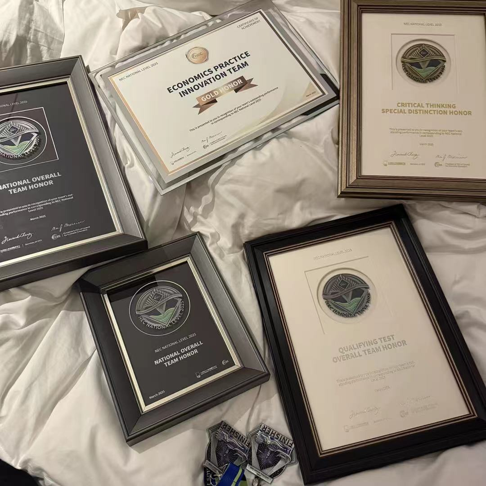

# 我们是要去很多地方的女孩—2025NEC全球站晋级感想

“我总觉得我注定是要去很多地方，做很多有趣的事的女孩。”

彻底决定成为一名商科方向的学生是什么时候的事呢？大概是我去年在micro模考中第一次得到5分的时候，又大概是我前年刚开始学经济，觉得这门课的名字听起来超级厉害的时候。2024年的秋天，我从学长学姐们口中的小九成为了一名彻头彻尾的高中生，10年级这个我期待已久的数字真的到来了，这也意味着我距离申请季仅仅剩下了2年的时间。身边的朋友都已经早早定好了申请的方向和专业，我也不例外，和父母一拍即合，决定从此在商科的道路上继续发展自己的学业。

和我同样选择了这条道路的还有我的三位好朋友，毫无疑问，她们成为了我在本次NEC商赛当中的队友。如果没有和她们共同的努力，我们的队伍也无法获得如此精彩的成绩，在那个气温骤降的十月份，在我过完生日的一周后，COMM正式成立，我们开始了2025NEC冗长的备赛。这个独特的队名一开始并没有什么特殊的含义，只是我们四个人英文名的首字母，却承载了我十年级绝大多数动容的回忆。从去年冬天的地区站备考，到今年中国站的CT环节整整两个星期没日没夜的查reference，开组会，改essay，准备presentation；从到长沙第一晚翘掉开幕式躲在酒店里一起做题互相打气，到最后一天大荧幕上Advanced List出现DR0666—Beijing Academy的队伍编号……学业上无数繁琐的事物堆叠，这段时间虽然是我上高中以来最非人的一段时光，但是我从这段经历当中学到的东西让我觉得自己似乎变了一个人。

当我亲眼看到自己超长的certificates list，看到半个月前的疲惫和透支换来了屏幕上的Top Team in Essay Writing，我感到有一股能量从心底直通我的眼眶，顺着我的脸颊淌下：原来喜极而泣是这样的感觉。如果一年前的我得知自己在未来做到了这些事，她一定会开心得跳起来。在我们向组委会登记取走所有的奖牌，抱着它们走回酒店的路上，我能够听到身后的另一支队伍感叹“哇，她们有那么多奖啊”。沉甸甸握在手中的全球赛晋级资格，不仅仅是四张通向美国的机票，更是我们热爱的证明，是我们亲手打开续章的钥匙。透过那小小的奖框，我似乎窥见了一段更加美好的岁月，一个更加坚定的自己，站在大洋彼岸的仲夏向我招手。即使在那一天真正到来前，还有program的结课，数不清的模考以及25年的AP大考等着我们，但我相信这一次我们依然能够做到。

