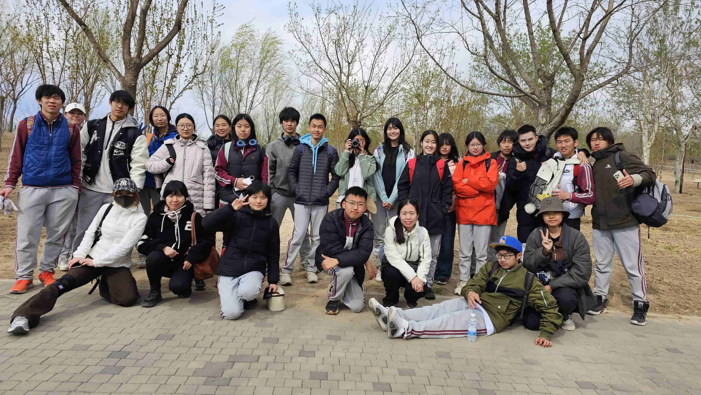

# 328春游感想

*每一次美好与狂欢都会引来终结，即使我很明确地知道这一次次美好和狂欢已在我的脑海中刻下了无法被抹去的痕迹。*

## 记人生以来最快乐的一次春游

**Benjamin**

从2月中开学到3月中下，我逐渐开始感受到升学的压力以及这种压力带来的盲目作息（这里的盲目是指日渐规律的作息所导致的对于一些生活中除了这部分作息以外的事务的无法感知）。因此，我们学校传统的328春游在我不知不觉中就提上了日程，一天天迫近。说实话，相比我已经参加过的4次328活动，没有一次如今年这般期待，也许是我们J同学安排的看似有些抽象的春游计划，也许是高中时期的我开始更加在意同学之间的联系与情谊了。

这次春游的分班也非常令我喜欢，上一届的一班，和我们班一样，还是很喜欢玩的。不知不觉到了春游当天，十分抱歉的是我居然迟到了，比较有罪恶感的一件事。小插曲过后我们开始了这次春游。相比于以往328强行安排的一些成果展示的任务，这次的春游就是纯粹的与同学一起玩耍一起挥洒青春和老师一起交流… 每一刻都很享受，每一刻都希望时间可以永驻此间。

但就如同热力学第二定律的潜在推论所描述，时间无法停下来或者减缓流逝，不知不觉间我们还是坐上了回程的班车。仔细回想这次完全称不上长，甚至可以说是在一瞬间就结束的春游，给我留下的意义、价值、或者说是美好的回忆，至少时至今日都还在我的心间回响。想着和几名老师同学在林荫小道漫步，想着所有人一起在最美好诠释的春天下潇洒，一种温暖伴随着失落涌上心头。夕阳的余晖洒进大巴车，车内的大部分同学都以睡去。眼前的这番景象让我又想起前四年每一次328的回程大巴。每一次美好与狂欢都会引来终结，即使我很明确地知道这一次次美好和狂欢已在我的脑海中刻下了无法被抹去的痕迹，我还是希望在每个当下这种美好可以持续下去。

那至于我失落的原因？可能是流逝的时光和青春吧。即使现在看上去一切都充满希望和活力，这些狂欢都会迎来终结。那就让一切都应该死在最高潮的那一刻，比如刚刚开始迎风奔跑的时候，夜晚鲜花盛开的那一秒，傍晚所有灯都亮起来的那一瞬间。无法挽回，所以要珍惜身边的每个人和事物呀。

## 328春游小记

**Star**

这次 328 简直太成功了！！我甚至认为这是北中历史上最酷的一次 328！跟其他班对比一下（嗯看来这个感想是不能发出去了要不太拉仇恨了），只能说我们班还是太有实力了（（

出发的时候我带了电脑和书，本来想在车上看一下宏观和微观的，不过上车之后也没看，既然出来玩那就好好放松一下吧。（另外谴责我旁边的某些人甚至在车上还在看欧洲历史!!!

我们的第一个正式活动是阿尔法探险塔。一共有五层，我选了第三层。
这个探险塔还是太好玩了，我觉得我在上面 1/3 的时间都在大叫（lin：ltx 你很擅长发出《宏大的叫声》）。不过确实很解压诶，我觉得反正玩完下来之后感觉 ap 的压力变小了一些（有一种可能是在上面呆着的时候除了担心自己是不是要摔死了之外没有脑子思考别的，所以压力小了一些（（

然后第二个项目是太空球，虽然一开始大家都抢着要排右边的队，但是其实我玩完之后感觉左边和右边都很好玩，虽然但是拍的视频就不怎么能看了（（

下午走了差不多四十分钟到了第二个地点，我觉得走走路还是蛮好的，我很喜欢戴着耳机散步，然后在脑子里过电影或者编小说，感觉非常放松，很难得地能从一周 15 个小时地模考里解放出来。。。

我真的觉得学校春游的时间选的特别好，三月底和四月正好是最最最累的时候，周五休息一天出去玩之后感觉真的又充满电了!!! 

啊啊啊啊啊啊啊谢谢学校！！！！

