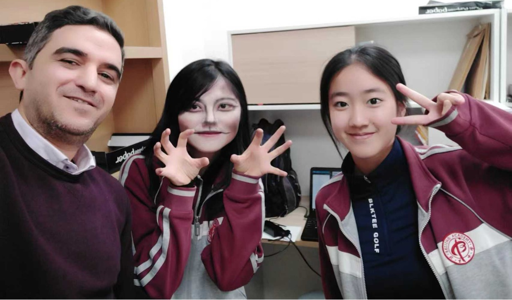

# We’re so lucky to meet you—Ali

People often casually say someone is ‘so nice’, but Ali is one of those rare individuals who truly deserves that compliment—from everyone who knows him.

The first meeting with him wasn’t exactly ideal. At the time, Ali hadn’t yet arrived in China, and classes had to be conducted online. The internet connection was often unstable; sometimes, he couldn’t hear the students at all. In truth, few students were fully engaged—it was difficult, distant, and frankly, boring.

But everything changed when Ali finally arrived on campus. From his very first face-to-face lesson, his students were captivated. His teaching was engaging, his stories fascinating, and his humor turned even the toughest parts of physics into something enjoyable. 

As time went on—especially for Luna and me—We got to know him beyond the classroom. They discovered he held a PhD and, sadly, he may return to London the following year. It’s hard to explain the quiet grief of knowing someone so admired might soon be leaving. 

Fortunately, he later decided to stay longer—a decision that brought joy to everyone.

One particularly meaningful memory took place during a school project visit to the Grand Canal Museum, where I served as interpreter, and during those four hours, we shared a heartfelt conversation. We talked about Ali’s dietary habits, his family, and even exchanged a few words in Persian. It wasn’t just small talk—it was encouragement, connection, and trust. That conversation left a lasting impression.

Now, AP Physics C has officially ended—but the bond with Ali has not. As he once wisely said: ‘Every beginning has an end. The only one who won’t end is the one who never begins.’ And what he began here—with his care, brilliance, and presence—will not end.

When that first poem was written, our acquaintance had only just begun. Still, Ali was deeply moved and asked to keep it. Nearly a year later, I wrote a second poem—this time for someone who has become a mentor, a role model, and a friend.

Ali is, without question, one of the most remarkable individuals we’ve had the privilege to learn from. Several students—including the writer, me—hope to take his class again in Grade 11.

Thank you, Ali, for everything. You’ve made a difference that won’t fade.

All the best, from all of us.

---

## Ode to you 

In halls of acquiring, bright and wide,

The shining light, like a constant guide.

Assigning our task, strive new height,

expressing your wisdom, ignite our minds.

With every question, your advice shines,

Transforming confusion into clearly design.

Your words inspire, bring us delight,

staring us benign, with smile so kind.

Despite language barrier you still strive,

navigating us through academic strife.

Encouraging thoughts to take daring flight,

you nurture our hopes, our future so bright.

Gravitational force, pulling from the earth,

finding in the knowledge a newfound worth,

gaining not just facts and not just figures,

but how we could think, to see, to differ.

In physics C you are the helpful mentor,

So here we stand, to thank your labor.

---

## Ode to you -- Every Beginning has an end

Every Beginning has an end,

yet the lesson you impart continue to expand.

Waves may break upon the sand,

but your kindness flows like lines you penned.

Scores we strive to ascend,

Guiding by words you always defend--

'keep loving Physics', failing is not the main event,

And how we respond--Ali is in Wonderland !

You shook your head, with chalks still in hand,

A wandering soul still learns where it stands.

Through every test, you helped us without a cram, 

showed us balance where others might misunderstand.

'Details mattered', you firmly demand,

No more of this' it doesn't matter' withstand.

When life gets tough or poorly planned,

We'll solve it like circuits, steady and grand.

For if our troubles are physics, firsthand—

Then we are the luckiest person in the land.

Your impact stays, like footprints we won't amend.

Every beginning is where the paths extend.

