# The Invisible Weight: A Visual Deconstruction of Anxiety

How can the internal sensation of anxiety be expressed through visual mediums like distortion, repetition, and claustrophobic composition? I examined how anxiety is expressed in bodily sensations, warped perception, and isolates individuals emotionally. I directed my research towards taking invisible emotional tension and making it physical by distorting mundane imagery to represent psychological instability.

I began with observation drawings of individual instances of worry, then distorted them by layering and abstracting shapes. I played with color to represent emotional intensity, progressing from muted and light tones to jarring, contrasting colors. I composed the images to achieve burgeoning tension through close framing and imbalance. In exploring relief, I employed repetition and symmetrical forms to represent efforts to soothe the turmoil.

## Work 1 ***Behind the Mask***

**Description:** Using colored pencils and white gel pen, this piece reveals the hidden anxiety beneath a bright, emotional facade. The distorted lines and layered colors illustrate the tension between outward appearance and inner turmoil.

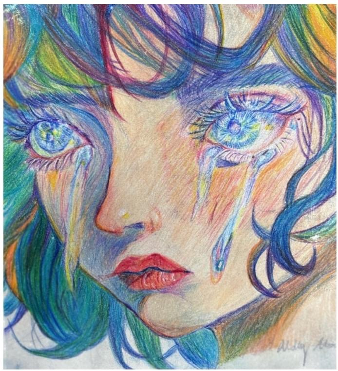

---

## Work 2 ***The Gaze of Judgment***

**Description:** A digital painting depicting a girl subjected to body-shaming stares. The exaggerated proportions and claustrophobic composition amplify the suffocating pressure of societal scrutiny.

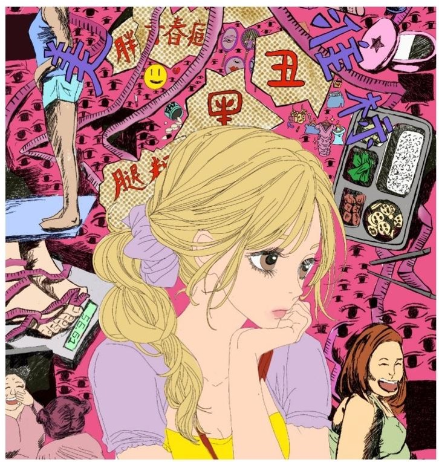

---

## Work 3 ***Inhale, Exhale***

**Description:** A comic-style illustration of a boy exploring ways to cope with anxiety—exercise, deep breathing, and sharing feelings. The vibrant panels contrast chaotic emotions with moments of calm.

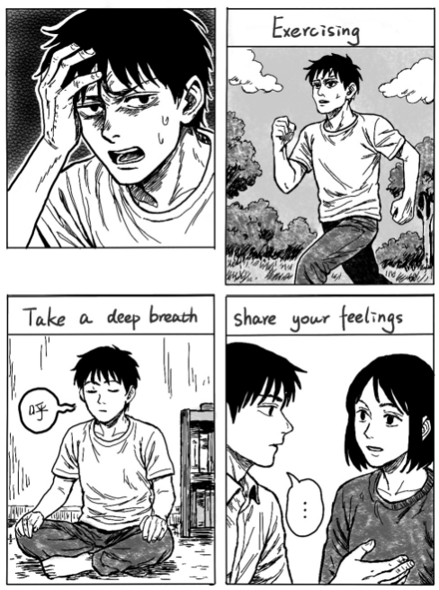

---

## Work 4 ***Rainy Day Journal***

**Description:** A comic strip following a girl’s journey from anxiety to peace through quiet walks, journaling, and the soothing sound of rain. Soft hues and flowing lines evoke serenity.

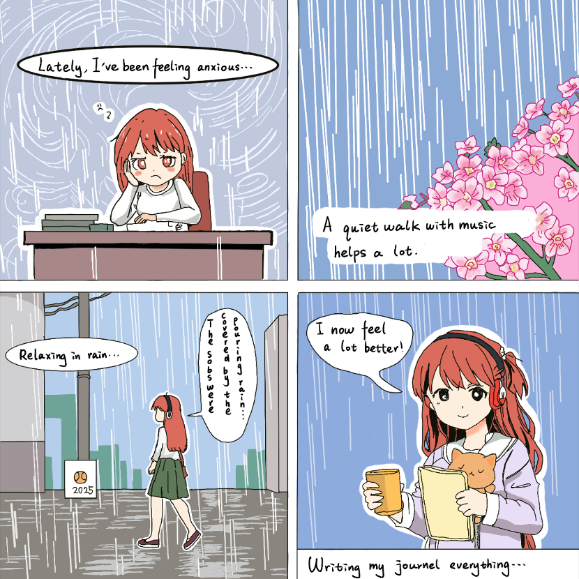

---

## Work 5 ***Sheltered in Pages***

**Description:** A girl curls behind a towering book, surrounded by symbols of academic pressure. The oppressive scale of the book and looming eyes represent the weight of expectations.

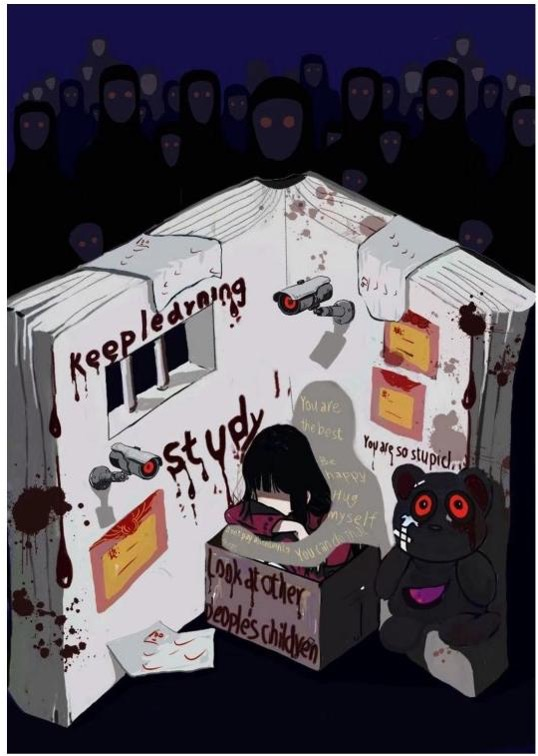

---

## Work 6 ***Eden in the Iris***

**Description:** Inspired by Magritte’s The False Mirror, the eye’s interior bursts with color while the outside world remains monochrome. This duality reflects longing for escape amid emotional confinement.

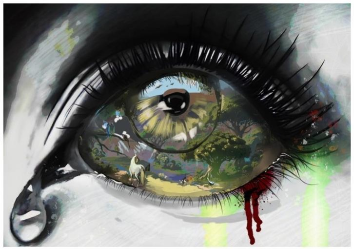

---

## Work 7 ***Nature Within***

**Description:** A hollow figure filled with a serene landscape symbolizes nature’s healing power. The contrast between the fractured body and tranquil scenery underscores renewal.

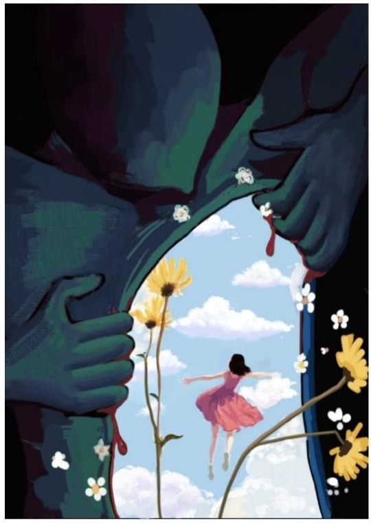

---

## Work 8 ***The Scramble***

**Description:** Countless hands strain toward a single key, embodying the chaos of societal competition. The chaotic composition mirrors the desperation and tension of collective ambition.

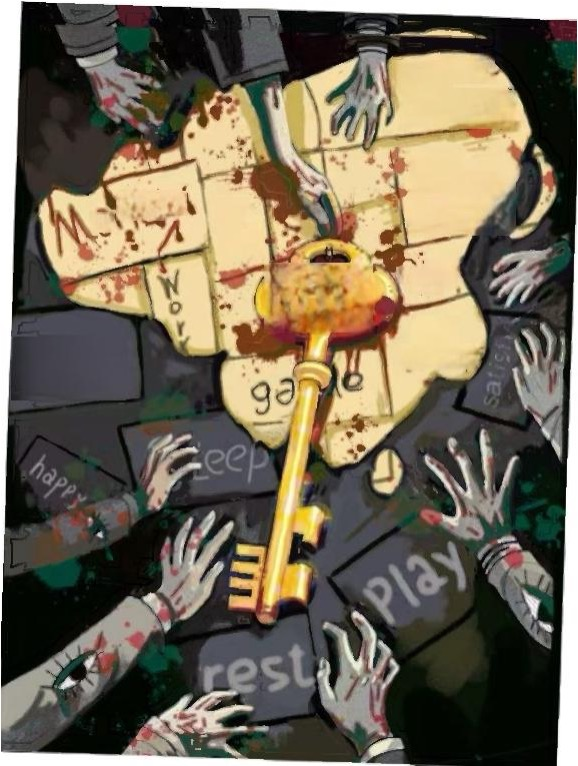

---

## Work 9 ***Lexicon of Anxiety***

**Description:** A textured collage combining handwritten text and imagery to articulate physical and emotional symptoms of anxiety—headaches, isolation, and the desire to disappear.

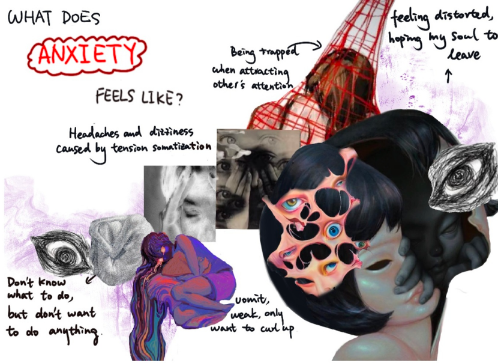

---

## Work 10 ***Inheritance***

**Description:** A red handprint links father and son, visualizing the cycle of inherited trauma. The stark imagery critiques how pain reverberates across generations.

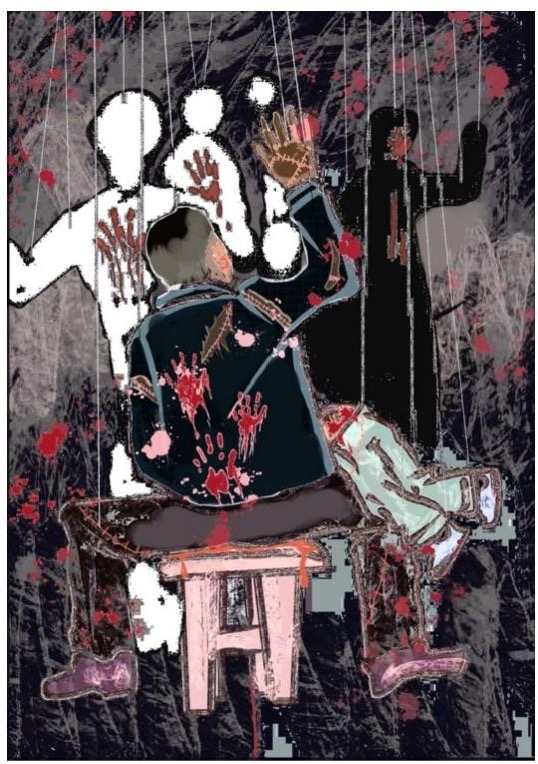

---

## Work 11 ***Watched***

**Description:** Oil-painted eyes and fragmented faces peer from a mixed-media collage, evoking the paranoia of constant surveillance and social judgment.

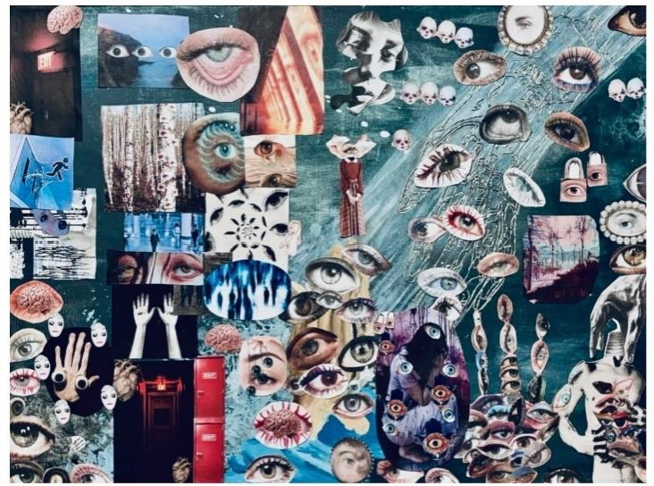

---

## Work 12 ***Beauty in Fragments***

**Description:** A digital sketch blending beauty standards and the fear of observation. The fractured composition mirrors the dissonance between self-perception and external expectations.

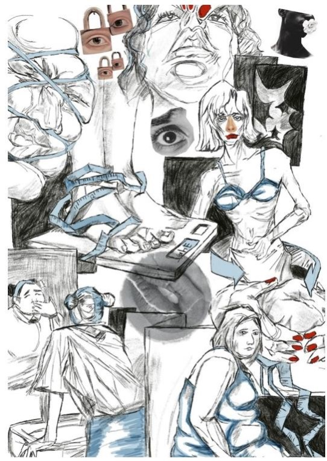

---
 
## Work 13 ***The Monsters Within***

**Description:** Exaggerated, chaotic lines form monstrous figures embodying anxiety. Their tangled forms spill across the page, representing the uncontrollable nature of intrusive thoughts.

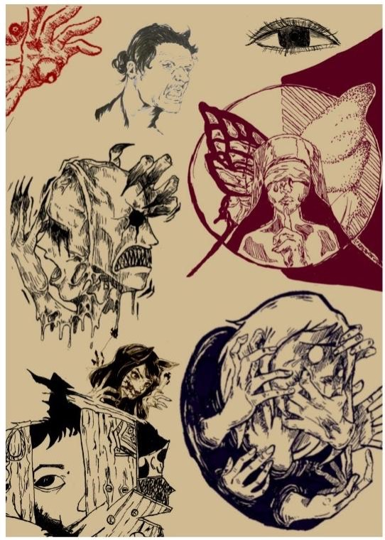

---

## Work 14 ***Mirror Shards***

**Description:** A mixed-media collage using pencil sketches and cut PVC board to explore self-awareness anxiety. The fragmented surface reflects a splintered sense of identity.

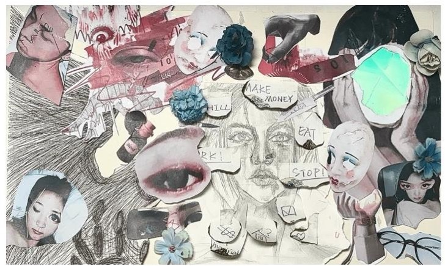

---

## Work 15 ***Thorned Wings***

**Description:** A PVC butterfly with hot-glued thorns on a black background symbolizes the pain of growth. The digital backdrop intensifies the contrast between fragility and suffering.

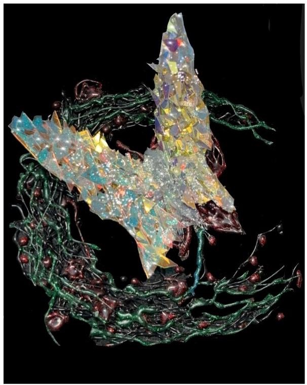