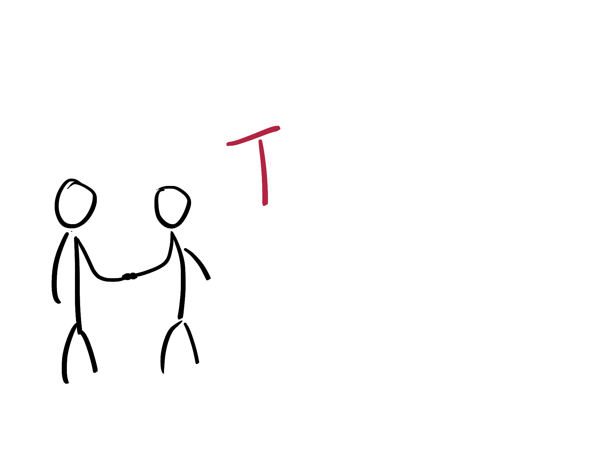
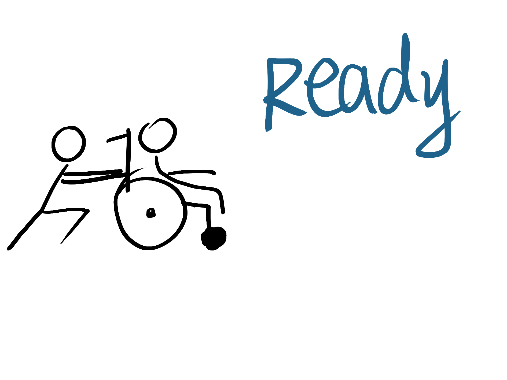
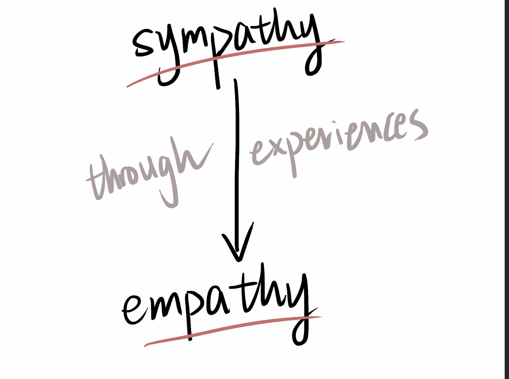

# How Sympathy Turns Into Empathy

This was the first time I noticed the height difference between the subway platform and the train. For a long time, I had never paid attention to these “unimportant details.” Or rather, I simply didn't have time to think about such things. Every time, before my brain had time to think, I was already on the train. But this time was different—I was about to take a friend on the subway, and he needed to use a wheelchair the entire time. That's why I started thinking: How do wheelchair users take the subway?

After thinking about it for a moment, I realized how hard it must be for people who use wheelchairs to travel by subway. During rush hour, when everything is crowded and noisy…how could anyone even hear them asking for help? Would anyone be willing to wait or move to another door, even if it wastes their time?

That night, lying in bed, I stared at the ceiling, trying to find answers. But I couldn't. There was a solid wall between me and the answers. I thought about this question all night, but I still couldn’t break through this wall.

So?

I began to simulate all kinds of situations and solutions. Imagining I’m pushing someone in a wheelchair…

> (My brain was overloaded)

> There are stairs on the ground, so I need to find a place with a ramp or elevator. After going down, we still have to go through security. Wait a minute, should I push him through the ticket gate? If I push him through the gate with me, do I have to pay for the ticket again? Should I talk to the staff first? Will they allow us to do this? If they don't allow me to do this, how can I buy another ticket for myself? Once we reach the platform, an even more challenging issue comes—how to board the train? Do we have enough time to board? What if the train is too crowded and there isn't enough space on the train for the wheelchair? What if people are unwilling to wait for us to board?

> The most “difficult” part is—there is a gap of about 7 centimeters between the platform and the train.

> So, how to board the train?

> I began to simulate....

## Different simulations came to mind:

**Simulation One:**

If I have enough strength, I can simply lift the whole thing with my arms!

Obviously...I can’t do that.

---

**Simulation Two:**

If I can't manage to move it on my own, maybe I could ask someone to help me lift the front part, and then I'll lift the back part.

Hmm...It looks like it might be a bit tricky to avoid falling over.

---

**Simulation Three:**

Or I could take a running start and use momentum to push the wheelchair over the gap. Hmm, that would cause the entire wheelchair to tip over. (That would be disastrous.)

---

After simulating the entire process, I couldn't find a suitable solution... but I had to get on the train no matter what, so I decided to use the “most convenient and feasible” method—using momentum to get on the train.

...

When I opened my eyes again, we had already arrived at the station. I looked around—no one else was there, check! The runway was long enough, check! The door was about to open, check! Ready, set, go? Just as I was about to push the wheelchair and run, my friend simply told me, “You can pull the wheelchair from behind; it's easy.”

...

Why hadn’t I noticed this before???

In just 5 seconds, I pulled the wheelchair up, yet I had spent hours thinking about this simple problem.

> I realized that while I could sympathize with the difficulties wheelchair users face when using transportation, I sometimes still didn’t know how to actually help them.

> Sometimes, maybe you just need to wait until you encounter these situations in real life. These experiences act as a bridge, connecting sympathy with empathy.

> From now on, I’ve begun to understand how to transform sympathy (I can understand) into empathy (I feel with you).

> 