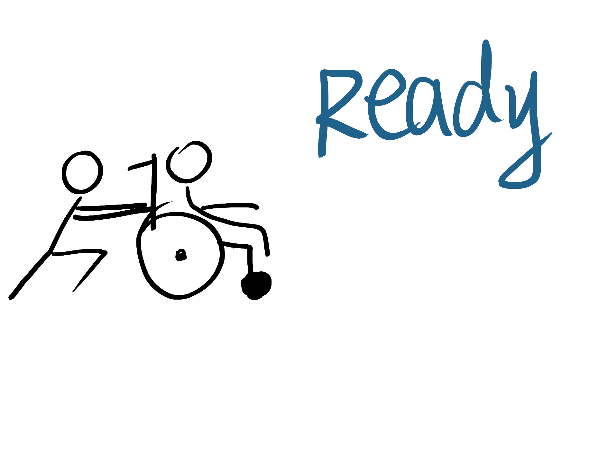
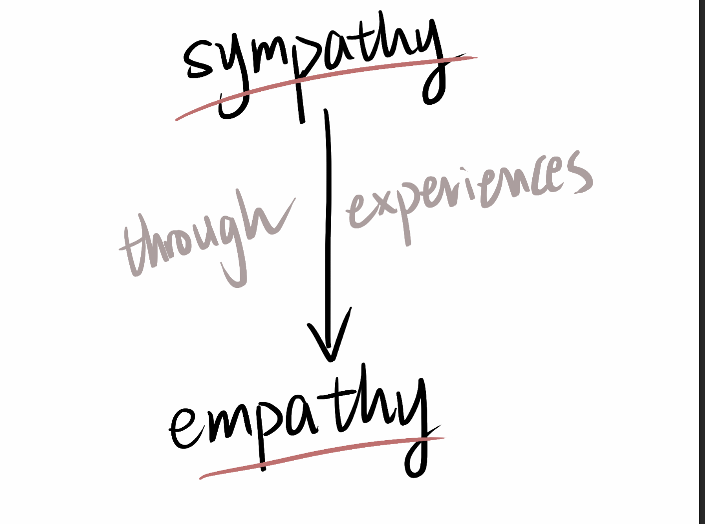

# How Sympathy Turns Into Empathy

This was the first time I noticed the height difference between the subway platform and the train. For a long time, I had never paid attention to these “unimportant details.” Or rather, I simply didn't have time to think about such things. Every time, before my brain had time to think, I was already on the train. But this time was different—I was about to take a friend on the subway, and he needed to use a wheelchair the entire time. That's why I started thinking: How do wheelchair users take the subway?

After thinking about it for a moment, I realized how hard it must be for people who use wheelchairs to travel by subway. During rush hour, when everything is crowded and noisy…how could anyone even hear them asking for help? Would anyone be willing to wait or move to another door, even if it wastes their time?

That night, lying in bed, I stared at the ceiling, trying to find answers. But I couldn't. There was a solid wall between me and the answers. I thought about this question all night, but I still couldn’t break through this wall.

So?

I began to simulate all kinds of situations and solutions. Imagining I’m pushing someone in a wheelchair…

